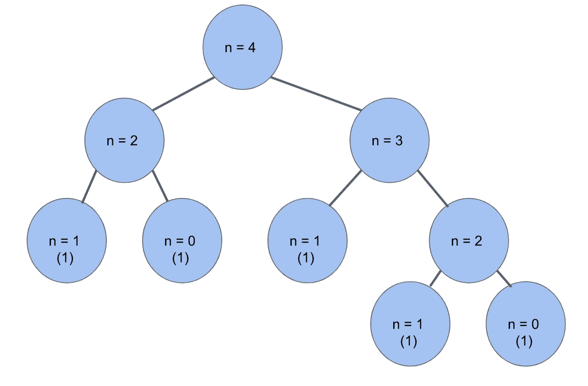
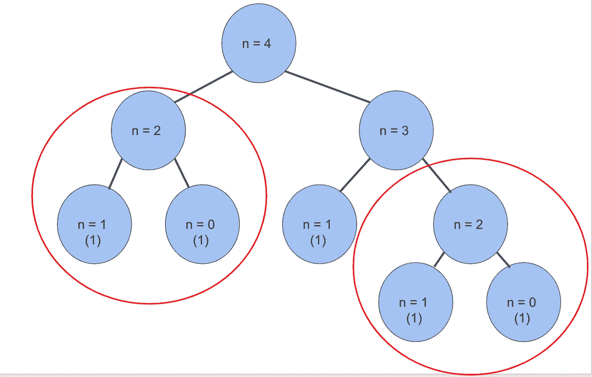
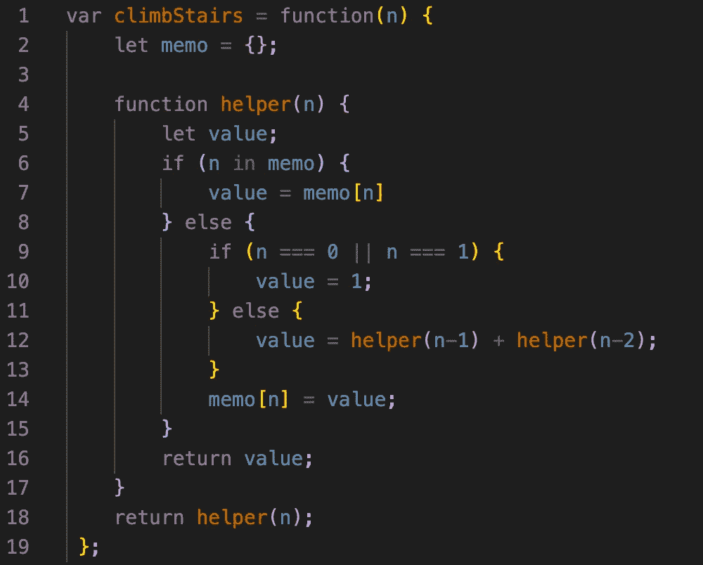

# 递归、记忆和阶梯算法

> 原文：<https://javascript.plainenglish.io/recursion-memoization-and-the-staircase-algorithm-f17c337d7657?source=collection_archive---------3----------------------->


Photo by [Serhat Beyazkaya](https://unsplash.com/@serhatbeyazkaya?utm_source=medium&utm_medium=referral) on [Unsplash](https://unsplash.com?utm_source=medium&utm_medium=referral)

在我们进入这些定义之前，让我们先来看看引发这一切的 Leetcode 问题:楼梯问题。

> 你正在爬楼梯。到达顶端需要`n`步。
> 
> 每次你可以爬`1`或`2`台阶。有多少种不同的方式可以让你爬上顶峰？

这个问题乍一看似乎足够简单。你稍微思考一下，然后提出一些基本原则:

```
input: n = 1
output: 1
// 1 step
-----------------------
input: n = 2
output: 2
// 1 step + 1 step
// 2 steps
-----------------------
input n = 3
output: 3
// 1 step + 1 step + 1 step
// 2 steps + 1 step
// 1 step + 2 steps
```

没那么难。但是当你有一个 40 度的楼梯时会发生什么呢？不仅你的四边形会燃烧，而且你还会得到如此多的分支路径决策。

# 思维过程

当你问自己这个简单的问题时，这个问题的症结就打开了:*“我可以从哪些步骤到达第 n 步？”*

第 n 步只能从`n-1`和`n-2`步到达，因为那是你能迈出的最大一步。所以，如果我们把到达 n-1 步的所有方法加起来，再加上到达 n-2 步的所有方法，我们就应该得到答案了！例:如果`n = 4`，我们需要做的就是把`n = 3` 和`n = 2`相加，得到我们的答案。有了这两条路径，我们可以进一步缩小范围。



Representation of n=4 steps

# 天真的解决方案

所有这些重复和缩小到一个单一的情况开始听起来很熟悉。看来我们的好朋友**递归要来拜访我们了。**

对于那些不了解递归的人，FreeCodeCamp 的 Beau Carnes 写了一篇很好的文章，解释了你可以在这里阅读的基础知识。现在，我将复习一下最低限度。

在递归中，你需要一个**基础用例**，和一个**递归用例**。基本情况告诉你什么时候停止调用你的函数(也就是说，我们知道如果 n=1，我们总是返回 1)。递归情况调用*本身*并改变输入，所以我们将其缩小到基本情况。

下面是一个简单解决方案的基本代码:

```
function climbStairs(n) { if (n === 1 || n === 0) return 1; return climbStairs(n - 1) + climbStairs(n - 2)
}
```

就是这样！然而，有一个问题。这种递归需要很多时间。我说的很多是指很多。让我们回头看看我们的图表。



Recursion Tree

您会注意到树的两个圈起来的部分是完全相同的，并且将返回相同的值。随着增长，很快我们将会有数以千计的小函数被反复调用。如果有一种方法可以告诉函数记住越来越大的输入值，那么我们就不必处理同一个函数被多次调用的情况了。进入**记忆**。

# 记忆化

事实证明，我们的函数有办法记住之前递归循环的答案。记忆化就是准确记录这一过程。因为在一个对象中搜索需要相对较少的时间，如果我们将输入/答案作为键/值对保存在一个对象中，我们可以跟踪我们的循环并大大加快我们的运行时间。

我们所要做的就是使用一个助手函数来检查 memo 对象的值`n`。如果它找到了，太好了！如果没有，我们仍然可以做递归，并继续循环。这只是确保我们不会重复大量的递归代码。

它看起来是这样的:



climbStairs() with memoization

你可以看到我们声明了一个`memo`对象和一个`helper`函数来进行递归。第 6 行检查我们的当前值`n`是否已经在我们的备忘录中。如果是，则将`value`的值设置为该值，然后在线路 16 上返回所述值。然而，如果我们不知道值，我们可以重复我们最初的递归代码块(第 9-13 行)。最后，我们确保用我们发现的这个新值更新我们的备忘录。最后，在第 18 行，我们用原始的`n`调用我们的助手函数，它将返回我们所寻求的答案。

# 结论

虽然楼梯问题一开始看起来很抽象和混乱，但是一旦你把它分解成一个简单的递归问题，它就变得更容易处理了。最后，用记忆化来分解我们缓慢的递归大大提高了这个函数的时间复杂度。想想看，每一次`n`增加，我们必须进行的函数调用的数量几乎翻倍。通过记忆化和 Javascript 对象的快速访问，我们将时间复杂度从大约 O(1.68ⁿ降低到了 O(n)。这是一个巨大的差异。例如，40 步和 41 步之间的差别是大约 60，000，000 种不同的组合。

这个问题到此为止。和往常一样，欢迎发表评论，谈谈你自己的递归或记忆之旅。感谢阅读！

*更多内容请看*[***plain English . io***](http://plainenglish.io)