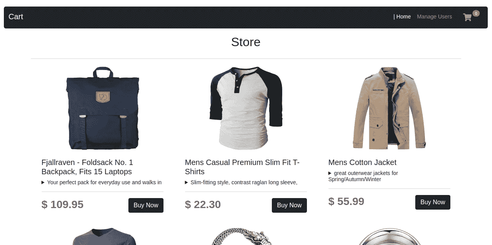
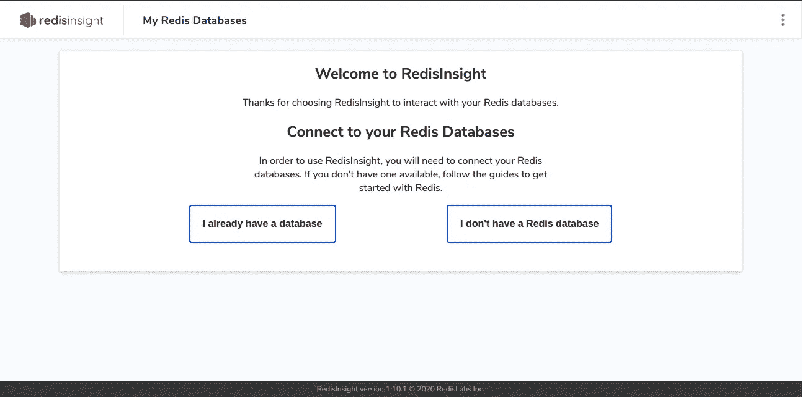
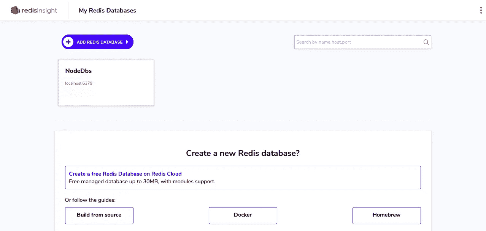
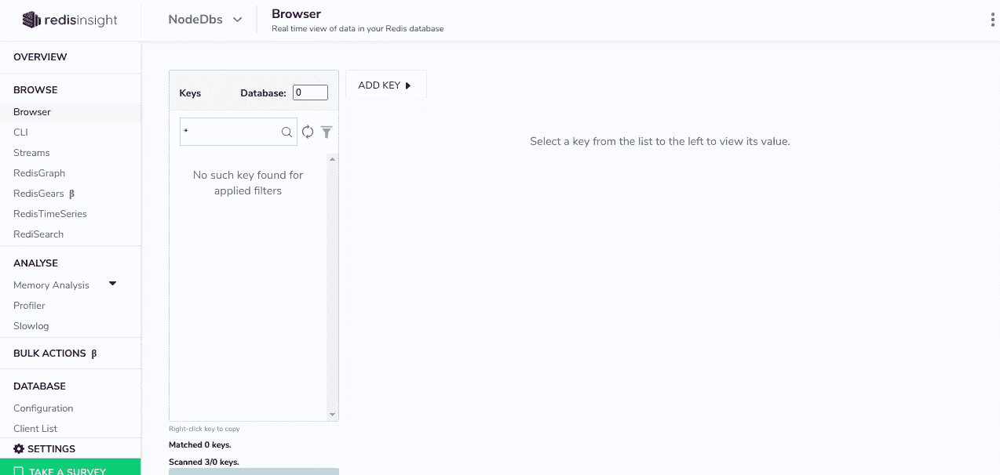
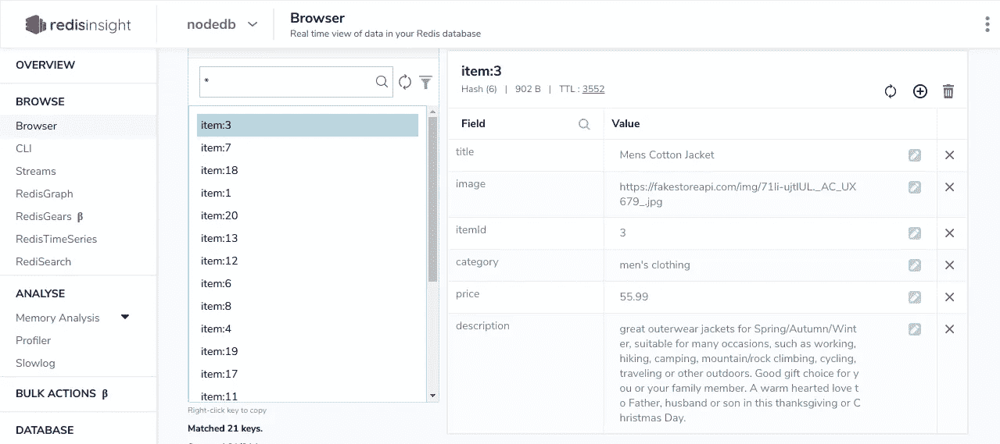
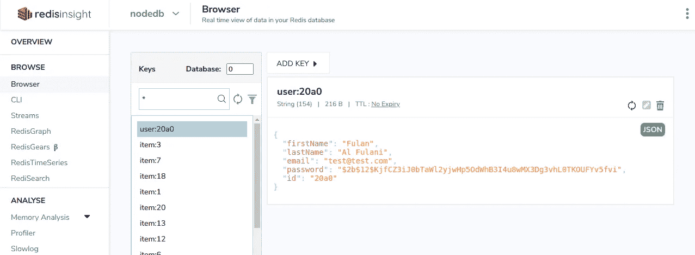
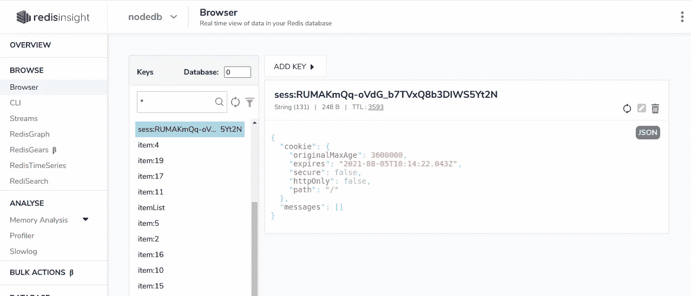
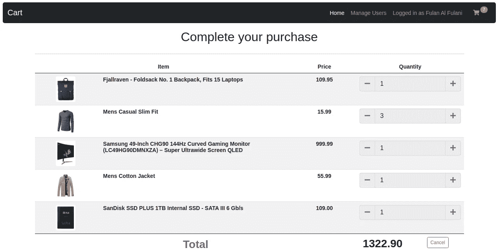
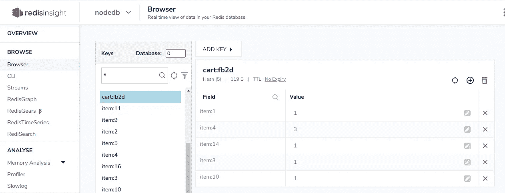

# Redis:综合指南

> 原文：<https://javascript.plainenglish.io/redis-a-hands-on-introduction-a181b43a32c1?source=collection_archive---------10----------------------->

## 通过与 Node.js、Express & Redis 建立电子商务网站，熟悉 Redis


Adapted from a photo by [Patrick](https://unsplash.com/@pf91_photography?utm_source=unsplash&utm_medium=referral&utm_content=creditCopyText) on [Unsplash](https://unsplash.com/?utm_source=unsplash&utm_medium=referral&utm_content=creditCopyText)

## [**概述**](#88ee)

## [再世](#4787)

*   [**安装 Redis**](#b8ba)
*   [**再版 GUI**](#84a4)

## [设置应用](#7586)

*   [**安装依赖项**](#c973)
*   [**连接至再世**](#f7eb)

## [**在 Redis 中缓存**](#72fb)

## [**再版为 NoSQL 文献数据库**](#8ecf)

## [**通过 Redis 进行会话管理**](#a604)

*   [**存储会话数据**](#28ab)
*   [储物购物车](#27c8)

## [剩余路线](#4e9f)

*   [**添加&移除推车物件**](#6fae)
*   [加工大车](#b3ab)
*   [**删除用户**](#d1fe)

## [结论](#797d)

# 概观

如果你正在阅读这篇文章，我想你至少已经查阅了 **Redis、**的定义，并且正在寻找一种更实际的方法来处理它。简单地说，

> Redis 是缓存、会话管理、游戏、引导板、实时分析、地理空间、叫车、聊天/消息、媒体流和酒吧/sub 应用的热门选择。

Redis 最适合于快速数据检索。这是通过 Redis 的内存存储实现的。大多数数据库存储发生在磁盘或固态硬盘上。因此，数据库操作需要往返于磁盘。相比之下，内存中的数据驻留在服务器的随机存取存储器中，不受同样的约束，提供亚毫秒级的响应时间，因此支持大量的操作。

本入门教程的目的是为 Redis 支持的一些数据结构和操作提供一种实用的方法。我们将使用 **NodeJS** 和 **Express** 构建一个简单的电子商务网站。

本教程的范围最初仅限于 Redis 的会话管理，但是很明显 Redis 的多功能性可以用来实现应用程序的大部分功能。我们将在以下情况下使用 Redis:

*   缓存 API 响应。
*   作为应用程序用户的 NoSQL 文档数据库。
*   会话管理。
*   存储用户的购物车。

完成后，访问我们应用程序的客户应该能够:

*   查看可用项目列表。
*   注册并登录。
*   在购物车中添加和删除商品；并查看他们购物车中的内容。
*   完成或取消购买，在此过程中清空购物车。



Store front-end.

# 雷迪斯

我们将安装以下组件来启动和运行 Redis:

*   Docker :一个开发、运输和运行应用程序的开放平台。我们将在 Docker 容器中运行 Redis 服务器。
*   **Redis** : 开源键值存储，起到数据结构服务器的作用。
*   **RedisInsight** : Redis GUI 可以可视化数据，也可以在不使用 shell 的情况下执行命令，不过也可以使用 CLI。

## 装置

如果您已经安装了 Redis，请跳到 [Redis GUI](#84a4) 部分。不需要 Docker 知识。只需在 [Ubuntu(第一步&第二步)](https://www.digitalocean.com/community/tutorials/how-to-install-and-use-docker-on-ubuntu-20-04)、 [Mac](https://docs.docker.com/docker-for-mac/install/) 或 [Windows](https://docs.docker.com/docker-for-windows/install/) 上安装 Docker 即可。然后从 Docker Hub 中提取 Redis 映像。

```
docker pull redis
```

使用别名`redis`启动 Redis 容器，别名`redis`由`--name`选项提供。Docker 守护进程使用`-p`标志`6379`将容器映射到 Redis 的默认端口，最后使用`-d`标志启动守护进程。

```
docker run --name redis -p 6379:6379 -d redis
```

检查容器是否正在运行:

```
docker ps
```

预期输出应类似于:

```
CONTAINER ID   IMAGE     COMMAND                  CREATED       STATUS              PORTS                                       NAMES
fabcb755ad52   redis     "docker-entrypoint.s…"   10 days ago   Up About a minute   0.0.0.0:6379->6379/tcp, :::6379->6379/tcp   redis
```

要停止容器一起运行:

```
docker stop redis
```

要再次启动 Redis 容器:

```
docker start redis
```

## Redis GUI

通过执行以下命令并等待下载完成，在 Docker 容器中运行 RedisInsight:

```
docker run -v redisinsight:/db -p 8001:8001 redislabs/redisinsight:latest
```

确保上一步中的 Redis 实例也在运行，然后在浏览器中导航到 [http://localhost:8001](http://localhost:8001) 。您应该会看到类似的页面:



RedisInsight in the browser

选择`**I already have a database**` 然后选择`**Connect to a Redis Database**`。

通过运行以下命令获取 Redis 容器的 IP 地址，用作`**Host***`的值:

```
docker container inspect -f "{{range .NetworkSettings.Networks}}{{.IPAddress}}{{end}}" redis
```

如果您使用 Docker 之外的其他方法安装 Redis，请使用`localhost`作为`**Host***`的值。填充字段。

```
**Host***: <IPAddress>
**Port***: 6379
**Name***: <EnterAName>
```

您应该在主页上看到创建的数据库。



RedisInsight with database added.

选择数据库为我们提供了 Redis 实例的概述。导航到`**BROWSE**`下的`**Browser**`，这是可以检查存储值的地方。我们还可以在`**CLI**`选项卡中执行 Redis 命令。



RedisInsight data store.

# 安装应用程序

## **设置**

我假设您已经安装了 NodeJS。将下面的[库](https://github.com/StphnLwnga/redis-cart)、`cd`克隆到目录中，并安装依赖项。我们将使用 [PugJS](https://www.sitepoint.com/a-beginners-guide-to-pug/) 作为模板引擎。

这是 app 的一个骨架。相关的代码和解释将在下面介绍。

```
npm i
```

要启动应用程序:

```
npm start
```

导航到 [http://localhost:3000](http://localhost:3000) 会把我们带到应用程序的主页。为了限制本教程的范围，省略了真实电子商务网站的许多复杂性。

我们有三视图。这是展示商品的主页。在用户页面上，我们将能够创建一个用户，查看最近创建的用户，并以任何用户的身份登录。最后，我们可以查看购物车的内容，并继续完成或取消订单。

为了存储会话数据，应用程序最初将依赖于`express-session`的默认会话存储— `MemoryStore`，据开发者称，

> ……是不是**故意**不是为生产环境设计的。在大多数情况下，它会泄漏内存，不会扩展到单个进程之外，并且用于调试和开发。

在会话管理部分，我们将讨论如何在 Redis 中存储会话数据。

启用`app.js`内的会话中间件。Require `express-session`并将其添加到中间件数组中。我们还将启用即时消息。要设置 flash 消息传递，我们还要编辑中间件函数，该函数设置`res.locals`中的`cartCount`属性。

**./app.js 👉🏾** Enabling session middleware.

如果应用程序已经在运行，输入`rs`和⏎.

## 连接 Redis

我们将使用`**ioredis**`初始化一个 Redis 客户端。将以下内容添加到`app.js`。

`**./app.js**` **👉🏾** Establishing Redis connection.

通过将 Redis 客户端对象作为属性保存在`config`中，我们使它在整个应用程序中都可用。重启应用程序。

# 贮藏

我们商店的存货目前是空的。我们将向外部服务查询商店的商品。我们将使用 [Fake Store API](https://fakestoreapi.com/) 来生成清单并将结果缓存在 Redis 中，从而减少对 API 的请求数量。

每一项都将存储为 Redis 散列数据类型。哈希是由与值相关联的字段组成的映射，适合于表示对象。Redis 中的哈希可能看起来像:

```
"object-type:id" field1 value1 field2 value2 ... fieldN valueN
```

第一个条目表示哈希的键，其中包含字段和值。*例如*带有 SKU `100`的项目可以在 Redis 中表示为:

```
"item:100" name "Jordan Series 0.1" price 115.00 ...
```

这里是 Redis 支持的其他数据类型的概述。

我们还将在一个单独的列表中索引项目 id。每个项目的一个`TTL`(生存时间)，并且项目 id 列表也将被设置。当密钥的`TTL`过期时，它们会自动从 Redis 中删除。我们将把`TTL`设置为 1 小时进行演示。

将以下内容添加到`data/items.js`并重启服务器。

**./data/items.js 👉🏾** Querying API & caching response in Redis.

```
rs
```

`**axios**` 用于发出`HTTP`请求。`**dayjs**` 是一个日期时间库我们将用它来显示时间相关的信息。`Items`是一个将`config`对象作为参数的函数。`config`对象包含 Redis 客户端对象。将在`data/index.js`文件中调用`Items`函数，并将其导出至路线。`ioredis`与回调和承诺一起工作。我们使用了承诺，因此在`try…catch`块中使用了`async/await`。`ioredis`方法映射到同名的 Redis 命令。您可以在 处查看所有使用过的 [**命令。**](https://redis.io/commands)

我们首先检查项目 id 列表的`item:itemList`键是否仍然存在或者已经过期。如果过期，对 Redis' `EXISTS`命令的响应是`0`，之后向 API 发出请求。响应是一个 item 对象数组。Redis 事务允许在一个步骤中执行一组命令。通过在客户机上调用`MULTI`命令，对事务上的命令进行排队，最后用`EXEC`命令执行它们，从而创建一个事务。在`Items`函数中，`transaction`是在收到 API 响应后创建的。我们遍历数组，使用析构赋值语法来解包每个`item`的属性，并为每个属性排列以下命令:

*   `HSET` **👉🏾**哈希方法，采用两个参数、哈希的密钥(`item:id`)和要存储在哈希中的字段-值对的对象。
*   `EXPIRE` **👉🏾**在作为参数提供的键上设置以秒为单位的`TTL`。
*   `RPUSH` **👉🏾**将值插入列表末尾的列表方法。如果列表不存在，则创建该列表。

处理完所有项目后，`item:itemList`键的一个`EXPIRE`命令也会排队，最后在`transaction`上调用`EXEC`命令，操作依次执行。事务是原子的*，即*要么处理所有命令，要么什么都不处理。如果`EXISTS`命令响应为`1`，则不执行`if`块。

我们在一个键上调用`TTL`命令来获取和显示我们数据的时间相关信息。

`Items`函数的默认动作是从 Redis 中检索条目。我们首先使用 list 方法`LRANGE`从`item:itemList`获取所有的条目 id，该方法接受一个列表键、一个开始和一个停止索引。`-1`表示列表中的最后一个元素。我们创建另一个事务`itemPipeline`，并将每个条目 ID 的`HGETALL`命令排队。`HGETALL`检索存储在指定键的散列的所有字段和值。`EXEC`在事务上调用命令。结果是一个包含一些`null`值的数组，我们使用`flat`和`filter`数组方法过滤掉这些值。

API 请求和 Redis 操作封装在`console.time()`调用中，让我们了解每批操作需要多长时间。

在`routes/index.js`内部，让我们导入`Items`并渲染主页中的项目。添加以下内容。

**./routes/index.js 👉🏾 Loading items from Redis.**

重新启动服务器。您应该会看到主页上显示的项目。我们还可以在 [RedisInsight](http://localhost:8001) 中的`**Browser**` 选项卡中可视化存储的哈希。



Redis Hashes

在终端中，应该可以看到不同操作的时间相关信息。值得注意的是，与从 Redis ( `retrieved-from-cache`)获取相同数据相比，从 API ( `querying-api`)获取数据所花费的时间。

# 文档数据库

根据定义，Redis 是一个 NoSQL 数据库，我们可以用它像 MongoDB 一样将数据存储为文档。尽管将用户保存为散列更有意义，但为了展示 Redis 的能力，我们将用户保存为 JSON 字符串。在填写**管理用户**页面上的表单时，一个`POST`请求被发送到`*/users*` 路由。让我们来定义路线。在`routes/users.js`中编辑以下内容。

**./routes/users.js 👉🏾** User sign up route.

Redis 客户机对象是从`config`对象导入和解包的。表单字段值是从请求正文中解析出来的。`**bcrypt**`和`**crypto**`分别用于散列密码和生成用户 ID。要添加用户，我们创建一个事务，然后将以下命令排队:

*   `SET` **👉🏾**设置一个键来保存作为第二个参数提供的字符串值。
*   `LPUSH` **👉🏾**在`user:userList`前添加用户 ID。
*   `GET` **👉🏾**返回一个键值

用`EXEC`处理命令，并从响应中提取结果。我们可以在 RedisInsight 中查看注册用户。



User in RedisInsight

为了显示注册用户的列表，当一个`GET`请求被发送到`*/users*` *时，从 Redis 中检索用户数据。*编辑`routes/users.js`中的路线。

**./routes/users.js****👉🏾** Get users’ list

与检索所有项目类似，用户 id 列表是用`LRANGE`获得的。执行一个事务，该事务带有针对列表中每个用户 ID 键的`GET`命令。从响应中解析用户，并呈现在`users`视图中。

# 会话管理

由于会话数据仍存储在`MemoryStore`中，应用程序无法同时支持多个用户会话，并且该数据仅在该会话期间有效。使用与`express-session`兼容的外部存储器应该允许持久存储和多个会话。

`**connect-redis**`使用现有 Redis 客户端为 Express 应用程序提供外部会话存储。我们用作为参数传递的`session`中间件创建一个`connect-redis`实例。Redis 客户机然后被传递给`session`中间件。

需要`app.js`里面的`connect-redis`，编辑`middlewares`数组中的`session`条目。

**./app.js 👉🏾** Transfer session storage to Redis.

重新启动服务器，会话数据现在以 JSON 字符串的形式保存在 Redis 的键-值对中。



Session data saved in Redis.

## 存储会话数据

用户数据也将作为会话数据的一部分存储。为了简单起见，我们将通过单击用户表中的用户来模拟用户登录。所选用户的 ID 存储为会话变量，匹配的用户数据从 Redis 的中间件函数中检索。当前登录的用户数据通过`res.locals`在整个应用程序中可用。

我们将在`routes/users.js`中的用户创建路径下定义登录用户的路径。

**./routes/users.js 👉🏾** Login a user route.

让我们在`app.js`中实现用户抓取。将以下内容添加到中间件函数中，我们在其中设置了 flash 消息传递和初始的`cartCount`。

**./app.js 👉🏾** Middleware to fetch current user on select.

我们现在应该能够在用户之间切换了。在本教程开始时，当启用会话中间件时，cookie 的`maxAge`属性被设置为 1 小时，之后 Redis 中的会话密钥`TTL`也被设置为相同的时间，之后会话过期，用户被注销。

## 保存购物车

让我们让已登录的用户能够进行购买。通过编辑`routes/index.js`中的路线，启用**立即购买**功能。

**./routes/index.js 👉🏾** Create and save user’s cart in Redis.

如果用户没有登录或者查询到不存在的项目，他们将被重定向到主页。从`res.locals`对象中检索当前用户的 ID。它将被用作购物车钥匙的一部分。项目 ID 是 URL 中的路由参数。

购物车数据保存为一个散列，以`cart:userID`为关键字，每个`item:itemID`为字段，商品数量为值。Redis' `HINCRBY`命令接受 3 个参数、键、一个字段和该字段的增量值。如果该键不存在，则用默认值`0`创建。

购物车中的商品保存在 Redis 中，但是这不会反映在前端。为此，我们将从用户的购物车中获取商品 id 并合计它们的值，然后在初始化它的中间件函数中更新`res.locals.cartCount`。在`*/users/:userId/cart*`路线中，我们将从 Redis 获取实际的商品进行显示。

将以下内容添加到`if (req.session.userId)`模块内`app.js`的中间件功能中。

**./app.js 👉🏾** Tally the items in a user’s cart.

让我们编辑`routes/users.js`中的`*/users/:userId/cart*` 路线以获得实际项目。

**./routes/users.js** **👉🏾** Retrieve the cart items.

用户 ID 是从 route 参数中解析出来的，我们检查当前用户是否可以访问该购物车。我们遍历`res.locals.cartData`数组，获取相关的商品信息，以及购物车中的商品数量，并将这些数据放入`cartData`数组。总价也被计算出来并呈现给`cart`视图。购物车数据可以在 RedisInsight 中查看。



Cart view.



Cart data in Redis.

# 定义剩余的路线

## 添加和删除购物车商品

让我们为购物车中的`➕️`和`➖️`按钮添加功能。编辑`routes/users.js`内的路线。

**./routes/users.js** **👉🏾** Add & Remove items from the cart.

从 URL 解析用户 ID 和项目 ID 路由参数，并且存储在关键字`cart:userId`处的散列中的字段`itemId`的值增加或减少。使用与第一次将[物品添加到](#a5b9)购物车时相同的命令— `HINCRBY`。Redis 命令用于增加和减少值是相同的，除了最后一个参数——字段递增的值；`1`增加，`-1`减少。我们现在应该能够在购物车中添加和删除商品了。

然而，在减少项目计数时，数量可以减少到`0`及以下。Redis 不知道购物车商品应该只能是正整数。我们将在会话中间件中处理这个问题，在检索购物车中的商品 id 列表后，如果一个`itemId`字段的值小于 1，我们将使用`HDEL`命令从购物车中删除它，该命令从存储在指定键的散列中删除一个字段。编辑`app.js`中的中间件功能。

**./app.js** **👉🏾** Limit cart item counts to positive integers.

## 处理购物车

我们可以继续模拟真实购物车中会发生什么。如果购买完成，订单数据可能会被发送到一个更健壮的数据库。无论是完成还是取消订单，购物车都是空的。在`routes/users.js`中编辑以下路线。

**./routes/users.js** **👉🏾** Empty the cart.

`DEL`命令用于清空购物车。它从存储区中移除指定的密钥。

## 删除用户

最后，让我们启用**管理用户**页面中的`🗑`按钮。在`routes/index.js`中编辑删除用户路由。

**./routes/users.js** **👉🏾** Delete user.

我们创建一个事务，并在执行删除命令之前对其进行排队。`DEL`命令接受一个键列表来删除用户的购物车和数据。使用`LREM`命令从`user:userList`中删除用户 ID，该命令接受 3 个参数、列表的键、计数(要删除的出现次数)和要从列表中删除的元素。当 count 设置为`0`时，该元素的所有出现都将从列表中删除。

# 结论

Redis 是一个多功能的存储服务器，有许多使用案例。它在缓存技术领域大放异彩，显著提高了应用程序的性能。不同的数据结构为保存和查询数据提供了强大的方法，这是普通的键值缓存无法实现的。

本文的目的并不是建议将 Redis 作为数据库的 TVA 它确实有局限性。虽然我们也使用 Redis 文档数据库，但它缺乏内置加密；没有基于角色的帐户控制；并且在大规模云部署中进行部署可能会很困难。此外，牺牲更好的性能是增加内存使用，使用的内存存储几乎是相同数据在磁盘上占用的两倍。

希望这是 Redis 的一个有用的入门。谢谢你坚持到最后。欢迎在评论中提出建议和改进。快乐黑客👍🏾️.

*更多内容请看*[***plain English . io***](http://plainenglish.io)