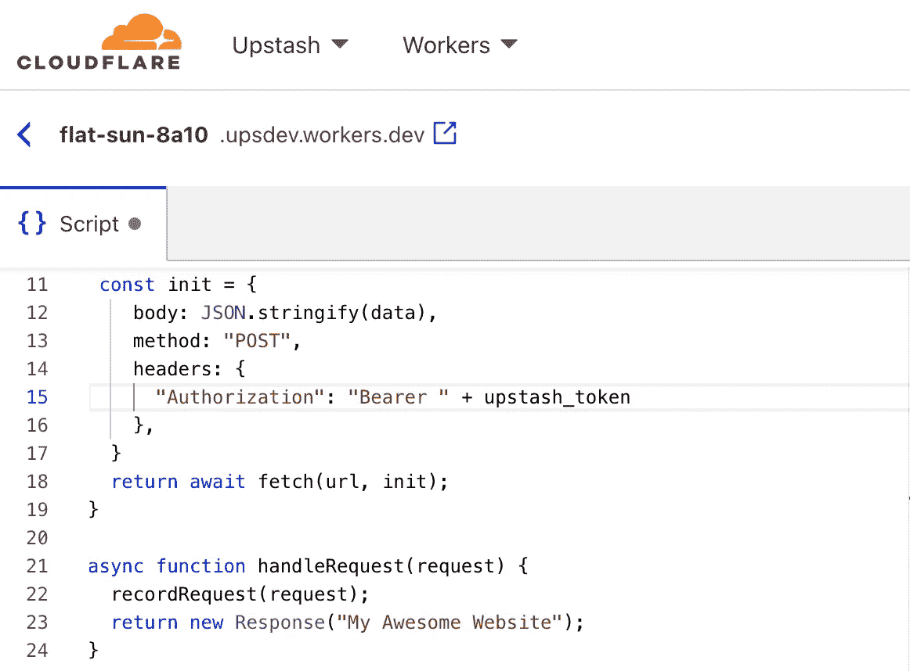
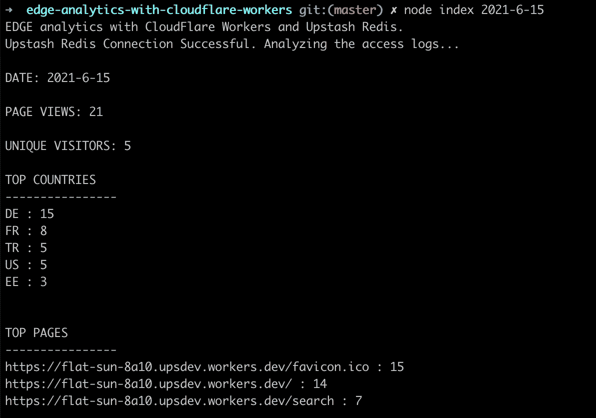

# Redis 与 Cloudflare 工人站在一起

> 原文：<https://javascript.plainenglish.io/redis-at-the-edge-with-cloudflare-workers-c5181da0c66e?source=collection_archive---------13----------------------->

边缘计算是近年来最令人兴奋的功能之一。CDN 可以让你的文件离用户更近。边缘计算使您能够在离用户更近的地方运行应用。这有助于开发人员构建全球分布的高性能应用程序。

Cloudflare Workers 是目前该领域的领先产品。它给你一个没有冷启动的无服务器处理环境。您可以利用 Cloudflare 的全球网络来最大限度地减少应用程序的延迟。你可以用 JavaScript，Rust，C 和 C++写你的函数。

类似于无服务器功能(AWS Lambda 等。)，Cloudflare 工作人员是无国籍的。正如你在 [Cloudflare 的调查](https://workers.cloudflare.com/node)中看到的，开发人员正在询问从 Edge 功能连接他们的数据库的方法。不幸的是，大多数数据库不是为无服务器环境设计的，它们需要持久连接。我们在 Redis 上开发了 REST API，使无服务器的 edge 函数能够以最简单、最快的方式访问 Upstash。

# 与 Cloudflare Workers KV 比较

Cloudflare 有一个基本的键值存储，可以用来存储 Edge 函数的状态。Upstash Redis 在几个方面优于 Cloudflare KV:

*   Cloudflare KV 仅提供基本的获取/设置/删除功能。Upstash 为您提供了所有 Redis 数据结构，您可以在其中构建更复杂的功能(哈希、列表、排序集、范围、追加、增量等)。
*   Cloudflare KV 旨在从 Cloudflare 生态系统中访问，而您可以从任何地方访问和使用 Upstash Redis，因为它支持 Redis 和 REST API。您可以将数据从 Edge 卸载到 Redis，然后由任何 Redis 客户端处理。
*   Cloudflare KV 针对读取繁重的应用程序进行了优化。写入可能需要 60 秒才能复制到其他位置。对于 Upstash，写入延迟以毫秒为单位。

现在让我们编写一个简单的示例来展示 Cloudflare+Redis 组合的强大功能。

# 边缘分析

网络分析是所有网站所有者非常普遍的需求。谷歌分析是强大的，但许多开发者不喜欢与谷歌分享他们的流量数据，并向用户的浏览器注入 cookies。由于您的网站流量来自 CDN，您可以在边缘层轻松跟踪您的流量。在这里，我们将实现一个非常简单的示例来展示如何跟踪来自 Cloudflare Workers 的用户流量。我们将拦截 Cloudflare Workers 中的流量，并将用户请求保存到 Upstash Redis。然后，我们将编写一个基本的独立应用程序，它将分析请求，并在选定的一天给我以下信息:

*   页面视图
*   独特的访问者
*   游客数量最多的国家
*   最常访问的页面

# 设置

如果您没有数据库，请按照本[指南](https://docs.upstash.com/)创建一个数据库。在数据库页面中，单击 REST API 按钮并复制 REST URL。如果你有一个 Cloudflare 帐户，你可以创建一个 Workers 函数，或者你也可以在没有帐户的情况下使用 [the playground](https://cloudflareworkers.com/#36ebe026bf3510a2e5acace89c09829f:about:blank) 。

# Cloudflare 工人代码

Cloudflare Workers 函数接受`request`作为参数。使用 Upstash 的 REST API，我将请求记录到 Redis 列表中。我使用当前日期作为 Redis 列表的关键字。因此，我们将每天的请求记录在单独的列表中。

Upstash REST API 需要一个端点和一个令牌。创建数据库后，您可以从控制台点击`REST API`按钮[复制端点和令牌。使用以下代码更新您的 Cloudflare Workers 函数，替换端点和令牌:](https://console.upstash.com/)

# 分析工具代码

现在让我们编写一个简单的命令行应用程序，它将日期作为参数，并返回我们的分析数据。创建一个文件夹并运行`npm init`。然后用`npm install ioredis`安装 Redis 客户端。将`.env.example`复制为`.env`文件，并设置你的 Redis URL (ioredis)。使用以下内容更新 index.js:

现在你可以用`node index 2021-6-16`或者仅仅用`node index`来运行你的应用程序。后一个将查询今天。

你可以把这个例子当作一个起点。您可以根据您的分析需求开发一个包含图表和表格的富 web 应用程序。您可以使用其他 Redis 数据结构进行更强大的分析。

# Upstash Edge 路线图

REST API 是我们 Edge 故事的第一步。我们计划今年进行两项重要的开发。

*   边缘缓存:现在，所有的 REST 请求都到达数据库区域。我们将很快支持边缘缓存，因此您的 REST 请求将在全球所有边缘位置进行缓存。这将使 Upstash Redis 能够像 Cloudflare KV 一样在全球范围内提供低延迟。
*   全局复制数据库:全局(多区域)复制会将您的数据复制到多个区域。因此所有请求(Redis 和 REST API)都将到达最近的位置。这将为您提供全局低延迟，同时对一致性的牺牲最小。

我计划写一篇博客，专门介绍我们的 Edge 路线图。请继续关注我们的推特。

*原载于 2021 年 6 月 15 日*[*【https://blog.upstash.com】*](https://blog.upstash.com/redis-cloudflare-workers)*。*

## 进一步阅读

 [## 如何构建可重用的 Cloudflare Worker 组件

### 生成和部署无服务器 Cloudflare worker 的过程非常简单:派生一个现有的 Cloudflare…

比特云](https://bit.cloud/blog/how-to-build-a-reusable-cloudflare-worker-component-l4bf0swo) 

*更多内容看* [***说白了。报名参加我们的***](https://plainenglish.io/) **[***免费周报***](http://newsletter.plainenglish.io/) *。关注我们上* [***推特***](https://twitter.com/inPlainEngHQ) ，[***LinkedIn***](https://www.linkedin.com/company/inplainenglish/)***，***[***YouTube***](https://www.youtube.com/channel/UCtipWUghju290NWcn8jhyAw)***，以及****[***不和***](https://discord.gg/GtDtUAvyhW)*** *对成长黑客感兴趣？检查出* [***电路***](https://circuit.ooo/) ***。***