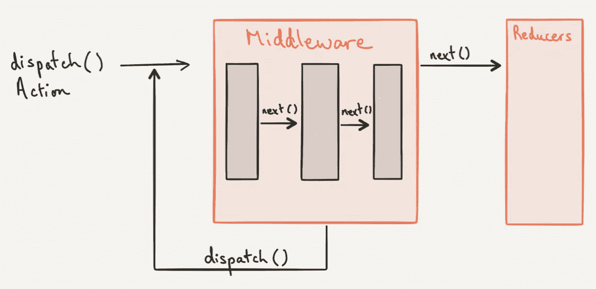
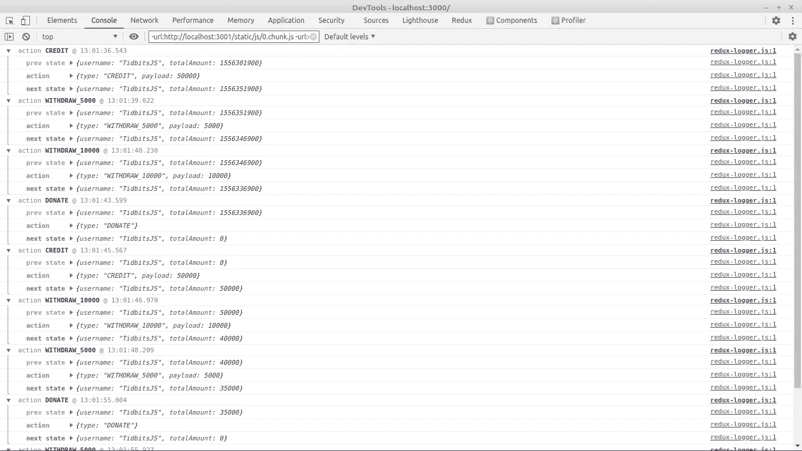
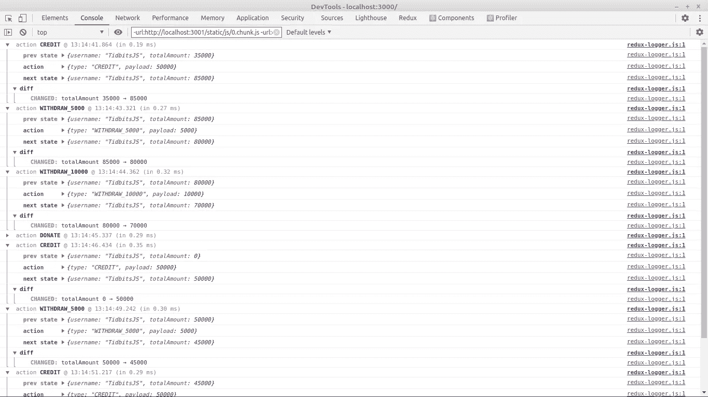

# redux Logger——您的下一个调试工具(日志的艺术)

> 原文：<https://javascript.plainenglish.io/redux-logger-your-next-debugging-tool-the-art-of-logging-e1999cbbd146?source=collection_archive---------1----------------------->

## 使用 redux-logger 以更清晰和精确的方式记录 redux 状态流。您的下一个调试工具。


The developer's [debugging](https://levelup.gitconnected.com/javascript-basics-console-log-8532b446db22) art

你真是个天才。你已经学会了 React，然后是 Context API，然后是 Redux。太美了。现在你已经爱上了 Redux——你的状态管理库。直到昨天你都做得很好。嘣。一个错误，你一无所知。你正在为此烦恼，找不到是什么让这个 bug 困扰你。现在你要一行一行的去翻 1000+行的代码库去调试。更加烦躁。

> 调试是一门艺术——一位调试艺术家说

是的，调试是一门艺术，很少有人掌握它。我们其余的人就像，"*向 StackOverflow* 致敬。"存在各种调试工具，包括强大的浏览器开发工具或定制工具。正如文章名称所暗示的，我在这里讨论 Redux 环境中的调试(这是我个人遇到问题的地方)。Redux 帮助管理应用程序的状态。但是当你写越来越多的动作时，发现哪个触发了什么就变得很笨拙了。*是什么导致了国家的变化？*

具体来说，对于 Redux，已经创建了一些工具来帮助您了解更大的情况。一个这样的工具是 Redux Devtools。

[](https://github.com/zalmoxisus/redux-devtools-extension) [## GitHub-zalmoxisus/Redux-dev tools-extension:Redux dev tools 扩展。

### 请注意，从 v2.7 开始，window.devToolsExtension 被重命名为 window。__REDUX_DEVTOOLS_EXTENSION__ /…

github.com](https://github.com/zalmoxisus/redux-devtools-extension) 

它是一个跟踪应用程序状态变化的扩展。您可以跟踪、跳转、跳过任何已调度的操作。这对你的工作流程有好处。但是我更喜欢不同的。*嗯？*

Redux Logger 是我的最爱。简单易懂(至少对我来说)。它与 Redux Devtools 相同，但它不是一个扩展——相反，它是一个存在于您的应用程序中的日志记录器。一个包裹！

> 一个 production Redux 日志记录工具，让您重放问题，就像它们发生在您自己的浏览器中一样。它不需要猜测错误发生的原因，也不需要用户提供截图和日志转储，而是让您重放 Redux 操作+状态、网络请求、控制台日志，并查看用户所看到的视频——log rocket

LogRocket 是背后的创造者。它在贫民区相当有名，每周有 6lakhs 下载量。

别再说什么和为什么了。

> *空谈不值钱，给我看看代码*——你可能会说。

但是没有哪个天才能够直接跳到代码上&一眼就学会。如果这是真的，那么就真的没有必要记录和谈论。想想— *如果 NPM 软件包的创建者直接向您展示他们的遗留代码而不是文档，会怎么样？很可怕，不是吗？Xd。*

无论如何，让我们进入代码库。我已经使用 Redux 和 React 创建了一个示例项目进行演示(您可以在 React 上使用您选择的任何框架)。这是一个有 3 个行动的基本项目(文章末尾有回购链接，所以继续前进)。

项目名称— Redux Bank。

行动名称-信用、提款、捐赠。

州——总金额

# 装置

要安装这个包，你可以使用 Yarn 或者 NPM 作为包管理器(我忘记告诉你了吗，节点安装是必须的？).

```
npm i redux-logger
```

否则，

```
yarn add redux-logger
```

虽然简单！

# 设置

假设您已经克隆了演示存储库，或者您已经准备好 redux 应用程序来试用它——

Default logger

有两件事需要指出，

1.  **应用中间件**

Redux 提供的一个插件，用于在被调用的动作和到达 reducer 的时刻之间嵌入任何类型的中间件。更好的视觉效果—



[Action — Middleware — Reducer](https://medium.com/chingu/understanding-redux-middleware-5d8fe63aabfb)

说白了，就是在动作被调用之后，但到达 reducer 之前，你想调用的东西。中间。

一些著名的中间件——

*   还原传奇
*   还原-thunk
*   redux-持久化
*   redux-devtools(是)
*   redux-logger(哦耶)

2.**为什么【logger】&为什么不应用中间件(logger)**

可以直接将`logger`传递给 applyMiddleware。那我为什么要这样写呢？万一将来我需要另一个中间件，比如。，redux-thunk，然后为了将集合中间件传递给 applyMiddleware，我使用了 array(这是推荐的)。不管怎样，最后我还是要毁掉它。

**注意**——如果你必须使用不止一个中间件，那么总是把`redux-logger`放在中间件列表的最后。

调用操作并打开你的控制台，你应该看到这个(如果你和我使用相同的代码库)



Logging…

您可以清楚地看到您调度的那些操作。动作 ACTION_NAME。对于每一个动作，`redux-logger`都会记录这三件事(默认)。

*   **前一状态** —调度动作前的状态
*   **动作** —有效载荷任意的动作类型
*   **下一个状态** —完成动作后的状态，即发生任何变化后的状态。

很酷，不是吗？

不，我不喜欢那些颜色，或者没有什么东西可以显示状态实际变化之间的差异，你可能会想。

不要担心，继续&建立你自己的定制日志。*真的吗？是的，这个软件包可以让你创建自己的日志程序。看看我的定制记录器—*

Custom Logger

阐述…

*   **创建记录器** —创建带有选项的自定义记录器
*   **折叠** —默认情况下，动作是展开的。如果您不希望这样，请使用折叠。您可以更具体地折叠某些操作。像我一样。我不想看到捐赠行动的细节，所以我折叠(因为我捐赠所有的钱)。
*   **谓词** —记录某种类型的操作。在我的代码中，这是信用行动。除了在控制台中的谓词中指定的操作之外，您将看不到任何操作。只有信贷活动的变化将被记录，其余的被忽略。
*   **diff** —类似于 git diff。可以直接看状态的 diff。
*   **持续时间&时间戳** —调用动作所用的时间。
*   **颜色** —随心所欲上色。*尽情享受。*
*   **级别** —如果您想使用其他类型的控制台，例如。、警告、信息、错误等。，而不是默认的记录器或自定义颜色。

就是这样。您的自定义记录器。你所需要知道的。给我看看结果，*请*。



Custom logging…

看看那个*差*。我还没有在这里使用 level &谓词选项。你们可以自己玩。点击了解更多信息[。](https://www.npmjs.com/package/redux-logger)

现在，它对调试困扰你的错误没有帮助吗？当然，感谢造物主。这将有助于您关注状态变化。

还有什么？*去把那个****Bug****拿出来。*

这是用于演示的存储库链接—

[](https://github.com/TidbitsJS/Redux-Bank) [## GitHub - TidbitsJS/Redux-Bank

### 这个项目是用 Create React App 引导的。使用 ReactJS & Redux 制作的简单应用程序。没有使用…

github.com](https://github.com/TidbitsJS/Redux-Bank) 

奥伦梅耶·德瓦姆等人👋

*更多内容请看*[***plain English . io***](http://plainenglish.io/)