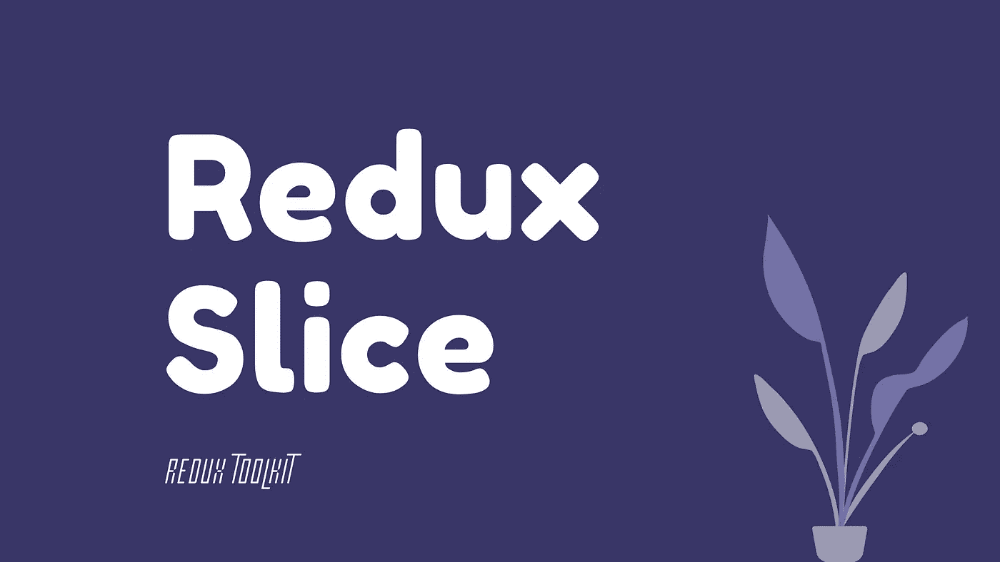

# Redux 切片介绍🍕

> 原文：<https://javascript.plainenglish.io/redux-slice-37c7616cebdc?source=collection_archive---------4----------------------->

## Redux Slice 的基本介绍以及如何创建！



如果您熟悉 redux，那么您可以充分利用这篇文章。

在这篇文章中，我们将不会涵盖 Redux 概念本身，我们将采取切片🍕

# 传统的方式

每次您想要使用 redux 时，您都需要创建类型、动作和 Reducer，以便能够创建 Redux 循环，但是使用 Redux 工具包，这要简单得多。

# Redux 工具包方式

它的创建是为了帮助解决 redux 的一些问题，如“redux 需要太多的样板代码”，它有根据 Redux 最佳实践构建的函数，它包括几个实用函数，简化了最常见的 Redux 用例。

所以它提供了一些功能，比如 createSlice，我们将在本文中讨论。

安装:

```
npm install @reduxjs/toolkit
```

您可以通过以下链接查看更多关于 Redux toolkit 的信息:

 [## Redux 工具包:概述| Redux

### Redux Toolkit 是我们官方的、固执己见的、包含电池的工具集，用于高效的 Redux 开发。它旨在…

redux.js.org](https://redux.js.org/redux-toolkit/overview) 

# 现在是时候创建切片了()🍕

## 1-如何创建它！

它是一个接受以下对象的函数:

*   切片名称
*   初始状态值
*   包含 Reducer 函数及其键名的 Reducers 对象将用于生成操作—这些函数旨在处理特定的操作类型，相当于开关中的单个 case 语句—并且每个函数都有一个状态作为存储中的当前值，而操作将携带更新值的有效负载。

它会在后台自动生成一个带有对应动作创建者和动作类型的切片还原器。

以下是切片文件的一个示例:

Redux Toolkit Example

## 2-将其添加到减速器中

在组合减速器中，添加切片名称作为键:

或者您可以遵循另一种方式，使用 redux toolkit 方式，但是使用 configureStore()函数，该函数将 reducers 作为其参数之一。

您可以通过以下链接查看有关 configureStore()的更多信息:

[](https://redux-toolkit.js.org/api/configureStore) [## 配置存储| Redux 工具包

### 对标准 Redux createStore 函数的友好抽象，为……的商店设置添加了良好的默认值

redux-toolkit.js.org](https://redux-toolkit.js.org/api/configureStore) 

# 3-分派行动

现在，您可以在组件中调度带有导出名称的动作，这些导出名称已添加到切片文件的末尾，例如上面示例中的 increment 或 decrement。

# 摘要

您可以继续使用使用 redux 循环的传统方式，而不需要 redux 工具包，但是如果您决定使用 redux 工具包，它将使您免于重复的 Redux 配置。

你也可以在 Redux 文档中找到这个建议

> *不过，* [*我们强烈推荐所有 Redux app*](https://redux.js.org/style-guide/style-guide#use-redux-toolkit-for-writing-redux-logic)*使用 Redux Toolkit。*

如果您已经在使用 redux，那么您所需要做的就是安装 redux toolkit，并创建一个带有名称、初始状态和 reducer 对象的片，该片具有稍后将作为动作被调度的函数。

> 非常感谢您抽出时间阅读本文。
> 
> *快乐学习！*

# 有用的资源:

 [## Redux 工具包:概述| Redux

### Redux Toolkit 是我们官方的、固执己见的、包含电池的工具集，用于高效的 Redux 开发。它旨在…

redux.js.org](https://redux.js.org/redux-toolkit/overview) [](https://redux.js.org/style-guide/style-guide) [## 风格指南| Redux

### 这是写 Redux 代码的官方风格指南。它列出了我们推荐的模式、最佳实践和…

redux.js.org](https://redux.js.org/style-guide/style-guide) [](https://redux-toolkit.js.org/introduction/getting-started) [## 入门| Redux 工具包

### Redux 工具包旨在成为编写 Redux 逻辑的标准方法。

redux-toolkit.js.org](https://redux-toolkit.js.org/introduction/getting-started) [](https://redux-toolkit.js.org/api/createSlice) [## createSlice | Redux 工具包

### 编辑描述

redux-toolkit.js.org](https://redux-toolkit.js.org/api/createSlice) 

*更多内容尽在*[*plain English . io*](http://plainenglish.io/)