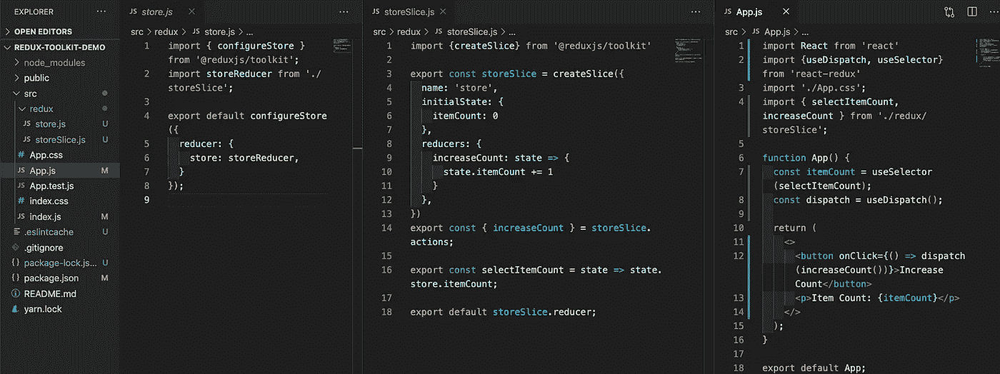
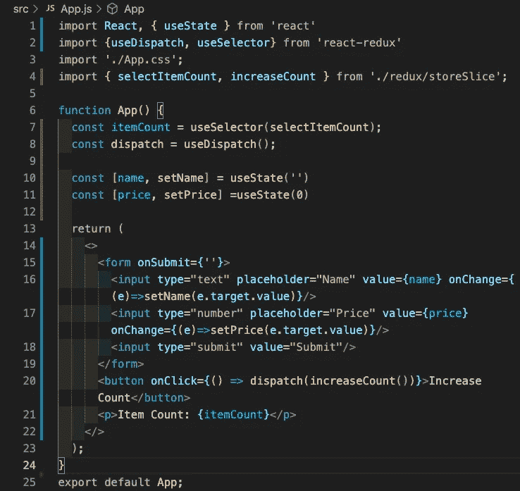
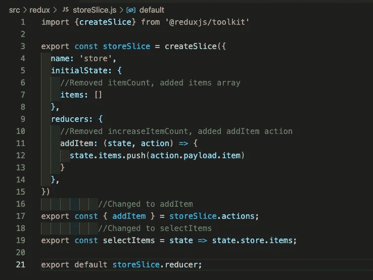
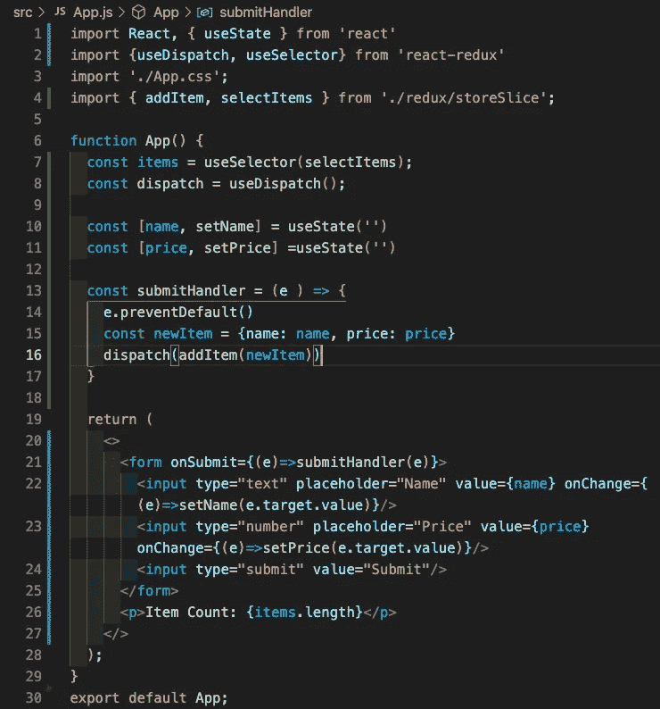
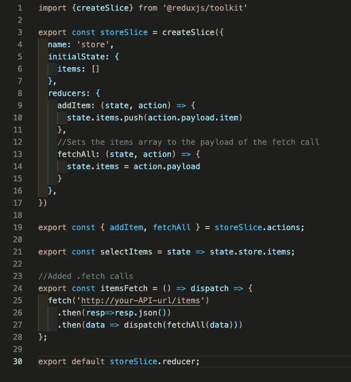
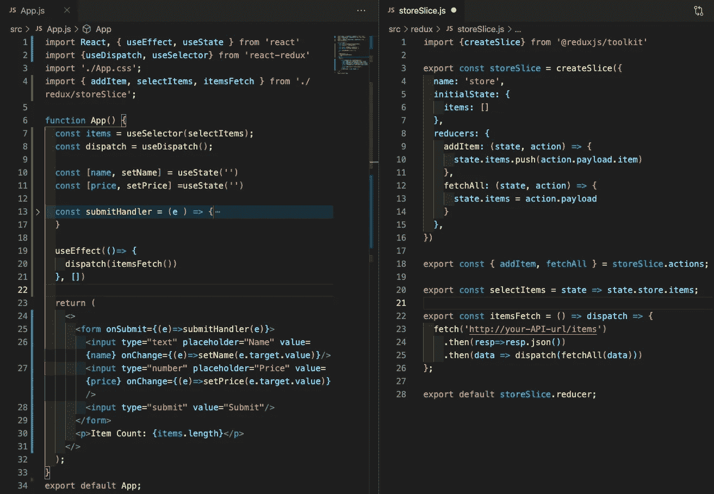

# Redux 工具包(Immer & Thunk)

> 原文：<https://javascript.plainenglish.io/redux-toolkit-immer-thunk-5bcac23968d7?source=collection_archive---------4----------------------->

> 在我的上一篇文章中，我简要介绍了如何重构现有的 Redux 代码，以利用 Redux 工具包和 React-Redux 挂钩。那篇文章可以在([这里](https://medium.com/javascript-in-plain-english/refactoring-existing-redux-w-redux-toolkit-hooks-550a628d74a9))找到，因为我将把它添加到从那里开始的演示中，所以它可能是一个很好的起点。现在，我想介绍的 Redux Toolkit 的另外两个功能是处理我们的片内的直接状态变化(感谢 Immer ),然后还进行异步 HTTP 调用(感谢 Thunk)。所以请不要离开，我将带您完成将这些功能添加到我们之前的演示中的过程。

让我们先快速浏览一下之前的代码。

Store (left), Slice(center), App Component(right)

我们有基本的商店设置，我们的应用程序组件订阅的一些简单状态的切片，以及将增加我们状态中的“itemCount”的调度方法。

Adding <form> to App.js

让我们直接对我们的应用程序组件进行一些更改。我将从现在开始将实际的项目对象合并到我们的应用程序中。它将有一个简单的形式，我们的用户将填写创建一个新的项目，并将其添加到他们的购物车。将 onSubmit 留为空白，一旦我们编写了将它添加到 Redux 中的状态的 dispatch 方法，我们将马上回来处理它。接下来，我们需要去我们的商店。

鉴于我们将使用实际项目的数组，我们的 itemCount 变成了一个冗余，所以我们将把它换成一个我们称之为 items 的数组。因此，我们也可以利用我们的 reducers 和导出的 selectItemCount 中的 increaseCount()。我们将用数组的功能替换所有这些功能，然后我们的应用程序组件将订阅这些功能，并能够根据数组的长度确定项目数。重构应该会产生如下所示的 storeSlice:

Refactored storeSlice for items: []

因此，随着这些新的变化，我们已经设置了我们的切片来利用 Immer。以前在 Redux 中，最佳实践表明，状态的改变必须在不直接改变状态的情况下进行，即创建当前状态的副本，操作该副本，然后将状态重新分配给改变后的副本。Immer 在幕后为您完成所有这些工作。他们的医生是这样描述的:

> “基本的想法是，你将把你所有的修改应用到一个临时的 *draftState* ，它是 *currentState* 的代理。一旦你所有的突变都完成了，Immer 将会基于草稿状态的突变产生*下一个状态*。这意味着您可以通过简单地修改数据来与数据进行交互，同时保留不可变数据的所有优势。”
> 
> “使用 Immer 就像拥有了一个私人助理；他拿了一封信(当前状态)并给了你一份副本(草稿),让你在上面草草修改。一旦你完成了，助理会拿走你的草稿，为你产生真正的不可改变的，最终的信(下一个状态)。”

这对我们来说意味着一个超级简单的方法来处理和改变我们的 Redux 状态。我们可以直接推入' items '数组，让 Immer 为我们做一堆幕后工作。完成后，我们将继续对我们的应用程序组件进行更多的更改，现在可以反映我们更改的部分。

Refactored App component

我们开始从 storeSlice 向 addItem(我们的调度方法)和 selectItem(我们订阅的状态片段)修复我们的导入。现在，我们只需为表单添加一个提交处理程序，它会将用户创建的项目发送到 Redux 存储中。Immer 将会适当地改变我们的状态，一旦物品被添加到我们的物品数组中，它将会反映在第 26 行的物品计数中。这只是一个小例子，说明我们如何在 Immer 的帮助下，在 Redux 工具包中改变状态。

接下来让我们回到我们的 storeSlice，在这里我们可以实现一个对伪 API 的 GET 请求，这个伪 API 理论上会在应用程序的初始加载时填充我们的 items 数组。这些都可以在我们的 storeSlice 中完成，使用 Redux Toolkit 中内置的 Thunk 中间件对外部源(通常是数据库)进行异步调用。当然，您可以使用其他中间件选项来进行异步调用，但是 Thunk 是 Redux Toolkit 的“开箱即用”产品，并且易于使用，这是在 Redux 中编写异步调用的一个很好的起点。

storeSlice.js w/Async Fetch Call

因此，在我们的 storeSlice 中，我们添加了两件事情，首先是一个“fetch all”reducer 操作，它将把我们的 items 数组设置为从 fetch 调用返回的任何内容。出于演示的目的，我们假设我们的 fetch 调用将从我们的 DB 返回一个项目数组。其次，我们添加实际的 fetch 调用‘items fetch ’,在我们的 dispatch 中传递，并在幕后的 Thunk 的帮助下，为我们进行异步调用。然后，我们当然会解析返回的数据，并随后调用 fetchAll() reducer 方法，用刚刚接收到的数据给 items 数组赋值。

相当简单，比以前编写 Redux 异步调用和相应的 reducer 方法要干净得多。现在，我们只需要在我们的应用程序组件中使用 or itemsFetch 方法，利用 useEffect 钩子，并通过我们的 Redux 工具包进行初始异步 Fetch 调用(使用 Thunk)，Redux 工具包可以直接改变状态(使用 Immer)。就这么简单。下面是我们最终的应用程序组件和 StoreSlice 文件。

Final App.js (left) & storeSlice.js (right)

这里有两个小例子说明如何继续构建 Redux 功能。这只是皮毛，因为我相信你可以想象你可以轻松地构建它，并将其扩展为一个完整的应用程序。这只是希望让您体验一下，使用 Redux Toolkit 可以简化以前复杂且经常令人费解的 Redux 代码的编写。

当然，如果你想更深入地了解它的功能，Redux Toolkit、Immer 和 Thunk 的文档都列在下面，有一些更好的例子和用例！

*【1】:Redux-Toolkit Docs(*【https://redux-toolkit.js.org/】T2)

*【2】:Immer Docs(*[https://immerjs.github.io/immer/docs/introduction](https://immerjs.github.io/immer/docs/introduction))

*【3】:Thunk Docs(*[https://github.com/reduxjs/redux-thunk](https://github.com/reduxjs/redux-thunk))