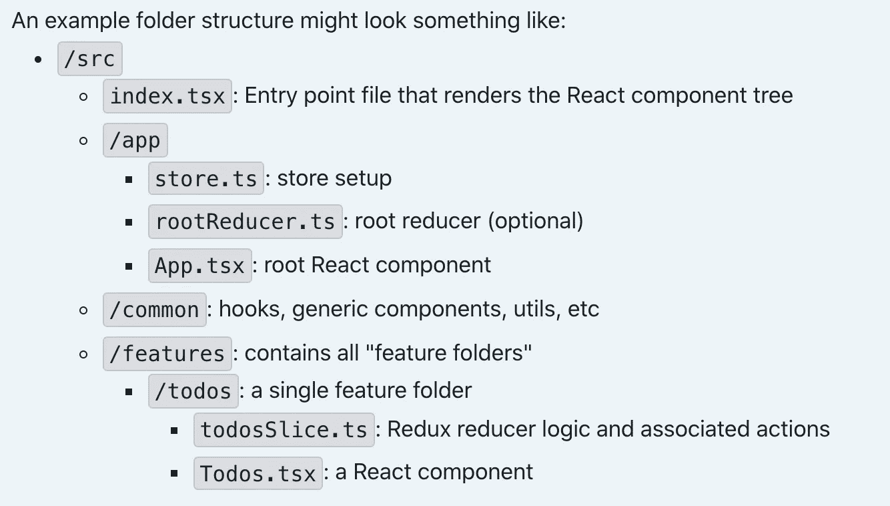

# Redux 工具包——编写 Redux 的标准方法

> 原文：<https://javascript.plainenglish.io/redux-toolkit-the-standard-way-to-write-redux-dcfb372202b8?source=collection_archive---------1----------------------->

## Redux 工具包，存储，创建切片，特征文件夹


Photo by [Brendan Church](https://unsplash.com/@bdchu614?utm_source=unsplash&utm_medium=referral&utm_content=creditCopyText) on [Unsplash](https://unsplash.com/s/photos/proper-way?utm_source=unsplash&utm_medium=referral&utm_content=creditCopyText)

[Redux](https://redux.js.org/) 是 JavaScript 应用程序的状态管理器。大多与 React 连用。大部分大型 react apps 都包含 redux，用于管理全局状态。但是所有基于 redux 的应用程序都遵循标准方法吗？

Redux 需要以标准和最佳的方式实现，以避免 React 应用程序中的问题。当我们开始开发一个基于 redux 的应用程序时，我们会对搜索最佳实践产生决策疲劳。为了避免这种混乱。我将分享在 React 应用中实现 redux 的标准方法，以及如何构建 react-redux 应用。我们出发吧

# Redux 工具包

[redux Toolkit](https://redux-toolkit.js.org/) 是一个 Redux 官方包，以标准和最小化的方式实现 Redux 逻辑。让我们快速看看，Redux Toolkit 解决了什么问题

1.  用单一功能配置 redux store！
2.  不需要添加额外的包来实现 redux。
3.  不再有样板代码。
4.  在生成 thunk 异步处理程序时。
5.  带有内置 [immerjs](https://github.com/immerjs/immer) 的变异助手。

让我们转到代码部分，看看这个包是如何标准化减速器的。

使用下面的命令将 Redux Toolkit 添加到您的项目中

```
yarn add @reduxjs/toolkit
```

# Redux 商店

使用 redux toolkit 创建一个商店非常简单！检查下面的代码

`configureStore`默认启用 redux-thunk 和 redux dev 工具。不需要使用中间件手动配置。但是如果你计划使用 redux-saga 或任何其他副作用管理器，你可以通过如下中间件进行配置

现在你的 redux 商店已经准备好行动了。接下来，将其添加到`<Provider/>`中，如下所示

下一个减速器设置？不要！！。该切片了。

# 创建切片 API

Redux Toolkit 提供了一个名为`createSlice`的 API。它处理初始状态，自动创建动作类型和创建者。并且没有**更多的开关情况。**我们也不需要手动编写动作类型和创建者。检查新切片缩减器的以下代码

让我们分解每个创建切片选项

**初始状态**:切片的初始状态

**名称**:切片名称。(减速器名称)

**减速器:**处理动作类型，如我们在减速器中使用的开关盒。

createSlice 也有`extraReducer.`这个选项是为了处理不是由当前切片生成的动作类型。

现在，您可以与 redux 存储交互，并从 React 组件中切片，如下所示

# 功能文件夹

特征文件夹与 redux toolkit 无关。但这也是 redux 推荐的构造你的 React Redux App 的方式。要素文件夹方法是将要素分组到一个文件夹中。

feature 文件夹包括特定特性的 redux toolkit `createSlice` API 的组件和单个文件。Redux 相关动作创建者，类型需要在单个文件中添加，而不是在多个文件中添加。



sample folder structure

`**/app**` 整个 app 使用的全局 app 设置和布局配置。

`**/common**`可重用的助手和组件

`**/features**`与特定功能及其切片逻辑相关的组件。

# 资源

[Redux Toolkit GitHub 资源库](https://github.com/reduxjs/redux-toolkit)

[鸭子重叠模式](https://github.com/erikras/ducks-modular-redux)

# 结论

Redux toolkit 提供了一种方便和标准的编写 reducers 的方法。我希望你已经发现这是有用的。感谢您的阅读。

*更多内容请看*[***plain English . io***](http://plainenglish.io/)