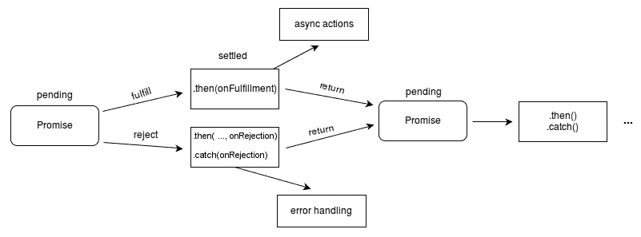

# 重构带有异步等待的承诺链

> 原文：<https://javascript.plainenglish.io/refactoring-promise-chains-w-async-await-d126c7fac3a8?source=collection_archive---------2----------------------->

> 在我永无止境的重构和精炼代码的旅程中，我最近的努力是在`async-await`的帮助下编写更干净、更易读的代码


直到最近，我只在编写 React 代码的环境中使用 JavaScript & `Promises`。至于异步代码和`Promises`,我仅有的用例是编写对 API 的`fetch()`调用。它通常看起来像这样:

```
function getUsers(){
   fetch('https://some-url-here.com/')
   .then(resp => resp.json()
   .then(data => someFunctionToUseReturnedData(data))
   .catch(err => console.log(err))
}
```

熟悉上面代码的人都知道，JavaScript 的 fetch API 利用了`Promises` &，通过将后续的`Promises`链接在一起，实现了异步功能。调用`fetch()`会返回一个`Promise`，任何后续的`.then()`或`.catch()`调用也是如此，然后每个调用都必须被处理。如果您需要快速复习，下面显示了`Promise`的“生命周期”以供参考:



Promise lifecycle

像这样一个简单的 API 调用很容易阅读和理解，但是一旦你的逻辑和用例变得越来越复杂，“可读性”因素就很容易远离你了。当我开始使用 Node/Express/MongoDB 作为我的后端 API 的堆栈时，情况确实如此。在 MongoDB 中处理复杂的集合和文档以及处理它们的关联，控制器函数中的链接`Promises`经常很快变得混乱和不可读。

所以我决定最终利用`async-await`关键字，并重构我所有的现有代码，以便更同步地读取。让我们从上面那个简单的 API 获取调用开始，然后我将进入一些更详细的细节和另一个用例。

首先，每个函数必须立即声明为异步的:

```
***async*** function getUsers(){
   ...
}
```

这声明了零个或多个异步`await`表达式将出现在函数的上下文中。接下来，为了利用错误处理，我们将不再使用`.catch()`，因此我们可以将函数的内部代码包装在`try/catch`块中。

```
***async*** function getUsers(){
   try{
       ...
   } catch(error){
       console.log(error)
   } 
}
```

接下来，我们可以通过使用`await`关键字来重构`Promise`链的`.then()`块。这里要理解的最大一点就是`await`关键词是阻塞。它阻止其余代码的执行，直到“幕后”发生的基于`Promise`的功能完成。所以记住这一点，一定要厌倦在一个异步函数中使用多少个`await`关键字。通常情况下，不仅仅是当一个`await`表达式的返回结果依赖于前一个表达式时，才需要使用多个`awaits`。通常，如果在一个`async`函数中有许多`awaits`，这可以被抽象成更小的`async`函数，这些函数可能会并行运行，因此可以加速代码的执行。

现在是我们小代码的最后一个变化:

```
***async*** function getUsers(){
   try{
       const resp = ***await*** fetch('https://some-url-here.com/');
       const data = ***await*** resp.json();
       someFunctionToUseReturnedData(data);
   } catch(error){
       console.log(error)
   } 
}
```

我们现在拥有了和以前完全一样的功能，但是没有使用链式承诺，并且以一种更简洁、同步的方式编写，不熟悉您的代码的人更容易理解。

为了快速展示如何在后端 Node.js 环境中使用它，我将包括一个`Promise`链`(req/res)` &的例子，然后是一个使用`async-await`关键字的重构版本

```
const Post = require('../models/post')
const express = require('express')
const router = express.Router();...router.get('/post/:id', (req, res, next) => {  
   Post.findById(req.params.id)   
      .then(post => {    
         if (!post){    
            const error = new Error('Could not find post');        
            error.statusCode = 404;  
            throw error;   
         } else {    
            res.status(200).json({      
               post: post    
            });   
         }  
      });   
      .catch(error => {   
         if (!error.statusCode){     
            error.statusCode = 500;   
         }    
         next(error);  
      })
})
```

这里我们有一个`Promise`链来从数据库中获取一篇文章，或者以 json 格式发送回这篇文章，或者发送回一个错误，描述这篇文章无法找到，或者有一个服务器错误。现在让我们继续使用`async-await`关键字重写它

```
router.get('/post/:id', ***async*** (req, res, next) => {
   try {
      const post = ***await*** Post.findById(req.params.id)
      if (!post){
         const err = new Error('Could not find post');
         err.statusCode = 404;
         throw err;
      } else {
         res.status(200).json({
            post: post
         }) 
      }
   } catch (error) {
      if (!error.statusCode) error.statusCode = 500;
      next(error);
   }
})
```

代码的行为和以前一样，但是没有了`Promise`链接，并且通过使用`async-await`它变得更加可读。简单的`await`表达式使得编写的代码更加同步。

重构远离承诺链有助于提高可读性，尤其是在处理大型且不断增长的应用程序时。如果你想对 async-await、Promises 或 Fetch API 做更多的研究，下面是文档的链接。

*【1】:异步函数文档(*[https://developer . Mozilla . org/en-US/Docs/Web/JavaScript/Reference/Statements/async _ Function](https://developer.mozilla.org/en-US/docs/Web/JavaScript/Reference/Statements/async_function))

*【2】:Promise Docs(*[https://developer . Mozilla . org/en-US/Docs/Web/JavaScript/Reference/Global _ Objects/Promise](https://developer.mozilla.org/en-US/docs/Web/JavaScript/Reference/Global_Objects/Promise))

*[3]:取 API 文档(*)