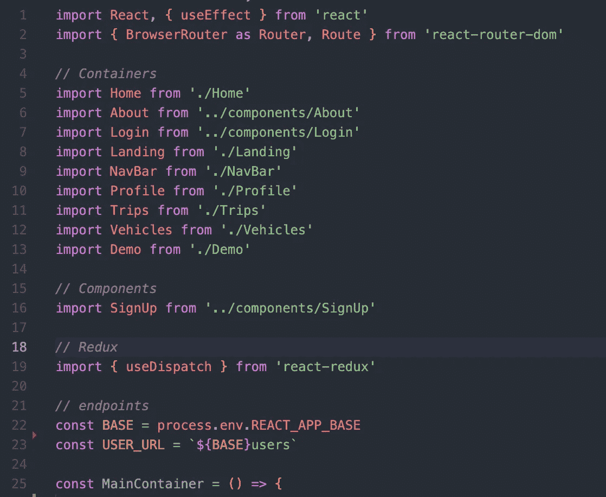
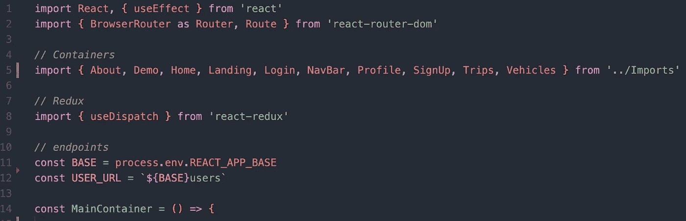
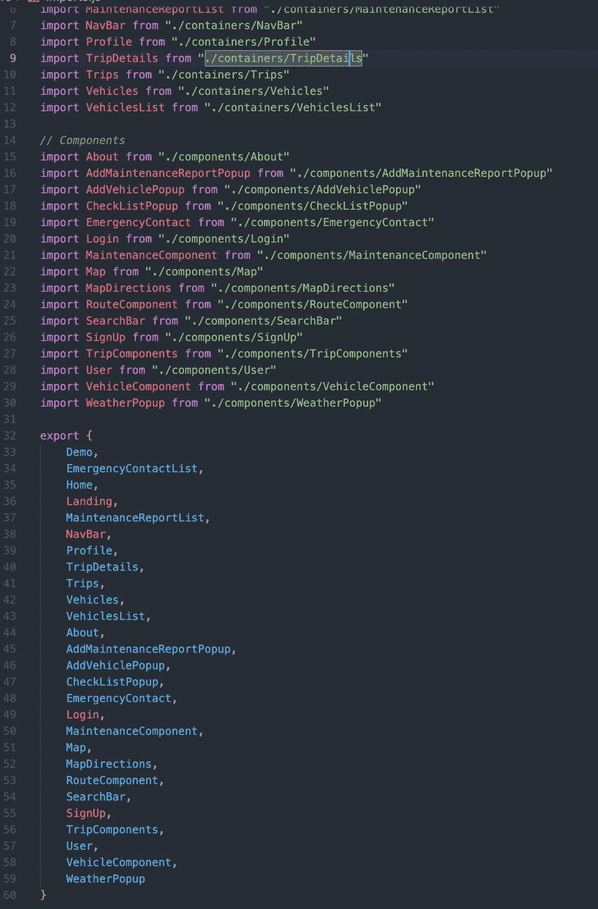

# 重构 React 导入

> 原文：<https://javascript.plainenglish.io/refactoring-react-imports-6901a9ee7b11?source=collection_archive---------10----------------------->

photo by [Pat Whelen](https://unsplash.com/@patwhelen) via [unsplash.com](https://unsplash.com/photos/xSsWBa4rb6E)

我最近开始回顾我创建的第一批项目，以练习我的重构技能。我告诉你，这可不好看。事实上，需要做的事情太多了，但反思我已经走了多远也很有趣。

对于我第一次尝试重构，我决定从小处着手，解决一个一直困扰我的问题:在我的主组件顶部有一长串组件导入。下面是我所说的内容的截图。

这是我的主容器，所以这是迄今为止最糟糕的情况，但是我的很多组件都导入了三到四个其他组件。但是看看这个，在我讲到组件本身之前有 23 行代码。让我向你展示我想出的解决方案，然后我会解释我是如何做到的。

我不知道你怎么想，但对我来说，这比第一张快照看起来容易多了，它去掉了 9 行。我是怎么做到的？我使用[命名导出](https://developer.mozilla.org/en-US/docs/web/javascript/reference/statements/export)，一个 ES6 特性，从一个文件中导出我的所有组件，然后在导入时使用对象析构将我的所有组件合并成一行。

首先，我在 src 文件夹中创建了一个名为 **Imports.js** 的新文件。在那个文件夹中，我将所有的组件都导入到一个地方，有点像是组件的集中存储。最后，我将包含每个组件的对象导出到项目的其余部分。这是那个文件的截图。

我不得不剪掉一些，但是你应该明白，导入每个组件，然后在一个对象中导出所有组件。你现在要做的就是选择你需要的组件，然后从 **Imports.js** 导入。

现在我承认，这不是很漂亮，但至少它都藏在一个文件中，除非我在项目中添加或删除组件，否则我不必查看它，它有助于清理单个组件，以便您可以专注于重要的部分。

你们是如何处理进口货物的？我错过了什么或者可以做得更好吗？请在下面的评论中告诉我！

*更多内容请看*[***plain English . io***](http://plainenglish.io/)