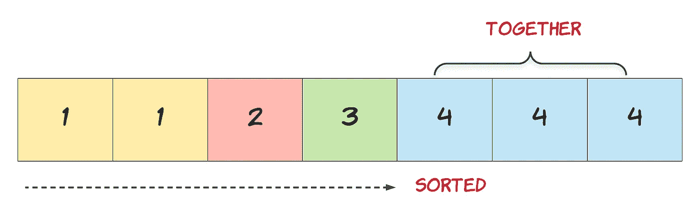

# 如何从排序后的数组中删除重复项

> 原文：<https://javascript.plainenglish.io/remove-duplicates-from-sorted-array-leetcode-challenge-ae9e676e70db?source=collection_archive---------15----------------------->



Hint from LeetCode

我们所有寻找软件开发工作的人都知道，练习算法和编码问题非常重要。于是，我开始在一个热门网站— [LeetCode](http://www.leetcode.com) 上解决编码问题。

我认为解决这些问题对我来说是一个很好的练习，然后试着在这里解释每个挑战。所以，我将从我最近做的一个开始— [从一个排序数组](https://leetcode.com/problems/remove-duplicates-from-sorted-array/)中移除重复项。

我必须提醒读者，我的解决方案不一定是最快的。但我总是试图提出自己的解决方案，而不是在网上找。

## 问题

> 给定一个排序的数组 nums，就地删除重复的元素，这样每个元素只出现一次，并返回新的长度。
> 
> 不要为另一个数组分配额外的空间，必须通过用 O(1)额外的内存就地修改输入数组来做到这一点。
> 
> **例一:**
> 
> **输入:** nums = [1，1，2]
> 
> **输出:** 2，nums = [1，2]
> 
> **说明:**你的函数应该返回 length = **2** ，其中 *nums* 的前两个元素分别是 **1** 和 **2** 。超出返回长度的内容无关紧要。

在这个特殊的挑战中，提到的任务并不特别关心修改原始数组，有一个更快的解决方案可以返回新数组的长度。我想得到一个修改过的数组以及它的长度，因此我更进一步。

## 递归

在我的模拟技术面试中，我学到了递归 T21——这是一种解决问题的方法，其解决方案依赖于同一问题的较小实例的解决方案。所以，你创建了一个解决基本问题的函数，这个递归函数会调用自己必要的次数来解决我们的主要问题。

在我的例子中，基本问题是比较数组中的两个数字，如果它们相等，就删除其中一个数字。

## 密码

## 递归函数

该函数将接受两个参数— **current** (当前数字的位置，我们将从 0 开始)和 **nums** (我们的排序数组)。

首先，我们需要确保当前数字不是数组的最后一项。因为一旦我们到达数组的末尾，我们就可以返回它的长度。

```
if (current === nums.length-1) { return nums.length;}
```

一旦我们知道我们不在数组的末尾，我们就可以比较当前值和下一个值。

```
if (nums[current]!==nums[current+1])
```

如果当前值与下一个值不同，我们通过传入下一个索引号来调用数组的下一个元素上的函数。

```
dups(current+1,nums);
```

否则，我们删除重复的值，并在数组的同一个元素和更新后的数组上调用 **dups** 函数。

```
nums.splice(current+1,1);
dups(current,nums)
```

每次调用 **dups** 函数时，我们都会检查是否还没有到达数组的末尾，一旦我们清理完数组，就会返回它的长度。这是我第一次自己练习递归，能够构建递归函数的感觉很好。

*请也在以下社交网络上关注我，我很乐意收到你的来信！——*[*LinkedIn*](https://www.linkedin.com/in/nick-solonyy/)*，* [*GitHub*](https://github.com/nicksolony) ， [*脸书*](https://www.facebook.com/nick.solony) *。*

*更多内容请看*[*plain English . io*](http://plainenglish.io/)