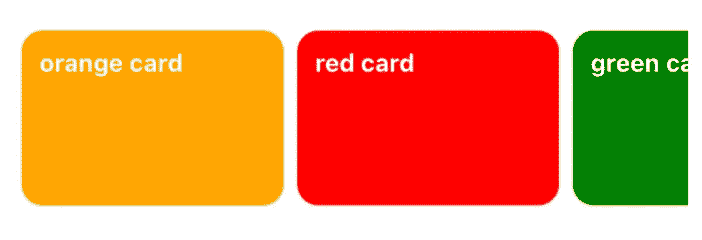
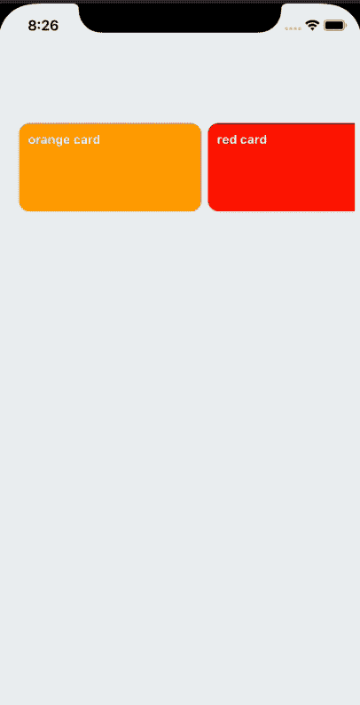
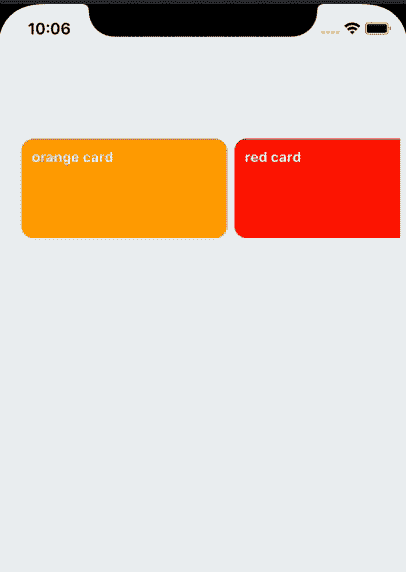

# 在 React Native 中移除水平平面列表中带动画的项目

> 原文：<https://javascript.plainenglish.io/remove-item-with-animation-in-a-horizontal-flatlist-with-layoutanimation-in-react-native-4cd5fc172cb3?source=collection_archive---------5----------------------->

## 使用布局动画



Our horizontal FlatList

我一直在 React Native 里做一个横向的平面列表。这个想法是，用户可以通过点击项目来移除项目。因此，一旦项目被删除，我需要:

*   用一个漂亮的不透明动画从列表中删除项目
*   同时，我需要用下一个滑入的项目来填充空间，以便正确地填充它。

起初，我用 react native**Animated**library 试了一下，但是它越来越乱，我无法实现我想要的效果。然而，使用 react-native 的 **LayoutAnimation** ，这可以很容易地完成。那我们开始吧。首先，我们将为我们的横向平面列表进行初始设置。

```
onst { height, width } = Dimensions.get("window");
const dummyData = [
  {
    id: 1,
    name: "orange card",
    color: "orange",
  },
  {
    id: 2,
    name: "red card",
    color: "red",
  },
  {
    id: 3,
    name: "green card",
    color: "green",
  },
  {
    id: 4,
    name: "blue card",
    color: "blue",
  },
  {
    id: 5,
    name: "cyan card",
    color: "cyan",
  },
];
const styles = StyleSheet.create({
  container: {
    flex: 1,
    justifyContent: "center",
    paddingTop: 120,
    backgroundColor: "#ecf0f1",
    padding: 8,
  },
  flatList: {
    paddingHorizontal: 16,
    paddingVertical: 16,
  },
  cardContainer: {
    height: 100,
    width: width * 0.5,
    marginRight: 8,
  },
  card: {
    height: 100,
    width: width * 0.5,
    borderRadius: 12,
    padding: 10,
  },
  text: { color: "white", fontWeight: 'bold' }
});export default function App() {
  const [data, setData] = React.useState(dummyData);
  return (
    <View style={styles.container}>
      <FlatList
        showsHorizontalScrollIndicator={false}
        contentContainerStyle={styles.flatList}
        horizontal={true}
        data={data}
        keyExtractor={(item) => item.id.toString()}
        renderItem={({ item }) => {
          return (
            <TouchableOpacity
              style={styles.cardContainer}
              onPress={() => removeItem(item.id)}
            >
              <Card style={[styles.card, {backgroundColor: item.color}]}>
                <Text style={styles.text}>{item.name}</Text>
              </Card>
            </TouchableOpacity>
          );
        }}
      />
    </View>
  );
}
```

这样，我们得到以下输出。



init

现在是从平面列表中删除项目的时候了，我们可以将项目的 id 传递给我们的平面列表，并删除与 id 匹配的项目。像这样:

```
const removeItem = (id) => {
    let arr = data.filter(function(item) {
      return item.id !== id
    })
    setData(arr);
  };
```

如果我们单击我们的项目，项目将从平面列表中删除，但没有任何动画。这会很奇怪。输出将如下所示-


remove without animation

好了，开始动画吧。用**布局动画**我们可以很容易地创建一个布局配置，将有效果。

```
const layoutAnimConfig = {
  duration: 300,
  update: {
    type: LayoutAnimation.Types.easeInEaseOut, 
  },
  delete: {
    duration: 100,
    type: LayoutAnimation.Types.easeInEaseOut,
    property: LayoutAnimation.Properties.opacity,
  },
};const removeItem = (id) => {
   let arr = data.filter(function(item) {
     return item.id !== id
   })
   setData(arr);
   // after removing the item, we start animation
   LayoutAnimation.configureNext(layoutAnimConfig) 
};
```

如果我们检查配置，我们可以看到从列表中删除项目时的动画。类型为 **easeInEaseOut** ，属性为**不透明度**。因此，让我们看看最终的结果与**布局动画**的影响。



remove animation

你可以在这里获得完整的源代码)(https://snack.expo.io/@saad-bashar/remove-item-flatlist)