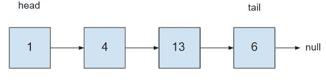
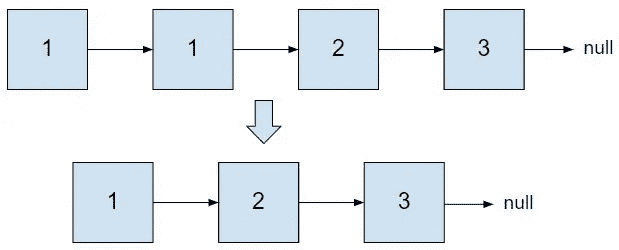
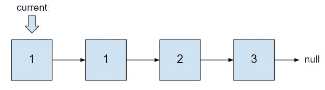
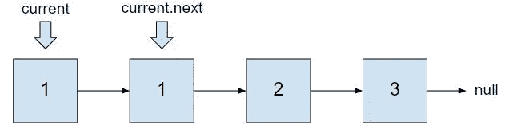
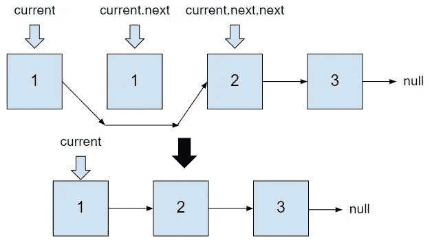
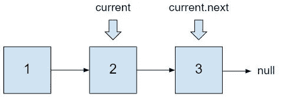
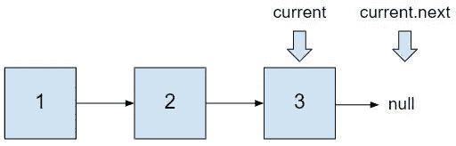

# 从排序的链表中移除重复项

> 原文：<https://javascript.plainenglish.io/removing-duplicates-from-a-sorted-linked-list-c9e0e62d2c96?source=collection_archive---------8----------------------->

我一直在学习数据结构，为技术面试做准备。我在准备中经常看到的一种数据结构是链表。我将回顾一下我最近在 LeetCode 上完成的一个链表问题:[从排序列表中移除重复项](https://leetcode.com/problems/remove-duplicates-from-sorted-list/)。这是一个简单的问题，但在第一次学习链表时，这是一个很好的问题。让我们首先定义什么是链表，然后深入研究。



Example of a linked list

# W **什么是链表？**

链表是数据元素的线性集合，其中每个元素指向下一个元素。链表可以保存字符串、字符和数字等数据类型。在链表中，元素被称为节点。每个节点都有一个与该节点上的数字相关联的 value 属性和一个引用列表中下一个节点的 next 属性。这就是链表成为线性数据结构的原因。列表是有顺序和次序的。要到达列表的末尾，我们必须从第一个节点(head)开始，按顺序遍历所有节点。最后一个节点(尾部)将指向 null，表明这是列表的结尾。

现在让我们进入问题。我将描述我是如何处理这个问题的，并在底部用 JavaScript 写下解决方案。

# 从排序列表中删除重复项

给定排序链表的头，删除所有重复的元素，这样每个元素只出现一次。

```
Input: head = [1,1,2,3]Output: [1,2,3]
```



Visual representation of our input and our wanted output

如前所述，我们希望去掉任何重复的数字。在这种情况下，我们希望删除值为 1 的额外节点。我们首先要设置一个变量`current`来表示我们所在的节点。首先，我们将`current`设置为列表开头的头。`let current = head`



Our current node is equal to the first node

我们想检查节点的`current`值和我们下一个节点的值是否相同。我们可以通过遍历列表直到到达最后一个节点来做到这一点。`while (current !== null && current.next !== null)`如果`current.next`为空，那么我们在最后一个节点上，想要退出 while 循环。



Check current.val and current.next.val

我们看到`current.val`和`current.next.val`是一样的。我们想跳过第二个节点(`current.next`)，使用`current.next.next`将当前节点指向第三个节点。`current.next = current.next.next`



Current node now points to current.next.next

现在，我们当前节点的值和下一个节点的值是不一样的。我们现在希望将当前节点移动到下一个节点。`current = current.next`



Current node moved to the next node

我们想再次运行相同的检查。当前节点的值等于我们下一个节点的值吗？不，我们可以将当前节点再次移动到下一个节点。`current = current.next`



Current node moved to last node

我们在最后一个节点上，我们的`current.next`等于 null。我们现在退出循环，返回链表`return head`。我们现在有了一个没有重复值的链表。我希望这个演练是有帮助的！

# **JavaScript 代码**

```
var deleteDuplicates = function(head) {
    // sets current node to be head of list
    let current = head
    // runs until we are at the end of the list
    while (current !== null && current.next !== null) { 
        // checks to see if the current value and the next value are the same
        if (current.val === current.next.val){  
            // skips over the duplicate and the next value becomes 2x next
            current.next = current.next.next            
            // current value and the next value are not the same
        } else {  
            // moves to the next node on the list to run through the while again
            current = current.next 
        }

    }
    // returns the linked list with no duplicates
    return head  
};
```

# 资源

关于链表的更多资源，我建议看看这些有用的链接。

[https://medium . com/basecs/whats-a-linked-list-anyway-part-1-d8b7e 6508 b9d](https://medium.com/basecs/whats-a-linked-list-anyway-part-1-d8b7e6508b9d)

[https://www.youtube.com/watch?v=WwfhLC16bis](https://www.youtube.com/watch?v=WwfhLC16bis)

[https://www.youtube.com/watch?v=njTh_OwMljA](https://www.youtube.com/watch?v=njTh_OwMljA)

这里有一个 LeetCode 问题的链接。

[https://leet code . com/problems/remove-duplicates-from-sorted-list/](https://leetcode.com/problems/remove-duplicates-from-sorted-list/)