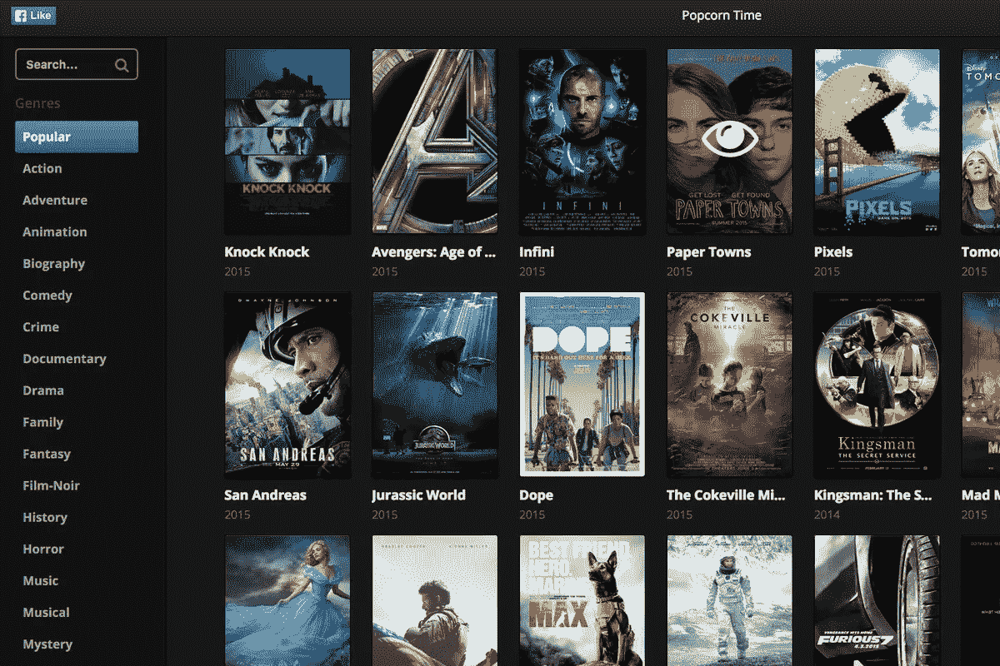
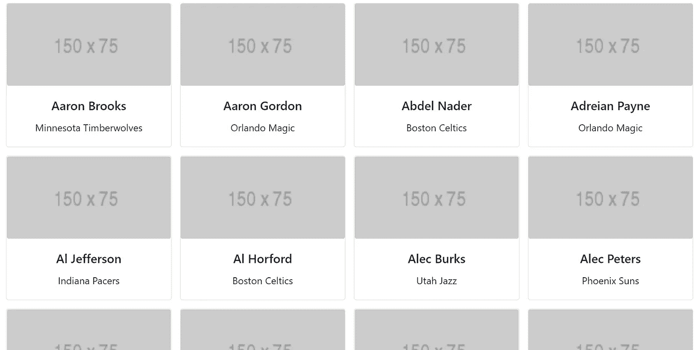
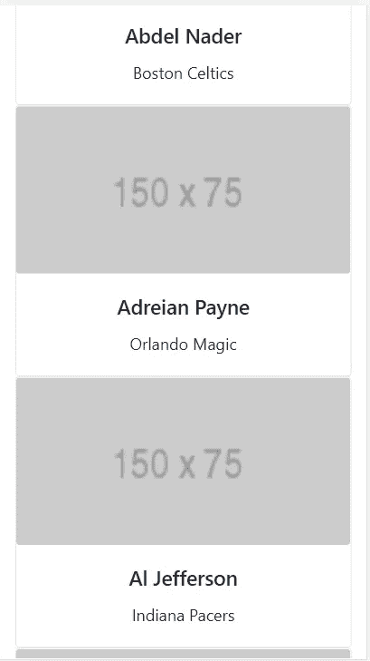

# 动态渲染反应卡和图像

> 原文：<https://javascript.plainenglish.io/render-react-cards-and-images-dynamically-2387434e809d?source=collection_archive---------3----------------------->

## 使用 JavaScript map()

基于 API 响应呈现图像/卡片/元素在 React 中很常见。响应性地在一行中添加 React 组件是非常常见的事情。看看下面的例子。



以上所有项目都以响应方式加载。我们使用动态渲染的一些常见用例有

*   在主页上呈现一组产品。
*   在你的博客上呈现一组相关的博客。
*   将结果呈现给搜索查询。

这不是一个脑力型的教程。但是我发现为那些用例找到一个干净和合适的样本代码是非常困难的。所以想到了写一个新的，分享一下。

## 我们将建造什么

我们将构建一个示例 React 组件来显示 NBA 球员数据。我们将从这个任务的现场 NBA API 获取数据。数据将在卡组件中呈现，为此我们使用 react-bootstrap。卡是完全响应的，因此卡将分别适合屏幕尺寸。

## 入门指南

使用创建反应应用
`npx create-react-app Dynamics`创建反应应用

初始化 react 应用程序后，在 src 文件夹中创建一个名为 Components 的文件夹。
在组件文件夹中创建一个名为`Dynamic.js`的新文件

在 Dynamic.js 内部，让我们调用 API 并将数据值设置为一个常量。

导入反应、状态挂钩和效果挂钩

```
import React, { useEffect, useState } from 'react'
```

创建一个名为 Dynamic 的基本 react 功能组件

让我们用一个状态钩子初始化玩家的详细信息。

```
const [playerData, setPlayerData] = useState([]);
```

如果你想了解 useState 钩子，请阅读我关于 State 钩子的文章。

[](https://levelup.gitconnected.com/learn-react-usestate-hook-a09ccf955537) [## 学习反应使用状态挂钩

### 有例子和练习

levelup.gitconnected.com](https://levelup.gitconnected.com/learn-react-usestate-hook-a09ccf955537) 

让我们在那之后添加 useEffect 钩子

要了解更多关于`useEffect`钩子的信息，请阅读下面的文章。

[](/react-useeffect-hook-tutorial-for-beginners-30626402b739) [## React useEffect Hook 初学者教程

### React useEffect 初学者教程，提供真实示例和日常使用模式。

javascript.plainenglish.io](/react-useeffect-hook-tutorial-for-beginners-30626402b739) 

我们创建了一个名为`fetchData` 的函数来调用 API 并获取数据。在函数内部，我们使用内置的 fetch 方法调用了 API。

之后，我们将响应转换为 JSON 格式。使用 useState 钩子，我们使用`setPlayerData` 方法保存了`playerData`中的前 15 个元素。

## 反应引导

安装 react-bootstrap 来创建相应的显示组件。

在 npm 命令下运行并安装 react-bootstrap

```
npm install react-bootstrap@next bootstrap@5.1.0
```

并在 app.js 中添加以下导入语句

```
import 'bootstrap/dist/css/bootstrap.min.css';
```

现在是时候在响应元素中呈现 API 数据了。从 react-bootstrap 导入`Card, Row, Col, Container`。

```
import { Card, Row, Col, Container } from "react-bootstrap";
```

在 react 组件的 return 语句中添加以下代码。

我们已经使用`Container` 元素和`Row`包装了整个组件`jsx` 部分。这就是 react-bootstrap 网格系统应该实现的方式。为了在`jsx`中呈现 javascript，我们使用了`{}`。在括号内，我们使用`.map`方法循环`playerData`元素。

使用 react-bootstrap `<Col key={k} md={2}>`标签，我们已经为组件赋予了响应特性。

关于 react-bootstrap 网格系统的更多细节可以在下面的官方文档中找到。

 [## 反应引导

### Bootstrap 的网格系统使用一系列容器、行和列来布局和对齐内容。它是由…

react-bootstrap.github.io](https://react-bootstrap.github.io/layout/grid/) 

通过使用 map 函数，我们遍历 API 数据，并使用这些数据来填充引导卡。

[](https://developer.mozilla.org/en-US/docs/Web/JavaScript/Reference/Global_Objects/Array/map) [## array . prototype . map()—JavaScript | MDN

### 该方法创建一个新数组，该数组填充了对中的每个元素调用提供的函数的结果…

developer.mozilla.org](https://developer.mozilla.org/en-US/docs/Web/JavaScript/Reference/Global_Objects/Array/map) 

最终确定的`Dynamic.js`代码看起来是这样的。

现在，该卡可以在大、中、小屏幕上快速显示。在 bootstrap 中，整个屏幕宽度被视为 12 个单位。在中等大小的屏幕中，一个卡组件的宽度为 4 个单位。因此，将有 3 张卡片排成一行，填满整个 12 个单元。同样，在每个屏幕上，我们已经给出了卡片应该具有的宽度。

将`Dynamic.js`组件添加到 app.js 文件中，并运行 npm start。

桌面视图



mobile 中的视图可以这样看



*更多内容请看*[***plain English . io***](http://plainenglish.io/)