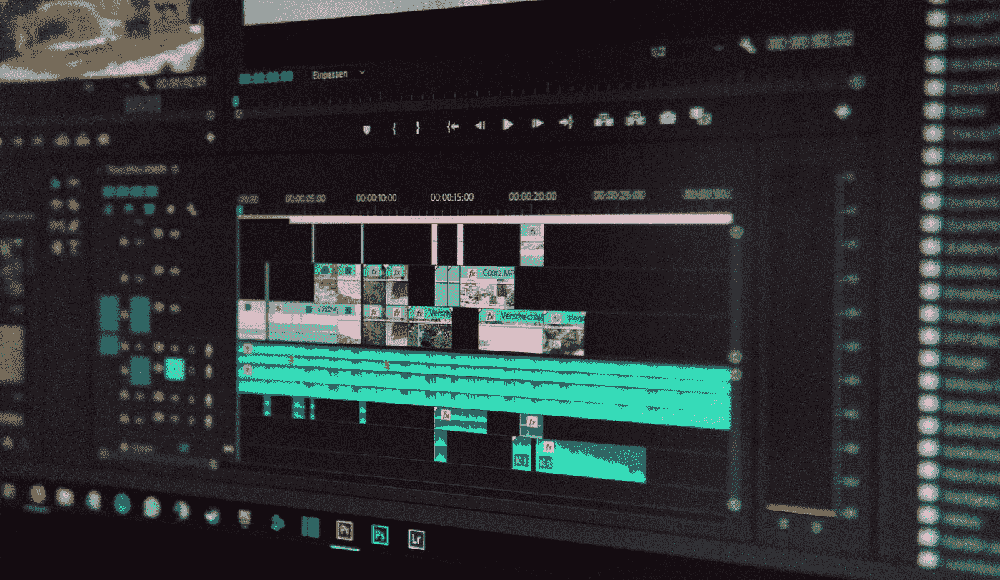

# 用 JavaScript 渲染视频

> 原文：<https://javascript.plainenglish.io/rendering-videos-with-javascript-5d58ce925d01?source=collection_archive---------3----------------------->

## 是啊！有了 Remotion，你现在可以用 JavaScript 渲染视频了！

Photo by [Wahid Khene](https://unsplash.com/@wahidkhene?utm_source=medium&utm_medium=referral) on [Unsplash](https://unsplash.com?utm_source=medium&utm_medium=referral)

几周前，我遇到了 [**Remotion**](https://www.remotion.dev/) ，这是一个让你用 TypeScript(Javascript 的超集)渲染视频的框架。随着 JavaScript 在最近几年进入不同的领域，它并没有像你想的那样让我感到惊讶，但是是的，我很想尝试一下！

[Remotion](https://www.remotion.dev) 利用基于网络的技术(如 CSS、WebGL 等。)，React 的基础，以及编程渲染视频的艺术。你可以在他们的网页上读到更多关于他们的信息。他们也有很好的[文档](https://www.remotion.dev/docs/)，可以帮助你快速入门。

为了抑制我的好奇心，我决定用基本的动画制作一个视频来描述一个信息。鉴于目前的情况，这是我坚信的一条信息。由于我无法在这里上传视频，我用[EZGIF.COM](https://ezgif.com/)把视频转换成了 GIF。

GIF version of the video rendered with Remotion

如前所述，该框架有很好的文档记录，并且更容易理解概念。它也有基于物理的动画 API，这是相当惊人的！毫无疑问，我只是触及了冰山的一角，你可以通过遥控实现很多事情！

你能试试遥控吗？你对此有什么想法？

你可以在这里找到我的代码:

 [## Nithish1101/remotion-covid

### 欢迎来到你的搬迁项目！开始预览渲染视频服务器渲染演示见服务器端渲染文档…

github.com](https://github.com/Nithish1101/remotion-covid) 

*更多内容请看*[*plain English . io*](http://plainenglish.io/)