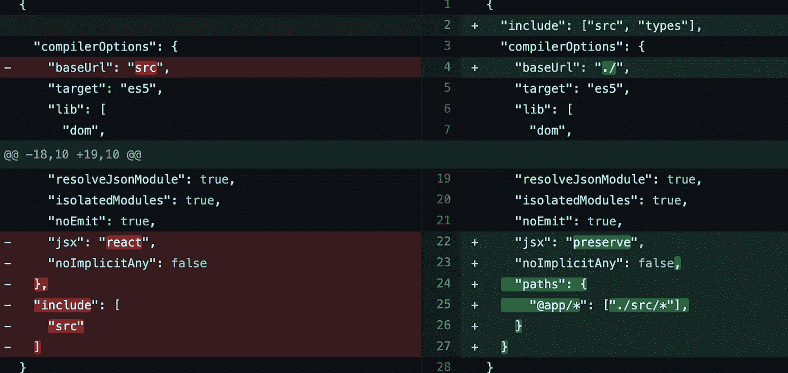
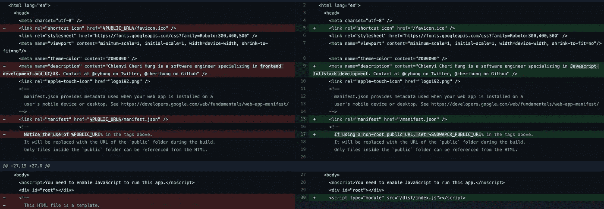

# 用 Snowpack 替换 Create-React-App

> 原文：<https://javascript.plainenglish.io/replace-create-react-app-with-snowpack-6a979e65ab90?source=collection_archive---------4----------------------->

设置构建工具和捆绑器是任何前端开发人员工作流程的重要部分。但通常，它感觉更像是开发真正乐趣的阻碍。虽然最新的 [Webpack](https://webpack.js.org/) 需要的启动工作比以前少得多，但它仍然远远不能满足开箱即用的所有需求。

最近，我开始使用 [Snowpack](https://www.snowpack.dev/) 作为前端捆扎机。我第一次听说它是在 2020 年 JavaScript 开源大会上，Snowpack 获得了[生产力助推器](https://osawards.com/javascript/2020)奖。我现在已经在一个企业项目中非常轻松地使用了它。并将我的个人网站从使用 [Create-React-App](https://reactjs.org/docs/create-a-new-react-app.html) (CRA)转换成 Snowpack。

这篇文章旨在强调积雪场的好处，以及用积雪场取代 CRA 所需的几个步骤。(跳过重点部分，滚动到“好东西”部分查看分步指南。)

**TLDR；创建-反应-应用和需要弹出**

像 React、Vue、Angular 这样的前端框架都有它们建议的或内置的启动器来帮助引导项目。

对于 React 项目，常见的入门工具是官方 CRA，它为您提供了从代码质量、构建、捆绑和测试工具的完整工具链。开始 React 项目的便捷方式。它提供了一个问题的解决方案，我认为这有助于推动当时 React 的采用。

我在许多项目中使用过 CRA，从小型到大型。对于很少定制的项目来说，这是非常完美的。它对于独立的 React 站点尤其适用。但是如果项目需要任何超出其规定的文件组织、配置模式的定制，或者需要与后端结合，CRA 肯定是不灵活或不可扩展的。

通常情况下，最后也是唯一的方法是弹出或者[分叉 react-scripts 和依赖关系](https://create-react-app.dev/docs/alternatives-to-ejecting/)。但是这个选择是全有或全无。一旦你离开了 CRA(或者尝试了其他选择)，你仍然会留下一个非常复杂的基于 Webpack 的工具链。大量的 Babel/TypeScript、Jest 和其他依赖项需要处理。对于正在进行开发来说，试图维护它们并不是一个小任务。

**使用 Snowpack，这是一个比自己处理所有复杂问题更好的选择。**

**TLDR；关于积雪场的一些亮点**

[Snowpack](https://www.snowpack.dev/) 是一个前端构建工具，提供了许多现代 web 开发常用的[开箱即用文件支持](https://www.snowpack.dev/reference/supported-files)，以及像[热模块替换](https://www.snowpack.dev/concepts/hot-module-replacement) (HMR)和[开发服务器](https://www.snowpack.dev/concepts/dev-server)这样的特性。

它是轻量级的，启动时只需要很少的配置。要启动一个全新的 React 项目，我们可以使用[Create-snow pack-App](https://github.com/snowpackjs/snowpack/tree/main/create-snowpack-app/cli)(CSA)CLI。不像 CRA，它一旦产生就不会把我们锁在里面。CSA 是一个更像约曼的脚手架 CLI。我们可以选择从空白的 JavaScript、TypeScript 或特定于框架的模板开始。例如:

```
npx create-snowpack-app new-dir --template [@snowpack/app-template-react-typesc](http://twitter.com/snowpack/app-template-react-typesc)ript
```

Snowpack 和 Webpack 的另一个关键特性和区别是[非捆绑开发](https://www.snowpack.dev/concepts/how-snowpack-works#unbundled-development)。这带来了闪电般的确定性开发体验，尤其是在与 HMR 结合的时候。为此，Snowpack 利用了现代浏览器的 ESM 支持。*这里需要注意的是，本地开发环境不支持在 IE11 这样的旧浏览器中构建。*

Snowpack 中有许多更令人兴奋的设计选择和功能，如 [API 接口](https://www.snowpack.dev/reference/javascript-interface)、[流导入](https://www.snowpack.dev/guides/streaming-imports#nav-primary)、[带节点运行时的 SSR](https://www.snowpack.dev/guides/server-side-render#option-3%3A-server-side-rendering-(ssr))，以及使用 [esbuild](https://www.snowpack.dev/guides/optimize-and-bundle#option-1%3A-built-in-optimizations) 的可选内置优化，当 esbuild 本身更加成熟时，这将是一个很好的功能。想了解更多关于积雪场的概念，这里有一个来自创造者 @FredKSchott 的[演讲。](https://www.youtube.com/watch?v=65R4th-rixM)

# 好东西——用积雪包替换的步骤

## **1。更新 Package.json:依赖关系**

移除`react-scripts`并添加以下当前版本的包:

```
*"@snowpack/app-scripts-react"*: "^2.0.0", // has useful defaults
*"@snowpack/plugin-dotenv"*: "^2.0.5", // env variables like CRA
*"@snowpack/plugin-react-refresh"*: "^2.4.0", // Fast refresh
*"snowpack-plugin-svgr"*: "^0.1.2", // to import SVG as components
*"@snowpack/plugin-webpack"*: "^2.3.0", // to optimize prod build
*"jest"*: "^26.6.3", // testing using your jest.config
*"serve"*: "^11.3.2", // to serve up static prod build like CRA
*"snowpack"*: "^3.0.1",
```

这是一个最基本的包列表，你需要它为 React JS 项目提供一个非常相似的 CRA 环境，同样支持 **env vars** 、**快速刷新**，以及导入 **SVG 作为 React 组件**。CRA 也来了个笑话和静发球。所以我们也把这些加进去。(见结尾关于 Jest 设置的注释)。

对于 TypeScript 项目，添加这两个附加项目:

```
*"@snowpack/plugin-typescript"*: "^1.2.1",
*"@types/snowpack-env"*: "^2.3.2",
```

*值得注意的是，Snowpack 使用 TypeScript 进行类型检查而不是 transpile。在引擎盖下，它仍然与巴别塔一起运输(与 CRA 的行为相同)。*

## 2.**更新 Package.json 脚本**

将以`react-scripts`命令开始的`serve`、`build`和`test`脚本替换为:

```
"start": "snowpack dev --reload",    
"build": "snowpack build",    
"test": "npx jest", //optional nice to have:
*"test-watch"*: "npx jest --watch",
*"test-coverage"*: "npx jest --coverage",
```

这个`serve-prod`命令应该不需要改变。当然，让我们也删除`eject`命令。CRA 还附带了一个`lint`命令和 eslint 设置，我们将在后面介绍。

## 3.**添加了** `**snowpack.config.js**`

在这一点上，我们几乎准备好开始使用 snowpack。接下来，我们将设置我们的 snowpack 配置文件。

这是大多数支持类型脚本和 SPA [回退路由](https://www.snowpack.dev/guides/routing#scenario-1%3A-spa-fallback-paths)的 React SPAs 的配置示例。所有可用选项参见[正式文件](https://www.snowpack.dev/reference/configuration)。

```
/** *@type* {import("snowpack").SnowpackUserConfig } */*module*.*exports* = {mount: {
 public: {url: '/', static: true},
 src: {url: '/dist'},
},plugins: [ 
'@snowpack/plugin-react-refresh', 
'@snowpack/plugin-dotenv', 
'@snowpack/plugin-webpack', 
'@snowpack/plugin-typescript', // TS support
'snowpack-plugin-svgr' // import SVG as React component
],/* for local SPA fallback routing support, more below */
routes: [
  {"match": "routes", "src": ".*", "dest": "/index.html"},
],devOptions: {
  port: 3000,
},testOptions: {
  files: ['src/**/*.test.*']
},/* optional, if you want to use alias when importing */
alias: {
  "@app": "./src/",
}};
```

**SPA** [**回退路由**](https://www.snowpack.dev/guides/routing#scenario-1%3A-spa-fallback-paths) **在本地开发**默认情况下被 CRA 封装。这对于任何有不止一条基本路线供用户直接导航的应用程序来说都是相当典型的。

Snowpack 中的**路线**部分对于更接近地模拟应用程序的生产环境非常有用。例如，在生产中，我们提供一个您的 React SPA 无法处理的自定义 404 页面。

使用路由，Snowpack 的另一个本地开发特性，如 CRA，能够用相同的基域代理 API 请求。这是 SPA +微服务架构的另一个典型生产设置。与 CRA 不同，Snowpack 的灵活路线可以让你对代理行为进行更精细的控制。

如果您需要代理和 SPA 回退，我建议这样设置(按顺序):

```
const httpProxy = require('http-proxy');
const proxy = httpProxy.createServer({ target: 'http://localhost:3001' });.....skip....routes: [
    { match: 'all', src: '/api/.*', dest: (req, res) =>     
      proxy.web(req, res) 
    },
    { match: 'routes', src: '.*', dest: '/index.html' },
],
```

## 4.**(可选，TS 使用)更新** `**tsconfig.json**`

对于一个 TypeScript 项目，你*不应该*需要调整你的 tsconfig.json 太多。事实上，不像 CRA 会自动格式化并删除某些定义，Snowpack 可以让你做任何你想做的事情。

这些微小的变化是建议有一个更灵活的指向 root 而不是`src`的 baseUrl 配置，并像我在 snowpack.config.js 中做的那样添加相同的[绝对别名导入](https://www.snowpack.dev/reference/configuration#alias)路径我的本地组件。



## 5.**更新** `**process.env**` **至**`**import.meta.env**`**&public/index . html**

首先，也是最重要的，把这个添加到你的`public/index.html`文件中。

```
<script type=”module” src=”/dist/index.js”></script>
```

这就是你的应用程序如何启动一个非绑定的本地开发。不用担心，在产品构建期间，webpack 插件将生成适当的缩小和分割的 JS 文件，以链接到部署的 index.html 上。

此外，继续从 index.html 移除`PUBLIC_URL/`，只要这些资产在`public`文件夹中，在产品构建时，snowpack 会正确放置它们。

然后，Snowpack 对环境变量有自己的[约定](https://www.snowpack.dev/reference/environment-variables)。只需将任何`process.env`引用替换为`import.meta.env`。任何以`PUBLIC_` CRA 公约到`SNOWPACK_PUBLIC_`开头的环境变量。



index.html from CRA vs for Snowpack

## 我们完成了！

现在运行`npm run start`在本地启动应用程序，运行`npm run serve-prod`使用静态服务。

如果你有专门的 Webpack 配置来优化你的产品版本，请查看官方的 snowpack webpack 插件文档，了解如何快速添加定制配置。

## **关于杰斯特、林挺和 Svgr 的更多注释:**

1.  `jest -init`启动新文件或使用现有文件。连接所有需要的巴别塔转换的最简单的方法是从雪堆默认值开始。从`@snowpack/app-scripts-react` 导入开始就很容易了。任何定制都可以从中扩展:

```
*const* snowpackJestConfig = require('@snowpack/app-scripts-react/jest.config.js')();*module*.*exports* = {
...snowpackJestConfig,
[custom overrides here]
```

3.要使用 SVG 作为反应组件来测试组件，请查看如何使用几行代码来模拟 `svgr`进行 Jest 单元测试。

4.`require`不适用于未捆绑的当地开发。将需要使用动态导入。

5.CRA 得到了 Eslint 的支持和一个`npm run lint`。两者都非常有帮助。要继续使用，请[安装 CRA 使用的 eslit-config](https://www.npmjs.com/package/eslint-config-react-app#usage-outside-of-create-react-app)，并按照步骤进行操作。