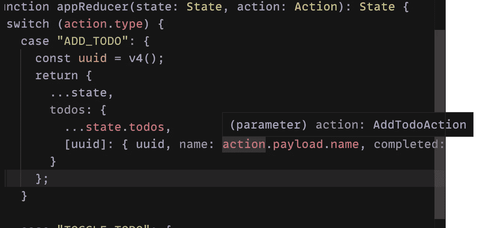
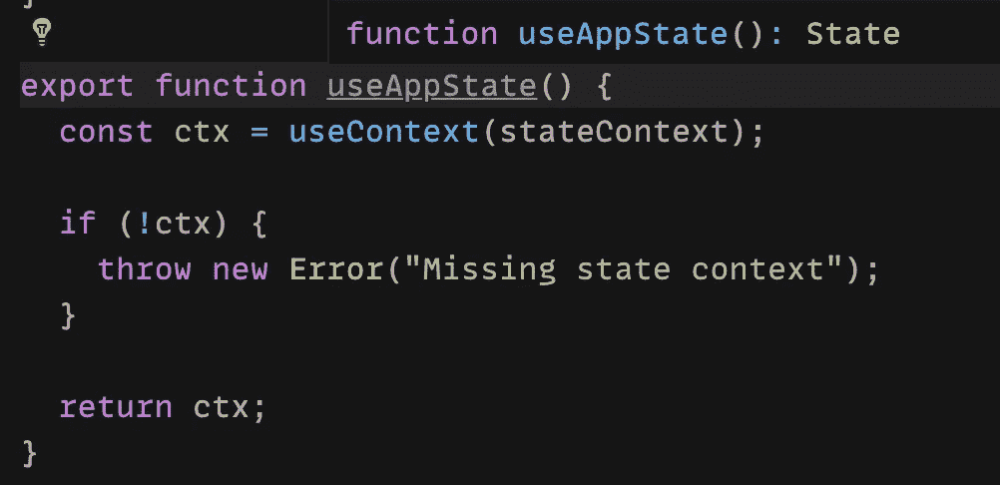
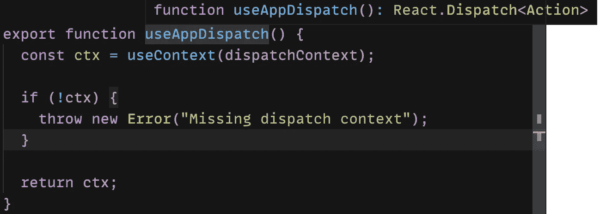
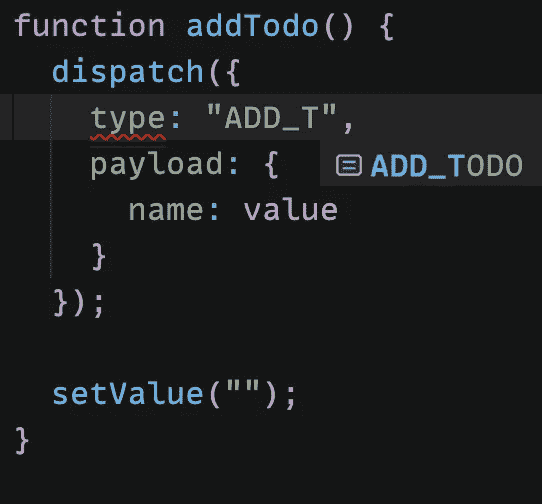
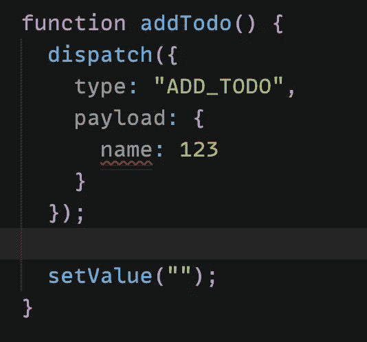

# 用 useReducer 替换 Redux

> 原文：<https://javascript.plainenglish.io/replace-redux-with-usereducer-100406773332?source=collection_archive---------5----------------------->

Photo by [Pankaj Patel](https://unsplash.com/@pankajpatel?utm_source=medium&utm_medium=referral) on [Unsplash](https://unsplash.com?utm_source=medium&utm_medium=referral)

Redux 曾经是我管理全局应用程序状态的首选。我喜欢它的简单性，它周围的社区，令人敬畏的开发者工具。然而，我也喜欢让我的应用程序的依赖性最小化。有了[上下文 API](https://reactjs.org/docs/context.html) 和钩子(更具体地说 [useContext](https://reactjs.org/docs/hooks-reference.html#usecontext) 和 [useReducer](https://reactjs.org/docs/hooks-reference.html#usereducer) ，我们可以很容易地用已经内置的 react 工具替换 *basic* Redux。在这样做的时候，我们仍然可以对我们已经知道的概念进行操作，如*动作*、*状态*或*减少功能*。

# **减少功能**

让我们从写一个 reduce 函数开始。提醒一下，reducer 函数接受现有的状态和动作，并返回新的状态。我们将使用 TypeScript 来避免与类型相关的错误，并提供更好的开发人员体验。示例缩减器指定了两个动作:

*   `ADD_TOOD` 向列表中添加新的待办事项
*   `TOGGLE_TODO`这将切换特定待办事项的已完成属性

我们使用[区别联合](https://www.typescriptlang.org/docs/handbook/unions-and-intersections.html#discriminating-unions)来输入所有可能的动作。这非常有用，请注意 TypeScript 如何能够在 reduce 函数中适当缩小操作类型。

It’s not just an Action, it’s AddTodoAction!

现在我们已经准备好了 reduce 函数，让我们用`useReducer`钩子把它包起来。

# 语境

为了在应用程序中访问 redux store，通常使用[提供者](https://react-redux.js.org/api/provider)组件。在我们的例子中，我们将用我们自己的上下文(实际上是两个上下文)来替换它。

我们来分析一下上面的代码。`useAppReducer`返回`state`和`dispatch`功能(就像普通的`useReducer`钩子一样)。我们将使用一个上下文来提供`state`，使用另一个上下文来提供`dispatch`。这是一种性能优化，每次上下文值发生变化时，订阅该上下文的所有组件都会重新呈现。当`state`改变时，只对分派事件感兴趣的组件不应该重新呈现，这就是引入这种分离的原因。

注意，我使用了 [ReturnType](https://www.typescriptlang.org/docs/handbook/utility-types.html#returntypetype) 助手来从`useAppReducer` 中提取返回类型，并使用它们来键入上下文的值。你很快就会明白为什么这很重要。

最后，我创建了两个自定义钩子，用于从上下文访问`state`和`dispatch`函数。在`ctx`为 null 的情况下，我抛出一个错误(这意味着上下文提供者没有被呈现，在这种情况下，我只想快速失败)。注意 TypeScript 如何正确地推断我的自定义钩子的返回类型。

state type

dispatch type

# 装上电线

因此，为了使应用程序商店在全球范围内可用，我将它包装在整个应用程序中。

这是应用程序组件的样子

请注意，`dispatch`函数是完全类型化的，这意味着我已经自动完成了动作名和它的有效载荷。而且，这意味着我不需要像`TODO_ACTIONS.ADD_TODO`这样丑陋的(至少在我看来)常量。TypeScript 已经解决了这个问题，所以不可能调度一个不存在的动作。

I love when autocompletion just works

如果提供了无效的操作名称或有效负载，我们会得到一个错误

it must be a string

当然`state`也是完全类型化的。

# 摘要

就这样了！如您所见，从头开始创建一个简单的类似 redux 的状态管理解决方案并不困难。谁知道呢，也许你的下一个 React 项目不需要`redux`？