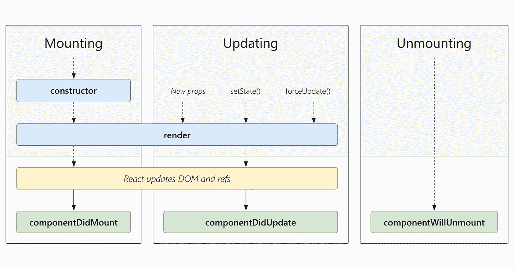

# 用 React 挂钩替换生命周期方法

> 原文：<https://javascript.plainenglish.io/replacing-lifecycle-methods-with-react-hooks-3dc293d2e73a?source=collection_archive---------22----------------------->

## **什么是 React 钩子？**

> “钩子是 React 16.8 中的新特性。它们让你不用写类就能使用状态和其他 React 特性。”—反应文档

非常简单的定义。但是为什么我们不想在 React 中使用类呢？许多开发人员感兴趣的最大原因之一是关键字`this`的用法。围绕着`this`的东西太多了，与其他 OOP 语言相比，很难完全理解它是如何工作的。

## **组件生命周期**

我们将看看`componentDidMount()`、`componentDidUpdate()`和`componentWillUnmount()`。在 React 17 中，所有其他生命周期方法都将被弃用。

下图显示了生命周期方法及其使用方式。

有一点需要注意，你 ***不能*** 在类组件内部使用钩子。

让我们来看看在类组件中使用这些方法与在带有 react 钩子的功能组件中使用这些方法的区别。

# `componentDidMount()`

*类组件:*

*带挂钩的功能部件:*

请注意功能组件中的空数组。这通知`useEffect`我们只需要运行一次。当组件完成安装阶段时。

# componentDidUpdate()

*类组件:*

*带挂钩的功能部件:*

这看起来与`componentDidMount`挂钩非常相似，不是吗？有一个小小的改变改变了行为。这并没有给`useEffect`第二个论点。这将在每次重新渲染时触发`useEffect`。

如果我们想在特定属性发生变化时调用钩子怎么办？很简单，我们传递第二个参数，`[]`并传递一个值，即属性。`[someProperty]`每当`someProperty`改变时，挂钩将触发并更新。

# componentWillUnmount()

*类组件:*

*带挂钩的功能部件:*

此方法将在组件被卸载时调用，并且在其生命周期中只调用一次。为了复制类组件中的行为，我们需要在`useEffect`中返回一个回调函数，并传递第二个参数`[]`。这与`componentDidMount`非常相似，所以一定要记住你需要在`useEffect`中返回一个回调。

感谢阅读这篇文章。快乐挂钩！

## 资源:

 [## 使用效果钩-反应

### 钩子是 React 16.8 中的新增功能。它们允许您使用状态和其他 React 特性，而无需编写类。的…

reactjs.org](https://reactjs.org/docs/hooks-effect.html)  [## 用 React 挂钩替代生命周期方法

### 当你有钩子的时候为什么要使用类组件🤩🧨

medium.com](https://medium.com/javascript-in-plain-english/lifecycle-methods-substitute-with-react-hooks-b173073052a)