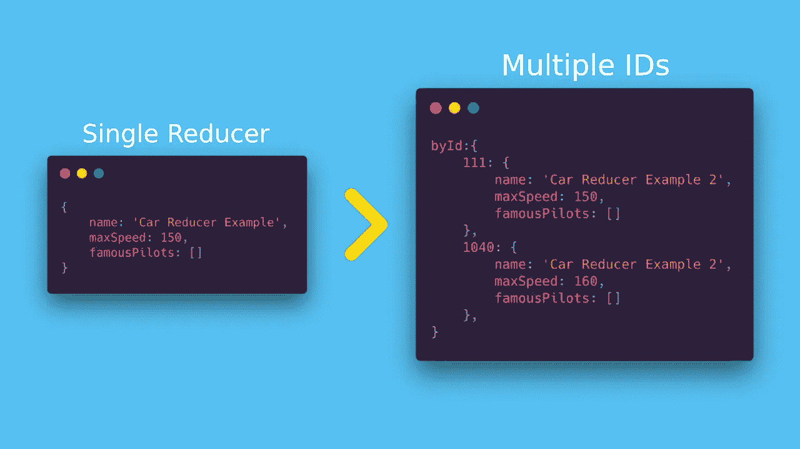

# 如何将 Reducer 逻辑复制到多个 id 中

> 原文：<https://javascript.plainenglish.io/replicating-reducer-logic-into-multiple-ids-691a72e40f63?source=collection_archive---------22----------------------->



Redux 是一个强大的应用程序状态管理器，与 React 一起广泛使用。一旦定义了一个 Reducer，您可能希望将这个文件的完全相同的逻辑复制到多个标识符中。

> **TL；博士** — [完整的代码要点](https://gist.github.com/pflevy/bc555d0e6fa159894ece9316997e3433) || [代码盒示例](https://codesandbox.io/s/multiple-ids-reducer-example-1v7h1)

## 会实现什么？

让我们假设一个“汽车”减速器支持和控制下面的结构:

```
{
    name: 'Car Reducer Example',
    maxSpeed: 150,
    famousPilots: []
}
```

您将实现以下目标:

```
byId:{
    111: {
        name: 'Car Reducer Example 2',
        maxSpeed: 150,
        famousPilots: []
    },
    1040: {
        name: 'Car Reducer Example 2',
        maxSpeed: 160,
        famousPilots: []
    },
}
```

整个 reducer 逻辑(处理动作、更新状态)将被单独复制到每个 ID。您只需定义一次减速器结构，然后根据需要重用它。

数据不仅仅是后端的责任。前端应该明智地构建其数据流，专注于为用户提供无缝体验。

这里有一个例子。假设您希望显示一个关于应用程序中最活跃用户的信息的屏幕。您的减压器负责处理来自该屏幕的数据:

```
{
   mostActiveUser: 'User X Name',
   totalNumberOfPosts: 77,
   ...otherProperties
}
```

该结构解决了在屏幕上显示所需信息的要求。然而，它的能力有限，因为它只能在特定的时间段内保存数据**。**

如果显示的信息与四月有关，为了将用户可视化更改为五月，您将**覆盖整个数据**，一旦用户决定再次检查四月，这是对资源和时间的**浪费。
你不仅会让用户等待一些他们之前已经拥有的数据，而且你还会向服务器发出重复的请求。**

应用多个 id 的处理程序**将月份视为标识符**您可以实现以下功能:

```
byId:{
    '2020-04': {
       mostActiveUser: 'User X Name',
       totalNumberOfPosts: 77,
       ...otherProperties
    },
    '2020-05': {
       mostActiveUser: 'User Y Name',
       totalNumberOfPosts: 53,
       ...otherProperties
    },
}
```

缩减器保持不变，它的实现没有改变。然而，你可以通过使它能够重现它负责的每一个变化来增强它，但是要在特定的月份处理这些变化。

**实例**

在下面的例子中，一个缩减器被设计用来保存单个神奇宝贝的数据。为了复制其逻辑，应用了多重 id 处理程序，并且神奇宝贝名称被用作标识符。

注意**减速器结构**保存了一个**单个**神奇宝贝的数据。
使用处理程序，其逻辑被复制到**多个**神奇宝贝。

## 应用这种功能的动机是什么？

上面的例子显示了相当简单的情况，具有简单的结构。在现实世界的应用程序中，reducers 更有可能控制更多的数据，并负责处理复杂的操作。

一旦定义了这个结构，您应该避免通过简单地将代码从一个缩减器复制到另一个来复制它。我们将经历构建处理程序的过程，以复制整个 reducer 功能来处理多个 id。

如果您希望将整个 reducer 逻辑应用于多个动态项目，即在获取一些数据之前还不可用的标识符，就像实例中的神奇宝贝名称一样，这是非常强大的。

通过**而不是**进行重复请求，避免浪费资源也很有效，这在用户体验中也起着重要作用，因为你不会让用户等待他已经拥有的信息。

## 入门指南

构建这样的处理程序时，首先要注意的是 reducers 只是函数:它们需要两个参数(state 和 action ),并根据传递的动作返回更新后的状态。

```
// Reducer function example
function myReducer(state,action) => {
    switch(action.type){
        default: return state
    }
}
```

这意味着我们被允许在它上面应用一个函数，并且**对将要使用的最终状态**进行修改。这是高阶减速器的概念。

## 创建多 id 缩减器处理程序

创建一个新文件，并插入以下代码:

```
export const multipleIdsReducerHandler = (reducerFunction) => (state = {}, action) => {
    const { internalReducerId } = action
    if(internalReducerId === undefined) return state
}
```

到目前为止，它做了一个简单的工作，它将接收一个 reducer 函数(我们希望将它的功能扩展到多个 id 中)，然后像任何 reducer 一样接收状态和动作。如果属性 **internalReducerId** 不在**动作**中，它将自动返回当前状态。

在这一点上，定义了一个结构来标识 reducer 逻辑应该应用到哪个特定的 Id 上: **internalReducerId 必须存在于动作**上，以便处理程序能够**标识在哪个对象(ID)上应用所需 reducer 的执行结果**。

下面的代码负责执行所需的 reducer，并从动作调用中获得结果状态。此外，底部的比较避免了在不是所需的缩减器上包含新的 ID。

```
 const newState = reducerFunction(state.byId?.[internalReducerId] || {}, action) if(Object.keys(newState).length === 0 ) return state
```

想象以下场景，multipleIdsReducerHandler 应用于两个 reducer**上:如果我们在 Reducer1 上设置了一个 ID，那么它也不应该在 Reducer2 上设置。由于**当一个动作被分派时，所有的 reducer 函数都在运行，**我们将陷入第二个 reducer 的“默认”情况(因为它没有实现被分派的动作)。但是在这一点上，我们不能继续我们的操作，否则，我们将把 ID 属性(在动作中定义为 internalReducerId)添加到所有实现处理程序的 reducers 中，这就是为什么我们在识别到这个尝试时自动返回状态。**

现在剩下的就是从期望的 reducer 的执行中获取结果，并将其设置为指定的 ID，然后返回整个状态。

```
return {
    ...state,
    byId:{
        ...state.byId,
        [internalReducerId]: { ...newState }
    }
}
```

处理程序已完成。简单，但功能强大。你可以检查[这个要点](https://gist.github.com/pflevy/bc555d0e6fa159894ece9316997e3433)的完整代码。

要应用它，将**multipleids Reducer handler**导入到您想要的 Reducer 文件中，并用它包装它的导出:

```
export default **multipleIdsReducerHandler(**myReducerFunction**)**
```

并且当调度一个与期望的 reducer 相关的动作时，总是包含 **internalReducerId 属性:**

```
dispatch({ ...otherProperties, **internalReducerId: myId** })
```

## 多 id 缩减器处理程序的完整代码

你也可以从神奇宝贝的例子中查看这个 [CodeSandbox](https://codesandbox.io/s/multiple-ids-reducer-example-1v7h1?fontsize=14&hidenavigation=1&theme=dark&view=preview) 来查看实现细节。

## **奖金型派单**

如果您正在使用 TypeScript，那么最好将 **dispatch** 函数类型化，以便在调度动作时强制要求 internalReducerId 属性。

```
export type DispatchWithMultipleIds = (
    args: {
        [x: string]:any;
        internalReducerId: string;
    }
) => void;
```

只需导入类型并在 dispatch 参数上使用它。例如:

```
return async (dispatch: DispatchWithMultipleIds, getState) => ...
```

*你可以在* [*官方 Redux 文档*](https://redux.js.org/recipes/structuring-reducers/reusing-reducer-logic) *上了解更多关于高阶减速器和重用减速器逻辑的知识。*

*更多内容请看*[*plain English . io*](http://plainenglish.io/)