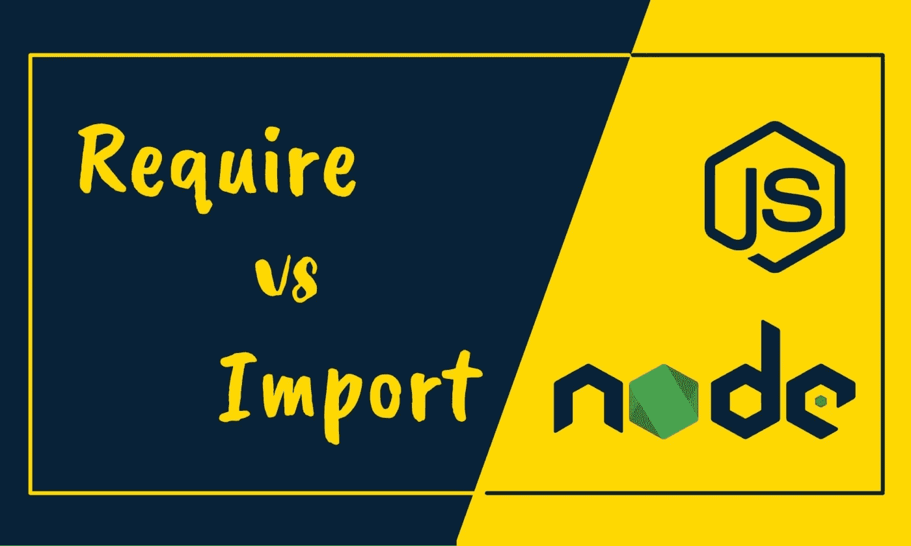
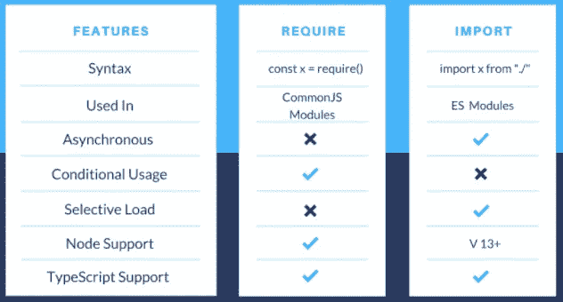

# 比较 JavaScript 中的 require()和 import()

> 原文：<https://javascript.plainenglish.io/require-vs-import-in-js-82a7a47671f?source=collection_archive---------1----------------------->

## 探索 JavaScript 中 require()和 import()方法的特性。

`require()`和`import()`都用来包含模块。但是它们有几个你应该知道的重要特征。但是在我们详细讨论之前，让我们详细地看一下它们。



[link](https://www.google.com/url?sa=i&url=https%3A%2F%2Fblog.bitsrc.io%2Fjavascript-require-vs-import-47827a361b77&psig=AOvVaw1yah8VqhMdiUsgkbR-5tjC&ust=1640315640821000&source=images&cd=vfe&ved=0CAkQjRxqFwoTCKif3Zn6-PQCFQAAAAAdAAAAABAI)

# **要求()**

在 Node.js 中，require()是一个内置函数，用于包含存在于单独文件中的外部模块。require()语句基本上读取一个 JavaScript 文件，执行它，然后返回导出对象。require()语句不仅允许添加内置核心 NodeJS 模块，还允许添加基于社区和本地的模块。

```
var myVar = **require**('http'); //to use built-in modules  
var myVar2 = **require**('./myLocaModule'); //to use local modules
```

# **导入()**

import() & export()语句用于引用 ES 模块。其他具有文件类型的模块，如。json 不能用这些语句导入。它们只允许在 ES 模块中使用，并且该语句的说明符可以是 URL 样式的相对路径或包名。此外，import 语句不能在嵌入式脚本中使用，除非此类脚本具有 type="module "。动态导入可用于类型不是“模块”的脚本

```
var myVac = **import**("module-name");
```

# **要求()与导入()**


[link](https://www.google.com/url?sa=i&url=https%3A%2F%2Fwww.educba.com%2Frequire-vs-import%2F&psig=AOvVaw16bSXk791NemxeV9fHrQq0&ust=1640315632899000&source=images&cd=vfe&ved=0CAsQjRxqFwoTCMiwpcb7-PQCFQAAAAAdAAAAABAD)

## 1. **require()可以从任何地方调用**

通常，我们称文件开头的语句为`import()`或`require()`。但是你可以在代码的任何地方调用`require()`，而`import()`语句只能在文件的开头定义。在别处定义一个`import()`语句会给你一个错误或者自动转移到文件的开头。

## 2. **require()可以有条件地调用**

`require()`语句可以被有条件地调用，但是`import()`语句不能。请参考下面给出的代码:

```
//**require**
if(user.id == 1){
   const getBlogTitle = require(‘./blogDetails.js’);
}//**import** if(...) {   
  import ...; // Error, not allowed! 
}  
{   
  import ...; // Error, we can't put import in any block 
}
```

## 3. **ES 模块可以动态调用**

也就是说，有一种方法可以动态调用导入，这与条件调用不同，但有助于解决异步加载问题

```
**//dynamic** **import** let {hi, bye} = await import('./say.js');  
hi(); // Hello!
bye(); // Bye!//ORlet say = await import('./say.js');     
say.hi(); // Hello!     
say.bye(); // Bye!
```

## 4.`**import() statements are asynchronous**`

`require()`语句被一个接一个地同步调用，而`import()`被异步调用，众所周知，在大规模应用中，它们比`require()`函数执行得更好。



[link](https://blog.bitsrc.io/javascript-require-vs-import-47827a361b77)

现在你知道了。感谢您的阅读。

## **读起来不错**

[](https://blog.bitsrc.io/javascript-require-vs-import-47827a361b77) [## JavaScript 要求与导入

### JavaScript 中 require 和 import 语句的区别

blog.bitsrc.io](https://blog.bitsrc.io/javascript-require-vs-import-47827a361b77) [](https://flexiple.com/javascript-require-vs-import/) [## JavaScript 需要 vs 导入

### 在本文中，让我们了解 JavaScript require()和 import()语句是做什么的，它们如何获取模块，以及…

flexiple.com](https://flexiple.com/javascript-require-vs-import/) [](https://javascript.info/modules-dynamic-imports) [## 动态导入

### 我们在前面章节中提到的导出和导入语句被称为“静态的”。语法非常简单，而且…

javascript.info](https://javascript.info/modules-dynamic-imports) 

*更多内容看* [*说白了. io*](http://plainenglish.io/) *。报名参加我们的* [*免费每周简讯*](http://newsletter.plainenglish.io/) *。在我们的* [*社区*](https://discord.gg/GtDtUAvyhW) *获得独家写作机会和建议。*