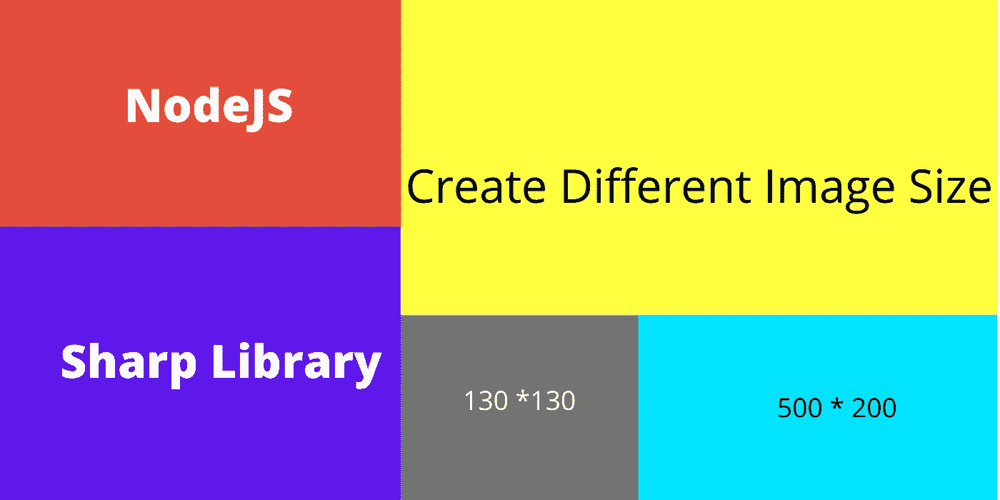

# 使用 Node.js 调整图像大小

> 原文：<https://javascript.plainenglish.io/resize-an-image-using-nodejs-f5e57ac10419?source=collection_archive---------3----------------------->

## 使用 Node.js 和 Sharp 创建不同大小的上传图像



今天，我们有更先进的设备来捕捉图像。每个人都有高分辨率的手机或专业相机。由于先进的设备，总是图像的尺寸也很大。一幅普通的相机图像至少占用 **2MB** 的内存。我们将图片上传到云服务器，或者通过社交媒体或其他通讯工具与我们认识的人分享图片。服务器存储高分辨率图像(客户上传的原始图像)。然而，由于图像的使用越来越多，我们不能保存原始图像的大文件。所以我们需要对用户上传的图片做两件事。

1.  将大文件减小到最佳大小(15MB 到 800KB，而不损失质量)
2.  以较小的尺寸创建相同图像的不同尺寸(个人资料图标、缩略图尺寸、明信片尺寸、封面图像尺寸等)。

比方说，假设你用专业相机拍摄一张照片，文件大小约为 15MB。服务器将存储 15MB 的图像。然而，每次将图像显示给用户需要 15MB 的带宽。今天，我们有更好的互联网连接。但是并不是所有人都有同样好的连接。所以完全加载图像对用户来说将是一个大问题。为了解决这个问题，作为一名 web 开发人员，我们总是会在图像上传到服务器时自动执行**图像** **调整大小**活动。

如果你拿脸书来说，它使用各种图像尺寸来给用户更好的用户体验。一旦用户上传一张图片到**脸书**，他们会根据他们的优化理念自动将你的图片转换成不同的尺寸。下面列出了一些图像尺寸。

> *360 * 360 —缩略图尺寸*
> 
> *500 * 261 —卡片布局图像尺寸*
> 
> *132 * 132 —个人资料图标图像尺寸*

在本教程中，我们将使用 NodeJS Sharp 库来执行图像调整活动。

# **安装库**

在 NodeJS 项目中使用下面的命令安装 NodeJS 的 sharp 库。

```
npm install sharp
```

# **回调示例**

1.  **resize()** —获取新图像尺寸的宽度和高度。
2.  **toFile()** —用于将调整后的图像以新的文件名保存。

# **许诺示例**

你可以通过任何方式回电或许诺。这里我只展示了两个函数——resize 和 toFile。我们在 sharp 库中有更多的功能。我们可以改变**背景**颜色。我们可以改变**颜色**通道**通道**。这个名单还在继续。你可以参考夏普库的官方文档中的那些东西。

[NodeJS 锐库](https://github.com/lovell/sharp)

我用的是 **1MB** 的文件大小进行测试。然后我新建了一个文件，宽度和高度都是 200 * 200。新文件大小只有 **15kb** 。

# **结论**

调整图像大小一直是所有现代 web 应用程序的必备功能。大多数语言提供了更好的图像库来调整图像大小。我喜欢 NodeJS 库 **sharp** ，它简化了我调整图像大小的工作。当我们调整大小时，夏普图书馆提供了更好的图像质量。毫无疑问，这将是开发者的一大福音。

如果您是其他语言的开发人员，并且您找不到更好的库来调整图像大小，那么您可以通过两个简单的步骤在您的语言中使用这个 NodeJS 库。

1.  为这个(sharp) NodeJS 库功能创建 **REST API** 。
2.  使用 **CURL** 概念从您的语言中调用 NodeJS REST API。

## **延伸阅读**

[使用 Node.js 和 MySQL 从头开始创建 REST API。](/create-rest-api-using-nodejs-and-mysql-from-scratch-d1844601e21)

[使用 NodeJS 和 Angular 实现基于 JWT 的授权。](/implement-jwt-based-authorization-using-nodejs-and-angular-9f75ab5904ac)