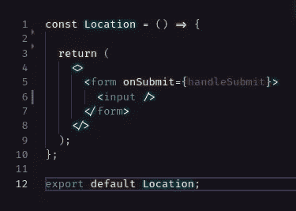
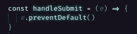
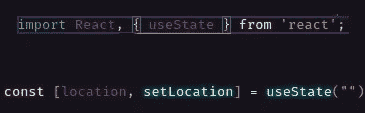
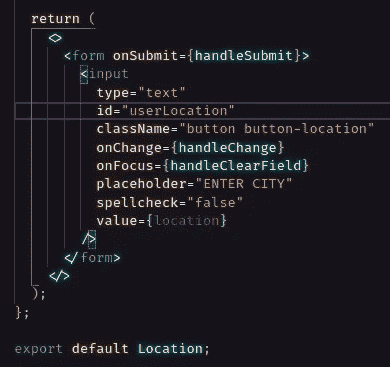
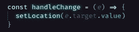
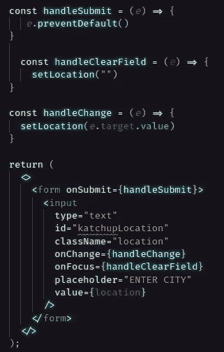
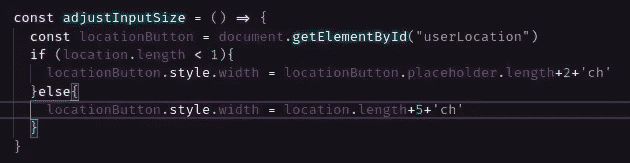
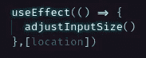
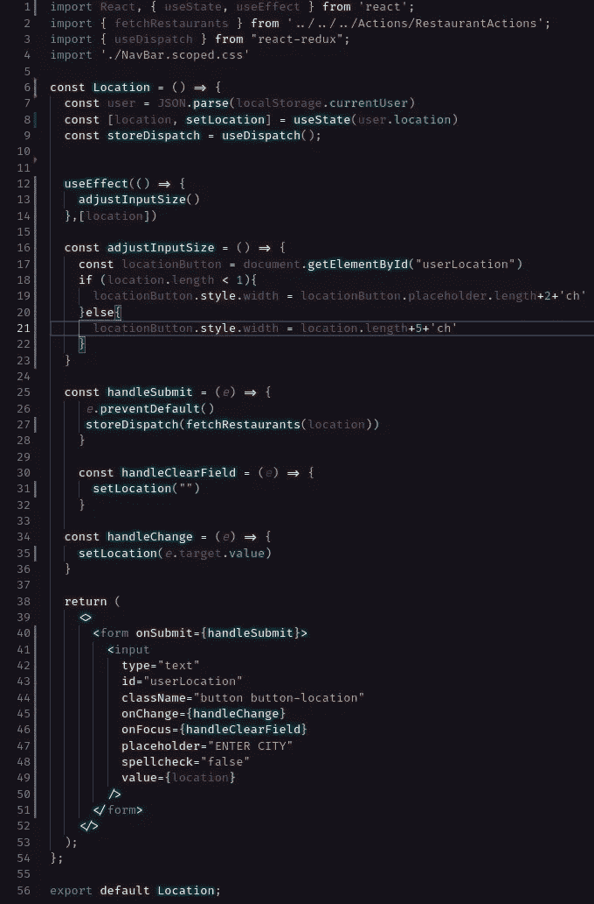

# 如何调整输入框的大小以避免函数反应形式的溢出

> 原文：<https://javascript.plainenglish.io/resize-an-input-box-to-avoid-overflow-in-a-functional-react-form-94d6610a6129?source=collection_archive---------2----------------------->

上周，我写了一篇非常相似的文章关于如何调整文本大小以适应静态尺寸的输入框。本周，我们将研究调整输入框的大小以适应文本。很遗憾，两者都没有一个纯 CSS 解决方案，但是用一些 JavaScript 很容易实现。

在本文中，我们将创建一个简单的表单，接受一个输入，用户的位置，并改变输入框的大小，这样我们就不会有任何溢出。

**注意:**本文的开头与我之前关于如何调整文本大小以适应输入框的文章基本相同。如果您想跳过，点击[此处](#8ac7)。

我们开始吧！首先，我们需要创建一个功能性的 React 组件，该组件返回一个带有单个输入的表单。

对于本例，我们只需确保表单提交时页面不会刷新。在`handleSubmit` 功能中，我们只是通过增加`e.preventrDefault().`来防止默认提交行为

既然已经排除了这种可能性，让我们努力使它成为一种受控的形式。为了改变输入字段的大小，我们首先需要知道每当输入值改变时，输入字段中有多少个字母。为此，我们使用一种受控形式。我们将从设置一个状态变量开始。因为我们使用的是功能性组件，所以我们将需要使用钩子来实现这一点。在这里我们将使用`useState`钩子。

接下来，我们将设置输入。我们需要将我们的输入值设置为状态变量“location”，给输入一个 ID，我们还需要一个`onChange`事件监听器，它会在输入改变时执行我们的`handleChange`功能。如果您愿意，您可以在选择输入时添加一个占位符和一个函数来清除该值，但是对于这个受控形式来说，唯一绝对必要的是值、ID 和`onChange` 事件侦听器。

现在让我们通过构建我们的`handleChange` 和`handleClearField` 函数来为这个表单添加一些功能。我们从`handleChange.`开始

如您所见，我们在这里所做的只是将状态变量“location”设置为事件目标的值。事件是对输入的改变，目标是输入本身。因为输入的值被设置为我们的状态变量“location ”,所以这允许我们控制表单。现在，我们将来自用户的输入信息保存到一个变量中，我们可以用它来确定输入字段的大小。

为了清理场地，我们做了一些类似的事情。我们只是将状态变量“location”设置为一个空字符串。一旦输入的值为空，占位符就会显示出来。

现在，我们只需要调整输入字段的大小，以适应其中的文本。

为了调整输入字段的大小，我们将创建一个函数，使用 location 变量中的字符数来确定适合所有文本所需的宽度。然后，我们将 width dimension 设置为输入元素的`width`属性。

这里我们抓取位置按钮元素，并将其设置为变量`locationButton`。然后，如果我们的位置变量的值小于一个字符长，我们设置`locationButton`的宽度以适合占位符文本。否则，我们设置`locationButton`的宽度等于位置变量中的字符数加五。这给了我们一点填充，并确保所有的文本将适合没有溢出。我们使用`ch`度量单位来确定输入字段的宽度，因为一个`ch`大约等于一个字符的大小(基于“0”)。

为了让一切顺利进行，我们只需要再走一步。让我们导入`useEffect` 钩子，当组件挂载时，以及每次位置变量改变时，用它来调整输入字段的大小。

有了这个`useEffect`钩子，我们的`adjustInputSize` 函数在定位组件挂载时开始运行。通过包含我们的位置变量作为依赖项，它将运行`adjustInputSize`并在`location`的值改变时触发重新渲染。

就是这样！通过使用来自我们的控制表单的信息，我们能够创建一个根据其值的长度动态调整大小的输入字段。再也不用处理难看的溢出了！开心快乐编码！

*更多内容请看*[*plain English . io*](http://plainenglish.io/)