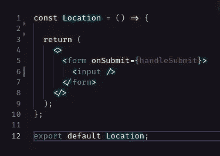
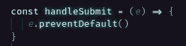
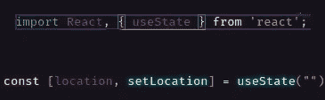
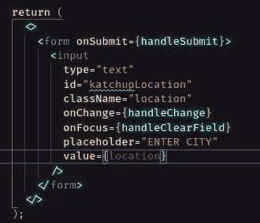
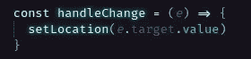
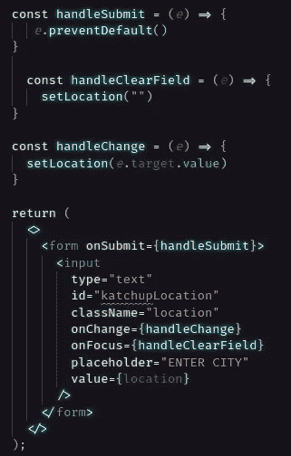
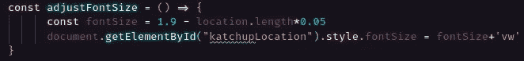
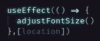
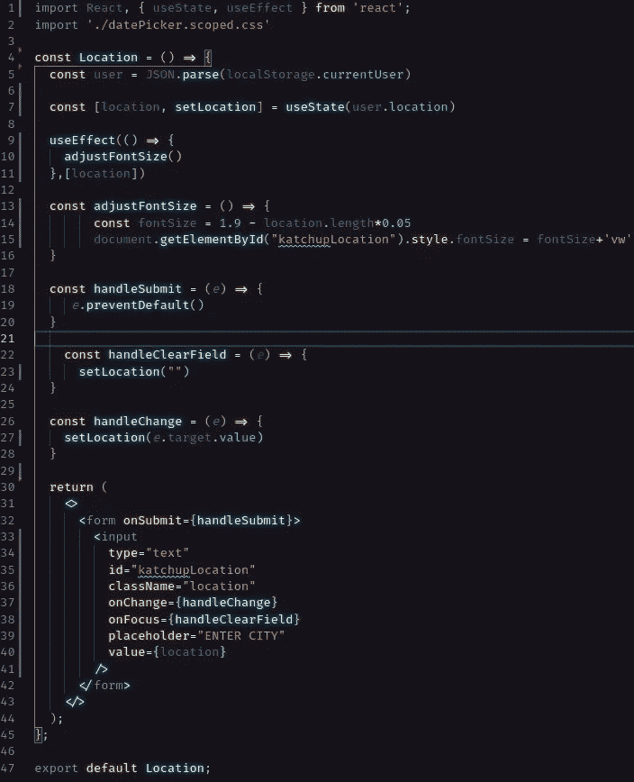

# 调整输入文本的大小以避免函数式反应表单中的溢出

> 原文：<https://javascript.plainenglish.io/resize-input-text-to-avoid-overflow-in-a-functional-react-form-178bb8d33708?source=collection_archive---------6----------------------->

我能想到几个例子，在这些例子中，能够改变字体大小以适应输入字段的尺寸会很方便。事实上，令我非常惊讶的是，这并不是 CSS 中已经包含的东西。哦，好吧，用一点 JavaScript 和一些 React 钩子的使用，这应该不是一个太大的问题。

在本文中，我们将创建一个简单的表单，接受一个输入，即用户的位置，并更改字体大小，这样我们就不会有溢出。

我们开始吧！首先，我们需要创建一个功能性的 React 组件，它返回一个只有一个输入的表单。

对于本例，我们只需确保表单提交时页面不会刷新。在`handleSubmit` 函数中，我们将通过添加`e.preventrDefault().`来防止提交的默认行为

既然已经解决了这个问题，让我们把它变成一个可控制的表单。为了改变文本的大小，我们首先需要知道每当输入字段的值改变时，输入字段中有多少个字母。为此，我们使用一个受控的表单。我们将从设置一个状态变量开始。因为我们使用的是功能组件，所以我们需要使用钩子来完成这个任务。这里我们将使用`useState`钩子。

接下来，我们将设置输入。我们需要将输入的值设置为状态变量“location ”,给输入一个 ID，我们还需要一个`onChange`事件监听器，它将在输入改变时执行我们的`handleChange`函数。如果您愿意，您可以添加一个占位符和一个函数来在输入被选中时清除值，但是对于这个受控表单来说，唯一绝对必要的是值、ID 和`onChange` 事件监听器。

现在让我们通过构建我们的`handleChange` 和`handleClearField` 函数来给这个表单添加一些功能。我们从`handleChange.`开始

如您所见，我们在这里所做的只是将状态变量“location”设置为事件目标的值。事件是对输入的改变，目标是输入本身。因为输入的值被设置为我们的状态变量“location ”,所以这允许我们控制表单。现在，我们将来自用户的输入信息保存到一个变量中，我们可以使用这个变量来确定输入文本的大小。

为了清理场地，我们做了一些类似的事情。我们只是将状态变量“location”设置为一个空字符串。一旦输入的值为空，占位符就会显示出来。

现在我们只需要调整字体大小来适应输入字段。

**免责声明:**这需要一点数学知识，根据输入字段的大小、使用的字体等，数学知识可能会有所不同，但这应该会给你一个很好的起点。

为了调整字体大小，我们将创建一个函数，使用位置变量中的字符数来确定字体的大小。然后，我们将字体大小设置为输入元素的`fontSize`属性。为了给我们的应用程序确定合适的字体大小，我们需要首先做出一些设计决定。

我决定让字体大小不仅根据字符的数量来改变，还根据窗口的宽度来改变。所以，我选择使用视口宽度或“vw”测量单位。最适合我的应用程序的基本大小似乎是 1.9vw。因此，以 1.9 为起点，我想在输入字段中添加每个新字符时减小字体的大小。

记住所有这些，我们需要创建一个变量来存储字体大小，如下所示。⬇️

这里，我们用基本字体大小(1.9)减去`location.length`(位置变量中的字符数)乘以 0.05……同样，您的特定应用程序的数学可能会有所不同。然后，我们通过 ID 选择输入元素，并将“fontSize”属性设置为变量`fontSize`+‘VW’。

为了让一切顺利进行，我们只需要再走一步。让我们导入`useEffect` 钩子，当组件挂载时，以及每次我们的位置变量改变时，用它来调整输入字体的大小。

有了这个`useEffect`钩子，我们的`adjustFontSize` 函数在定位组件挂载时开始运行。通过包含我们的位置变量作为依赖项，它将运行`adjustFontSize`并在`location`的值改变时触发重新渲染。

就是这样！通过使用来自控件表单的信息，我们能够创建一个具有动态字体大小的输入字段。再也不用处理难看的溢出了！开心快乐编码！

*更多内容请看*[*plain English . io*](http://plainenglish.io/)