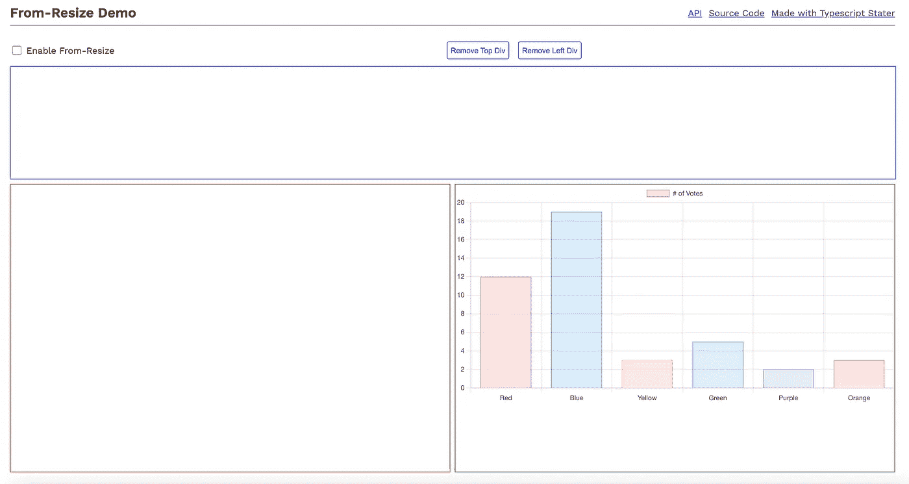
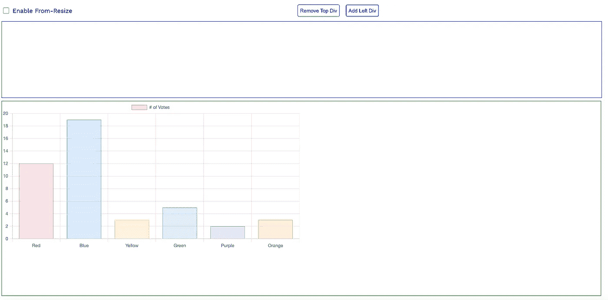
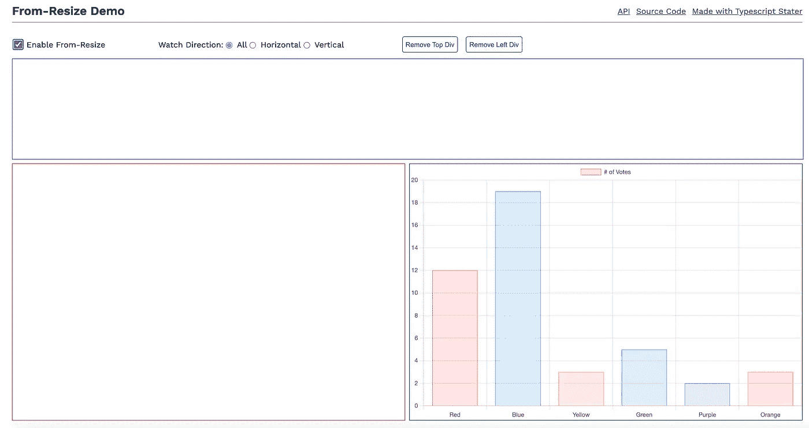
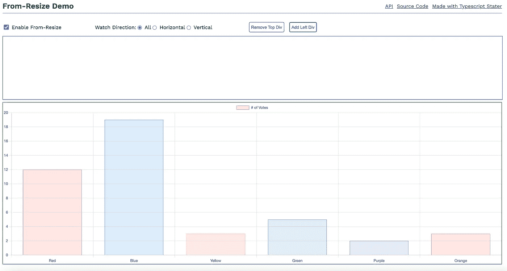

# 使用 RXJS 扭曲调整观察点的大小

> 原文：<https://javascript.plainenglish.io/resize-observer-with-an-rxjs-twist-8dee5bdedce3?source=collection_archive---------7----------------------->

## 当容器尺寸改变时得到通知

## 我们都喜欢使用 CSS Flex 和网格，不是吗？

但是，在某些情况下，容器维度的更改可能需要重新绘制其内容元素。为了解决这样的用例， [**调整观察者尺寸规范**](https://developer.mozilla.org/en-US/docs/Web/API/Resize_Observer_API) 发布了。

我很高兴地报告，Resize Observer 现在在现代浏览器 中得到广泛的 [**支持。它的类型定义也与**](https://caniuse.com/?search=resize%20observer) **[**this**](https://github.com/microsoft/TypeScript-DOM-lib-generator/pull/948) PR 合并在 Typescript Lib 中。**

然而，在 [RxJs Observables](https://github.com/ReactiveX/rxjs) 的时代，我发现用于调整观察者大小的 **API 使用起来有点**繁琐**。我开始想…围绕这个 API 构建一个 RxJs 包装器会很好！**

这个想法引导我创建了 [**From-Resize**](https://github.com/twig-it/from-resize) 库。下面列出了这个库的主要目标。

*   返回一个 RxJs 可观察对象，它在每次容器维度改变时发出
*   将手表方向设置为`Horizontal`、`Vertical`或`All`
*   设置初始去抖时间以控制发射频率
*   使用`emitOnStart`在首次加载时获得通知
*   利用 [RxJs 操作员](https://rxjs.dev/guide/operators)的力量创造奇迹！

# 让我们看看它的实际效果吧！

*演示假设:我使用 ChartJs，将“responsive”选项设置为****false****来演示这个示例*。*

## 看到问题了吗

*   保持*启用从-调整*未选中
*   图表显示在右下角的单元格中。顶部和左侧的单元格仅用于演示目的。

现在点击“*移除左 div* ”按钮移除左 Div 元素。对于这个动作，没有 ***窗口大小调整*** 事件会被激发，因为窗口大小保持不变。

*   **问题**:图表元素的维度现在与其父容器维度不同步。要解决这个问题，我们需要重新绘制图表。但是我们如何得到通知呢？？

## 解决方法！

*   通过选择复选框启用 **From-Resize**

*   您可以选择方向。默认值为“全部”；也就是说，它将在水平和垂直尺寸变化时发出。
*   现在通过点击“移除左 div”按钮移除左 Div 元素。
*   图表被重新绘制。**问题解决了！！**

这次成功了，因为我们从-resize observable 订阅了**，并且在每次发射时，我们都重新绘制图表。**

可以在这里 **玩这个互动试玩 app [**。**](https://twig-it.github.io/from-resize/)**

## 用法示例

如您所见，代码简单易懂。现在你可以把它和不同的 RxJs 操作符结合起来做更高级的东西！

## 结论

我希望你在使用这个库的时候开心！请联系 [me](https://github.com/anandtiwary) 获取任何反馈或使用说明。

## 有用的链接

*   [**互动演示 App**](https://twig-it.github.io/from-resize/)
*   [**Github 来源**](https://github.com/twig-it/from-resize)
*   [**From-Resize API**](https://twig-it.github.io/from-resize/types/index.html)
*   用 [**构建的打字稿** **模板**](https://github.com/twig-it/typescript-starter-template)
*   观看[**@ twig-it**](https://github.com/twig-it)GitHub org 一些即将推出的精彩库。