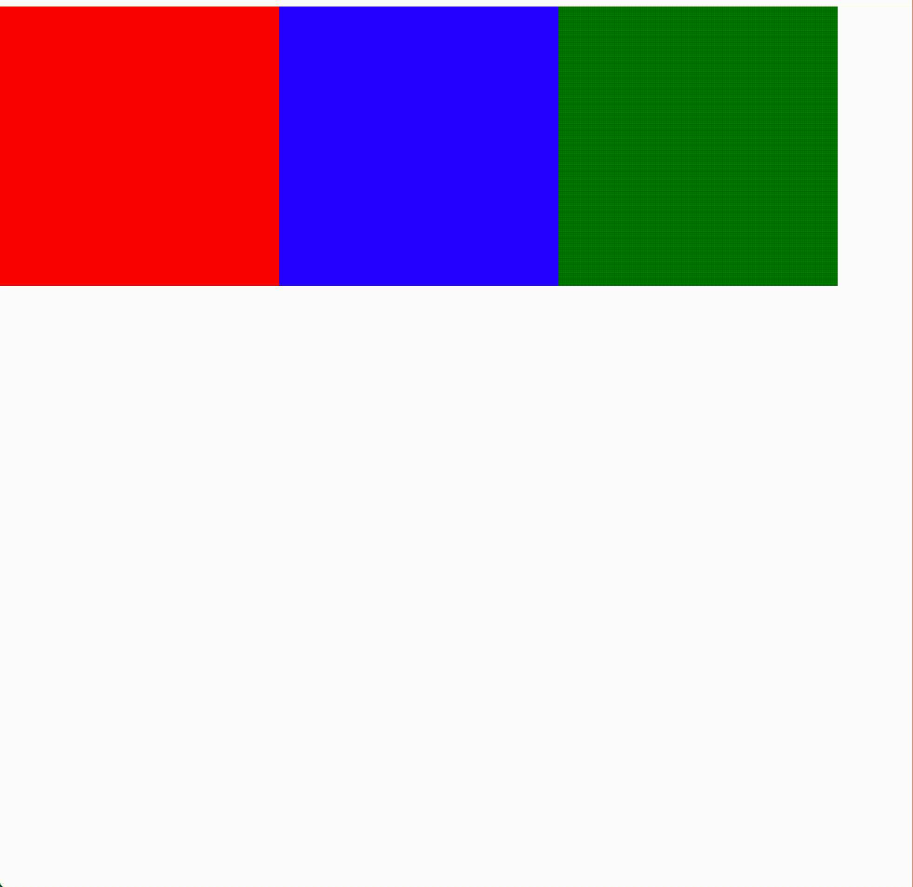
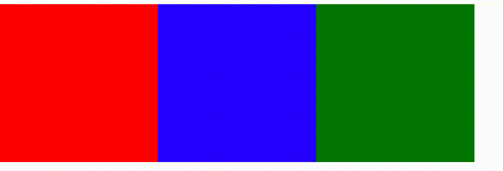
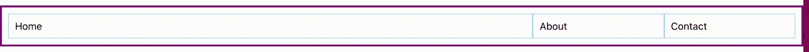
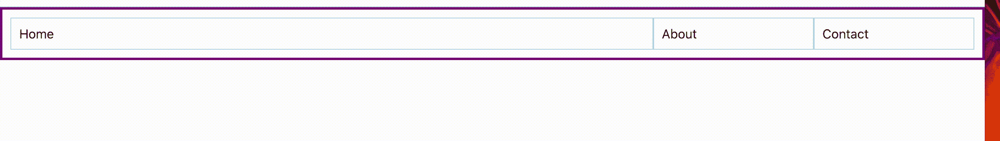
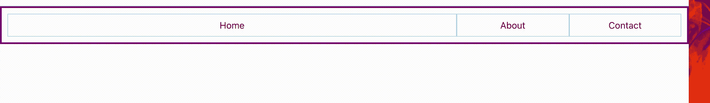

# 使用 React + Material 用户界面为移动设备和网络设计响应样式

> 原文：<https://javascript.plainenglish.io/responsive-styling-for-mobile-and-web-with-react-material-ui-6984205ac65e?source=collection_archive---------2----------------------->


在当今时代，网站拥有*响应式设计*变得越来越重要。

> 响应式网页设计是一种建议设计和开发应该根据屏幕大小、平台和方向对用户的行为和环境做出反应的方法。

这意味着一个网站在大屏幕上看起来应该和在小手机屏幕上一样好，或者在垂直方向上和水平方向上一样好。

在这篇文章中，我将会谈到通过使用 css flexbox 布局、React 和材质 UI 网格来构建一个具有响应式设计的网站的众多方法中的几种。

如果您已经熟悉 flexbox 样式，请随意跳到材质 UI 部分。

(注意:本演示假设您对 Html、CSS 和 React 有基本的了解)

# Flexbox

响应式网页设计的第一个关键概念是 **css flexbox 布局。**如果你以前从未听说过或使用过 flexbox，点击这里查看一个很棒的指南[。简而言之，css flexbox 布局允许您动态地调整元素的大小和重新排列元素。](https://css-tricks.com/snippets/css/a-guide-to-flexbox/)

在您选择的任何文本编辑器中，创建一个名为 index.html 的文件，其内容如下:

```
<!DOCTYPE html>
<html lang="en">
<head>
    <link rel="stylesheet" href="styles.css">
</head>
<body>
    <div class="container">
        <div class="item" id="item-1"></div>
        <div class="item" id="item-2"></div>
        <div class="item" id="item-3"></div>
    </div>
</body>
</html>
```

然后在与 index.html 相同的文件夹中创建一个名为 styles.css 的文件，内容如下:

```
.container {
    display: block
}

.item {
    display: inline-block;
    width: 300px;
    height: 300px;
}

#item-1 {
    background-color: red;
}

#item-2 {
    background-color: blue;
}

#item-3 {
    background-color: green;
}
```

接下来，在 web 浏览器中打开 index.html(根据您的操作系统或计算机设置，您可以双击该文件，它会自动在您的默认浏览器中打开，或者右键单击该文件并选择“打开方式”，然后选择您的浏览器)。

您应该在页面上看到 3 个彩色框。现在继续拖动浏览器的右侧来缩小窗口。注意当你继续缩小窗口时，方块是如何跳到下面一行的？



这看起来有点笨重，不适合不同的屏幕尺寸。如果这些盒子代表导航项目呢？对于中等大小的屏幕，你不希望两个项目在一行，一个项目在第二行。

现在让我们用 flexbox 试试。继续将容器更改为显示 flex，并从 item 类中删除显示，如下所示:

```
.container {
  display: flex;
}

.item {
  height: 300px;
  width: 300px;
}

#item-1 {
  background-color: red;
}

#item-2 {
  background-color: blue;
}

#item-3 {
  background-color: green;
} 
```

回到浏览器，重新加载页面，拖动窗口再次缩小。请注意，这一次，不是将框向下推到新的一行，而是框随着页面向下收缩。那好多了。



现在，您可以使用 flexbox 进行大量的样式设置，将方向从行更改为列，沿垂直或水平轴对齐项目，使项目占用不同的空间，重新排序项目，等等。如果你以前没有使用过 flexbox，我强烈推荐你在继续下一步之前尝试一下[指南](https://css-tricks.com/snippets/css/a-guide-to-flexbox/)中描述的不同属性。

# 材料用户界面网格

好吧，简单的 flexbox 风格很好，但是如果你需要更好的响应呢？如果您希望项目改变颜色，并在特定的窗口大小下从行方向切换到列方向，该怎么办？你会怎么做？一个答案(有很多)是使用 React 和 Material UI 中的网格组件。

如果你还不是 React 的高手，你可以在这里阅读和学习教程[。Material UI 是 React 的一个组件库，它附带了许多漂亮的预构建但可定制的组件。我们将在这里讨论的一个叫做](https://reactjs.org/)[网格](https://material-ui.com/components/grid/)组件。您可以对网格做很多事情，就像 flexbox 样式一样，因为它们本质上是带有默认 flex 显示的 div。然而，我们将特别关注断点，因为它们是网格响应样式的关键。

对于演示的这一部分，我们将使用一个名为`create-react-app`的 npm 包。如果你还没有安装 node 或者 npm，你可以按照这里[的说明](https://www.npmjs.com/get-npm)。一旦设置完毕，运行下面的命令。

```
npx create-react-app grid-demo
```

这将为您生成一个名为 grid-demo 的现成 React 应用程序。生成完成后，您还需要使用以下命令添加材质 ui 包:

```
cd grid-demo
npm install @material-ui/core
```

接下来，在您喜欢的编辑器中打开项目，并用以下内容替换 App.js 的内容:

```
import Reactfrom 'react';
import { makeStyles, Grid} from '@material-ui/core';

const useStyles = makeStyles(() => ({
    container: {
        border: '3px solid purple',
        padding: '10px',
    },
    item: {
        padding: '10px',
        border: '1px solid lightblue',
    },
}));

function App() {
  const classes = useStyles();
  return (
      <Grid container className={classes.container}>
          <Grid item xs={4} className={classes.item}>Home</Grid>
          <Grid item xs={4} className={classes.item}>About</Grid>
          <Grid item xs={4} className={classes.item}>Contact</Grid>
      </Grid>
  );
}

export default App;
```

现在继续使用命令`npm start` *运行应用程序。*这将自动启动您在 localhost:3000 的默认 web 浏览器。如果没有，请打开浏览器并导航到该 url。

好的，在我们继续之前，让我们来谈谈我刚才给你的这段代码中发生了什么。

有了网格，你可以使用所谓的断点来告诉元素在不同的窗口大小下需要占用多少空间。在网格系统中，组件大小与值 12 成比例，因此 12 =容器宽度的 100%。

啊？好吧，我们退一步。在这个初始设置中，您会注意到 3 个 item 元素都有一个属性`xs={4}`。这些断点表示，在极小的窗口尺寸*和最大的*时，这些元素应该都是容器总宽度的三分之一(12/4 = 3)。断点被组织成 t 恤衫大小，以便您可以设置超小、小、中、大和超大窗口的大小。每个断点决定该窗口大小*及以上的组件大小。*

如果您想添加在不同的窗口大小下动态改变某些项目的比例大小的能力，您可以添加更多的断点。例如，您可以为中型窗口添加不同于小型窗口的大小，如下所示

```
<Grid container className={classes.container}>
    <Grid item xs={4} md={8} className={classes.item}>Home</Grid>
    <Grid item xs={4} md={2} className={classes.item}>About</Grid>
    <Grid item xs={4} md={2} className={classes.item}Contact</Grid></Grid>
```

如果您重新加载浏览器页面，并尝试拖动窗口变大变小，您应该会看到以下内容



当窗口以最大尺寸开始时，“主页”项占据三分之二的空间，“关于”和“联系人”项各占六分之一。然后，当您将窗口拖小时，比例会跳到各三分之一。继续尝试不同的比例和断点，看看效果如何。

好了，现在我们有了一些横向响应，如果我们想让导航在最小的窗口尺寸下变成垂直的，比如在手机上呢？为此，您只需将所有三个元素的 xs 断点设置为 12(`xs={12}`)。这就是它看起来的样子。



Tada！现在我们有了一个可以在小屏幕和大屏幕上使用的样式，而不需要构建两个不同的组件！

让我们更进一步。如果我们还想改变一些其他样式，比如让文本只在垂直方向居中对齐，会怎么样？再次，我们可以使用断点，但这次是在 css 中。

在我提供的代码中，你会注意到方法`makeStyles()`的用法，它包含了看起来像 css 的东西。你现在不需要担心细节，除了这是你可以使用 css 样式和材质 UI 的一种方式。在这种情况下，它只是简单的样式，添加边界和填充到我们的外部和内部 div，使之更容易告诉他们在哪里。如果你愿意，你可以在这里阅读更多关于这个语法的内容。

要在 css 中使用断点，请更改该方法的代码，如下所示

```
const useStyles = makeStyles((theme) => ({
    container: {
        border: '3px solid purple',
        padding: '10px',
        [theme.breakpoints.down('md')]: {
            textAlign: 'center',
        },
    },
    item: {
        padding: '10px',
        border: '1px solid lightblue',
    },
}));
```

在容器样式中，`theme.breakpoints.down('md')`将 css 应用于中等尺寸*或更小的窗口。*如果你想让它适用于中等尺寸*或更大尺寸*的窗口，你可以使用`theme.breakpoints.up('md')`。如果您运行这段代码，您的应用程序现在应该是这样的



咻！这是很多东西，但希望它有助于阐明如何使用 React 和 Material UI 来构建响应式 web 应用程序。我鼓励您尝试本文中描述的每种技巧的不同组合，以真正感受它是如何工作的。编码快乐！

## 进一步阅读

[](https://bit.cloud/blog/how-to-build-material-ui-components-with-bit-l3isiibs) [## 如何用 Bit 构建 React 材质 UI 组件

### Material UI 是一个流行的开源()UI 组件库，它将材质设计与 React 结合在一起。材料 UI 是…

比特云](https://bit.cloud/blog/how-to-build-material-ui-components-with-bit-l3isiibs) 

*更多内容请看*[***plain English . io***](https://plainenglish.io/)*。报名参加我们的* [***免费周报***](http://newsletter.plainenglish.io/) *。关注我们关于*[***Twitter***](https://twitter.com/inPlainEngHQ)[***LinkedIn***](https://www.linkedin.com/company/inplainenglish/)*[***YouTube***](https://www.youtube.com/channel/UCtipWUghju290NWcn8jhyAw)***，以及****[***不和***](https://discord.gg/GtDtUAvyhW) *对成长黑客感兴趣？检查* [***电路***](https://circuit.ooo/) ***。*****