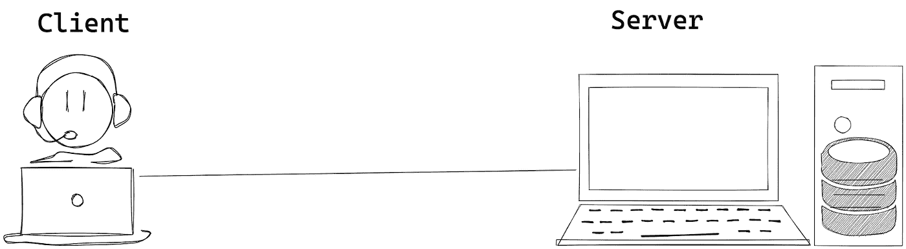

# 您需要注意的 10 个 API 安全漏洞(以及 REST API 概述)

> 原文：<https://javascript.plainenglish.io/rest-api-overview-api-security-vulnerabilities-a677cda0be9d?source=collection_archive---------7----------------------->

REST API overview & API Security Vulnerabilities

什么是 API？

API(或应用程序编程接口)提供了两个系统之间的交互方法。

**什么是 RESTful API？**

REST 代表具象状态转移，由计算机科学家[罗伊·菲尔丁](https://roy.gbiv.com/)博士在 2000 年首次定义。

REST 是一组架构约束，而不是协议或标准。它是一种通过 HTTP 设计松散耦合应用程序的架构风格，通常用于 web 服务的开发。

REST 并不强制执行任何关于如何在较低层次实现它的规则，它只是给出了高层次的设计指导方针，并让您考虑自己的实现。

**其余设计原则或架构约束**

1.  客户端-服务器
2.  无国籍的
3.  隐藏物
4.  统一界面
5.  分层系统
6.  按需编码(可选)

**客户端-服务器**

这种约束背后的原则是关注点的分离，因为用户界面与数据存储的关注点完全分离。

本质上，这意味着客户机和服务器应用程序的发展不再相互依赖。

**Client-Server**

**无状态**

在 REST 应用程序中，每个请求必须包含服务器理解的所有必要信息，而不是依赖于服务器记住之前的请求。

在服务器上存储会话状态违反了 REST 架构的无状态约束。所以会话状态必须完全由客户端处理。

这个约束归纳了可见性、可靠性和可伸缩性的属性

*   **可见性** —每个请求包含理解它所需的所有上下文。因此，查看单个请求就足以可视化交互。
*   **可靠性** —由于请求是独立的，一个请求的失败不会影响其他请求。
*   **可伸缩性** —服务器不必记住应用程序的状态，使其能够在更短的时间内为更多的请求提供服务。

**Stateless**

**缓存**

缓存约束要求对请求的响应中的数据隐式或显式地标记为可缓存或不可缓存。如果一个响应是可缓存的，那么客户机缓存就有权为以后的等价请求重用该响应数据。

缓存是将频繁访问的数据的副本存储在请求-响应路径上的几个地方的能力。

我们可以使用 **Expires** 和 **Cache-Control** HTTP 响应头来控制缓存行为

cache

**统一接口**

统一接口约束是任何 REST 服务设计的基础。统一的接口简化并分离了架构，使每个部分都能独立发展。

该界面的四个指导原则是:

*   **资源的标识** —您使用 URI (IRI)标准来标识资源。在这种情况下，资源是一个 web 文档。
*   **通过这些表示操纵资源** —您使用 HTTP 标准来描述通信。例如，GET 意味着您想要检索关于 URI 标识的资源的数据。您可以用 HTTP 方法和 URI 来描述操作。
*   **自描述消息** —使用标准 MIME 类型和(标准)RDF 词汇使消息自描述。因此，客户端可以通过检查语义来找到数据，而不必知道服务使用的特定于应用程序的数据结构。
*   **超媒体作为应用程序状态的引擎** —使用超链接和可能的 URI 模板将客户端从特定于应用程序的 URI 结构中分离出来。你可以用语义注释这些超链接，例如 IANA 链接关系，这样客户就能理解它们的意思。

**Uniform Interface**

**分层系统**

为了改进互联网规模需求层的行为，系统约束就出现了。

分层系统风格通过约束组件行为使得每个组件不能“看到”与其交互的直接层之外，从而允许体系结构由分层的层组成。

REST 允许您使用分层的系统架构，在服务器 1 上部署 API，在服务器 2 上存储数据，在服务器 3 上验证请求。

**Layered System**

**按需编码**

REST 允许通过下载和执行 applets 或脚本形式的代码来扩展客户端功能。

这通过减少需要预先实现的功能数量来简化客户端。允许在部署后下载特性提高了系统的可扩展性。

然而，它也降低了可见性，因此只是 REST 中的一个可选约束。

**Code-On-Demand**

# **API 安全漏洞(** OWASPS-Top-10 **)**

1.  **打破对象级别授权**

API 倾向于公开处理对象标识符的端点，从而产生了广泛的攻击表面级访问控制问题。

缺少适当的授权检查使得攻击者能够访问指定的资源。

**Broken Object Level Authorization**

**用例**

1.来自经过身份验证的用户的真实请求，以获取用户信息

Case 1 - Genuine request from an authenticated user

2.用户试图通过猜测正确的参数来访问另一个用户的资源

case 2 — guess right parameter

3.用户试图通过猜测错误的参数来访问其他用户的资源

Case 3 — guess wrong parameters

> 破坏的对象级授权只能手动测试。你可以使用相同的工具来测试 API，比如 [Postman](https://www.postman.com/) 、 [Fiddler](https://www.telerik.com/download/fiddler) 、 [ReadyAPI](https://smartbear.com/product/ready-api/overview/) 。

2.**破解用户认证**

破碎用户认证缺陷的发生主要是由于会话管理和凭证管理中的漏洞。

攻击者主要利用身份验证机制的弱点来获取用户会话 id、详细信息和用户凭证。

在这个漏洞中，有很多情况是由于在开发和部署 API 时没有实现最佳实践。

破解认证攻击旨在接管一个或多个账户，给予攻击者与被攻击用户相同的权限。当攻击者能够泄露密码、密钥或会话令牌、用户帐户信息和其他细节来冒充用户身份时，身份验证就会被破坏。

**用例**

1.  用户名和密码很容易使用模糊或暴力猜测。
2.  密码与密码复杂性策略或最佳实践不匹配。
3.  验证失败响应时枚举用户名/密码无效的用户名或密码。
4.  登录凭据在存储时不受保护，并且缺少哈希和 salt。
5.  通过未加密的通道(如 HTTP)传输用户名和密码
6.  URL 中公开的会话 ID。
7.  用户注销后，用户会话或身份验证令牌不会超时。

**Broken User Authentication**

> 开发人员必须确保正确设置和保护身份验证机制。一些自动化工具可以帮助您测试最常见的身份验证模式。例如，对于基本身份验证，像 [Acunetix](https://www.acunetix.com/) 或 [Burp Suite](https://portswigger.net/burp) 这样的安全工具可以验证令牌是否加密以及哈希是否正确。这些工具将为你提供一个基本的报告，然后你必须仔细分析。

3.**数据暴露过多**

此漏洞与暴露 API 中的数据以及将在 UI 上呈现或显示的数据有关。

例如，我们有一个界面，我们希望在其中显示来自用户对象的三个字段，如姓名、地址和个人资料照片。但与此同时，从 API 中，我们在用户对象中获得了更多的数据，这与当前用户界面的情况无关。

为了防止这种情况，我们在 API 响应中返回了相关字段，而不是通过 API 共享敏感数据。

**用例**

1.  API 返回存储在后端数据库中的完整数据对象。
2.  客户端应用程序过滤响应，只显示用户真正需要看到的数据。
3.  攻击者直接调用 API 并获取用户界面过滤掉的敏感数据。

**Excessive Data Exposure**

> 我们必须手动测试过度的数据暴露。我们可以通过功能测试来验证 API 响应字段。

4.**资源匮乏&限速**

不适当的[速率限制](https://nordicapis.com/everything-you-need-to-know-about-api-rate-limiting/)是一种漏洞，当一个 API 对它发送给另一个 API 或服务器的请求数量没有限制时，就会出现这种漏洞。

API 无法防止过多的调用或负载大小。攻击者可以利用这一点进行拒绝服务(DoS)和身份验证缺陷，如暴力攻击。

**用例**

1.  攻击者可能会通过发送不必要的更多请求来使 API 过载
2.  没有对每个请求所请求的记录大小进行适当的验证

**Lack of Resources & Rate Limiting**

> 要找到速率限制漏洞，可以使用不同的模糊工具，如 [JBroFuzz](https://sourceforge.net/projects/jbrofuzz/) 或 [Fuzzapi](https://github.com/Fuzzapi/fuzzapi) 。或者，您可以使用与分析流量相同的工具。
> 
> 使用 429(太多请求)状态代码，我们可以对过载的不必要的 API 请求实施速率限制。
> 
> 我们可以添加对 API 请求的记录大小的适当验证，以返回受限的记录作为响应

5.**中断功能级别授权**

具有不同层次结构、组和角色的复杂访问控制策略，以及管理功能和常规功能之间不明确的分离，往往会导致授权缺陷。

此漏洞与垂直授权级别有关，即用户试图获得超过允许的访问权限。例如，一个普通用户试图成为管理员。

**Broken Function Level Authorization**

> 要发现这个漏洞，我们必须了解应用程序中的各种角色和对象是如何连接的，以及应用程序中实现的访问矩阵

6.**批量分配**

API 获取客户端提供的数据并存储，而不对列入白名单的属性进行适当过滤。

实现验证中间件，从客户机 API 请求中获取参数，并提取服务于该请求所需的特定字段。

**Mass Assignment**

> 将对象模式中设置为`true`的`readOnly`属性用于可以通过 API 检索但永远不应该修改的所有属性。
> 
> 在设计时精确定义您将在请求中接受的模式、类型和模式，并在运行时实施它们。

7.**安全错误配置**

此漏洞与您的 web 服务器或 API 的错误配置有关。

API 服务器的不良配置使得攻击者能够利用它们。

必须在服务器上禁用所有不必要的 HTTP 方法。根本不要显示任何不必要的用户错误。

不要将错误的技术细节传递给客户。如果您的应用程序使用跨源资源共享(CORS)，也就是说，如果它允许来自不同域的另一个应用程序访问您的应用程序的 cookies，那么必须适当地配置这些头以避免额外的漏洞。

还必须禁止对内部文件的任何访问。有一些特殊的安全头，如 Content-Security-Policy，您也可以在应用程序中实现它们来提高安全级别。

**Security Misconfiguration**

> 如果我们的应用程序使用跨源资源共享(CORS)，也就是说，如果它允许来自不同域的另一个应用程序访问我们的应用程序的 cookies，那么必须适当地配置这些头以避免额外的漏洞。还必须禁止对内部文件的任何访问。有一些特殊的安全头，像[内容-安全-策略](https://developer.mozilla.org/en-US/docs/Web/HTTP/Headers/Content-Security-Policy)，我们也可以在您的应用中实现，以提高安全级别。

8.**注射**

攻击者构造 API 调用，其中包括 SQL、NoSQL、LDAP、OS 或 API 或其背后的后端盲目执行的其他命令。

我们可以使用对象关系映射模型来避免 SQL 注入。

这并不意味着我们需要完全忘记注射。

在大量的旧站点和系统中，这样的问题仍然是可能的。除了 XSS 和 SQL，我们还应该寻找 XML 注入、JSON 注入等等。

**Injection**

> 我们可以使用不同的工具测试注射。比如 [ReadyAPI](https://nordicapis.com/top-25-api-testing-tools/) 提供了自动扫描的付费工具。其他的，像 [Burp Suite](https://portswigger.net/) ，是部分免费的。或者，如果您在项目中使用 Postman，您可以使用 Postman 和数据驱动测试来执行基本的注入测试。

9.**资产管理不当**

此漏洞与您的资产管理不善有关。

随着工程师采用 DevOps、持续测试和 CI/CD 管道，这个缺陷越来越大。

从安全角度来看，正确配置这些 CI/CD 管道至关重要。

攻击者找到 API 的非生产版本(例如，试运行、测试、测试版或更早的版本),这些版本不如生产 API 受到良好的保护，并利用它们来发起攻击。

**Improper Assets Management**

> 当使用虚拟机时，容器可以由 CI/CD 管道创建，微服务可以放在单独的容器中。在整个过程中，确保我们周围没有大家都已经忘记的旧容器——这些容器很容易成为额外的访问点。

10.**测井不足&监控**

此漏洞与不充分的日志记录和监控程序有关。

这里的主要思想是，无论我们的应用程序发生什么情况，我们都必须确保能够跟踪它。我们应该始终有日志来准确显示攻击者试图做什么。

此外，要有识别可疑流量的系统，等等。

**Insufficient Logging & Monitoring**

> OWASP 提供了[详细的清单](https://owasp.org/www-pdf-archive/OWASPApplicationSecurityVerificationStandard3.0.pdf)供参考，以确保您的应用程序受到保护。

**案例分析**

 [## 黑客可以通过不安全的 API 访问日产聆风

### 两名安全研究人员通过使用移动电话展示了日产 Leaf 电动汽车的安全漏洞

www.csoonline.com](https://www.csoonline.com/article/3037408/hackers-can-access-the-nissan-leaf-via-insecure-apis.html)  [## Google+曝光了 5250 万用户的数据，将于 4 月关闭

### 10 月，谷歌戏剧性地宣布将在 2019 年 8 月关闭 Google+,因为该公司已经…

www.wired.com](https://www.wired.com/story/google-plus-bug-52-million-users-data-exposed/)  [## GitLab 安全更新- API 缺陷可能会暴露私有事件* DEVCLASS

### GitLab 昨天发布了一系列安全更新，紧接着公布了一个漏洞…

devclass.com](https://devclass.com/2018/10/02/gitlab-api-flaw-security-updates/)  [## Steam bug 可以让你访问任何游戏的所有 CD 密钥

### 一名乌克兰漏洞研究员发现了一个漏洞，这个漏洞可以让他下载所有的激活密钥…

www.zdnet.com](https://www.zdnet.com/article/steam-bug-could-have-given-you-access-to-all-the-cd-keys-of-any-game/) 

**参考文献**

 [## 架构风格和基于网络的软件架构设计

### 加州大学欧文分校提交的学位论文部分满足了…

www.ics.uci.edu](https://www.ics.uci.edu/~fielding/pubs/dissertation/top.htm)  [## OWASP API 安全性-前 10 名| OWASP

### 在当今应用驱动的世界中，创新的一个基本要素是 API。从银行、零售和运输到…

owasp.org](https://owasp.org/www-project-api-security/)  [## 测试 OWASP 的 10 大 API 安全漏洞|北欧 APIs |

### 与 web 应用程序相比，API 安全测试有其特定的需求。下面，我们将介绍最大的漏洞…

nordicapis.com](https://nordicapis.com/testing-owasps-top-10-api-security-vulnerabilities/)  [## OWASP API 安全性前 10 名

### 开放 Web 应用程序安全项目(OWASP)是一个非盈利的、协作性的在线社区

apisecurity.io](https://apisecurity.io/encyclopedia/content/owasp/owasp-api-security-top-10) 

[应用安全验证标准](https://owasp.org/www-pdf-archive/OWASPApplicationSecurityVerificationStandard3.0.pdf)

*更多内容请看*[***plain English . io***](http://plainenglish.io/)