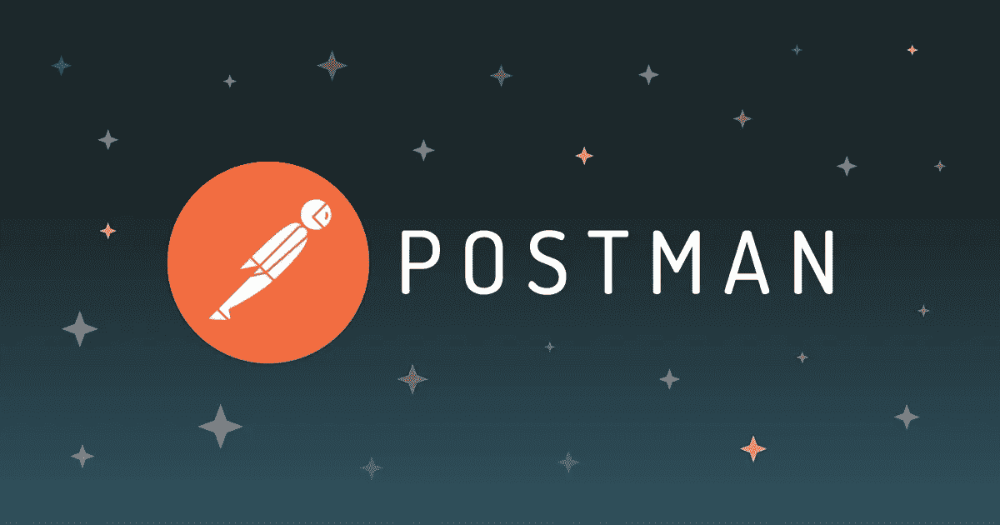

# 使用 Node.js、Express.js 和 MongoDB 构建一个 REST API，并在 Postman 上进行测试

> 原文：<https://javascript.plainenglish.io/rest-api-using-nodejs-express-mongodb-and-postman-a218a5596e59?source=collection_archive---------0----------------------->

## *在本教程中，我们将使用 Node.js 和 MongoDB 数据库构建一个 REST API。但是什么是 API 呢？*


## 什么是 API？

API 是应用程序编程接口的首字母缩写，它是一个软件中介，允许两个应用程序相互通信。每次你使用像脸书这样的应用程序，发送即时消息或在手机上查看天气，你都在使用一个 API。

## 教程的先决条件:

1.  系统中安装的节点
2.  JavaScript 的基础知识
3.  了解任何数据库(关系/非关系)

放心吧！如果你不知道第一行中的所有内容，你将在本教程中学习所有内容。

# 1.项目设置:

在这里，我使用 VS code 作为我的代码编辑器，使用 MongoDB atlas 来存储所有数据。整个项目结构应该如下所示:


在你的系统中创建一个文件夹，命名为“API”。你可以随意命名。在代码编辑器中打开这个文件夹，然后进入终端。

在您的终端类型中

```
“npm init”
```

“npm init”命令将初始化一个项目并创建 **package.json** 文件。

之后，我们需要安装 Express.js 和项目的所有其他依赖项。

再次在终端中键入以下内容:

```
npm install express dotenv mongoose body-parser cors
```

所以 express 会处理我们的服务器，dotenv **允许你从你的源代码**中分离秘密。Mongoose 是 MongoDB 和 Node.js 的**对象数据建模(ODM)库。它管理数据之间的关系，提供模式验证，并用于在代码中的对象和 MongoDB 中这些对象的表示之间进行转换。主体解析器模块解析使用`HTTP POST`请求提交的 JSON、缓冲区、字符串和 URL 编码的数据。CORS 主张跨产地资源共享。它**允许我们放松应用于 API** 的安全性。**

现在我们将安装 nodemon，所以在终端中键入:

```
npm install -g nodemon
```

nodemon 模块是一个开发基于 node.js 的应用程序的模块，当检测到目录中的文件更改时，它会自动重新启动节点应用程序。

安装后，在 package.json 文件的脚本部分添加以下内容:


安装完所有内容后，转到 package.json 文件并验证您的依赖项部分。应该是这样的，版本可能不同。


# 2.服务器设置:

让我们创建我们的第一个服务器。创建一个文件名 *server.js* 并编写以下代码:


创建一个文件名”。并将这段代码放入其中。


这里我们添加了一个端口号和 MongoDB 连接 URL。首先让我告诉你如何获得 MongoDB URL。

# 3.数据库设置:

转到[*MongoDB Atlas*](https://www.mongodb.com/cloud/atlas/lp/try2?utm_source=google&utm_campaign=gs_apac_india_search_core_brand_atlas_desktop&utm_term=mongodb%20atlas&utm_medium=cpc_paid_search&utm_ad=e&utm_ad_campaign_id=12212624347&adgroup=115749713263)*并创建一个集群，这可能需要几分钟来设置。之后，点击**连接**，然后**连接您的应用程序。然后您将获得您的 MongoDB 连接 URL。***

# *4.模型设置:*

*对于数据库中的每个数据，我们需要一个模型，通过它我们可以上传和维护适当的数据。这里我们使用 mongoose 为数据库创建模型。*

**

# *5.路线设置:*

*在主目录中创建一个名为“Routes”的文件夹，创建一个名为“todo.js”的文件，在该文件中将建立所有的路由。现在将这些行添加到 routes 文件夹中的 todo.js 文件中。*

**

*在这个文件中，我们创建了 4 条路线来获取所有的待办事项列表、创建一个待办事项、更新一个特定的待办事项和删除一个待办事项。所有的业务逻辑都将进入控制器部分。*

*每个传入的请求都将被发送到特定的控制器方法。*

# *6.控制器设置:*

*控制器是应用程序的主要部分，所有业务逻辑都将驻留在其中。对于不同的方法，我们需要特定的逻辑块。*

**

*这样，我们就准备好了 API 端点。现在最关键的部分是我们将在哪里测试 API。在此之前，请打开您的终端并运行“npm start”来启动您的应用程序。*

# *7.邮递员:*

*对于 API 测试，我们使用 Postman。可以下载桌面版，也可以在浏览器中使用。*

**

# *8.API 测试:*

## *(一)。插入待办事项:*

*网址:[http://localhost:3000/API/todos/](http://localhost:3000/api/todos/)*

*方法:邮寄*

*确保您的标题设置为:*

**

*现在试着给它添加一个 todo 并点击 SEND。*

**

*我们应该在你的邮递员身上看到这一点:*

**

*这意味着数据插入成功。如果您仍然想从数据库中检查它，您会发现:*

**

## ***(b)待办事项列表:***

*网址:[http://localhost:3000/API/todos/](http://localhost:3000/api/todos/)*

*方法:获取*

*这样，我们就可以得到所有的待办事项列表。*

## *(c)更新具体的待办事项:*

*网址:[http://localhost:3000/API/todos/update/xxy 667 e 48 c 13 e 3 AE 5d 7](http://localhost:3000/api/todos/update/61c3667e48c13e3ae5d711ff)XXXX*

*方法:放*

*您需要在 URL 的末尾传递特定的 id，并在表单数据中传递 todo 的更新值。*

**

## *(d)删除具体的待办事项:*

*网址:[http://localhost:3000/API/todos/delete/61c 369 c 773923 cf 617 beba 60](http://localhost:3000/api/todos/delete/61c369c773923cf617beba60)*

*方法:删除*

*同样，随着更新 API 的工作，我们需要在 URL 的末尾传递特定的 ID，并使方法 delete。*

**

*这就是了。我们已经使用 Node.js、Express.js 和 MongoDB 成功创建了一个 REST API。希望本教程能帮助您理解每个 REST API 背后的基本概念。*

*非常感谢你一直读到最后。如果你需要帮助，可以联系我。*

****Web:****[*https://ankandas . net lify . app*](https://ankandas.netlify.app/)***insta gram:***[](https://www.instagram.com/ankan_designer/)*[*https://www.instagram.com/ankaninperson/*](https://www.instagram.com/ankaninperson/)***GitHub:******

****更多内容请看*[*plain English . io*](http://plainenglish.io/)*。报名参加我们的* [*免费周报*](http://newsletter.plainenglish.io/) *。在我们的* [*社区*](https://discord.gg/GtDtUAvyhW) *获得独家写作机会和建议。****