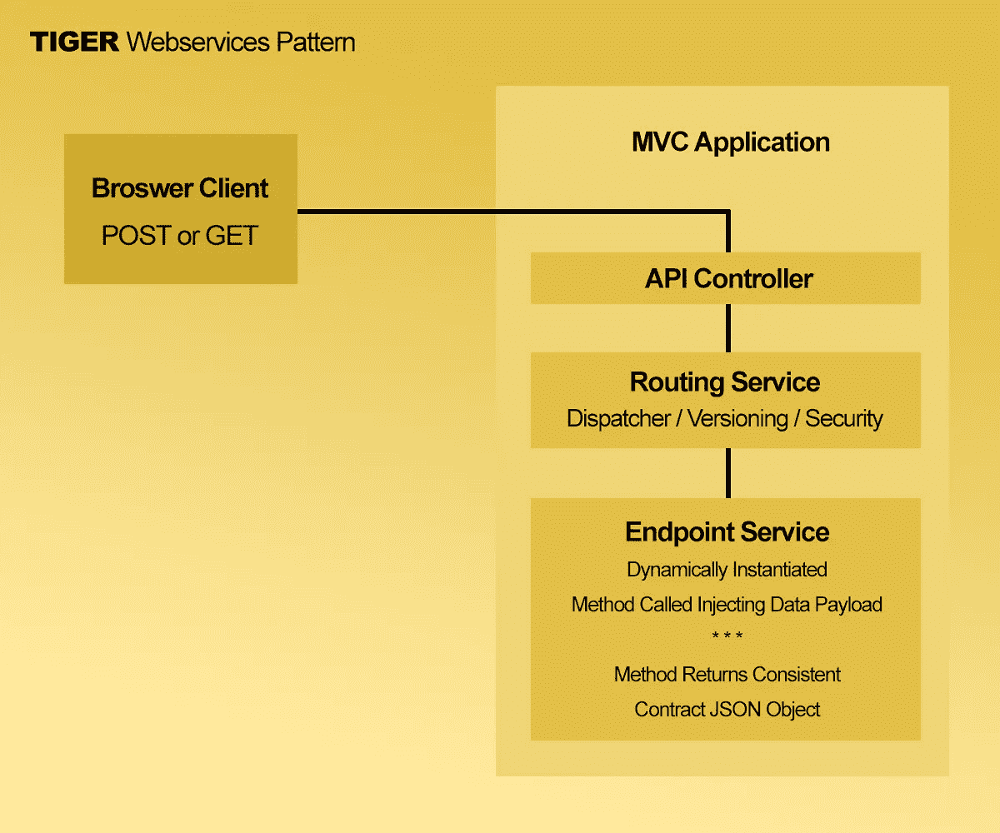

# 休息是垂死挣扎。摆脱它。

> 原文：<https://javascript.plainenglish.io/rest-is-dying-get-rid-of-it-d43e6ef80cbe?source=collection_archive---------0----------------------->

## TIGER:您现在可以使用的更简单的高级 web 服务


Image by Art9858 via DepositPhotos

从 20 世纪 80 年代起，我就一直在编写计算机程序。在那段时间里，我看到并使用了许多来来去去的语言和技术。我看着 web 随着新功能的出现而蓬勃发展，比如浏览器异步交换 XML 数据。今天，我们称这种异步 JavaScript 和 XML T2 数据交换为“AJAX ”,但具有讽刺意味的是，AJAX 通常不再使用 XML。大多数时候，这些数据是以 JSON、YAML、HTML 或其他格式交换的。

1996 年，微软工程师在 IE4 中引入了 iframe 标签。这允许浏览器在不刷新页面的情况下与相同或完全不同的服务器异步交换数据，并且数据可以传递给产生 iframe 对象的父对象。

当时，这个新功能对我来说似乎只不过是一个“框架”功能(我知道，你不知道 HTML 框架是什么；是的我有那么老，谢谢提醒)。然而，我的兄弟在 20 世纪 90 年代中期在商业项目中使用这项技术来做这件事——甚至在“AJAX”这个术语被发明出来之前，就用 XML 进行“AJAX”数据调用。

几年后，微软将在 IE5 中创建`XMLHttpRequest`对象。其他浏览器厂商也会跟进，“AJAX”时代由此诞生。

# **休息是垂死挣扎。摆脱它。**

有时候，标准和技术的发明会因为好的、坏的和丑陋的原因而生根发芽。休息是这些标准之一，体现了所有三个:好，坏，和丑陋。但是每个人都继续使用 REST，因为这是现代客户端(浏览器)实现的。

我对 REST 的主要问题是它的动词:GET、POST、PUT、DELETE 等。，限制太多，响应经常不一致，或者根本没有响应，就像删除一样。是的，你*可以*用一个删除调用发送一个成功响应(意味着一个数据负载),但是这并不是真正的标准。哦，你得到了 200 个回复，这意味着它起作用了。不是。也许是，也许不是。发送 202 或 204 个响应也可能同样神秘。

公平地说，REST 本质上并不是一个数据交换协议，比如像 SOAP。它实际上是一种建筑风格，或者有人会说是“模式”。作为软件开发人员，有时我们明确地遵循风格/模式，有时则不然。

如果可行，标准是好的。但是随着技术的发展，通常“标准”会开始阻碍你，这就是 REST 对网络的影响。

除了对动词的限制，我对 REST 的另一个问题是它的端点。谁会认为拥有 37 个不同的端点是个好主意呢？

REST 也不像 SOAP 对 WSDL 那样实现 API 文档。是的，OpenAPI 规范(以前的 Swagger)试图解决这个问题，但它是另一个 REST 插件。

由于 REST 的这一限制和其他限制，许多软件工程师使用 REST 的小部分和/或借鉴其他工作更好的协议来开发和发展我们自己的 web 服务版本，我也不例外。

# **TIGER:工作更好的更简单的网络服务**

TIGER 是我 12 年前为一个松散的 web 服务标准创造的名字，因为我厌倦了 REST 的局限性和无意义。TIGER 松散地基于一种 [**JSON-RPC**](https://en.wikipedia.org/wiki/JSON-RPC) (JSON 远程过程调用)协议，该协议实际上只是使用 REST 的 POST 和/或 GET 动词通过浏览器客户端发送和接收数据。如果您愿意，GET 用于快速获取数据，但是 POST 几乎专门用于安全地交换数据。

TIGER 利用易于使用的“消息模式”将数据发送和路由到需要的地方。路由元数据包含(混合)在发送给服务器的“消息”中。

因此，TIGER 实际上只需要一个端点。

是的，你可以有一个以上的端点，但你不应该。拥有一个有许多端点的 API 会产生巨大的代码膨胀，就像我们在典型的 RESTful 服务中看到的那样。Zend 甚至创建了一个名为“Apigility”的完整 REST 框架来管理和进一步扩充 API 端点。简直是胡说八道。不是说让事情变得简单吗？

TIGER 真正闪光的地方是在面向服务的 MVC 应用程序的上下文中。与设置多个端点不同，AJAX 数据消息只包含 MVC 的控制器/动作，或者在 SOA(面向服务的架构)的情况下，包含您希望将数据有效负载作为处理目标的服务/方法。嘣！完成了。

如果您愿意，还可以在消息元数据中包含版本属性等内容，以针对特定的服务版本。

TIGER Webservices 的主要目标是:

1.  为 API 创建一个单一且安全的入口点，这样我就不必管理和维护几十个版本化的端点，从而使我的代码膨胀。
2.  通过 API 自动验证、路由和授权请求。
3.  在客户端和服务器端的消息和响应之间创建一个灵活但一致的契约。

TIGER 服务通常是有状态的。但是如果你愿意，他们可以完全没有国籍。你不会受限于某个人对 API 应该如何表现的想法。

在 MVC 环境中运行的 TIGER 必须将每个匿名请求认证为“guest ”,或者出于授权目的的其他认证角色。如果你不能获得你所要求的任何资源，你就进不去。

在这方面，TIGER Webservices 确实依赖于维护某种会话状态的客户端，但是我们已经用各种 RESTful 服务做到了这一点，所以 TIGER 在这方面也没有什么不同。

# **TIGER Webservices 正在运行**

这里的概念非常简单。这就是这种模式的美妙之处:



下面是使用 jQuery 调用的典型 TIGER AJAX 请求:

```
$.ajax({
    type        : 'POST',
    url         : '/api',
    dataType    : 'json',
    data        : { 
                      service   : 'user',
                      method    : 'save',
                      firstname : 'Thundarr',
                      lastname  : 'Barbarian'
                  },
    beforeSend  : beforeSend,
    complete    : complete,
    success     : success,
    error       : error
});
```

*注意，* `*beforeSend*` *，* `*complete*` *，* `*success*` *，* `*error*` *仅仅是代表将处理这些 AJAX 事件的函数的 JavaScript 变量。*

在这个简单的例子中，我们看到我们将 JSON 数据发送到服务器的唯一的`/api`端点。TIGER API 服务希望在消息数据中看到的是“服务”和“方法”属性。然后，它会将整个消息数据对象路由到特定的服务和方法。

您还可以传递“控制器”和“动作”属性，TIGER 会将数据路由到 MVC 中任何控制器的特定动作。

在这个示例调用中，我们联系“user”服务的“save”方法，将用户的“firstname”和“lastname”字段持久化到数据库中。没有比这更简单的了。

# **TIGER API 路由**

每个 API 调用都通过 API 服务进行路由。API 服务实现了一个基本的工厂模式来进行一些完整性检查、验证、授权，然后实例化所请求的控制器或服务。

在 TIGER 平台的例子中，我使用 PHP 的`__construct()`方法将整个消息传递给构造中的服务，并让服务将消息路由到那里的任何方法。

以这种方式处理数据最酷的一点是，当新实例化的服务最终返回时，所有的工作都已经完成，我需要做的就是为响应负载调用服务的`getResponse()`方法，这样我们就完成了。

好吧，这只是让我在工厂流程中省了一步，但这仍然是用 PHP 实现 SOA 的一种巧妙的可扩展方式。但是我跑题了…

# **老虎回应**

TIGER 的美妙之处在于，我每次都返回完全相同的响应对象。那个响应对象总是有我期望的属性。它就像一个接口，一个客户机和服务器之间的契约。在一个响应对象中，我知道我总能找到至少以下属性:

```
{
    result   : 1,  // or 0 on error
    data     : { ... },  // can also be an array
    messages : ['An array of one or more messages, if any.'],
    error    : [ array of form errors, if any ]
}
```

但是你也不局限于一种类型的反应。例如，DataTables 和 Select2 要求我返回不同类型的响应供它们使用。没问题。对于这些类型的数据请求，我有单独的一致响应对象要发回。

# **把所有这些放在一起**

我不想在本文中发布太多的代码，所以如果你想看看 TIGER Webservices 的运行情况，可以看看在 GitHub 上使用这些服务的 TIGER 平台。以下是一些链接:

*   ***一个典型但简单的插件，其中一个 TIGER 服务被调用:***
    [*TIGER/core . admin . cache . js at master WebTigers/TIGER(github.com)*](https://github.com/WebTigers/Tiger/blob/master/application/modules/core/assets/js/core.admin.cache.js)
*   ***TIGER web Service API 服务工厂:***
    [*TIGER/Service Factory . PHP at master WebTigers/TIGER(github.com)*](https://github.com/WebTigers/Tiger/blob/master/application/modules/core/library/Tiger/Api/ServiceFactory.php)

注意，上面的代码是有版权的，因为它是商业产品的一部分，但是模式本身没有版权。随意“借用”这些想法，并写出你自己的版本。TIGER 代码特别公开，因为我想让人们看到 TIGER Webservices 是多么容易使用，以及它们如何在构建 web 服务时使每个人的生活变得更容易。

【无耻产品外挂警告:】如果你有 AWS 账号，还可以免费启动一个[**TIGER Platform**](https://aws.amazon.com/marketplace/pp/prodview-wixkz63qgutes)实例，看看 TIGER Webservices 的运行情况。【结束商业。]

# **老虎发现**

虽然我还没有为 TIGER 实现 OpenAPI 风格的“发现”模式或标准，但是您可以看到，使用 TIGER 的消息模式，只需传入一个元数据属性，告诉 TIGER 返回您想要的任何 API 文档和响应模型类型，就可以使发现变得简单。如果你需要实现一个公共 API，这个问题并不难解决。

# **结论**

随着网络的不断发展，随着新的更好的想法出现，REST 正在，也应该，慢慢消亡。JSON 几乎完全取代了 XML。微服务正成为更加单一的面向服务的架构的一个更受欢迎的变体；诸如此类。是时候超越休息，进入更灵活的状态了。

如果可以的话，我不会使用纯 RESTful 服务，如果没有其他原因，因为代码膨胀；这种膨胀是太多的废话来维持。

有些人可能会认为 TIGER Webservices 太“松散”了，不符合任何“公认的”标准。你说得对，他们没有，而且理由很充分。我不喜欢我见过和用过的标准。他们很烂。所以我不用它们。作为一名应用程序架构师，我自己写。你也可以。你不必因为其他人都使用某个不可靠的过时标准而使用它。

你的用例应该驱动技术，而不是相反。

关键是，仅仅因为某样东西是所谓的“公认的”标准，并不意味着它是完美的，或者它将最适合您的应用程序的用例。经验会告诉你什么最好，什么不好。有些东西不一定是“公认的标准”,只要它被很好地记录，并且为您独特的用例简化了您的代码。

如今，在客户机和服务器之间交换数据有比 REST 更好的模式和协议。查看 TIGER Webservices 以及它们是如何工作的。他们可能会给你一些你自己的想法，这些想法可能会让一两年后的其他工程师编写代码变得更加容易。

____________________

Beau Beauchamp 是一名 web 应用程序架构师，拥有 20 多年在云中开发企业级应用程序的经验；他是[*WebTigers*](https://webtigers.com)*的创始人，也是老虎平台背后的首席开发者。*

*更多内容看* [***说白了. io***](http://plainenglish.io/) ***。*** *报名参加我们的**[***免费每周简讯这里***](http://newsletter.plainenglish.io/) ***。****