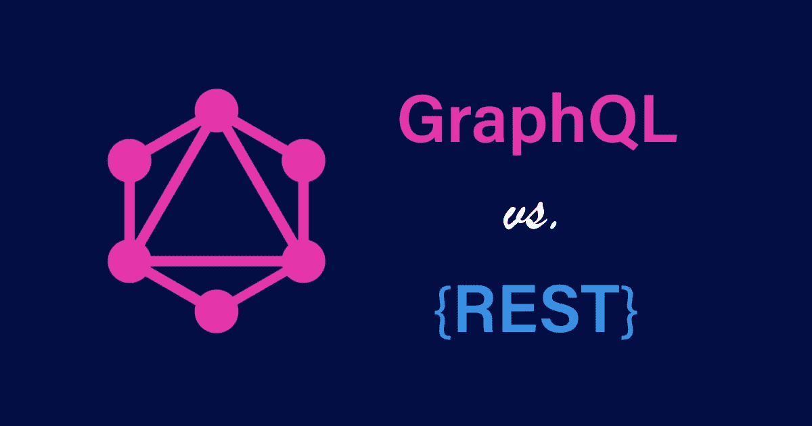

# REST 与 GraphQL

> 原文：<https://javascript.plainenglish.io/rest-vs-graphql-398cdade4566?source=collection_archive---------17----------------------->

## REST 与 graph QL——了解两者的区别以及何时使用。



# 介绍

这只是 GraphQL 和 REST 之间的一个快速比较，以帮助您确定何时使用哪个。我并不建议你使用其中一种，它们各有利弊。相反，我们将在本文中讨论它们，以帮助您为下一个大项目选择最佳方案。

我也让外面的新手保持简单，因为我发现一开始很难理解 GQL，我希望这也能帮助你们。

# GraphQL

GraphQL 近年来非常流行，新手可能不太熟悉它。在我学习 web 开发的第一年，我没有看到也没有接触到与 GQL 有关的东西。

GraphQL 是一种用于 API 的查询语言。它可以为您提供 API 中所有数据的完整且可理解的描述。它为网站的客户端(前端)提供了查询所需数据的能力，并且只能查询这些数据。这是 GQL 非常独特的一点，你不会弄乱从你的 API 返回的数据，你只得到你需要的。

由于它的命名，一个误解是 GQL 与数据库或 SQL 的替代品有关。我可以向你保证不是。

在 2015 年开源之前，它于 2012 年在脸书内部创建。

许多大公司已经将 GQL 纳入其技术体系，例如:


Companies using GraphQL

# GraphQL 的方法

那么 GQL 是如何运作的呢？与传统的 REST 方法不同，所有的东西都被看作是一个图，并且是相互连接的。顾名思义，它是一种图形查询语言。

使用 GQL 的简单查询:

```
query {
  book {
    name
    pages
  }
}
```

这是返回的内容:

```
{
  "book": {
    "name": "GQL for dummies",
    "pages": 451
  }
}
```

你注意到了什么？当您编写查询时，您只是在编写您想要返回的确切的 JSON 对象，当然没有值。

如前所述，你会得到你想要的。

# 休息

REST 是传统的方式，它比 GQL 存在的时间更长。REST 的核心思想是资源。每个资源都由一个 URL 端点定义。四种可用的基本操作是:

*   **获取-** 检索数据
*   **POST-** 发送要存储的数据
*   **上传-** 发送要更新的数据
*   **删除-** 通常用一个 ID 发送删除一些数据

客户端通常会将上述请求之一以及任何所需的数据发送到 URL 端点，然后在那里处理查询或更新数据库。

URL 端点的几个典型示例:

```
(GET)  app.com/api/books       -- All books
(GET)  app.com/api/books/:id   -- Just one book by ID
(POST) app.com/api/books       -- Store new book with the data given
(DELETE) app.com/api/books/:id -- Delete a book by ID
```

你在这里注意到了什么？与 GQL 不同，我们不定义我们想要什么数据。相反，我们在服务器端定义我们想要的数据，并在调用端点时获取返回的数据。

# GraphQL Pros

*   仅使用一个 API 端点获取数据
*   无数据提取过量和不足
*   前端开发人员可以更好地理解可用的数据
*   有现成的验证和类型检查
*   可以和 TypeScript 一起使用(牛逼)
*   环境来测试您的查询和变化
*   出色的自动生成文档
*   可以在开发时建立一致性
*   强类型架构

# 图表一致性

*   服务器无法控制所请求的数据，客户端请求的对象可能包含太多嵌套字段
*   上一次欺诈导致的性能问题
*   对于较小的应用程序来说是多余的
*   与 REST 相比，需要一些时间来设置
*   高学习曲线

# 休息专家

*   使用标准 HTTP 操作
*   与 GQL 相比，设置花费的时间更少
*   大量可供学习的资源
*   不难找到你遇到的任何问题的解决方案(其他人很可能以前也遇到过)
*   成熟且经过几十年的验证
*   可以处理多种数据格式(纯文本、HTML、JSON)
*   [更快返回缓存响应](https://blog.api.rakuten.net/graphql-vs-rest/#:~:text=REST%20APIs%20leverage%20the%20built,have%20not%20reached%20REST's%20level.)

# 休息缺点

*   倾向于获取过多或不足的数据
*   可能会有许多不同的终点
*   对于大型团队来说，自行编写详细的文档几乎是必须的
*   可能需要对一页数据进行多次 API 调用
*   前端开发人员无法控制他们获得的数据，需要与后端团队沟通

# 类似

*   资源可以由 id 指定
*   通过带有 URL 的 HTTP 请求获取
*   两者都只是调用服务器上的函数
*   可以依靠框架让生活变得更简单
*   返回 JSON 数据
*   两者都可以通过查询来区分请求
    - **GQL** ，通过 GET/POST/PUT/DELETE 来区分突变
    - **REST**

# 差异

在 REST 中，资源的形状和大小是在服务器端定义的。在 GQL 中，服务器声明所有可用的数据，客户端可以只查询他们需要的数据。

在 REST 中，通过改变 HTTP 动词(GET、POST、PUT、DELETE)来指定操作。在 GQL 中，您可以在查询和变异之间转换。

```
ComparisonQuery === GET
Mutation === POST, PUT, DELETE
```

在 REST 中，每个对端点的请求都会调用一个路由器处理函数，而在 GQL 中，一个查询可以调用多个解析器来构造需要返回的数据。

这里很好地解释了一个路由处理器。

此处为解析器[的文档。](https://graphql.org/learn/execution/)

# 什么时候应该使用 GraphQL？

GQL 适用于手机、智能手表和物联网设备等设备上的应用程序，这些设备的带宽使用非常重要。但这并不意味着它对 web 应用程序没有好处。

有大量嵌套数据需要在一次调用中获取的应用程序，如博客帖子，所有喜欢该帖子的用户，所有评论，以及对这些评论的所有回复。这就是 GQL 展现潜力的地方。

另一个很好的理由是当你的应用程序需要从多个存储中检索数据时。

如果你希望前端团队在选择需要什么数据和不需要什么数据时有更大的灵活性。

这对于快速原型设计来说非常方便，因为你的用户界面是渐进变化的，例如，需要更多或更少的数据，你不需要经常改变服务器端的代码。

# 何时不使用 GraphQL

如果您正在开发一个小而简单的应用程序，GraphQL 可能是多余的。最终，由于类型、模式、查询、变异和解析器等因素，它只会增加更多的复杂性。

为一个小应用程序维护所有这些东西真的没有意义。

如果你的应用包括很多文件上传，GQL 可能不适合你，因为它不支持。许多实现都留给了开发人员。有一些库可以帮助你，或者你甚至需要一个单独的服务器来处理它。

# 什么时候应该使用 REST？

如果您正在寻找一个经过验证的解决方案，那么您最有可能使用 REST。由于架构风格在很大程度上被视为设计 API 的传统标准，因此您不会有任何问题，因为您可以获得大量的资源。

REST 可以支持各种数据格式，而不需要付出额外的努力。因此，如果您的应用程序需要上传多种类型的数据，REST 可能是您的最佳选择。

如果你选择更好的错误处理，那么 REST 就是适合你的。使用 REST 进行错误处理非常简单，不像 GQL 那样复杂。REST 将返回各种 HTTP 状态(200、201、400、404、500……)。然而，GQL 即使对于错误也返回 200 OK。

如果你的应用程序处理的数据非常简单，并且没有大量的嵌套或者连接。REST 可能是你的朋友，你可能不太担心数据过量或不足。

我觉得 REST 对于初学者来说是更好的选择，当我一年多以前开始学习 web 开发时，我是从 REST 开始的，它教会了我很多。我直到今年早些时候才接触 GQL，我很高兴我在 GQL 之前就学会了它。随着对 web 和传统 REST 架构的了解，我对进入 GQL 更有信心了。

# 何时不使用 REST

正如我以前几次提到的，如果数据是高度连接/嵌套的，并且很有可能出现提取过量和不足，那么您应该选择 GraphQL。

您可能正在与一个由前端和后端开发人员组成的大型团队一起从事一个项目。如果目标是双方都快速进步，休息可能会阻碍你的团队。前端团队可能一直在改变 UI，每次都需要更多或更少的数据。后端团队必须不断更新每条路线返回的数据。

这将导致大量的来回通信，前端团队要求更改返回的数据或不知道哪些数据可供他们使用，后端团队必须进行更改，这意味着他们没有更多时间关注其他服务器端相关任务。

# 结论

最后，你得自己做决定，我的朋友。我们研究了每种方法的优点、缺点、何时使用以及何时不使用。

首先列出你的申请要求、截止日期、团队规模和目标。然后再看一遍这篇文章(也要做更多的研究),做出最佳选择的决定(如果你和你的团队在一起的话)。

GraphQL 不是 REST 的替代品，它只是另一个帮助我们完成工作的工具。

# 进一步阅读

*   GraphQL 文档—[https://graphql.org/](https://graphql.org/)
*   REST API—【https://www.redhat.com/en/topics/api/what-is-a-rest-api 
*   GQL(视频)——【https://youtu.be/eIQh02xuVw4 
*   休息(视频)——[https://www.youtube.com/watch?v=-MTSQjw5DrM](https://www.youtube.com/watch?v=-MTSQjw5DrM)

[](/7-repos-to-help-you-master-front-end-development-9b1b9cd065e3) [## 7 个回购帮助你掌握前端开发

### 帮助您踏上 web 开发之旅的资源列表。

javascript.plainenglish.io](/7-repos-to-help-you-master-front-end-development-9b1b9cd065e3) [](/react-is-still-the-king-7e70f9db8288) [## 反应仍然是王道

### React 会长久保持王者地位吗？

javascript.plainenglish.io](/react-is-still-the-king-7e70f9db8288) [](/what-actually-counts-as-clean-code-cc5db5f74301) [## 什么才算是干净的代码

### 让开发人员定义干净的代码，他们都会告诉你一些不同的东西。

javascript.plainenglish.io](/what-actually-counts-as-clean-code-cc5db5f74301) 

*更多内容请看*[*plain English . io*](http://plainenglish.io/)