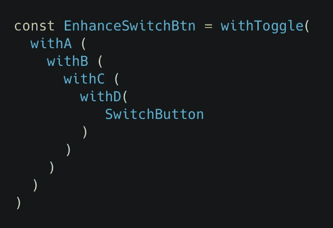

# React 中的重用模式

> 原文：<https://javascript.plainenglish.io/reusability-patterns-in-react-9c8ff2e29ef6?source=collection_archive---------2----------------------->


Avengers gonna hate this !

简短开场白:是的，我们将一起深入探讨可重用性！

长文开篇:有一次，我的 MacBook 被可口可乐淋透了，键盘粘得要命。我几乎不会打字。我真的讨厌一遍又一遍地输入一个函数的不同版本。可悲的是，我的键盘承受不了

我知道一定有更好的方法。

编程就像婴儿；作为父母，我们必须为它的成长、进化和扩展做好准备。没有完美的代码，你知道的！还是那句话，就是那一个宝贝，不同的“版本”。“借尸还魂”似乎总是一个糟糕的解决方案。

谈努力！我们还没讨论维护问题呢。我们不想要难以处理的东西，就像复仇者联盟不想同时对抗 9 个版本的灭霸😊。我们想要易于维护的代码。

> 这篇长文讨论了解决 React 中组件逻辑重复的不同方法。下面的例子和实现有时可能是荒谬和怪异的。但是坚持就好！我们只是利用它来指出上述模式的弱点。因此，这将是更多的学习方面。谢谢！

**目录:**

*   **问题**:了解元件中重复逻辑的问题。
*   **高阶组件**:我们用 HOC 来处理问题，知道缺点。
*   渲染道具:我们使用渲染道具来处理问题、道具和缺点
*   **定制钩子**:我目前解决问题的最佳选择，看看我为什么爱它。
*   **重述！**

# 问题！我们为什么要关心？


React 提供了很好的可重用性，由于组件模型和组合，我们可以很容易地在应用程序/web 的不同位置重用 UI 部件。他们还关心重用组件内部的逻辑。如你所知，并不是每个组件都是愚蠢的，我们可以利用像 State(大部分)这样的强大特性来使我们的组件变得更智能，拥有逻辑。通常，智能组件拥有相似的逻辑，复制。


假设我们有一个开关按钮，一个下拉菜单，另一个显示模态的按钮。它们可以在同一个屏幕上，也可以在不同的屏幕上，让我们假设总是有键盘显示的文本输入。对于每个按钮，我们都有一个切换功能来打开/关闭开关，显示/隐藏下拉菜单和打开/关闭模式。对于伟大的 UX，我们希望每次我们用按钮做动作时，键盘必须关闭，我们需要将我们的引用转发到组件(按钮)以利用它的一些功能。

简而言之，我们的按钮有 3 个主要特征。**切换，键盘关闭，前进参考。**

我们按钮的基本实现:


您会注意到在三个实现中有一个重复的部分。这些按钮并不相同，甚至初始状态来自不同的道具来源，一个来自 `props.value`一个来自`props.visible`，但它们共享相似的逻辑。


这些函数太基本、太简短，不值得关注。

但是想象一下，一旦这些函数变得庞大，计算复杂，版本更长。哪一个需要花很多精力去写，你将如何用新的变化来更新它？你会对其中一个进行修改，然后复制/粘贴到另一个吗？这将是很大的努力跟踪位置，更糟糕的是在复制过程中可能会有一些错误，产生错误的代码。当新开发人员开始这个项目时，他们不是这些代码行的作者，他们不知道在其他地方还有其他版本。说到保养，那是一种痛苦，很明显！

我实现这些简短功能的原因是为了提高意识。短逻辑总有一天会变大。通常我们不会认为一个逻辑会在很多地方出现或者成为一个怪物。一旦发生，不要犹豫重构它，增加可重用性！建议看编程中的[干原理](https://en.wikipedia.org/wiki/Don%27t_repeat_yourself)。现在让我们回来作出反应。

经过多年的发展，React 已经有了许多处理复制逻辑的方法。众所周知的有**高阶组件(HOC)、渲染道具和自定义钩子。**为什么这么多？旧方法有什么问题？为什么采用新方法？让我们来了解一下！

# **高阶分量(HOC)**

Component 把 props 转换成 UI，而 HOC 把一个组件转换成另一个组件，有增强！


话虽如此，HOC 并不修改你的输入组件。HOC 的任务是包装你的输入组件，就像一个容器，而 HOC 不关心数据是如何/为什么被使用的，component 不关心数据来自哪里。这一点很重要，因为它服务于**组合**的目的，意味着容易在组件之间进行&修改。

回到我们的例子，让我们写一个`withToggle` HOC:


`withToggle`处理切换逻辑并提供给`WrappedComponent`。它需要通过`toggle`和`onToggle`向下到达`WrappedComponent.`

> 我在这里不写`onToggle`，让我们只集中讨论 1 道具——`toggle`——因为对两者的解释最终是一样的。

基本上，HOC 只是一个具有组件输出的函数，所以实现它的方式可以是各种各样的方式，这取决于我们在编程中的创造力，我们实际上可以有无数个参数。可以看看 Redux 的 **connect()** ，一个真正有名的 HOC。

每一部分都是故意写出来指出不好的地方，大家一探究竟吧！

## #1 问题:包装器**地狱**

想象一下，有一天，我们的组件变成了多功能的，并且被 10 个 HOC 包裹着，那会有多难看？



我知道，这是个怪物。

谈到可读性，它伤害了我的眼睛，每天阅读这些代码，我可能会很快退休。努力读书意味着努力维持，我们终将承受痛苦。

谈到调试和编写测试，我们需要深入每个 HOC 来查看实现，并将它们想象成节点。为了确切地知道组件的行为，我们需要将这些节点连接在一起，这很复杂，对吗？

所以这是一个非常糟糕的经历，这导致了接下来的问题。

## **#2 问题:固定和重叠道具**

说到固定道具，当`withToggle`在它的实现中使用`props.value`时，我们必须将`initialState`传递给`EnhanceButton`作为`value`道具。如果我们传递任何与值不同的东西，它就会失败，这是固定的

```
const EnhanceButton = withToggle(SwitchButton)<EnhanceButton value={initialState}/>// inside withToggleconst withToggle = (component) => (props) => {
  const [toggle, setToggle] = useState(props.value)
 .....}
```

另一种方法是将 initialState 作为函数参数传递给`withToggle`，我将在下面讨论。但是现在，让我们保留它，因为像`value`这样的固定道具经常发生，更糟糕的是，对于嵌套的 hoc，它是重叠道具的主要原因。


我的 MacBook 用户伙伴们，我打赌你们已经看到这个警告很多次了！

对，复制！

假设我们的嵌套 hoc 正在构建一个包装器地狱，其中一些使用相同的道具`name`，会发生什么？显然，它们会互相替换/重叠，而不会警告我们。我们的电脑很好，它能给我们警告并提供许多选项，但是 React 却不能这样工作。

命名已经成为编程中的一个难题，这使得它变得更加复杂，我们不仅要考虑如何命名它，还要避免重复，就像在重复中解决重复一样有趣 lol:)


没有人喜欢代码中出现意外。😂

## #3 问题:外部引用屏蔽内部引用

如果你注意到，我在我们的`withToggle` HOC 中使用 `React.forwardRef` 。因为 HOC 只是一个容器，一个被社区称赞的常见问题，他们给了组件 ref，但是它不工作！

显然，我们的 WrappedComponent 就像是 HOC 的一个孩子，所以给 ref 的方式是:

```
const btnRef = useRef(null)<EnhanceSwitchBtn ref={btnRef}/>
```

我们的`SwitchButton`没有收到 ref，我们需要将其转发给`SwitchButton`。这实际上不是一个问题，更多的是一个提醒！

## #4 问题:动态数据


想知道为什么我会有这些评论吗？

在`SwitchButton`内部:我们有这样的东西:

```
<Switch value = {toggle}/>
```

由于我们转而使用 HOC，toggle 从`withToggle`传递到`SwitchButton`(部分`toggle = {toggle}`)=`SwitchButton`内的>将变成

```
const SwitchButton = () => {
   return <Switch value = {props.toggle}/>
}//similar to inside ModalButtonconst ModalButton = () => {
   return <...>
      <Modal visible = {props.toggle} /> </...>}
```

同样，`ModalButton`的行为也是如此。

但是如果我想要更透明的东西，比如:

```
const SwitchButton = () => {
   return <Switch value = {props.value}/>
}//similarly inside ModalButtonconst ModalButton = () => {
   return 
       <...>
         <Modal visible = {props.visible} /> </...>}
```

`WrappedComponent` ( `SwitchButton`，`ModalButton`)是作为道具通过`toggle`的，我们不可能同时通过`value`，`visible`，如果像这种情况需要更多的道具，我们的 HOC 就难看了。我们能做到！但是不建议！


一旦我们创建了像 HOC 这样的抽象，它迫使我们定义一个通用规则，我们必须修改我们的组件来接收`props.toggle`。

WrappedComponent 就像是一个地方，我们将在其中放置许多组件。因此，我们不能只服务于一个组成部分而放弃其他部分。显然，HOC 对输出数据不够灵活。

这是下一个**渲染道具**方法解决的原因之一，但是让我们等到下面发现它。

另一方面，HOC 可以很好地处理动态输入数据。假设我们有两个列表组件，以同样的方式利用数据，同样的逻辑，我们想要一个`withData` HOC 来处理它的逻辑，并给我们选择输入数据的权利。我们可以将数据作为参数传递，也可以从 props 中获取数据。

```
const withData = (component, inputData) => (props) => {
   const [data, setData] = useState(inputData)}const EnhanceHourList = withData(ListComponent, DataStore.getHour())- orconst withData = (component, selectData) => (props) => {
   const [data, setData] = useState(selectData(props))}// get different hours by country IDconst EnhanceUSHourList = withData(ListComponent,
 (props) => DataStore.getHour(props.countryID))const EnhanceJapanHourList = withData(ListComponent,
 (props) => DataStore.getHour(props.countryID))
```

很适合定制，不是吗？

总的来说，像任何概念一样，HOC 有优点也有缺点，没有什么是完美的。它在开发过程中为我们提供了很好的服务，所以无论如何，HOC ❤️❤️做得很好。我必须承认，在 React 的最初几年，在其他主流方法出现之前，HOC 是一个很好的解决方案。不浪费你的任何时间，让我们看看下一步如何渲染道具解决我们的情况！

# 渲染道具

Render Prop 是另一种像 HOC 一样重用逻辑的技术。顾名思义，这是一种利用渲染部分的技术。这种技术让你决定如何渲染这个“道具”——无论输出什么数据，意味着它不关心渲染什么，你才是决定者！

> 具有呈现属性的组件采用返回 React 元素并调用它的函数，而不是实现自己的呈现逻辑。

```
<DataProvider render={data => (
  <Text>Hello {data.name}</Text>
)}/>
```

`DataProvider`是一个渲染道具，它为我们提供了`data`，我们可以用它来渲染任何我们想要的东西。


回到我们的例子！在问题#4 中(滚动到上面)，我们讨论了在处理输出数据时，HOC 是如何的不灵活。显然，我们要求随心所欲地使用我们的数据，而不拘泥于任何通用规则。**渲染道具**来帮忙了。

让我们以渲染道具的方式重写我们的`withToggle` HOC:


姑且称之为`ToggleProvider`，因为它为孩子们提供了`toggle`。与参与塑造我们的孩子(渲染部分)的 HOC 不同，Render Prop 不在乎。

```
<ToggleProvider>
  {({toggle, onToggle}) =>
         <SwitchButton 
           onValueChange={onToggle}
           value={toggle}/>
  }
</ToggleProvider><ToggleProvider>
  {({toggle, onToggle}) => 
        <ModalButton 
          onPress={onToggle} 
          visible={toggle}/>
  }
</ToggleProvider>
```

每个`ToggleProvide`的孩子都可以使用`toggle, onToggle` 来渲染任何需要的东西。我们不需要像在第 4 期中那样制定一个通用规则，我们的`SwitchButton`和`ModalButton`现在可以直接使用`value`、`visible`道具，而无需设置另一个`toggle`道具。

`Provide`让我想起 [**上下文 API**](https://reactjs.org/docs/context.html) 。如果您还不知道，它正在解决我们应用程序中的深层更新。我们可以看到**的背景**是基于**渲染道具**设计的。


我们可以清楚地看到这一点，特别是在他们的**消费者**身上。我认为这很有趣，因为知道其他熟悉的技术是如何实现的很酷，对吗？另一个事实是，Render Prop 不仅擅长重用逻辑，还擅长传递数据。

## 作文能力

我们知道 React 非常擅长组合，这有助于将大问题分解成小部分。渲染道具增强了这个能力，为我们提供了更强大的工具。我们一直在谈论重用逻辑，这可以很好地呈现 Prop 句柄，但另一个优势是通过让我们将 UI 部分传递到另一个组件来使我们的组件更加灵活。

为什么这是有益的？让我们看一个例子:


假设我们的应用程序中有 3 种不同风格的标题，在我们的代码中，应该是这样的:

```
const NavHeader = (props) => { return(
  <View>
   <Left/>
   <Title/>
   <Right/>
  </View>)}
```

编写 3 合 1 右组件可能是:

```
const Right = (props) => {
 switch(props.type): {
 case 'icon': return <Icon/>
 case 'text': return <Text/>
 default: return null }}
```

这在一开始可以很好地工作，但是我们不知道将来什么样的更新会影响我们的组件。这种方法似乎过于固定，难以推广。理想情况下，我希望`NavHeader`呈现我告诉它的内容。

```
const NavHeader = (props) => {
return(
  <View>
   {props.renderLeft()}
   <Title/>
   {props.renderRight()}
  </View>
)}<NavHeader
renderLeft={...}
renderRight={<Icon/> or <Text/> or null}
/>
```

通过从**渲染道具**中学习这种方法，我们对未来的变化更加开放，并且能够避免编写类似上面`Right`的复杂组件。

## 深传球道具


假设我们有这个`ProfileScreen`

`ProfileScreen`包含关于我自己的不同信息。

它可能有不同的内容，如`Header`、`Body`、`Footer`。但是在这个例子中，我们只关注名为`ProfileBody`的`Body`

在`ProfileBody`里面，我们有我的头像，我的名字和我的身体状态。`BodyStats`描述一下我的身体状况。

`BodyStats`将接收我的`user`数据，并使用它来渲染布局。

好了，完成了！现在让我们做一些代码。

```
const ProfileScreen = (props) => {
 return <View>
         ...
         <ProfileBody user={props.user}/>
         ...
      </View>
}const ProfileBody = (props) => {
 return <View>
         ...
         <BodyStats user={props.user}/>
         ...
      </View>
}const BodyStats = (props) => {
 return ...
}
```

通常，我们有这样的结构。实现显示了**支柱钻孔**问题，我们通过许多层将`user`数据向下传递到`BodyStats`。

个人资料屏幕—>个人资料正文—→正文统计

为了处理 **prop drilling** ，我们可以利用**上下文 API** 或者像 **Redux** 这样的状态管理来访问`user`到任何我们想要的地方，而不用深入传递它。但是让我们把它用于复杂的情况，假设这只是为了渲染身体状态，让我们用一种简单的方法通过使用**渲染道具。**

```
const ProfileScreen = (props) => {
 return <View>
         ...
         <ProfileBody bodyStats={<BodyStats user={props.user}/>}/>
         ...
      </View>
}const ProfileBody = (props) => {
 return <View>
         ...
         {props.bodyStats()}
         ...
      </View>
}
```

通过这样做，我们不再需要将`user`传递给子组件。正如我们所做的，很明显**渲染道具**是一个很棒的合成和传递道具的技术。作文是创造力的主导，让我们在编程中进一步拓展能力，正如你所看到的，无论是提升还是传承都相当容易，并且非常善于适应变化！而且在我看来，**渲染道具**在**定制方面能力最好。**

显然，选择正确的结构取决于我们的需求和行为。例如，假设我们为 body stats 添加了编辑功能，我们只希望对`BodyStats`组件进行更新，而不需要计算/重新渲染`ProfileBody & ProfileScreen`的布局树来提高性能(可能是因为重新渲染过程成本很高)。这是另一个需要解决的问题，在我看来，使用**渲染道具**并不理想。好吧，让我们把这个问题抛在脑后，回到我们的例子。我们现在能讨论一下缺点吗？

## **#1 问题:锁定数据**

Render Prop 的最大问题是传递的数据被锁定在渲染中。

```
const ParentComp = () => {// outside fieldreturn (
 <ToggleProvider>
  {({toggle, onToggle}) => {
  //...usage scopereturn <SwitchButton onValueChange={onToggle} value={toggle}/> }}
 </ToggleProvider> // or custom prop <ToggleProvider renderContent={({toggle, onToggle}) => {
    //...usage scope return <SwitchButton onValueChange={onToggle} value={toggle}/> }}/>)} 
```

即使你使用子对象或任何自定义道具(如`renderContent`，或`anyPropYouLike`，传递的数据`toggle, onToggle` 也可以在`usage scope`和内部组件实现中使用。这限制了我们使用`outside field`的数据

需求是真实的，有时我们想要使用数据作为状态或基于它计算一些东西。话虽如此，我们仍然可以设法做到这一点，而不需要像将它传递给回调或任何你觉得它工作的方式这样的修复；这是你自己的创造力，总的来说，这可能很难做到。

## #2 问题:嵌套渲染属性——包装器地狱

我们已经看到嵌套的 HOC 发生了包装地狱。我们在渲染道具上也有类似的问题。

```
<ToggleProvider>
  {({toggle, onToggle}) => { return <DataProvider> {({data}) => {

          return <AccessProvider> {({access}) => {
            return <OurComponent/> }}   
          </AccessProvider> }}   
    </DataProvider> }}
 </ToggleProvider>
```

假设我们有 3 个渲染道具嵌套，可读性肯定很差。我喜欢 **JSX** 和 **React Native** 的一点是，它们提供了一种声明式的方式来编写布局。我喜欢我们写得干净利落。如果你曾经使用**样式表**来避免**内联样式**，或者将大 UI 分解成小容器，你知道我在说什么。除了技术上的好处之外，我们的眼睛也得到了休息。

这让我想起了`then`的用法在编程中的`asynchronous`。在`await`和异步`keyword`出现之前。这种回调我们见得多了。下面让我们看看如何用一个**定制钩子**来处理这个问题。

## #3 问题:中断渲染优化


在使用 React 的过程中，浪费的渲染经常发生。说到优化，我们要么让它跑得更快，要么少做点工作。关于 React，我们通常做的工作较少，对于浪费的渲染，主要是跳过渲染。如果你想了解更多关于它是如何发生的以及解决方法，你可以阅读我的[文章](/react-native-why-props-references-break-optimizations-79c463ca0723)。

简言之，React 提供了 3 种优化方式:`shouldComponentUpdate`生命周期、`React.memo`和`PureComponent`。虽然它们是不同的技术，但是它们有相同的基本原理，使用`shallow compare`。所以对象引用在这里起着重要的作用。

```
<ToggleProvider>
  {({toggle, onToggle}) => {
  return <SwitchButton onValueChange={onToggle} value={toggle}/> }}
</ToggleProvider
```

根据 **Javascript** 的性质，使用**渲染道具**的任何一种方式在渲染过程中每次出现差异都会产生新的引用，从而破坏我们的渲染优化。

我们并不总是需要优化我们的组件，但请注意，一旦你不得不这样做，并处理小心这些对象引用，因为**过早优化**是一个魔鬼的根源。

尽管有缺点，我相信**渲染道具**在 React world 中还是有它自己的价值的，直到现在我都认为它是最适合定制的！—阅读下文，我们将讨论它，在此之前，先和我一起浏览一下**自定义挂钩**部分。

# 自定义挂钩

钩子是 2018 年公布的，如果没记错的话。这是 React 的年度热门影片。显然，这种热情是由于它如何帮助编码反应得更愉快和满意。除了 React team 提供的默认钩子之外，它们还允许我们创建自己的钩子，定制钩子，这成为了它最强的特性。就像创造一个市场，让人们在上面生产和销售他们的产品，非常社区驱动！[usehooks.com](https://usehooks.com)是一个很好的定制钩子的网站，看看吧！

给我看看代码！


`useToggle`是我们的自定义钩子，它为我们处理初始化&更新 toggle 的逻辑，按照惯例，我们应该以`use`开头来命名它。而且很容易使用:

```
const Screen = () => {
  const [toggle, onToggle] = useToggle(false) return(
   ....
   <SwitchButton onValueChange={onToggle} value={toggle}/>
   ....
  )
}
```

自定义钩子可以返回一些值或者只是一个纯函数，这取决于我们如何实现它，并且严格遵循任何返回结构，我们可以返回任何我们喜欢的结构。

# 不再有包装地狱


我们已经在 HOC 和 Render Prop 中看到了包装器地狱，当它们处理嵌套问题时。自定义钩子不是这样工作的，因为它不包装任何东西，它就像一个无渲染组件，用`return null`进行渲染。就像我们只需要内容，我们不关心其他的。没错。买东西不带盒子:)

而自定义钩子的用法看起来就像写一行代码，更像是多行连续的代码，而不是互相包装。

```
const [toggle, onToggle] = useToggle(false)
const data = useFetchData(params)
useClickAway()
useHandleKeyboard()
```

# 灵活的数据使用

一个使定制钩子比其他钩子占优势的优势是灵活性。正如我们从上面的技术中了解到的，它们有时在数据使用上过于固定，Hook 则不然！hook 的数据流极其灵活。

## **1/无固定道具**:

还记得我们的`withToggle` HOC 和第 2 期吗？它使用 props.value 作为初始状态。

```
const EnhanceButton = withToggle(SwitchButton)<EnhanceButton value={initialState}/>// inside withToggleconst withToggle = (component) => (props) => {
  const [toggle, setToggle] = useState(props.value)
 .....}
```

简单提醒你一下，在`withToggle`的实现中，它使用`props.value`作为初始状态。所以当编写增强按钮的 JSX 时，我们必须将 initialState 作为`value` prop 传递，如果我们传递任何与`value`不同的东西，它都会失败，这是固定的。

```
const Screen = () => {
  const [toggle, onToggle] = useToggle(false)return(
   ....
   <SwitchButton onValueChange={onToggle} value={toggle}/>
   ....
  )
}
```

通过使用自定义钩子，当初始状态作为函数 arg 传递时，我们可以更开放地定义初始状态，我们不再需要将初始状态作为 prop 传递给组件。

## 2/无重叠道具:

上面我们也讲过**固定道具**和**嵌套的**如何导致**重叠道具**。因为**包装器地狱**不会发生在自定义钩子中，而且**固定道具** - >也不会发生，我们不必再注意这一点了！

## **3/对数据使用范围没有限制**

渲染道具所发生的是我们在**问题 1:锁定数据中讨论过的传递道具的使用范围。**

```
const [toggle, onToggle] = useToggle(false)
const data = useFetchData(params)
useClickAway()
useHandleKeyboard()
```

看看这些自定义钩子，`useFetchData`和`useToggle`是为我们提供渲染或计算数据的钩子，具体取决于。它将数据从它的实现中暴露出来并交给我们，因此我们可以在任何需要的地方自由使用数据，而不再像 **render Prop 那样被限制在 Render 中。**

## 4/没有输出数据的一般规则:

我们上面提到的 HOC 的第 4 期展示了我们如何需要一个通用的规则来将数据向下传递给`WrappedComponent`，因为我们的 HOC 将包装许多种类的组件。我还展示了 Render Prop 如何解决这个问题

如上所述，hook 将数据暴露在实现之外的方式赋予了将数据作为道具传递给子组件的自由。我们可以把数据传递给任何我们想要的道具，只要它是合适的。

```
const [toggle, onToggle] = useToggle(false)<SwitchButton 
 onValueChange={onToggle}
 value={toggle}/><ModalButton 
 onPress={onToggle} 
 visible={toggle}/>
```

# 定制能力

Component 是一个创造性的游乐场，我们利用 React 概念作为素材，custom hook 就是其中之一。

自定义钩子的用法并不总是一样的，有时我们需要添加逻辑来看是否需要使用它，就像一个条件。作为钩子的规则，我们不能在条件、循环或嵌套函数中调用钩子，以确保每次组件渲染时，钩子都以****相同的顺序**被调用。为什么这很重要？**

**由于 React Hook 的内部实现，顺序很重要，就像我在我的博文中提到的那样。有一个数组存储钩子的名字，这个数组用来做一些事情，比如更新。因此，制定了一些规则来确保数组的顺序在渲染时保持不变。**

**条件、循环或嵌套函数会导致不同的顺序，所以它们会阻止这种情况。**

```
const Component = (props) => { const [toggle, onToggle] = useToggle(false)
 const data = useFetchData(params) if(props.enableKeyboard){
  useKeyboardHandler()
 }
}
```

**说我们有一个使用 3 个钩子的组件`useToggle`、`useFetchData`和`useKeyboardHandler`。`useKeyboardHandler`是可选的，我们不需要键盘处理程序，以防禁用键盘，这是浪费，我们通过`enableKeyboard`道具来决定。这违反了钩子规则。因为在`enableKeyboard` = `true`的情况下，顺序数组将是['useToggle '，' useFetchData '，' useKeyboardHandler']，而`enableKeyboard` = `false`形成['useToggle '，' useFetchData '，]。顺序不同，就像我说的，顺序必须始终相同。**

**这条规则使得定制钩子在定制时不如**渲染道具**灵活。**

**您可以无条件地将`useKeyboardHandler`留在那里，显然，如果键盘被禁用，它将什么也不会做(不像键盘暂时关闭，就像从未出现过键盘)。奏效了。**

**无论哪种方式，我们都可以将其转换为无渲染组件，并将其用作 JSX 附带条件:**

```
// custom hook
const useKeyboardHandler = () => {
  useEffect(()=>{
   // listen some keyboard events return () => {
   // clear out listeners }
  }, [])
}// render less component
const KeyboardHandler = () => {  
 useKeyboardHandler()

 return null}// in JSX {props.enableKeyboard && <KeyboardHandler/>
```

**具体来说，`useKeyboardHandler`是一个自定义钩子，表示我们监听键盘事件(打开、关闭)并做一些逻辑处理，在卸载时，我们想清除监听程序。我们编写了一个无渲染组件，这个组件不输出/渲染 UI 布局，它只调用我们的自定义钩子。这样就免去了调用`useKeyboardHandler`时对条件的需要。最后，使用条件来决定是否渲染`KeyboardHandler`组件。**

**显然，`useKeyboardHandler`是一个没有提供任何数据的钩子，所以我们可以使用无渲染组件来处理它。但是在像`useFetchData`这样的钩子的情况下，它提供数据，我们将不得不使用渲染道具来解决它:**

```
// render less component
const FetchData = (props) => {  
 const data = useFetchData()

 return props.children({data})}// in JSX
{props.enableFetchData && 
    <FetchData> 
     {({data}) => do some thing }
    </FetchData>
}
```

**好吧。我知道这是非常罕见的情况下处理条件挂钩，即使在我的实际工作中，我并没有看到它很多。但是如果它发生了，我很高兴知道如何解决它。不确定是否还有其他方法可以解决这个问题，但这是我学到的两种方法。**

# **概述**

**很高兴你和我一起结束了这篇长文章，我相信我们通过这次讨论学到了很多。**

**每种技术都有其优点和缺点，这取决于我们的选择。我没有偏见，但定制挂钩是我目前最喜欢的。还有更多要讨论的，比如讨论可测试性，编写测试，自定义钩子似乎不像 as HOC，Render Prop 那么简单。那是另一次了！下一篇文章见。**