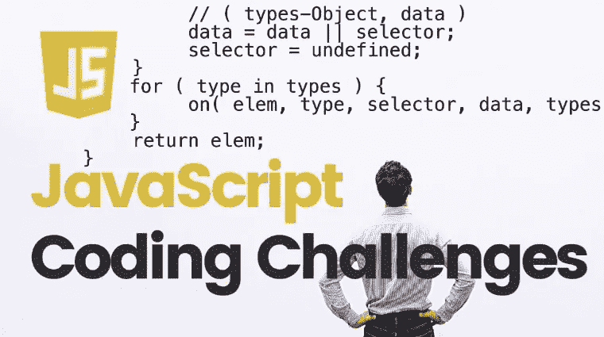
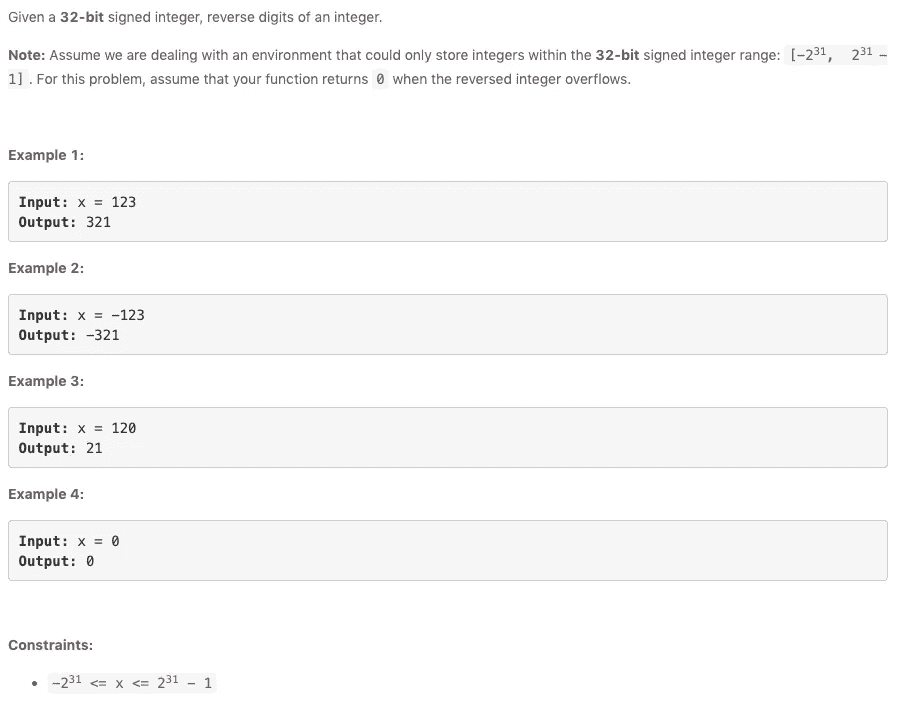
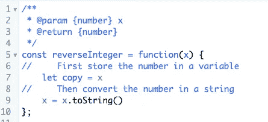
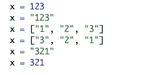
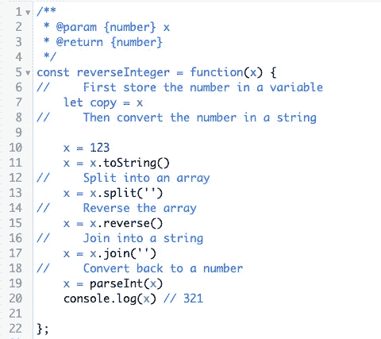
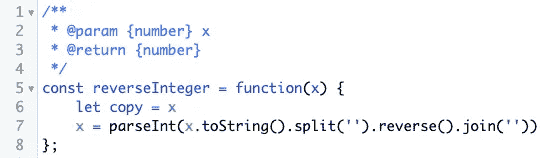
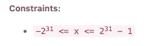
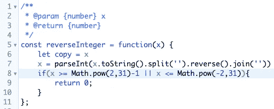
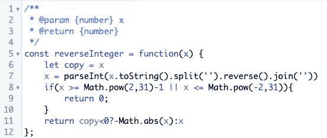

# 如何在 JavaScript 中反转整数

> 原文：<https://javascript.plainenglish.io/reverse-integer-in-javascript-8ec48721ccfb?source=collection_archive---------5----------------------->

大多数想成为软件工程师的人可能会面临技术面试和编码挑战。其中一个常见的问题是逆整数。

我见过很多解决这个问题的不同方法，尤其是当您需要考虑运行时和内存分配时。但是，让我们看看这个问题，并找到一个很好的简单的方法来解决它。

在这个问题中，我们将收到一个输入数字，我们需要输出反过来的数字。**示例 1** 展示了证明标题“反向整数”的完美输入。但是我们还会有，**例 2** ，如果我们采用同样的条件，我们会有 321，那是错误的。同样的情况也会发生在**示例 3** 中，其中答案将是 021。

我的方法包括首先将数字存储在一个变量中，这样我们可以稍后检查数字是否满足约束的标准。然后我们将数字转换成字符串类型。

现在值是一个字符串，我们可以更好地操作它的值。但是让我们把它变得更简单。我们可以把字符串变成一个数组，这样我们就可以循环遍历它的值，并按照我们想要的任何顺序放置它，得到如下结果。

要做到这一点，我们可以使用一些 JS 原生来执行这些动作，这将是 **split()** ，它返回一个数组。然后 **reverse()** ，顾名思义就是恢复一个数组，然后 **join()** 将数组中的所有项合并成一个，我们就可以得到字符串了。最后，我们使用 **parseInt()** 将字符串转换回数字。

让我们重构以获得一个漂亮干净的外观。

好多了！

我们需要考虑约束条件以获得正确的结果。

*“对于这个问题，假设你的函数在反向整数溢出时返回* `*0*` *”。*让我们将这些约束写入代码:

最后要做的是返回正数或负数。对于负数，我们需要加上“-”号来反映。对于这些情况，如果和否则条件，我喜欢使用三元运算符。

这里有一个好的，干净的，直截了当的解决方案。

非常感谢您的阅读！如果你有不同的方法来解决这个问题，请留言。此外，我将发布更多关于解决这些挑战的文章。