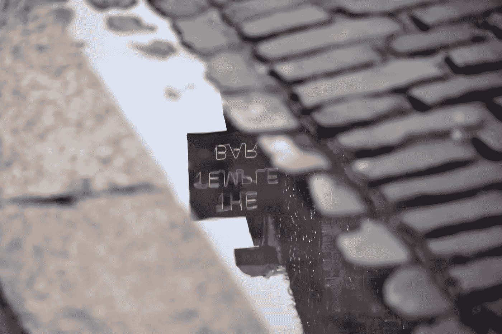
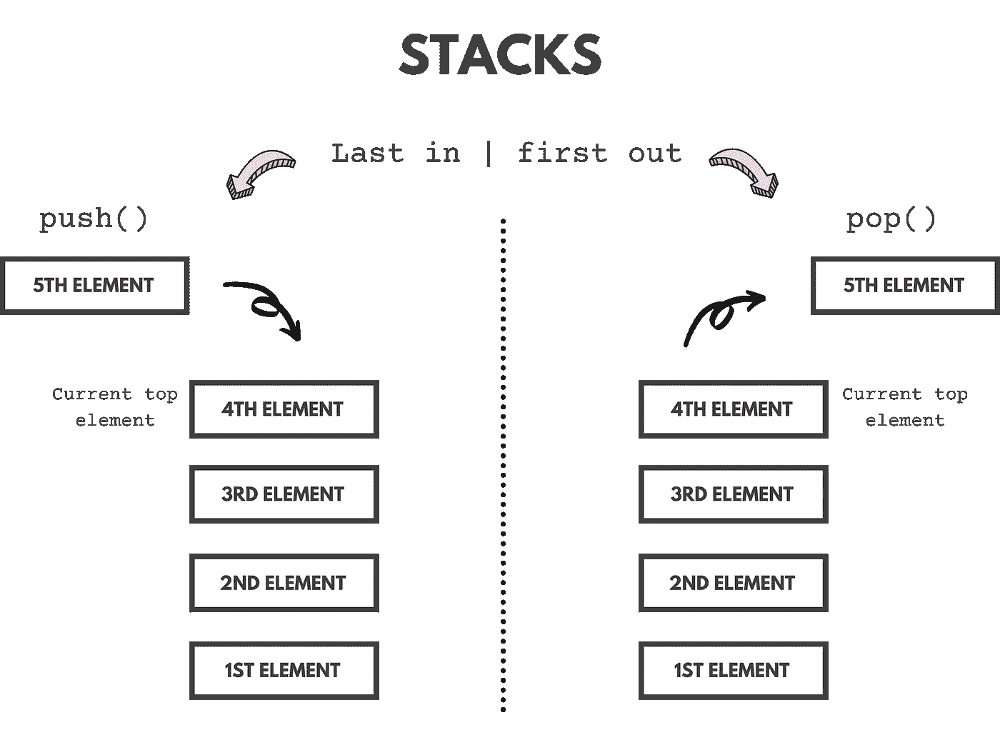
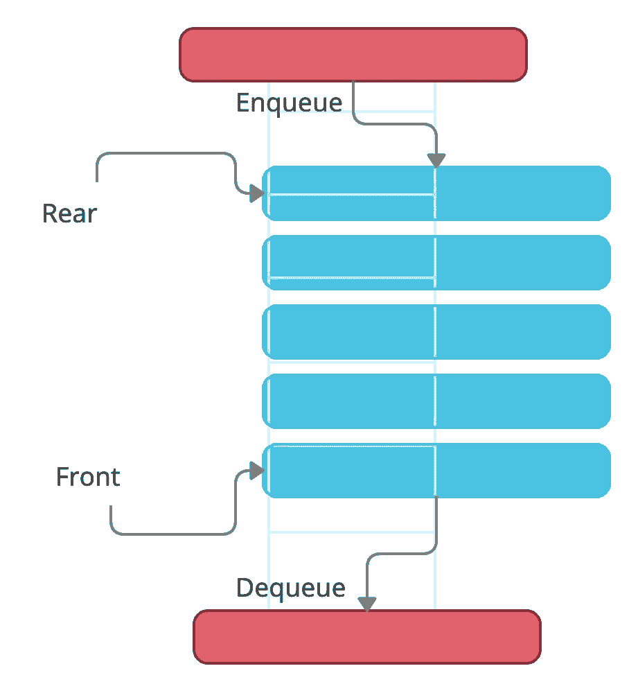
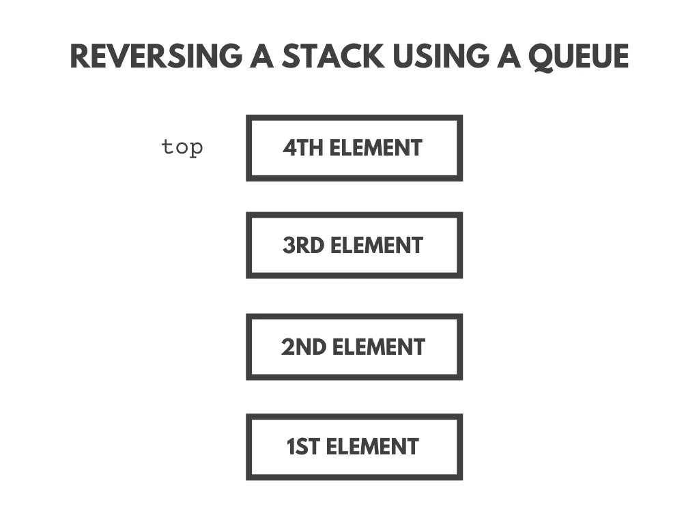
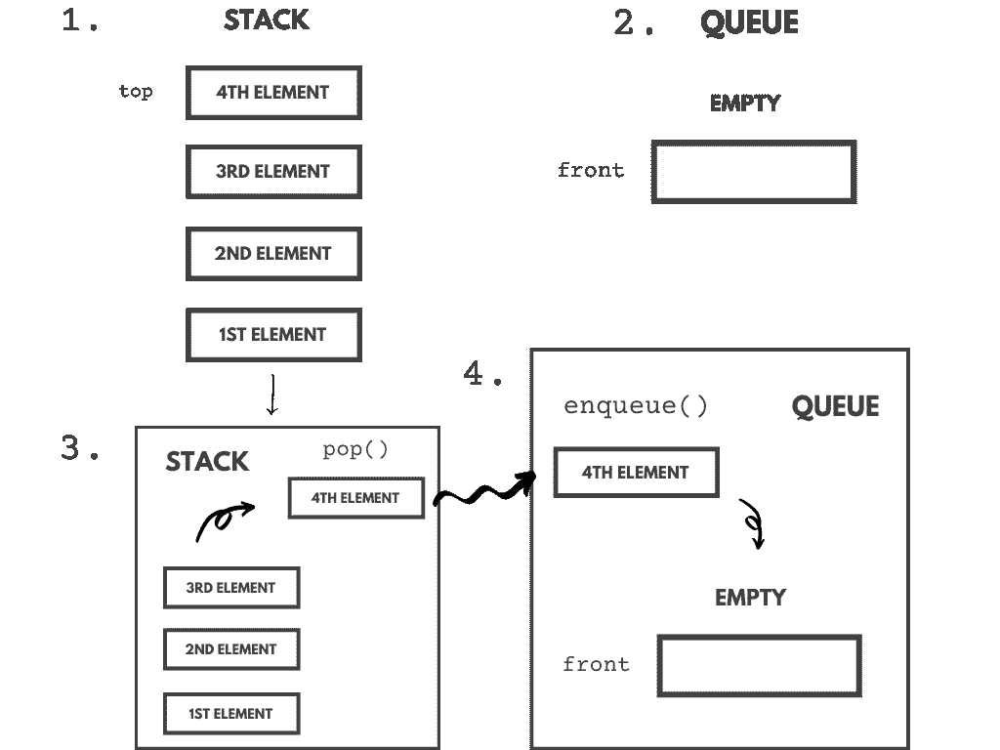
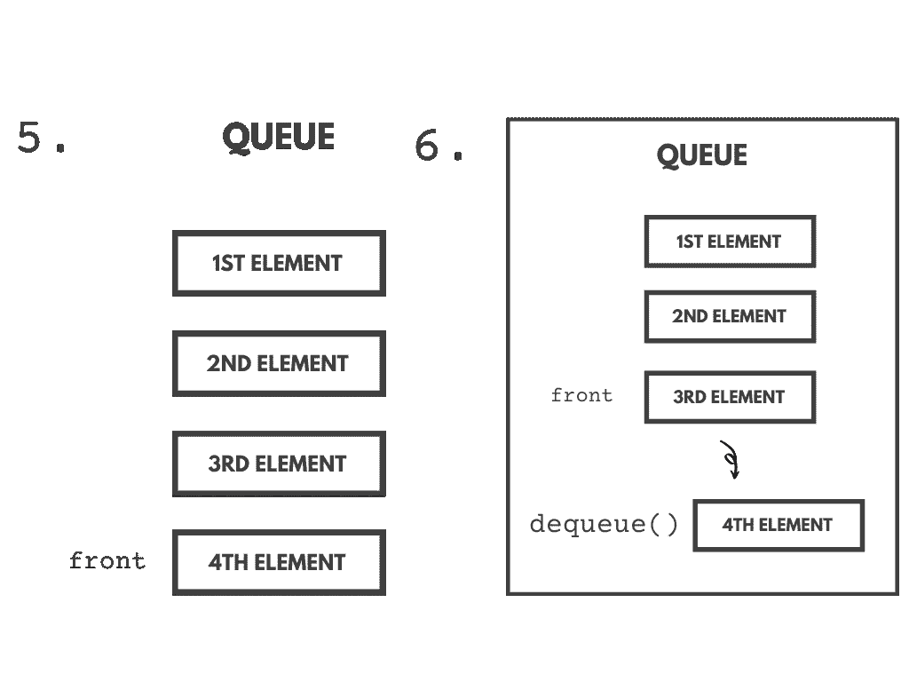
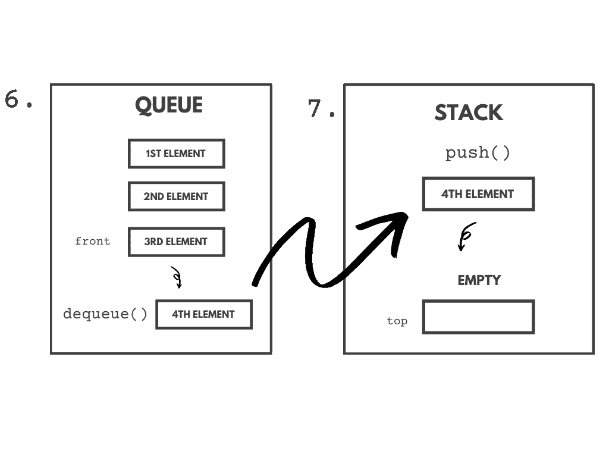
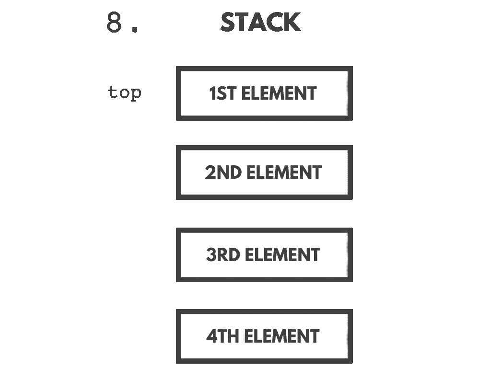
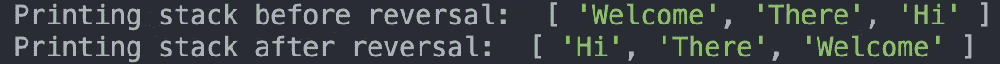

# 在 JavaScript 中使用队列反转堆栈

> 原文：<https://javascript.plainenglish.io/reversing-a-stack-using-a-queue-in-javascript-2fb5075fda97?source=collection_archive---------5----------------------->



Photo by [Pierre Binet](https://unsplash.com/@prrbnt?utm_source=unsplash&utm_medium=referral&utm_content=creditCopyText) on [Unsplash](https://unsplash.com/s/photos/reverse?utm_source=unsplash&utm_medium=referral&utm_content=creditCopyText)

在本文中，我们将学习如何使用 JavaScript 中的队列来反转堆栈。首先，我们需要理解什么是栈和队列。

> 注意:如果您已经了解堆栈和队列，您可以跳过本文的“什么是堆栈”和“什么是队列”部分，阅读“反转堆栈概述”部分。

# 什么是堆栈？

堆栈是一种线性数据结构，它遵循操作执行的特定顺序。顺序是*后进先出*(后进先出)。



A simple visualization of a stack

栈使用`push()`和`pop()`分别用于*添加*和*删除*元素。一个栈可以有任意多的元素，但是添加和移除元素的方式仍然是 LIFO。不能对堆栈底部/之间的元素进行操作。

## 实现堆栈

为了实现堆栈，我们将使用基于类的方法。堆栈中将使用以下方法。

1.  `push()` —将元素添加到堆栈中。
2.  `pop()` —移除并返回栈顶元素。
3.  `isEmpty()` —根据堆栈是否为空返回真或假。

## 让我们为栈写代码吧！

首先，让我们用一个构造函数创建一个类`Stack`，该构造函数初始化一个名为 elements 的数组，该数组将存储元素。

```
class Stack { 
    constructor(){  
        this.elements = []; 
    }
}
```

现在，让我们添加所有的方法。

## 推送方法:

```
push(element){ 
    this.elements.push(element);
}
```

## pop 方法:

```
pop(){ 
    if(this.isEmpty()) return "Underflow situation"; 
    else return this.elements.pop();
}
```

## isEmpty 方法:

```
isEmpty(){
    return this.elements.length == 0;
}
```

# 什么是队列？

队列是一种线性数据结构，它遵循访问元素的顺序。它非常类似于堆栈，但唯一的区别是队列两端都是开放的。一端用于*添加*元件，另一端用于*移除*元件。添加和删除元素的技术术语分别叫做 ***入队*** 和 ***出列，*** 。



A simple illustration of the queue data structure.

队列令人兴奋的部分是我们不能对队列中的每个元素进行操作。只有队列的前端和后端可以被访问或操作。

## 实现队列

为了实现队列，我们将使用基于类的方法。队列中将使用以下方法。

1.  `enqueue()` —将元素添加到队列中。
2.  `dequeue()` —删除并返回队列中输入的第一个项目。
3.  `isEmpty()` —根据队列是否为空返回真或假。

## 让我们为队列编写代码吧！

首先，让我们创建一个带有构造函数的类`Queue`，该构造函数初始化一个名为 elements 的数组，该数组将存储元素。

```
class Queue { 
    constructor(){  
        this.elements = []; 
    }
}
```

现在，让我们添加所有的方法。

## 入队方法:

```
enqueue(element){ 
    this.elements.push(element) 
}
```

## 出队方法:

```
dequeue() {
    if(!this.isEmpty()) {
          return this.elements.shift();
    } else {
          return 'Underflow situation';
    }
}
```

## isEmpty 方法:

```
isEmpty() {
    return this.elements.length == 0;
}
```

# 反转堆栈概述

先说栈的反转！

首先，栈的元素被弹出并放入队列。接下来，队列的元素逐个出队，并被推送到堆栈上。因为堆栈遵循后进先出(LIFO)，队列遵循先进先出(FIFO)，所以堆栈的顶部元素出现在队列的前面。当我们将队列出队时，前面的元素被推到堆栈上，因此创建了一个反向堆栈。

## 可视化堆栈的反转

我们举个例子。我们用堆栈`[1st Element (0), 2nd Element (1), 3rd Element (2), 4th Element (3)]`调用函数`reverse()`(负责反转的函数)



以下是反转堆栈的步骤:

1.  初始化一个空队列。
2.  从堆栈中弹出每个元素，并将其放入队列中。
3.  将每个元素从队列中出队，并将其推送到堆栈上。

让我们将这些步骤应用于上面的堆栈，并创建反转过程的简单可视化。



在上面的例子中，当堆栈弹出时，最顶端的元素(`1st element`)被放入队列。这个过程一直进行到堆栈为空。当栈为空时，队列包含栈的所有元素(队列中的元素:`[4th element (0), 3rd element (1), 2nd element (2), 1st element (3)]`)。接下来，我们开始从队列中取出元素，并将它们放入堆栈。第一个出列的元素:`4th element`。这种情况持续下去，堆叠被反转(`[4th element (0), 3rd element (1), 2nd element (2), 1st element (3)]`)

# 堆栈反转的代码。

首先，让我们创建一个带有参数`stack`的函数

```
function reverse(stack){}
```

逆转需要的三个步骤是:

1.  初始化一个空队列。
2.  从堆栈中弹出每个元素，并将其放入队列中。
3.  将每个元素从队列中出队，并将其推送到堆栈上。

首先，让我们创建一个空队列。

```
function reverse(stack){ 
    const queue = new Queue(); 
}
```

因为我们现在必须从堆栈中弹出每个元素，所以我们需要循环直到堆栈为空。因此，代码如下:

```
function reverse(stack){ 
    const queue = new Queue(); //Creating a new queue
    while(!stack.isEmpty()){ // Looping until the stack is empty.
       queue.enqueue(stack.pop()); //Enqueue the popped stack element.
    }
}
```

我们已经介绍了两个步骤，最后一步，我们必须让每个元素从队列中出列，并将这些元素推到堆栈上。因此，代码如下:

```
function reverse(stack){ 
    const queue = new Queue(); //Creating a new queue
    while(!stack.isEmpty()){ // Looping until the stack is empty.
       queue.enqueue(stack.pop()); //Enqueue the popped stack element.
    } 

    while(!queue.isEmpty()){  //Looping until the queue is empty.
       stack.push(queue.dequeue()); //Pushed the dequeued queue element.
    }
}
```

# 测试反向功能

就是这个！我们已经使用队列成功地反转了堆栈！现在，让我们测试一个样本堆栈的反转:`[‘Welcome’, ‘There’, ‘Hi’]`

> 注意:在上面的堆栈中，`*‘welcome’*`的索引为 0。

为了测试这个函数，我在`Stack`类中创建了一个名为`print()`的新方法，它返回堆栈中的所有元素。`print`功能的代码:

```
print(){
   return this.elements; 
}
```

反转和测试的代码:

```
function reverse(stack){ 
    const queue = new Queue();
    while(!stack.isEmpty()){
       queue.enqueue(stack.pop());
    } 

    while(!queue.isEmpty()){
       stack.push(queue.dequeue());
    }
}//Creates a new stack.
const stack = new Stack(); //Pushes 3 strings onto the stack
stack.push('Welcome');
stack.push('There');
stack.push('Hi'); //Prints the stack before the reversal.
console.log('Printing stack before reversal: ', stack.print());//Reverses the stack.
reverse(stack);//Prints the stack after the reversal.
console.log('Printing stack after reversal: ', stack.print());
```

当执行上述代码时，我们得到的输出是:



The output of the above code.

# 最终代码

知识库链接:[https://github.com/Megh-Agarwal/stack-reversal-using-queue](https://github.com/Megh-Agarwal/stack-reversal-using-queue)

# 结论

感谢您阅读这篇文章。希望你觉得有用。如果有，一定要留下评论让我知道。

*更多内容请看*[***plain English . io***](https://plainenglish.io/)