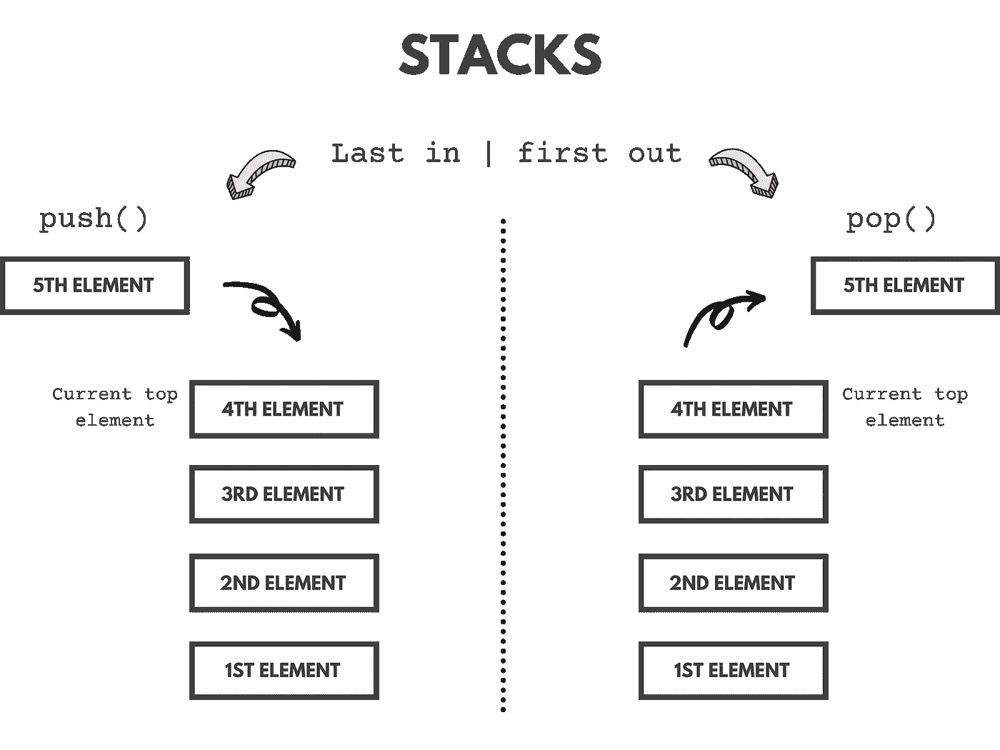
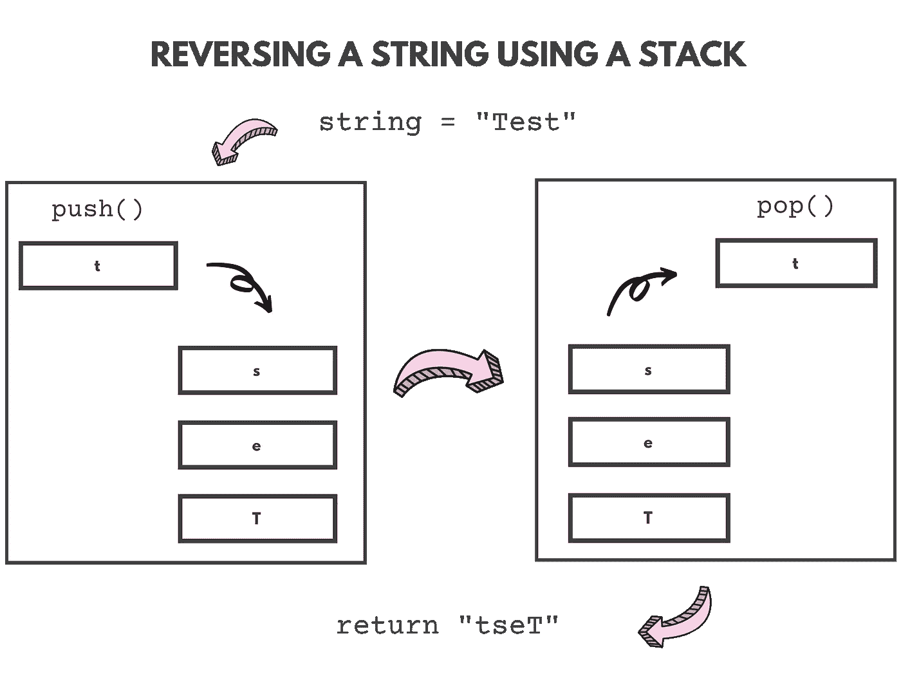

# 在 JavaScript 中用堆栈反转字符串

> 原文：<https://javascript.plainenglish.io/reversing-a-string-using-a-stack-in-javascript-66c4883bb441?source=collection_archive---------3----------------------->


Photo by [Johnson Wang](https://unsplash.com/@jdubs?utm_source=unsplash&utm_medium=referral&utm_content=creditCopyText) on [Unsplash](https://unsplash.com/s/photos/stack?utm_source=unsplash&utm_medium=referral&utm_content=creditCopyText)

在本文中，我们将学习如何在 JavaScript 中使用堆栈来反转字符串。

# 什么是堆栈？

堆栈是一种线性数据结构，它遵循操作执行的特定顺序。顺序是后进先出(LIFO)。



A simple visualization of a stack

栈使用`push()`和`pop()`分别为*添加*和*删除*元素。一个栈可以有任意多的元素，但是添加和移除元素的方式仍然是 LIFO。不能对堆栈底部/之间的元素进行操作。在本文中，我们将用 JavaScript 实现一个基本的堆栈，并用它来反转一个字符串！

# 实现堆栈

为了实现堆栈，我们将使用基于类的方法。堆栈中将使用以下方法。

1.  push() —将元素添加到堆栈中。
2.  pop() —移除并返回堆栈中最顶端的元素。
3.  isEmpty() —根据堆栈是否为空返回 true 或 false。

## 让我们为栈写代码吧！

首先，让我们创建一个带有构造函数的类堆栈，该构造函数初始化一个名为 elements 的数组，该数组将存储元素。

```
class stack { 
    constructor(){  
        this.elements = []; 
    }
}
```

现在，让我们添加所有的方法。

## 推送方法:

```
push(element){ 
    this.elements.push(element) 
}
```

## pop 方法:

```
pop(){ 
    if(this.elements.length === 0) return "Underflow situation"; 
    else return this.elements.pop();
}
```

## isEmpty 方法:

```
isEmpty(){ 
    if(this.elements.length > 0) return false;
    else return true;
}
```

# 反转字符串概述

首先也是最重要的，重要的是要形象化我们将如何反转一个字符串以使开发变得更加容易。

管柱的反向将遵循 3 个步骤:

1.  字符串的每个字符将被添加(推入)到堆栈中。
2.  在步骤 1 之后，堆栈将被弹出，并创建一个反向字符串。
3.  返回反转的字符串。



A visual representation of the algorithm

# 代码

堆栈:

```
class Stack {

    constructor(){  
        this.elements = []; 
    } push(element){ 
        this.elements.push(element) 
    } pop(){ 
        if(this.elements.length === 0) return "Underflow situation"; 
        else return this.elements.pop();
    } isEmpty(){ 
        if(this.elements.length > 0) return false;
        else return true;
    }}
```

`reverse`功能:

```
function reverse(*str*){ *//Creates a new stack* let stack = new Stack();

     let i = 0;
     let reversedStr = ""; *//Adds all the characters to the stack.* while (i !== *str*.length) {
         stack.push(*str*.charAt(i));
         i++;
     }

     *//Creates a reversed string by popping the stack.* while (!stack.isEmpty()) {
         reversedStr += stack.pop();
     } *//returns the reversed string.* return reversedStr;}
```

# 测试上述功能

让我们测试一下这个功能。以下是一些测试案例:面包、中等、javascript。

```
Input: BrEAd             Input: MeDIum           Input: javascriptOutput: dAErB            Output: muIDeM          Output: tpircsavaj
```

功能运行完美！

# 时间和空间复杂性

算法的*时间复杂度*为 O(n)，空间复杂度*也为 O(n)。*

## 说明

空间复杂度是 O(n ),因为我们将每个元素(字符串中的字符)推入并存储在堆栈中。

时间复杂度是 O(n ),因为我们访问字符串中的每个字符，并将其压入堆栈。在此之后，我们再次从堆栈中弹出每个字符，并创建反向字符串[O(n) + O(n) = O(n)]。

# 最终代码

资源库链接:[https://github . com/Megh-Agarwal/reverse-string-using-stack-js](https://github.com/Megh-Agarwal/reverse-string-using-stack-js)

## 结论

感谢您阅读这篇文章。希望你觉得有用。如果有，一定要留下评论让我知道:)