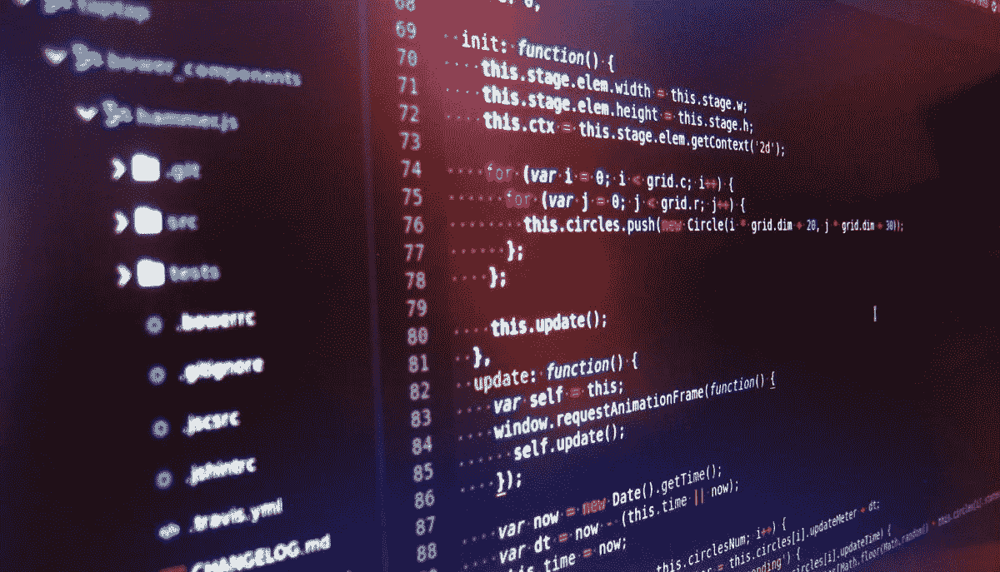

# “不要污染全局命名空间”在 JavaScript 中还是好建议吗？

> 原文：<https://javascript.plainenglish.io/revisiting-javascripts-global-namespace-4e21ed6fd049?source=collection_archive---------6----------------------->



如果你是一名 JavaScript 开发人员，你可能听说过这样一句话，“不要污染全局名称空间。”这条经验法则已经为开发人员节省了很多时间，并且仍然有一些优点。然而，JavaScript 的进步已经让位于以更安全的方式使用“全局”空间的新机会。

## 原创思维

JavaScript 开发人员最初接受“脚本”思维。这与今天更常见的“应用程序开发”的心态非常不同。在那个时期，脚本库开始出现，比如 jQuery。jQuery 库使用一个`$`符号作为全局名称空间(名称空间只是一个全局对象)。通过使用对象，可以将属性创建为方法，比如`$.ajax()`，它被定义为:

```
window.$ = {
  ajax: function () {...},
  ...
}
```

**这种方法容易出现域名冲突**。换句话说，如果在应用程序中使用 jQuery，`$`将不可用。随着越来越多的库开始出现，可用的名字越来越少。一些图书馆开始共享名称。这使得在不修改其中一个库的情况下不可能使用两个不同的库，因为它们都试图使用相同的全局变量名。

为了防止命名冲突，专家们将这种做法称为“全球命名空间的污染”。

*全局名称空间污染示例:*

```
var x = 10
var y = 2function add() {
  return x + y
}
```

所有未限定作用域的变量(x、y 和 add)“污染”了全局名称空间。

**替代方案**是创建一个单独的全局名称空间来隔离应用程序代码。例如:

```
var MyNamespace = {
  x: 10,
  y: 2,
  add: function () {
    return x + y
  }
}MyNamespace.add(1, 1)
```

这段代码更好，因为只有“MyNamespace”存在于全局范围内。尽管这仍然不是一个完美的解决方案。确实没有办法使用基于字符串的变量名在全局级别上唯一地标识某些东西。

## JavaScript 进化

ECMAScript(JavaScript 的规范)从 jQuery 的巅峰时期开始经历了巨大的转变。这种语言继续快速发展，比其他任何被广泛采用的编程语言都要快。

现代 JavaScript 中有两个更新的功能改变了我们在全局范围内可以做的事情: [**模块**](https://developer.mozilla.org/en-US/docs/Web/JavaScript/Guide/Modules) 和 [**符号**](https://developer.mozilla.org/en-US/docs/Web/JavaScript/Reference/Global_Objects/Symbol) 。

## 模块很重要

如果您熟悉模块，您可能已经知道全局名称空间惟一性已经成为可能。例如，可以为模块动态分配新名称，如下所示:

```
import MyNamespace as Different from 'https://domain.com/code.js'
import { something as Renamed } from 'https://domain.com/code.js'
```

这部分解决了全局名称空间污染问题，但不是完整的解决方案。

*有依赖关系问题需要考虑*。

模块是隔离的，这意味着很难与其他模块集成。

**现实世界中的依赖性挑战:**

多年来，我一直默默致力于一个名为 [NGN](https://github.com/ngnjs/ngn) 的 JS 库。它在浏览器、Node.js 和 Deno 中工作。我用它来构建框架、系统、API、桌面软件、ETL 过程，甚至还被用来创建 UI 框架(JET)。

核心库是围绕一个强大的事件发射器构建的，它被许多其他组件使用。还有一个非常强大的网络通信库、数据管理库、lexer/tokenizer(用于创建您自己的标记/查询语言)和许多其他功能，这些功能都包含在一个非常小的空间中。但是；大多数应用程序只需要可用功能的一个子集。将*所有的东西*捆绑在一起是没有意义的。将库拆分成单独的模块允许开发人员只使用他们需要的东西，但是这会产生内部依赖性。一些模块将依赖于其他模块，这是一个难题。

例如，如果您只想使用网络组件和核心事件发射器，您可能需要如下代码:

```
1\. import {EventEmitter} from '[http://jsdelivr.net/npm/ngn/index.js](https://cdn.jsdelivr.net/npm/ngn@2.0.0-alpha.8/index.min.js)'
2\. import NET from '[http://jsdelivr.net/npm/@ngnjs/net/index.js](https://cdn.jsdelivr.net/npm/ngn@2.0.0-alpha.8/index.min.js)'
3\. 
4\. class MyThing extends EventEmitter {...}
5\. const API = new NET.Resource(...)
```

问题出在第 5 行。NET 库有扩展核心的内部类`EventEmitter`。ES 模块在导入时检测到`EventEmitter`库*，使得网络库无法访问。要将每一个作为*独立的*模块打包/发布，需要将核心`EventEmitter`捆绑到每个组件中。使用上面的代码，这意味着`EventEmitter`代码将被下载两次*(一次在 NGN 导入，再次在. NET 导入)。**

*当增加更多依赖核心的库时，T21 的问题就更复杂了。`EventEmitter`会被第三次下载吗？第四个？在 Node 中同样具有挑战性，因为您需要`npm install`额外的软件包。节点应用程序可能并不总是像浏览器应用程序那样拥有运行时互联网访问。*

*一大捆增加的*优势是简单。如果您只需要/关心其中一个库，很容易导入:**

```
*import NET from '[http://jsdelivr.net/npm/@ngnjs/net/index.js](https://cdn.jsdelivr.net/npm/ngn@2.0.0-alpha.8/index.min.js)'*
```

*自 2013 年以来，我一直在使用不同形式的“图书馆收藏”，很少会出现只使用一个功能的情况。捆绑过程很有效，并不会阻止我使用我需要的东西，但是这种方法的带宽滥用 ***真的*** 让我恼火。*

## ***全球变量出手相救？***

*假设 JavaScript 社区不会因为使用全局变量而大吵大闹名称空间谋杀。每个非核心模块(如 network lib)都可以检查全局名称空间中核心库的存在，如果不存在就抛出一个错误/警告。这就避免了在每个模块中捆绑冗余代码的需要，而开发人员需要导入核心库。还有其他好处，比如确切地知道你的应用程序里有什么。*

*对每个系统库的全局引用肯定会使互操作性更容易，最小化带宽/内存需求，并简化绑定过程。这看起来像是一个胜利，除了讨厌的“不要污染全球命名空间”咒语。认识到这一点后，我渴望有一个全球注册中心来简化这一切。输入符号。*

## *作为符号的全局引用*

*[符号](https://developer.mozilla.org/en-US/docs/Web/JavaScript/Reference/Global_Objects/Symbol)是一种 [JavaScript 原语](https://developer.mozilla.org/en-US/docs/Glossary/Primitive)，就像数字、字符串、布尔等一样。它们是独一无二的，应该从字面上理解。它们绝对是独一无二的。*

*如果您不熟悉符号，请尝试运行以下代码:*

```
*console.log(Symbol() === Symbol()) // This will always be "false"*
```

*现在考虑一下这个:*

```
*globalThis[Symbol()]*
```

*上面的代码保证是唯一的“全局名称空间”。您可以向全局名称空间添加任意数量的符号，它们永远不会发生冲突。这是因为符号在[全局符号注册表](https://developer.mozilla.org/en-US/docs/Glossary/symbol#Global_symbol_registry)中保证是唯一的。*

> *注意:Symbol.for()将总是返回对符号的相同引用。因此，它**可能**污染全局名称空间。几率还是比较低的，因为`globalThis[Symbol.for('mylib')`和`globalThis['mylib']`不一样。它实际上只是一个隐藏的全局名称空间。这仍然是一把双刃剑，如果没有适当的治理，最初的“不要污染全球名称空间”的咒语仍然适用。换句话说，这种方法可能在像公司网络这样的可信/封闭环境中工作，但是对于向公众发布的代码可能不太好。*

## *在实践中使用全局符号*

*这种方法有一个问题。为了访问全局引用，您需要对符号的引用。为了突出这一挑战，请考虑以下情况:*

*模块 1:*

```
*globalThis[Symbol('mylib')] = {
  EventEmitter: MyEventEmitter
}*
```

*模块 2:*

```
*let EventEmitter = globalThis[Symbol('mylib')].EventEmitterexport default class Network extends EventEmitter {
  ...
}*
```

***模块 2 将出现故障。**请记住，`Symbol('mylib')`每次调用都会创建一个新的独特符号。*

*通常，使用变量传递符号引用，如下所示:*

```
*const REF = Symbol('mylib')
globalThis[REF] = ...*
```

*然而；`REF`变量不能“传递”给另一个模块。它也不能作为模块导出，因为这样做的目的是确定另一个模块是否存在。*

## ***这听起来不可能。全局符号实际上能起作用吗？***

*虽然解决方案并不像我个人喜欢的那样干净/直接，但还是有办法可以做到的。就我而言，这种权衡是可以接受的。下面的实验详细描述了这些方法、权衡以及我是如何评估它们的。*

***实验 1:全局符号查找***

*使用查找，库可以扫描符号的全局范围，遍历它们来搜索重要的符号。例如:*

```
*const references = Object.**getOwnPropertySymbols**(globalThis).filter(id => {
  return globalThis[id].hasOwnProperty('mylib')
})*
```

*上面的代码遍历全局范围内的所有唯一符号，并检查它们是否有一个名为`mylib`的属性。这将返回一个数组，起初这让我很困扰，因为我想要一个对我的库的引用。经过思考，我意识到支持对一个库的多个版本的引用是可能的。这对于迁移、测试和其他目的非常有用。*

*这种方法的主要挑战是确保您的库有一种一致且唯一的方式来标识自己。任何依赖项都需要能够执行相同的查找并获得相同的结果。作为一个库作者，这意味着保持纪律。根据我自己的经验，这是这个过程中相当琐碎的一部分。然而；并没有真正解决原来的问题。另一个库仍然有可能使用这种技术，同时给它们的库取与另一个库相同的名字。这只是比与典型的全局定义变量发生冲突的可能性小一点**。***

****实验 2:半安全查找****

**我仍然为需要遍历每个全局符号而烦恼。只是*觉得*没有必要。我决定使用`Symbol.for`创建一个符号引用。这允许更直接的查找，这*不太可能*与全局范围中的某些东西冲突。例如:**

***NGN 核心文件:***

```
**const NGN = ...
export { NGN as default, NGN, EventEmitter, .... }const ID = Symbol.for('NGN')
globalThis[ID] = globalThis[ID] || new Map()
globalThis[ID].set(NGN.version, NGN)**
```

**网络库文件:**

```
**const ID = Symbol.for('NGN')
const core = globalThis[ID]if (core.size === 0) {
  throw new Error('The network library is dependent on NGN core.')
}if (!core.has('2.0.0')) {
  throw new Error('The network library requires NGN 2.0.0')
}const NGN = core.get('2.0.0')export default class Network extends NGN.EventEmitter {
  ...
}**
```

**这也是可行的，但是仍然有可能出现命名冲突，因为`Symbol.for('NGN')`可能会被另一个库使用或者被用户创建。这个问题有点像唯一 ID 问题(UUID/GUID)，在某种程度上，冲突的可能性非常小，以至于我们可能不会活到看到它真正发生的时候。**

**实验三:混血儿**

**我决定尝试最后一种方法，使用半安全的全局符号作为查找索引。**

***NGN 核心文件:***

```
**const Reference = Symbol() // Guaranteed to be unique
const NGN = ...
export { NGN as default, NGN, EventEmitter, Reference, .... }globalThis[Reference] = NGNtry {
  const ID = Symbol.for('NGN')
  globalThis[ID] = globalThis[ID] || new Set()
  globalThis[ID].add(Reference)
} catch (e) {}**
```

**上面的代码有一个专门为 NGN 库定义的唯一符号，它使用实验 1 的概念被添加到全局范围。这保证了使用查找过程可以从全局范围访问该库。**

**我并不热衷于使用 try/catch 语句，但它确实有效。它为 NGN 寻找半安全的全局符号，如果它不存在就创建它(这就是`Symbol.for()`的工作方式)。然后，它试图找到/创建一个 JavaScript [集](https://developer.mozilla.org/en-US/docs/Web/JavaScript/Reference/Global_Objects/Set)，用来保存对核心库实例的引用。有人可能会覆盖`globalThis[ID]`的值，但可能性不大。问题的可能性在于为什么它被包装在一个 try/catch 中。**

**接下来，非核心库从如下代码开始:**

```
**const instances = globalThis[Symbol.for('NGN')]
let NGNif (instances && instances.size > 0) {
  for (const instance of instances) {
    if (globalThis[instance].version === '2.0.0') {
      NGN = globalThis[instance]
      break
    }
  }
}// fallback to scanning the global namespace
if (!NGN) {
  const references =
    Object.**getOwnPropertySymbols**(globalThis).filter(id => {
      return globalThis[id].hasOwnProperty('mylib')
    })
  ... loop through references to find the right version
}if (!NGN) {
  throw new Error('NGN is required.')
}export default class Network extends NGN.EventEmitter {
  ...
}**
```

**上面的代码首先尝试直接查找 NGN 库引用，这是最有效的方法。如果找到了，它就会继续前进。如果没有，它退回到扫描全局符号。最后，如果根本找不到引用，它就会崩溃。**

## **反思这些实验**

**当我回想这些实验时，我觉得它们“精神上很庞大”。符号的使用有许多细微差别，这可能具有挑战性。符号的命名法，即`Symbol()`和`Symbol.for()`一开始可能很难理解，因为它们看起来非常相似，但行为却非常不同。然而；我越来越欣赏这些功能，因为它们非常强大。**

**最后，我创建了一个小的“插件”模块来完成这些查找。这让我回到了最初的问题，即需要在库的每个部分都包含相同的重复代码。不同之处在于，与包含整个核心库相比，重复要少得多。这是一个我可以忍受的权衡。当缩小和压缩时，差别只是几个字节的开销。它使每个附加模块不必捆绑核心库(6kB)。**

**我主要编写库和工具，所以这些东西对我很重要。对于那些不知道的人来说，这里仍然有几个要点。**

1.  **通过符号在全局命名空间中具有唯一性是可能的。**
2.  **不正确地使用全局符号仍然会造成全局命名空间冲突。**

**我不会说旧的经验法则(“不要污染全局名称空间”)是过时的建议，但它感觉更像是一个“小心”标志，而不是“请勿进入”。JavaScript 的进步使得解决经验法则起源的根本问题成为可能。仍然没有一个完美的答案，但肯定有进步。**

**如果您尝试了这些实验中的任何一个，或者对解决这些概念有其他想法，请分享评论或在推特上联系我，网址为[@ gold glovercb](https://twitter.com/goldglovecb)。这是我第一次写关于深入实验的文章。所以，如果你喜欢，记得为这篇文章鼓掌(并保持更多的喜欢他们的到来)！**

***更内容于* [***通俗地说就是***](http://plainenglish.io/)**