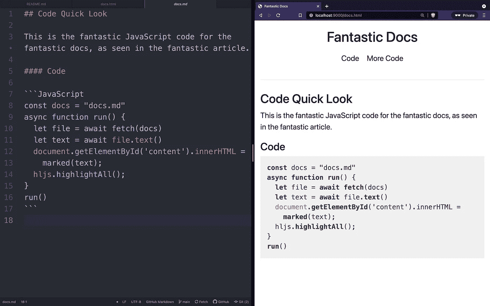

# 用 Marked.js 彻底改变你写文档的方式

> 原文：<https://javascript.plainenglish.io/revolutionise-the-way-you-write-docs-with-marked-js-5d1de8b8e725?source=collection_archive---------6----------------------->

不要再在 HTML 上瞎折腾了——用 Markdown 编写，然后用 Marked.js 快速地在客户端呈现 HTML。



The source markdown text side-by-side with the rendered HTML © Seb Hulse

***编辑于 2021 年 11 月 4 日，修复了 marked.js 在 2021 年 11 月 2 日的 v4.0.0 版本中引入的一个突破性更改。*** `***marked()***` ***功能已被弃用，取而代之的是*** `***marked.parse()***` ***。***

用 HTML 或其他前端语言编写文档/网站文案可能是一件痛苦的事情，尤其是如果你的团队中包括非编码人员，他们也需要做出贡献——如果你的文档需要经常更新，这是常有的事。

用用户友好的 Markdown 编写文档(因为它的可读性和丰富的有用工具),把 HTML 生成留给 Marked.js 和 Highlight.js，只需几行 JavaScript。使用 Markdown，您可以开放您的代码库，这样您的整个团队都可以为重要的事情做出贡献——高质量的文档！

> *“文档不仅仅是为开发者准备的”——*[*克里斯·钦奇利亚*](https://medium.com/hackernoon/a-documentation-crash-course-45006a85c15c)

Marked.js 接受 Markdown 文件，可以动态地生成 HTML 代码客户端，而不需要在部署之前进行静态的站点构建过程(尽管这也是 Marked.js 的一个选项)。这样做的好处是，你可以立即建立并运行你的网站，而不必受限于静态构建工具，如 Jekyll 或 Gatsby，它们的开发时间开销很大！

生成 HTML 后，使用网页上已有的 CSS 对其进行样式化——最重要的是能够用优雅的 JavaScript 一行程序自动突出显示所有代码块。

这就产生了一个非常简单的 HTML、CSS 和 JavaScript 网站，文档的副本保存在 Markdown `.md`文件中，每个人都可以很容易地理解和编辑。

我有没有提到它也非常快？看看我的另一个项目【fitness.sebhulse.com(报道即将发布)目前正在使用这种“即时”文档生成方法，并亲自评估一下它的性能！

在本文中，我们将:

*   介绍所涉及的**技术**
*   提供一个**简单代码示例**和一个**完整实现示例**
*   分享一些**工具**来建立有效的**降价**文档/参考
*   分享一些**资源**用于**编写**伟大的**文档/阅读材料**

可以直接跳到代码，但是不要错过工具和编写资源！

# 技术

[**标注. js**](https://github.com/markedjs/marked)

这个流行的 JavaScript 库得到了很好的维护，10 多年后仍在积极开发中。它执行将 Markdown 转换为 HTML 所需的大量幕后魔术。大多数功能都是通过综合的`marked()`函数执行的，传递给它一个降价文本字符串。在这里看文档[。](https://marked.js.org/)

浏览器内 CDN JavaScript 文件只有 16.1 KB 大小，可在以下位置找到:

```
<script src="<https://cdn.jsdelivr.net/npm/marked/marked.min.js>"></script>
```

此浏览器内的缩小文件按原样提供，不能调整以更改版本或大小。

但是，如果需要，也可以通过 CLI 或 node.js 安装[。](https://marked.js.org/#usage)

[**highlight . js**](https://github.com/highlightjs/highlight.js)

同样始于 2011 年，这个同样受欢迎的 JavaScript 库也仍在积极开发中——伟大的想法永远不会消失，嗯？这是对代码的一个可选添加，它(以最简单的形式)语法突出显示了所有在`<pre><code>` HTML 标签(由 Marked.js 生成)中的代码，只需在 HTML 生成后使用`hljs.highlightAll()`即可。当然，如果您没有希望语法突出显示的代码块，那么在页面上加载和使用这个库没有任何好处，因为可能会有性能损失。

当前“默认”的浏览器内 CDN JavaScript 文件大小约为 35 KB，可在以下位置找到(注意 CSS 和 JS 文件的要求):

```
<link rel="stylesheet" href="<https://cdnjs.cloudflare.com/ajax/libs/highlight.js/11.1.0/styles/default.min.css>">
<script src="<https://cdnjs.cloudflare.com/ajax/libs/highlight.js/11.1.0/highlight.min.js>"></script>
```

对于更新的库，[请关注本页](https://highlightjs.org/download/)。

这个默认的`highlight.min.js`文件包括一个 34 种常用编程语言的包——所以，与`marked.min.js`不同的是，`highlight.min.js`可以通过[只选择你需要的语言来优化](https://highlightjs.org/download/)。例如，如果只需要 Java，那么可以下载大小仅为 22 KB 的`highlight.min.js`文件。

既然我们知道了在哪里以及如何使用所需的代码，我们现在可以专注于实现了！

# 简单代码示例

注:所有代码在 [GitHub 这里](https://github.com/sebhulse/marked-docs-example)提供。

在以 HTML 网页的形式给出完整的实现示例以及所有必需的依赖项之前，我们将首先关注 JavaScript，以了解这有多简单！

这里，我们首先将`docs.md`文件的位置保存在一个变量中。然后，我们创建一个异步函数`run()`，首先`fetch()`这个`docs.md`文件，然后将这个文件转换成一个文本字符串(在本例中是 Markdown 文本)。

接下来，我们需要获取 HTML 元素(在本例中，它的 ID 为`content`，并将 innerHTML 设置为由`marked()`函数返回的 HTML，并向其传递`docs.md` Markdown 文本字符串。生成的 HTML 就是这样！

如果您想要突出显示语法，首先要确保您的`.md`文件已经在代码块中指定了编程语言——参见下面的示例`docs.md`文件，获取 JavaScript 语言规范的示例:

```
## Code Quick LookThis is the fantastic JavaScript code for the fantastic docs, as seen in the fantastic article.#### Code```JavaScript <---- here we specify what programming language the code block is in (Markdown Standard Syntax)
const docs = "docs.md"
async function run() {
  let file = await fetch(docs)
  let text = await file.text()
  document.getElementById('content').innerHTML =
    marked.parse(text);
  hljs.highlightAll();
}
run()
```
```

有了 Markdown 文件中指定的编程语言，我们在 JavaScript 中需要做的就是在`hljs`对象上使用函数`highlightAll()`——确保在我们从 Markdown 生成 HTML 后**完成此操作。**

注意，如果在降价中没有指定编程语言，`Highlight.js`将假设使用的语言，但这对于生产使用来说可能不够可靠。

太好了。多优雅啊！现在让我们缩小一下，看看这在完全实现中会是什么样子！

# 完整的实施示例

注:所有代码都在 [GitHub 这里](https://github.com/sebhulse/marked-docs-example)提供。

下面是一个完整的 HTML/CSS/Javascript 实现的例子，带有所需的依赖关系(文件`docs.md`和`docs.html`在同一个目录下——参见 [GitHub repo](https://github.com/sebhulse/marked-docs-example) )。

简而言之，我们在`head`中加载 Bootstrap 和 Highlight.js CSS 样式，然后在第一个主体部分有一些简单的 [Bootstrap nav](https://getbootstrap.com/docs/5.0/components/navs-tabs/) 。第二个主体部分包含我们从`docs.md`文件呈现 Markdown 所需的代码——包括 Highlight.js 和 Marked.js 简化的 JavaScript 源文件，以及我们在上一部分提到的 JavaScript。

就是这样！对于一个成熟的网站来说，这种实现是多么简单。

使用 Python 在这个目录中运行一个简单的 HTTP 服务器[以便能够在浏览器中实时预览您的`.md`文件:](https://pythonbasics.org/webserver/)

```
python3 -m http.server 9000
```

或者使用下一节中建议的一些降价工具来构建和编辑你的降价文件！

# 降价工具

我们已经讨论了如何实现将降价转换成 HTML 的幕后魔术，但是如何使用工具来实际编写我们想要呈现给世界的降价呢？

这些是我最喜欢的构建 Markdown 文件的工具，每一个都适用于不同的工作流程和应用程序。

1.  [readme.so](http://readme.so) —这个漂亮的网站免费使用，并提供了一个超级功能的编辑界面，在右边有一个实时预览(使用 GitHub 风格的 Markdown)。不过，它最好的一点是，它提供了有用的默认块/节，供您拖放到您的文件中，并根据您的需要进行编辑，例如 API 参考、附录等。
2.  [concept . so](http://notion.so)—这是您可能听说过的更全面的一体化工作空间解决方案。它有一个免费层，足以生成可以导出到 Markdown 的文档。我喜欢干净的界面，它让你专注于内容，而不是不必要的工具或格式。这个工具的好处是他们刚刚发布了一个 ace 的公共 API(可以在免费层获得！)—看看我整理的这个[教程示例](https://sebhulse.medium.com/a-laptop-battery-status-logger-with-the-notion-api-and-python-notion-public-api-guide-44595458cbd6)！这为(也许)自动更新你的文档提供了选择。
3.  用于 Atom 和 VS 代码的 [markdown-preview](https://github.com/atom/markdown-preview) 扩展——这是一个漂亮的 Markdown preview 扩展，用于两个流行的(免费的)文本编辑器，由 GitHub 开源和维护。它是 Atom 的一部分，但是你也可以在包管理器中搜索和下载它。在降价文件中，只需按下`ctrl-shift-m`,一个窗口将与降价文件并排打开，进行实时预览。

希望这能给你一些有效降价的思路，让你的文档繁荣起来！

# 编写文档/自述文件资源

我们已经了解了技术方面，但是我们如何真正写出好的文档或阅读材料——同时确保我们得到所有重要的信息，并且以一种对我们的读者有用的方式？我收集了一些我认为非常有用的资源，它们极大地提高了我的写作水平。

[WriteTheDocs.org](https://www.writethedocs.org/guide/)——这是一个非常棒的网站，有丰富的信息和很棒的文档指南——涵盖了从“谁”、“什么”和“为什么”到文档方面不断变化的公司文化，以及使用什么标记语言(剧透——Markdown 在里面)。

[“开发人员文档速成班](https://medium.com/hackernoon/a-documentation-crash-course-45006a85c15c)”—Chris Chinchilla 的这篇文章强调了文档的“谁”、“什么”和“为什么”，并提醒我们文档是为每个人准备的——而不仅仅是创建程序的开发人员。

[“编写文档](https://medium.com/frapp%C3%A9-thoughts/writing-the-docs-dabccd97c464)”—Prateeksha Singh 提醒我们，开发人员也是人！他们强调选择正确的语言——文档应该用邀请和积极的语气写，激发读者更多的参与。与实例的交互性也是传达得很好的重要一点。

[“撰写更好自述文件的速成课程](https://medium.com/hackernoon/a-crash-course-on-writing-a-better-readme-d796d1f6b352)”—Adnan Rahic 更侧重于撰写更全面的自述文件，他指向了一个有趣的网站[makeareadme.com](http://makeareadme.com)，该网站提供了在项目早期阶段应包含哪些内容的建议，并提供了在项目开始获得关注时应包含哪些内容的指导，以减轻项目首次发布时的文档“负担”。

我们有了它——一个在 Markdown 中编写文档的新工作流建议，不需要复杂的构建和部署过程。让您的项目启动并运行，从为大众准备的优秀文档中获益——加入一些优质资源和建议，将您的文档提升到一个新的水平！希望你学到了一些东西！

除了文中提到的我自己的工作之外，我与本文中的任何技术、人员或项目都没有关系。我只是觉得他们很酷！

# 资源

下面是本文中使用的链接的摘要:

[这个 GitHub 项目示例带有 HTML 和 Markdown 源文件](https://github.com/sebhulse/marked-docs-example)

[Marked.js GitHub 项目](https://github.com/markedjs/marked)

[Marked.js 文档](https://marked.js.org/)

[Highlight.js GitHub 项目](https://github.com/highlightjs/highlight.js)

[Highlight.js 文档](https://highlightjs.org/usage/)

[引导文档](https://getbootstrap.com/)

[Python http 服务器教程](https://pythonbasics.org/webserver/)

[readme.so](http://readme.so) —一个简单的 readme 构建工具，其中包含一些可以拖放的有用模块

[idea . so](http://notion.so)—一个全面的一体化工作空间，它能做的不仅仅是降价

[用概念 API 和 Python——概念公共 API 指南](https://sebhulse.medium.com/a-laptop-battery-status-logger-with-the-notion-api-and-python-notion-public-api-guide-44595458cbd6) — Seb Hulse 构建一个笔记本电脑电池状态记录器

[Atom/VS Code Markdown 预览版 Github 项目](https://github.com/atom/markdown-preview)——[或社区‘plus’版本](https://github.com/atom-community/markdown-preview-plus)

[Atom/VS Code Markdown 预览文档](https://atom.io/packages/markdown-preview) — [或者尝试社区‘plus’版本](https://atom.io/packages/markdown-preview-plus)

[writethedocs.org/guide](https://www.writethedocs.org/guide/)——关于撰写文档的技巧和资源的一站式商店

面向开发人员的文档速成班

[写文件](https://medium.com/frapp%C3%A9-thoughts/writing-the-docs-dabccd97c464)——普拉特克莎·辛格

[撰写更好自述的速成班](https://medium.com/hackernoon/a-crash-course-on-writing-a-better-readme-d796d1f6b352)——阿德南·拉希奇

[makeareadme.com](http://makeareadme.com)——一个自述文件构建工具，根据您的项目所处的阶段，提供关于包含哪些内容的建议

*更多内容请看*[***plain English . io***](http://plainenglish.io/)