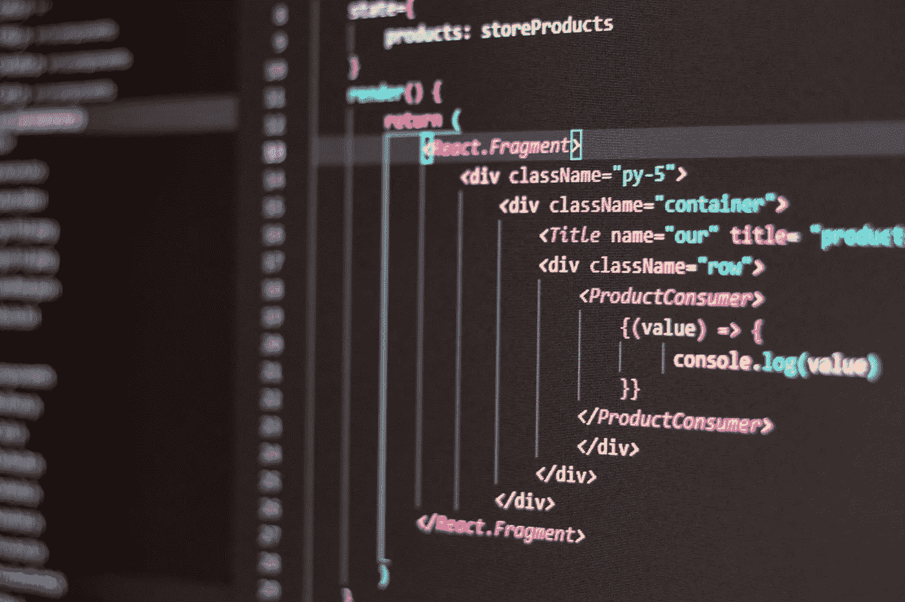

# 成为前端 Web 开发者的 2021 年路线图

> 原文：<https://javascript.plainenglish.io/roadmap-to-become-a-frontend-web-developer-in-2021-ee06abb21489?source=collection_archive---------1----------------------->



Photo by [Antonio Batinić](https://www.pexels.com/@antonio-batinic-2573434?utm_content=attributionCopyText&utm_medium=referral&utm_source=pexels) from [Pexels](https://www.pexels.com/photo/black-screen-with-code-4164418/?utm_content=attributionCopyText&utm_medium=referral&utm_source=pexels)

前端 web 开发，也称为客户端开发，是为用户可以直接看到和交互的 web 应用程序创建用户界面的实践。前端开发是你作为软件工程师获得第一份工作的一个很好的起点。本指南将带你经历一系列的步骤，从零开始成为一名前端开发人员。

## 前端开发者到底是做什么的？

认为前端开发人员永远只写 CSS 是一种误解，其实还有更多。作为一名前端开发人员，您很可能会从事以下工作之一:

*   设计布局
*   式样
*   状态管理
*   处理和呈现异步数据

以下步骤将帮助你从头开始。

# 1.学习 HTML

**HTML** (超文本标记语言)是任何网页最基本的构建块。它定义了 web 内容的含义和结构。你不需要学习 HTML 或每个标签的每一个细节。以下是您应该关注的一些要点:

*   HTML 页面的基本结构
*   在 HTML 中添加和格式化文本
*   创建列表、表格和表单
*   嵌入链接、图像和视频

> **资源**
> 
> html.com[文章学 HTML](https://html.com/)

# 2.学习 CSS

现在我们已经使用 HTML 将各种元素添加到页面中，我们需要使用 CSS(级联样式表)来设置它们的样式。CSS 描述了 HTML 元素应该如何显示。以下是一些重要的概念:

*   CSS 选择器(选择特定的或一组 HTML 元素)
*   CSS 中的单位(绝对像素值、百分比、em+rem、vh+vw)
*   CSS 定位(静态、相对、绝对、固定、粘性)
*   **CSS 盒子型号**
*   **CSS Flexbox**
*   **CSS 网格**

> **提示和技巧**
> 
> 从网页中移除任何默认边距和填充
> 
> 使用 Clamp 代替媒体查询
> 
> 使用相对单位而不是绝对单位来使你的页面具有响应性

```
*{ 
  padding: 0; 
  margin: 0;
  box-sizing:border-box;
}
```

> **资源**
> 
> [学习 CSS youtube 播放列表](https://www.youtube.com/playlist?list=PLZlA0Gpn_vH9D0J0Mtp6lIiD_8046k3si)通过 Web Dev 简化

# 2.1 CSS 框架

这是一个可选的步骤，但是可以成为快速创建网站和 ui 的一个很好的工具。CSS 框架为您提供了现成的模板/组件和类，您可以将它们导入到您的代码库中，无需编写任何 CSS 就可以获得漂亮的响应组件。

一些受欢迎的选择(选择一个)是:

*   顺风 CSS
*   Bootstrap5
*   实现
*   布尔玛

# 3.学习 JavaScript

现在你可以用 HTML 和 CSS 创建漂亮的网页。但是如何让它发挥作用呢？实际上，如何在点击按钮时提交表单，或者在某些事件中动态更新内容？答案是 **JavaScript。**

JavaScript 是一种脚本语言，可用于编写客户端代码(在浏览器中运行的代码)和服务器端代码(使用 Node.js 和 Deno)。您可以只使用一种语言来编写整个应用程序，从而使开发体验更加流畅，并加快应用程序的速度。这就是 JavaScript 如此受欢迎的原因，也是任何有抱负的开发人员必须学习的内容。

**基础 JavaScript**

*   变量、数据类型、循环和函数
*   JavaScript 对象和“this”关键字
*   文档对象模型(DOM)
*   var/let/const 关键字之间的区别
*   数组方法(foreach、map、filter、reduce 等。)

**高级概念**

一旦你完成了基本的工作，遵循 JavaScript 的高级概念将有助于提高代码的效率和简洁，也有助于从 API 获取数据并呈现它。这些是您应该熟悉的一些高级概念:

*   **ES6** 的特性包括箭头函数、模板文字、析构
*   回访和承诺
*   异步编程(异步/等待)
*   **获取 API**

> **资源**
> 
> 学习 JavaScript——freeCodeCamp 为初学者提供的完整课程
> 
> [JavaScript 面试问题](https://www.interviewbit.com/javascript-interview-questions/) by interviewbit

# 4.JavaScript 框架

JavaScript 框架通过提供代码库、设置样板代码和提供构建 web 应用程序的通用特性，使开发人员的生活变得更加轻松。

现在最流行的框架是 React，Angular，Vue.js，不建议什么都试着学。随便选一个。React 和 Vue.js 相对来说比较容易学但是功能比较少；而 Angular 有很多特性，但是学习曲线更陡。

React 是一个由脸书维护的开源库。它需求量很大，很容易学习，有一个很好的社区(你可以找到栈溢出最罕见问题的解决方案)，并且有很好的文档。因此，这可能是一个伟大的选择。下面的文章可能会更清楚地说明哪种框架最适合您的需求。

[](https://medium.com/swlh/vue-vs-react-vs-angular-what-framework-would-you-choose-5d77a3680b0d) [## Vue vs React vs Angular:你会选择什么框架？

### 这个博客对三个最流行的 JavaScript 框架进行了广泛的比较:Vue vs React vs Angular，万一…

medium.com](https://medium.com/swlh/vue-vs-react-vs-angular-what-framework-would-you-choose-5d77a3680b0d) 

> **资源**
> 
> [https://reactjs.org/docs/getting-started.html](https://reactjs.org/docs/getting-started.html)—官方文件
> 
> [通过协同进化反应教程播放列表](https://www.youtube.com/watch?v=QFaFIcGhPoM&list=PLC3y8-rFHvwgg3vaYJgHGnModB54rxOk3)
> 
> [学习 Angular —全教程教程](https://youtu.be/2OHbjep_WjQ)
> 
> [Learn Vue.js —初学者全教程](https://youtu.be/4deVCNJq3qc)

# 5.学习 Git

到目前为止，世界上使用最广泛的现代版本控制系统是 Git。版本控制是每个 web 开发人员都必须熟悉的重要技能。

Git 是一个命令行工具，但所有涉及 Git 的事情都围绕着它的中心——GitHub.com——开发人员存储他们的项目并与志同道合的人交流的地方。学会 git 后，可以在 Github 上贡献开源项目。通过参与开源项目，你会学到很多东西，这将有助于建立一个在线的存在。

> **资源**
> 
> 自由代码营的 Git 和 Github 速成班
> 
> 什么是 git 以及如何使用它

此时，您已经准备好申请您的第一份工作，即前端开发人员。以下步骤将帮助你学习一些先进的概念，使你的个人资料脱颖而出。

# 6.全局状态管理

*   React:上下文 API、Redux、MobX
*   Angular:共享服务
*   Vue.js: Vuex

# 7.服务器端渲染

*   React: Next.js
*   Vue.js: Nuxt.js
*   角度通用(角度)

# 8.可选择的

*   学习部署和托管您的项目(Netlify、Github pages、Heroku)。
*   学习 **TypeScript** (给 JavaScript 带来一个“严格”的类型系统)。它使您的代码更健壮，更不容易出错。非常适合大型项目。
*   作为前端开发人员，Firebase 对于构建全栈应用非常有帮助，不需要太多关于后端和数据库的知识，只需要最少的服务器端代码。它还提供免费托管。
*   学习一些测试框架(比如 JavaScript 的 Jest 和 Mocha)。
*   建立一个作品集网站来展示你的作品和项目。

**恭喜你！**你现在是前端开发者。

*更多内容看* [*说白了. io*](http://plainenglish.io/) *。报名参加我们的* [*免费每周简讯*](http://newsletter.plainenglish.io/) *。在我们的* [*社区不和谐*](https://discord.gg/GtDtUAvyhW) *获得独家获得写作机会和建议。*