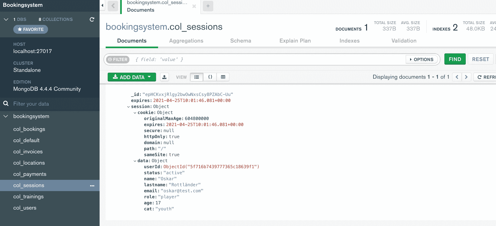
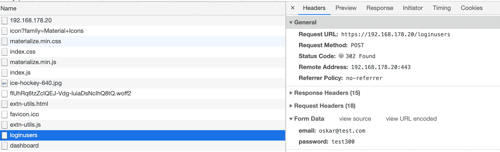
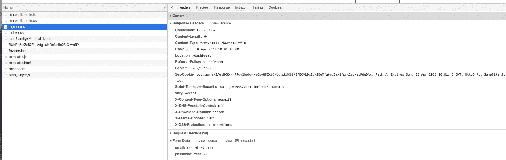
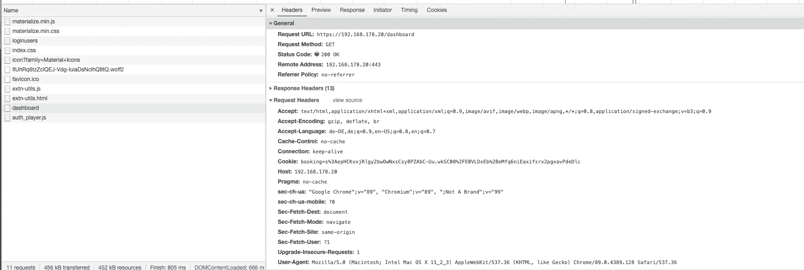

# 在 Node.js 应用程序中使用快速会话的基于角色的访问控制

> 原文：<https://javascript.plainenglish.io/role-based-access-control-using-express-session-in-a-node-js-app-7b91dd303269?source=collection_archive---------0----------------------->


This picture is free for commercial use from [pixabay](https://pixabay.com/de/photos/tastatur-h%c3%a4nde-hacker-hacken-4356763/)

在本文中，我提到了几个月前创建的一个应用程序。

这是一个预约系统，玩家可以在不同的地点预约冰球训练，教练可以确认参加训练课程，俱乐部经理可以组织训练课程，并向玩家收取预约训练的费用。

你可以在我的 [GitHub 账号](https://github.com/prottlaender/bookingsystem)上看到代码，并在我的博客 [Digitaldocblog](https://digitaldocblog.com/singleblog?article=9) 上以用户手册的方式阅读详细的应用描述。

在我的预订系统中，我在我的应用程序中给用户不同的角色，根据他们的角色，用户有不同的授权。例如*管理员*比普通的*玩家*或*教练*能够访问更敏感的数据和功能。因此，我的应用程序必须知道用户的角色，才能为特定用户分配不同的授权。

客户端，通常是浏览器，向应用程序发送请求。该应用程序会对请求做出回应，并全权负责确保客户端只能访问为其准备的数据。这个请求和响应游戏是基于 HTTP 协议的。HTTP 是一种无状态的网络协议，请求不能相互关联。每个请求都是孤立的，与以前的请求无关，服务器没有机会识别客户端，因此不知道它们的角色。

这个问题可以通过会话和 cookies 来解决，这意味着会话管理必须在应用程序中实现。应用程序创建会话并存储会话数据，例如请求者在该会话中的角色。会话有一个唯一的标识，应用程序只在 cookie 中保存该标识。cookie 被传输到浏览器并存储在本地。

从现在起，浏览器总是将这个 cookie 与 HTTP 请求一起发送，从而向应用程序标识自己。应用程序可以检查请求者在存储的会话数据中的角色，并控制适当的访问。

## 服务器的基本设置

首先，我们需要一个有效的服务器操作系统。我在生产中运行 Linux Ubuntu，并在我的博客网站 [Digitaldocblog](https://digitaldocblog.com/home?currpage=1) 上写了一篇关于生产 Linux 服务器的[基本设置的文章。因为我要将会话存储在 MongoDB 中，所以 MongoDB 必须安装在 Linux 服务器上。我使用 *MongoDB 社区版*，但是你也可以安装或升级到 *MongoDB 企业版*服务器版本。在文章的下半部分，你可以找到如何在你的 Linux 系统上安装和设置你的 *MongoDB 社区版*的说明。如果您想阅读原始文档，请访问 MongoDB 网站，阅读如何为您的操作系统安装](https://digitaldocblog.com/singleblog?article=10) [MongoDB 社区版](https://docs.mongodb.com/manual/administration/install-community/)。

在我的 express 应用程序中，我使用了许多外部模块或依赖项，为了使应用程序运行，必须为应用程序安装这些模块或依赖项。在我的 [GitHub 账户](https://github.com/prottlaender)上的 [bookingsystem](https://github.com/prottlaender/bookingsystem) 的存储库中，你可以找到 [package.json](https://github.com/prottlaender/bookingsystem/blob/master/package.json) 文件，其中包含了所有必要的依赖项。原则上，如果您将这个 *package.json* 文件放在您的应用程序主目录中，并使用`npm install`安装所有依赖项，这就足够了。

当然，所有模块也可以单独安装

`npm install <module> --save`

## 会话管理

我在第一部分讨论了我的应用程序主文件 [booking.js](https://github.com/prottlaender/bookingsystem/blob/master/booking.js) 中不同的代码片段。这里的目标是让您了解会话管理基本上是如何实现的。

```
// booking.js

// Load express module and create app
const express = require('express');
const app = express();
// Trust the first Proxy
app.set('trust proxy', 1);
// Load HTTP response header security module
const helmet = require('helmet');
// use secure HTTP headers using helmet with every request
app.use(
  helmet({
      frameguard: {
        action: "deny",
      },
      referrerPolicy: {
        policy: "no-referrer",
    },
    })
  );
// Load envy module to manage environment variables
const envy = require('envy');
const env = envy();

// Set environment variables
const port = env.port
const host = env.host
const mongodbpath = env.mongodbpath
const sessionsecret = env.sessionsecret
const sessioncookiename = env.sessioncookiename
const sessioncookiecollection = env.sessioncookiecollection

// Load server side session and cookie module
const session = require('express-session');
// Load mongodb session storage module
const connectMdbSession = require('connect-mongodb-session');
// Create MongoDB session store object
const MongoDBStore = connectMdbSession(session)
// Create new session store in mongodb
const store = new MongoDBStore({
  uri: mongodbpath,
  collection: sessioncookiecollection
});
// Catch errors in case session store creation fails
store.on('error', function(error) {
  console.log(`error store session in session store: ${error.message}`);
});
// Use session to create session and session cookie
app.use(session({
  secret: sessionsecret,
  name: sessioncookiename,
  store: store,
  resave: false,
  saveUninitialized: false,
  // set cookie to 1 week maxAge
  cookie: {
    maxAge: 1000 * 60 * 60 * 24 * 7,
    sameSite: true
  },
}));

... //further code not taken into account at this point
```

我使用 [Express-js](https://www.npmjs.com/package/express) Web 应用程序框架创建一个服务器应用程序。因此，我用`require()`函数加载 Express-js 模块，并将`express()`函数存储在常量 *app* 中。因为我的应用程序运行在反向代理服务器后面，所以我将应用程序设置为信任第一个代理服务器。然后我加载[头盔模块](https://www.npmjs.com/package/helmet)以在我的应用程序中使用安全响应头。我配置所有的浏览器都应该拒绝 iFrames，并且我的应用程序不会在响应头中设置 referrer。

我在应用程序中使用 [envy 模块](https://www.npmjs.com/package/envy)来管理环境变量。因此，我用`require()`加载模块，并将`envy()`函数存储在常量 *env* 中。有了 envy，你可以在你的*中定义你的环境变量。env* 和*env . example*文件。这些文件必须存储在 envy 文档中解释的应用程序主目录中。

由于我的预订应用程序是一个运行在生产中的 web 服务器上的真正的 web 应用程序，出于安全原因，我不能讨论真正的环境变量。因此，让我们看看这是如何工作的，并做一个例子*。env* 文件。

```
// .env

port=myport
host=myhost
mongodbpath=myexamplemongodbpath
sessionsecret=myexamplesecret
sessioncookiename=booking
sessioncookiecollection=col_sessions
```

这些变量在我的*中有不同的值。env* 文件。在上面的 [booking.js](https://github.com/prottlaender/bookingsystem/blob/master/booking.js) 文件中，我用`env = envy()`为 envy 函数定义了常量 *env* 。然后我可以访问我的*中定义的环境变量。env* 文件与 *env。<变量>变量*。我为每个变量定义了常数，并从。带`env.<variable>`的 env 文件。这些常量现在可以用作代码中的值。

我用`require()`函数加载了 [express-session](https://www.npmjs.com/package/express-session) 模块和[connect-MongoDB-session](https://www.npmjs.com/package/connect-mongodb-session)模块。存储在常量*会话*中的会话模块接管会话和 cookie 管理的全部控制。

常量 *connectMdbSession* 模块中存储的*connect-MongoDB-session*基本负责在数据库中存储会话。这就是为什么我们在代码中将 *session* 作为参数传递，并为常量 *MongoDBstore* 赋值。

`const MongoDBstore = connectMdbSession(session)`

我用`new MongoDBStore`创建了一个新的商店对象。在这里，我传递了 mongodb 路径的 uri 和应该存储会话的集合 T21。

```
// booking.js
...

const store = new MongoDBStore({
  uri: mongodbpath,
  collection: sessioncookiecollection
});

...
```

以这种方式初始化的 store 对象包含了在我的 MongoDB 数据库中成功存储会话对象所需的所有参数。

在我们定义了会话对象的存储之后，我们负责会话对象本身。

用`app.use(session( {... cookie: {...} }))`我创建了一个带有各种选项的会话对象。会话对象将随每个请求一起创建，并且还包含一个 cookie 对象。我传递`cookie: {...}`的值，然后传递其他选项，如`secret: sessionsecret`，用`name: sessioncookiename`传递会话对象名，用`store: store`传递会话对象应该存储的位置。此外，会话对象具有选项`saveUninitialized: false`和`resave: false`。

当*保存未初始化*选项设置为*假*时，只要会话**未初始化**，会话对象就*不存储*到存储器中。选项`resave: false`强制会话不会*保存回*存储器，即使会话已经**初始化**。所以我们必须明白*初始化*和*未初始化*是什么意思。这个必须解释。

浏览器向应用程序发送请求。更准确地说，浏览器将请求发送到应用程序中定义的端点。端点在应用程序中定义了一个路径，该路径对 HTTP 请求做出反应并执行代码。根据 HTTP 方法 GET 或 POST，端点期望请求者要求文档返回(GET)或者请求者想要向应用程序发送数据(POST)。

在下面的例子中，浏览器应该发送一个 GET 请求来获取 *home* 端点。端点呈现 HTML 模板*索引*并将 HTML 发送回浏览器。那么请求就完成了。所以这个从*请求*开始到*响应*结束的过程就是请求的*运行时间。*

在下面的代码片段中，您可以看到在 [booking.js](https://github.com/prottlaender/bookingsystem/blob/master/booking.js) 文件中有两个 GET 端点，一个用于 *home* 路线，另一个用于 *register* 路线。

```
// booking.js

... //further code not taken into account at this point

// GET home route only for anonym users. Authenticated users redirected to dashboard
app.get('/', redirectDashboard, (req, res) => {

  console.log(req.url);
  console.log(req.session.id);
  console.log(req.session);

  res.render('index', {
      title: 'User Login Page',
    });

});

// GET register route only for anonym users. Authenticated users redirected to dashboard
app.get('/register', redirectDashboard, (req, res) => {

  console.log(req.url);
  console.log(req.session.id);
  console.log(req.session);

  res.render('register', {
      title: 'User Registration Page',
    });
});

... //further code not taken into account at this point
```

我的 [booking.js](https://github.com/prottlaender/bookingsystem/blob/master/booking.js) 文件中带有`app.use (session({ ... }))`的代码确保每次请求都会生成一个会话对象。只要会话对象在请求运行时没有改变，就会为每个请求创建一个单独的会话，并且有自己的会话 ID。选项`saveUninitialized: false`确保会话对象不会被存储到数据库中。以这种方式创建的每个会话对象都是未初始化的。

当我们在控制台上记录每条路线的*路径*、*会话 ID* 和*会话对象*时，您可以在控制台上看到*起始*路线和*寄存器*路线的以下输出。

```
/
BmbE8RVoTRcPP9nUnBm5JLE1w1mQiNyt
Session {
  cookie: {
    path: '/',
    _expires: 2021-04-24T04:27:04.265Z,
    originalMaxAge: 604800000,
    httpOnly: true,
    sameSite: true
  }
}

/register
awlPO-KpyVM51Gp6UAoeXGGmRWo-QFtP
Session {
  cookie: {
    path: '/',
    _expires: 2021-04-24T05:54:57.439Z,
    originalMaxAge: 604800000,
    httpOnly: true,
    sameSite: true
  }
}
```

当用户成功登录时，我的应用程序的代码通过添加数据对象在请求运行时更改会话对象。我将在下一章详细解释这些代码，但是现在知道这些就足够了。因此，我们通过一个用户的登录如下。

如上所述，浏览器向 *home* route 发送 GET 请求，然后呈现 *index* 模板，并将带有登录表单的 HTML 页面发送回浏览器。在这个 GET 请求的运行期间，创建了一个会话对象，但是会话对象没有改变。我们在上面已经看到了这一点。

然后用户在登录表单中输入*邮箱*和*密码*，点击提交。通过这个提交，浏览器向 POST 端点 */loginusers* 发送一个 POST 请求，并且再次为这个 POST 请求生成一个会话对象。在 POST 请求的运行期间，代码检查传输的凭证是否正确。如果凭证正确，则生成具有用户数据的数据对象，并将其附加到会话对象。这里，会话对象在 POST 请求的运行期间被更改。用 POST 请求创建的现有会话现在在那个时刻被初始化。由于选项`saveUninitialized: false`，该会话对象被存储到数据库存储中。当我们使用工具 [MongoDB Compass](https://www.mongodb.com/products/compass) 查看数据库存储时，我们看到整个会话对象已经保存到了 *colsessions* 集合中，其中包括包含用户所需数据的数据对象。



Session Object stored in the Database

在会话初始化之后，由 POST 端点调用的代码重定向请求并将一个新的 GET 请求发送到 */dashboard* 路由。带有`app.use(session({ ... }))`的代码被再次调用，但是现在存储中存在一个初始化的会话。由于选项`resave: false`，现有的会话对象将不会随着每个进一步的请求而被更新和拖动。

当我们在控制台上记录每条路由的*路径*、*会话 ID* 和*会话对象*时，您会在控制台的输出中看到这一点。当 GET 请求被发送到 *home* route 时，控制台上的第一个输出被创建。然后，在用户单击 submit POST route*/loginusers*之后，调用第二个输出，并创建一个新的会话对象。您可以从不同的会话 id 中看到这一点。在这个 POST 请求的运行期间，数据对象被添加到初始化会话的会话对象中。然后，调用第三个输出，GET route */dashboard* ，我们看到相同的会话对象 ID，但是会话对象现在包含带有用户数据的数据对象。

```
/
TEAZITdX7nLWBDc8uOk2HhXIiMZO7W-4
Session {
  cookie: {
    path: '/',
    _expires: 2021-05-02T07:21:13.236Z,
    originalMaxAge: 604800000,
    httpOnly: true,
    sameSite: true
  }
}

/loginusers
gVlKut3bdEMiDHnK455FGjCi6YbPTBuZ
Session {
  cookie: {
    path: '/',
    _expires: 2021-05-02T07:21:35.202Z,
    originalMaxAge: 604800000,
    httpOnly: true,
    sameSite: true
  }
}

/dashboard
gVlKut3bdEMiDHnK455FGjCi6YbPTBuZ
Session {
  cookie: {
    path: '/',
    _expires: 2021-05-02T07:21:35.468Z,
    originalMaxAge: 604800000,
    httpOnly: true,
    secure: null,
    domain: null,
    sameSite: true
  },
  data: {
    userId: 5f716b7439777365c18639f1,
    status: 'active',
    name: 'Oskar David',
    lastname: 'Rottländer',
    email: 'oskar@test.com',
    role: 'player',
    age: 17,
    cat: 'youth'
  }
}
```

总之，会话管理的工作方式如下:每个请求都将创建一个会话对象，只有当用户登录时，会话对象才会保存在数据库中(*save initialized:false*)。只要用户登录，会话对象就不会改变，数据库中的会话对象数据也不会更新( *resave: false* )。

但是饼干会怎么样呢？这将在下一章解释。

## 用户登录

当会话被初始化时，包含会话 ID 的 cookie 被存储在请求者的浏览器中。对于每个请求，浏览器都会提供 cookie 来验证请求者。为了验证请求者，调用代码`app.use(session({...}))`并将浏览器发送的会话 ID 与会话存储中存储的会话 ID 进行比较。如果会话 ID 匹配，则包括数据对象的会话对象被附加到请求对象，以使应用程序能够访问数据对象。在应用程序中，我们现在可以访问带有 *req.session.data. <属性>* 的数据对象的任何属性。因此，我们现在可以通过使用 *req.session.data.role* 访问请求者的角色来实现基于角色的授权，并在代码的条件中使用该信息来根据请求者的角色控制访问。

但是让我们从请求者或用户的登录开始，因为从现在开始我称之为请求者。为了让用户能够登录，他或她必须首先调用**登录页面**，该页面可以通过调用家庭端点来显示。

```
// booking.js

... // Code not discussed here

// Redirect GET requests from authenticated users to dashboard
const redirectDashboard = (req, res, next) => {
  if (req.session.data) {
    res.redirect('/dashboard')

  } else {
    next()

  }
}

... // Code not discussed here

// GET home route only for anonym users. Authenticated users redirected to dashboard

app.get('/', redirectDashboard, (req, res) => {

  res.render('index', {
      title: 'User Login Page',
    });

});

... // Code not discussed here
```

正如你在上面的代码中看到的，我首先定义了中间件函数 *redirectDashboard* 。该中间件确保只有未登录的用户才能看到登录页面。如果我们查看中间件函数的代码，我们可以看到在 If 条件中使用了 *req.session.data* 来检查数据对象是否附加到当前会话对象。在 **if-condition 为真**的情况下，用户登录并且请求被重定向到仪表板，但是在 **if-condition 为假**的情况下，用户不登录并且调用 *next()* 函数。

GET 端点具有到归属路由的*路由路径*。当用户访问我的预订应用程序的主页时，GET HTTP 请求要求 home *routingPath* 。中间件函数 *redirectDashboard* 放在 *routingHandler* 函数的前面。如果用户没有登录 *routingHandler* 函数，呈现 HTML 模板 [index.pug](https://github.com/prottlaender/bookingsystem/blob/master/views/index.pug) 并将 HTML 发送回用户，或者更准确地说，发送到用户的浏览器。

到目前为止一切顺利。我们现在想象一个未登录的用户，看到他或她面前的索引页面，现在想要使用他或她的*电子邮件*和*密码*登录。

如上所述，索引页面只不过是一个用于输入电子邮件地址和密码的登录表单。当我们查看 [index.pug](https://github.com/prottlaender/bookingsystem/blob/master/views/index.pug) 文件时，我们看到表单动作属性定义了当点击提交按钮时，表单数据`email`和`password`将使用 POST 方法发送到表单处理程序`/loginusers`。

```
...

form#loginForm.col.s12(
		method='post', 
		action='/loginusers'
		)

		input.validate(
			type='email', 
			name='email', 
			autocomplete='username' 
			required
			)
		...

		input.validate(
			type='password', 
			name='password', 
			autocomplete='current-password' 
			required
			)
		...

button.btn.waves-effect.waves-light(
		type='submit', 
		form='loginForm'
		)
...
```

**注意**:为了理解输入标签的*自动完成*属性，我推荐阅读 [Chromium 项目](https://www.chromium.org/developers/design-documents/form-styles-that-chromium-understands)的文档。大多数浏览器都有密码管理功能，并在您提供主密码来解锁本地密码存储后自动填写凭据。通过在登录表单以及用户注册表单或更改密码表单中使用这些自动完成属性，您可以使用这些*自动完成*功能来帮助浏览器更好地识别这些表单。

当用户在 HTML 表单中输入他或她的*电子邮件*和*密码*并点击提交按钮后，**请求体**包含*表单数据*属性*电子邮件*和*密码*。然后，通过 HTTPS 向我的 [booking.js](https://github.com/prottlaender/bookingsystem/blob/master/booking.js) 文件中定义的 POST 端点`/loginusers`发送一个 POST HTTP 请求(见上文)。

在下图中，你可以看到 chrome 浏览器的开发者工具中网络分析的输出。这里你可以看到*表单数据*在**浏览器端**没有加密，但是你也可以看到 POST 请求 URL `/loginusers`是 HTTPS。这意味着当浏览器向服务器发送 POST 请求时，这些数据在从浏览器传输到服务器的过程中会使用 SSL/TLS 进行加密。



POST request and Form Data

在**服务器端**我们有一个代理服务器后面的 web 应用程序，它监听发往 POST 端点`/loginusers`的 HTTP 请求。这个 POST 端点是一个匿名的 POST 路由，这意味着 *routingHandler* 控制器功能仅限于未登录的用户。这是有意义的，因为已经登录的用户不能使用登录功能。因此已经登录的用户不能向这个 POST 端点发送数据。该检查由中间件函数 *verifyAnonym* 控制，该函数位于 *routingHandler* 之前。

所以让我们看看 [booking.js](https://github.com/prottlaender/bookingsystem/blob/master/booking.js) 中的相关代码片段。

```
// booking.js

...

// Load db controllers and db models
const userController = require('./database/controllers/userC');

...

// Verify POST requests only for anonym users
const verifyAnonym = (req, res, next) => {

  if (req.session.data) {
    var message = 'You are not authorized to perform this request because you are already logged-in !';
    res.status(400).redirect('/400badRequest?message='+message);

  } else {
    next()

  }
}

...

// Anonym POST Route
// Login user available for anonym only
app.post('/loginusers', verifyAnonym, userController.loginUser)

...

// GET bad request route render 400badRequest
app.get('/400badRequest', (req, res) => {

  res.status(400).render('400badRequest', {
    title: 'Bad Request',
    code: 400,
    status: 'Bad Request',
    message: req.query.message,
  })
})

...
```

在代码的开头，我使用`require`方法将常量 *userController* 引用到用户控制器文件 [userC.js](https://github.com/prottlaender/bookingsystem/blob/master/database/controllers/userC.js) 。在 [userC.js](https://github.com/prottlaender/bookingsystem/blob/master/database/controllers/userC.js) 中，定义了所有的用户功能来控制用户相关的操作。

**注意**:当你查看 [userC.js](https://github.com/prottlaender/bookingsystem/blob/master/database/controllers/userC.js) 文件时，你会看到我们使用`module.exports = {...}`导出模块。使用这个指令，我们实际上导出了一个具有各种属性的对象，这些属性的值就是函数。所以用`module.exports = { loginUser: function(...) ...}`我们导出包含属性 *loginUser* 的对象，该属性包含一个函数作为值。因此，当我们使用 [booking.js](https://github.com/prottlaender/bookingsystem/blob/master/booking.js) 文件中的`require()`函数引用常量 *userController* 时，我们将完整的导出对象及其所有属性存储到 *userController* 常量中。现在我们可以使用 *userController 从 [userC.js](https://github.com/prottlaender/bookingsystem/blob/master/database/controllers/userC.js) 文件中访问导出对象的任何属性。<属性>属性*。因为属性实际上是函数，所以我们用这个语句来调用这些函数。

在*中，verifyAnonym* 函数 *req.session.data* 在 if-condition 中用于检查数据对象是否附加到当前会话对象。在 **if-condition 为真**的情况下，用户已经登录并被重定向到 Bad Request GET 端点`/400badRequest`，这是我的应用程序中向用户显示出错的标准路径。用户可以使用请求参数`?message=+message`从附加到请求的消息中看到哪里出错了。如果**的 if 条件为假**，则用户未登录， *next()* 函数将请求转发给 *routingHandler* 控制器函数，后者使用*user controller . loginuser*调用`loginUser`函数。该函数可以访问**请求体**的属性 *email* 和 *password* 以及 *req.body.email* 和 *req.body.password* 。

那么我们来看看 [userC.js](https://github.com/prottlaender/bookingsystem/blob/master/database/controllers/userC.js) 文件中的相关代码片段。

```
// database/controllers/userC.js

// load the bcryptjs module
const bcrypt = require('bcryptjs');
// define hash saltrounds for password hashing
const saltRounds = 10;
// load the relevant Prototype Objects (exported from the models)
...

const User = require('../models/userM');

...

loginUser: function (req, res) {

    const inputemail = req.body.email
    const email = inputemail.toLowerCase()

    console.log(req.url);
    console.log(req.session.id);
    console.log(req.session);

    try {

      User.findOne({ email: email }, async function(error, user) {
        if (!user) {
          var message = 'User not found. Login not possible';
          res.status(400).redirect('/400badRequest?message='+message);

        } else {
          if (user._status !== 'active') {
            var message = 'Login not possible. Await User to be activated';
            res.status(400).redirect('/400badRequest?message='+message);

          } else {
              if (bcrypt.compareSync(req.body.password, user.password)) {

                var yearInMs = 3.15576e+10;
                var currentDate = new Date ()
                var currentDateMs = currentDate.getTime()
                var birthDateMs = user.birthdate.getTime()
                var age = Math.floor((currentDateMs - birthDateMs) / yearInMs)

                if (age < 18) {
                  var cat = 'youth'
                } else {
                  var cat = 'adult'
                };

                var userData = {
                  userId: user._id,
                  status: user._status,
                  name: user.name,
                  lastname: user.lastname,
                  email: user.email,
                  role: user.role,
                  age: age,
                  cat: cat,
                }

                req.session.data = userData

                res.status(200).redirect('/dashboard')

              } else {
                var message = 'Login not possible. Wrong User password';
                res.status(400).redirect('/400badRequest?message='+message);
              }
          }
        }
      })

    } catch (error) {
      // if user query fail call default error function
      next(error)

    }
  // End Module
  },

...
```

为了对用户进行身份验证，*登录用户*函数必须在用户数据库中找到一个用户，该用户的电子邮件地址与浏览器发送并由应用程序附加到请求正文的电子邮件地址相同。

如果通过电子邮件找到用户，该功能必须检查传输的密码是否与数据库中存储的该用户的密码相匹配。

如果电子邮件和密码匹配，则用户通过身份验证，登录成功；否则，登录失败。

密码从不以纯文本保存。因此我使用 [bcryptjs 模块](https://www.npmjs.com/package/bcryptjs)来散列密码。bcryptjs 模块通过`require()`函数加载到代码中，并分配给常量 *bcrypt* 。我们将常量 *saltRounds* 设置为值 10。这是 bcrypt 散列函数中所谓的成本因子，它控制 bcrypt 计算一个 bcrypt 散列需要多少时间。将成本系数增加 1 会使时间加倍，并且 bycrypt 需要散列的时间越多，暴力破解存储的密码就越困难。

然后我使用`require()`函数从 [userM.js](https://github.com/prottlaender/bookingsystem/blob/master/database/models/userM.js) 加载用户模型，并给常量 *User* 赋值。说到这里，我必须解释一下背景。为此，我们还需要查看一下 [userM.js](https://github.com/prottlaender/bookingsystem/blob/master/database/models/userM.js) 文件。

**注**:我用 MongoDB 做数据库，用 Mongoose 做数据建模。如果您查看文件 [userM.js](https://github.com/prottlaender/bookingsystem/blob/master/database/models/userM.js) ，您会看到一个用户对象是用函数 *new Schema()* 创建的，并保存在变量 *userSchema* 中。这个 *userSchema* 对象描述了一个用户及其所有属性。

在文件的最后，*mongose . model()*函数用于将 *userSchema* 引用到 my MongoDB 中的集合 *colusers* 。该引用被分配给变量*用户*，并使用函数 *module.exports()* 导出。使用*用户*，我可以访问用户模型，这意味着我的数据库中的所有用户对象和属性都存储在 *colusers* 集合中。为了让我可以在我的 [userC.js](https://github.com/prottlaender/bookingsystem/blob/master/database/controllers/userC.js) 文件的代码中使用这个访问，我用`require()`函数加载了 [userM.js](https://github.com/prottlaender/bookingsystem/blob/master/database/models/userM.js) ，并给常量 *User* 赋值。

例如，我现在可以使用 Mongoose 函数从我的 *colusers* 集合中查询用户数据。当我们试图用某个电子邮件查找用户时，这正是我们用 *User.findOne()* 所做的事情。

实际的**用户认证**现在发生在 *userFindOne()* 函数中。

当我们运行 *User.findOne()* 时，我们检查没有导致成功认证的标准。

1.  **未找到用户**:我们正在寻找与已提交的电子邮件相匹配的用户对象。如果在该电子邮件中找不到用户对象，或者找到的用户不活动，请求将被重定向到 400badRequest 路由。如果我们已经找到了一个活动用户，那么提交的密码字符串将使用 bcrypt 进行哈希处理，并与保存的密码进行比较。
2.  **密码错误**:如果密码比对不成功，则提交的密码错误，请求也被重定向到 400badRequest 路由。

**注意** : *User.findOne()* 有一个查询对象`{email: email}`和一个回调函数`async function(error, user {...})`作为参数。当异步函数在数据库中找到一个具有该电子邮件的用户时，该异步函数返回一个具有所有用户属性的用户对象，并将该对象存储到*用户*参数中。在异步函数的范围内，我现在可以使用 *user 访问用户属性。<属性>* 。

只有在找到具有电子邮件的用户并且提交的密码正确的情况下，认证才是成功的。

如果用户成功通过身份验证，则根据当前日期和用户的出生日期计算用户的类别。然后创建一个*用户数据*对象，其中存储了各种用户属性。然后将用户数据对象的数据附加到会话中。更准确地说，对象*数据*被附加到具有 *req.session.data* 的会话，并且值 *userData* 被赋值。现在会话已经初始化，会话对象存储在 MongoDB 的 *colsessions* 集合中。


Session object stored in the Database

然后将**响应**发送回浏览器。

在这个响应中，浏览器被指示调用一个 GET 请求到 GET 端点`/dashboard`。使用`res.status(200).redirect('/dashboard')`发送响应。在响应头中，您可以看到使用`set-cookie`指令在用户浏览器中设置了名为 *booking* 的 cookie。cookie 只包含已经用我们在`app.use(session( {... cookie: {...} }))`中提供的*秘密*签名和加密的会话 ID。



Response HTTP Header with set-cookie

然后浏览器向端点发送 GET 请求`/dashboard`。让我们再看一下 [booking.js](https://github.com/prottlaender/bookingsystem/blob/master/booking.js) 文件。

```
// booking.js 

...

// Redirect GET requests from not authenticated users to login
const redirectLogin = (req, res, next) => {
  if (!req.session.data) {
    res.redirect('/')

  } else {
    next()

  }
}

...

// GET dashboard route only for authenticated users. Anonym users redirected to home
app.get('/dashboard', redirectLogin, async (req, res) => {

  // Check admin authorization and render admin_dashboard
  if (req.session.data.role == 'admin') {

    const user_query = User.find( {} ).sort({lastname: 1, name: 1});
    var users = await user_query.exec();

    const training_query = Training.find( {} ).sort({date: 'desc'});
    var trainings = await training_query.exec();

    const location_query = Location.find( {} ).sort({location: 'desc'});
    var locations = await location_query.exec();

    const booking_query = Booking.find( {} ).sort({_booktrainingdate: 'desc'});
    var bookings = await booking_query.exec();

    const invoice_query = Invoice.find( {} ).sort({invoicedate: 'desc'});
    var invoices = await invoice_query.exec();

    res.status(200).render('admin_dashboard', {
      title: 'Admin Dashboard Page',
      name: req.session.data.name,
      lastname: req.session.data.lastname,
      role: req.session.data.role,
      data_users: users,
      data_trainings: trainings,
      data_locations: locations,
      data_bookings: bookings,
      data_invoices: invoices,

      });

  // Check player authorization and render player_dashboard
  } else if (req.session.data.role == 'player') {

    var currentDate = new Date();
    console.log('current date: ' +currentDate);

    const availabletraining_query = Training.find( { _status: 'active', date: { $gte: currentDate } } ).sort({ date: 'desc' });
    var availabletrainings = await availabletraining_query.exec();

    const booking_query = Booking.find( { _bookuseremail: req.session.data.email, _bookparticipation: { $ne: 'invoice' } } ).sort({ _booktrainingdate: 'desc' });
    var bookings = await booking_query.exec();

    const myuser_query = User.findOne( { email: req.session.data.email } );
    var myuser = await myuser_query.exec();

    const invoice_query = Invoice.find( {invoiceemail: req.session.data.email} ).sort({invoicedate: 'desc'});
    var invoices = await invoice_query .exec();

    res.status(200).render('player_dashboard', {
      title: 'Player Dashboard Page',
      name: req.session.data.name,
      lastname: req.session.data.lastname,
      role: req.session.data.role,
      email: req.session.data.email,
      data_availabletrainings: availabletrainings,
      data_bookings: bookings,
      data_myuser: myuser,
      data_myinvoices: invoices,
      });

  // Check coach authorization and render coach_dashboard
  } else if (req.session.data.role == 'coach') {

    var currentDate = new Date().setHours(00, 00, 00);
    console.log('currentDate: ' +currentDate);

    const training_query = Training.find( { _status: 'active', date: { $gte: currentDate } } ).sort({ date: 'asc' });
    var trainings = await training_query.exec();

    res.status(200).render('coach_dashboard', {
      title: 'Coach Dashboard Page',
      name: req.session.data.name,
      lastname: req.session.data.lastname,
      role: req.session.data.role,
      data_trainings: trainings,
      });

  } else {
    // if user not authorized as admin, player or coach end request and send response
    var message = 'You are not authorized. Access prohibited';
    res.status(400).redirect('/400badRequest?message='+message);
  }

});

...
```

正如你在上面的代码中看到的，我们首先定义了中间件函数 *redirectLogin* 。该中间件确保只有登录的用户才能看到仪表板页面。在 **if-condition 为真**的情况下，用户不登录并且请求被重定向到归属路由，但是在 **if-condition 为假**的情况下，用户登录并且调用 *next()* 函数。

GET HTTP 请求要求仪表板*路由路径*。中间件函数 *redirectLogin* 放在 *routingHandler* 函数的前面。如果用户没有登录到*重定向登录*中间件，则将请求重定向到本地路由。在用户登录的情况下，使用请求对象和响应对象作为参数调用 *routingHandler* 函数。

```
app.get('/dashboard', redirectLogin, async (req, res) => {...})
```

如果我们在浏览器中查看这个新的 GET 请求的请求头，我们可以看到 cookie 与 GET 请求一起被拖动到端点`/dashboard`。从现在开始，每个请求都会发生这种情况，直到会话过期或用户注销。



Request Header GET request with cookie

现在，在 *routingHandler* 函数中，我们执行**用户授权**检查。if 条件使用 *req.session.data.role* 检查用户角色。根据用户的角色，呈现不同的 *<角色>仪表板* HTML 模板，并且对于每个角色，不同的 HTML 被发送回用户的浏览器。

预先执行各种查询，因为我们需要每个 *<角色>仪表板* HTML 模板中的角色特定数据。不同查询`find()`和`findOne()`的返回值仅在其中一个 if 条件为真的情况下执行。

然后，在每种情况下，查询的返回值都存储在变量中。如果所有 if 条件都为假，意味着我们无法在数据库中找到角色类似于*管理员*、*玩家*或*教练*的用户，由于某种原因，请求被重定向到错误请求获取端点`/400badRequest`，使用该消息作为该用户未被授权的请求参数。

在每个 if 条件中，对于每个角色 *admin* 、 *player* 或 *coach* ，我们首先将 HTTP status 设置为值 200，然后使用 render 方法来呈现各自的 HTML 模板，从而创建响应对象。

```
res.status(200).render('<role>_dashboard', {...})
```

在 render 方法中，我们现在可以选择将具有不同属性的数据对象传输到 HTML 模板。稍后，我们可以在各自的 HTML 模板中访问这些数据，并在 HTML 模板中使用它们。这是如何工作的不是本文的一部分。当然，你可以仔细看看我的 GitHub 存储库中的模板[管理仪表板](https://github.com/prottlaender/bookingsystem/blob/master/views/admin_dashboard.pug)、[球员仪表板](https://github.com/prottlaender/bookingsystem/blob/master/views/player_dashboard.pug)和[教练仪表板](https://github.com/prottlaender/bookingsystem/blob/master/views/coach_dashboard.pug)，你会立即看到这是如何工作的。

## 创建授权

正如我在上一部分已经展示的，我使用中间件函数来控制对我的应用程序中的 GET 和 POST 端点的访问。因此，这些中间件功能就是授权，你可以在我的 [booking.js](https://github.com/prottlaender/bookingsystem/blob/master/booking.js) 文件的代码中找到它们。

```
// booking.js

...

// Authorizations
// Redirect GET requests from not authenticated users to login
const redirectLogin = (req, res, next) => {
  if (!req.session.data) {
    res.redirect('/')

  } else {
    next()

  }
}

// Redirect GET requests from authenticated users to dashboard
const redirectDashboard = (req, res, next) => {
  if (req.session.data) {
    res.redirect('/dashboard')

  } else {
    next()

  }
}

// Authorize POST requests only for not authenticated users
const verifyAnonym = (req, res, next) => {
  if (!req.session.data) {
    next()

  } else {
    var message = 'You are already logged-in. You are not authorized to perform this request !';
    res.status(400).redirect('/400badRequest?message='+message);

  }
}

// Authorize POST requests only for anonym and admin users
const verifyAnonymAndAdmin = (req, res, next) => {
  if (!req.session.data) {
    next()

  } else {

    if (req.session.data.role == 'admin') {
      next()

    } else {
      var message = 'You are no Admin. You are not authorized to perform this request !';
      res.status(400).redirect('/400badRequest?message='+message);

    }

  }
}

// Authorize POST requests only for admin and player users
const verifyAdminAndPlayer = (req, res, next) => {
  if (req.session.data) {
    if (req.session.data.role == 'admin') {
      next()

    } else if (req.session.data.role == 'player') {
      next()

    } else {
      var message = 'You are no Admin, no Player. You are not authorized to perform this request !';
      res.status(400).redirect('/400badRequest?message='+message);
    }

  } else {
    var message = 'You are not logged-in. You are not authorized to perform this request !';
    res.status(400).redirect('/400badRequest?message='+message);
  }

}

// Authorize POST requests only for admin users
const verifyAdmin = (req, res, next) => {
  if (req.session.data) {
    if (req.session.data.role == 'admin') {
      next()

    } else {
      var message = 'You are no Admin. You are not authorized to perform this request !';
      res.status(400).redirect('/400badRequest?message='+message);
    }

  } else {
    var message = 'You are not logged-in. You are not authorized to perform this request !';
    res.status(400).redirect('/400badRequest?message='+message);

  }
}

// Authorize POST requests only for player users
const verifyPlayer = (req, res, next) => {
  if (req.session.data) {
    if (req.session.data.role == 'player') {
      next()

    } else {
      var message = 'You are no Player. You are not authorized to perform this request !';
      res.status(400).redirect('/400badRequest?message='+message);
    }

  } else {
    var message = 'You are not logged-in. You are not authorized to perform this request !';
    res.status(400).redirect('/400badRequest?message='+message);

  }
}

// Authorize POST requests only for coach users
const verifyCoach = (req, res, next) => {
  if (req.session.data) {
    if (req.session.data.role == 'coach') {
      next()

    } else {
      var message = 'You are no Coach. You are not authorized to perform this request !';
      res.status(400).redirect('/400badRequest?message='+message);

    }

  } else {
    var message = 'You are not logged-in. You are not authorized to perform this request !';
    res.status(400).redirect('/400badRequest?message='+message);

  }
}

...
```

正如我上面已经解释过的，我使用**重定向函数**作为中间件来控制对**获取端点** *home* 、*寄存器*和*仪表板*的访问。这些中间件功能基本上基于用户是否登录来控制访问。重定向功能 *redirectDashboard* 仅允许未登录的用户访问 *home* 端点和 *register* 端点，而已经登录的用户没有访问权限，如果他们试图访问此处，将被直接重定向到 *dashboard* 路由。*重定向登录*中间件功能仅允许登录用户访问*仪表板*路线，而未登录用户被重定向至登录或更好的*主页*端点。

除了*重定向函数*之外，我还使用**验证函数**作为中间件来控制对**发布端点**的访问。在 POST 请求的帮助下，数据通过 POST 端点发送到应用程序。这就是为什么控制允许谁发送数据和不允许谁发送数据尤为重要。我基本上使用 5 种类型的 POST 端点。

**匿名帖子结束点**。我这里只有一个终点。 *loginusers* 端点只能由未登录的用户调用。因此*验证匿名*中间件设置在*路由处理程序*功能之前，以验证用户是否没有登录。

```
// booking.js
...

// Anonym POST endpoint
// Login user available for anonym only
app.post('/loginusers', verifyAnonym, userController.loginUser)

...
```

**共享开机自检终点**。非登录用户和管理用户可以调用 *createusers* 端点。 *verifyAnonymAndAdmin* 中间件设置在 *routingHandler* 功能之前，用于验证用户是否未登录，或者登录的用户是否具有 *admin* 角色。 *updateuseremail* 和 *setnewuserpassword* 端点只能由管理员和玩家用户调用。因此*verify adminand layer*中间件设置在 *routingHandler* 功能之前，验证用户是否登录，用户角色是 *admin* 还是 *player* 。

```
// booking.js
...

// Shared POST endpoints
// Create Users available for anonym and admin
app.post('/createusers', verifyAnonymAndAdmin, birthdateFormatValidation, userController.createUser)

// Update User-Email available for admin and player
app.post('/updateuseremail', verifyAdminAndPlayer, userController.updateUserEmail)

// Update User-Password available for admin and player
app.post('/setnewuserpassword', verifyAdminAndPlayer, userController.setNewUserPassword)

...
```

**管理开机自检终点**。我这里有 19 个端点，每个端点只能由管理员用户调用。*验证管理*中间件设置在*路由处理程序*功能之前，验证用户是否登录，用户角色是否为*管理*。

```
// booking.js
...

// Admin POST endpoints
// Admin User Management
app.post('/callupdateusers', verifyAdmin, userController.callUpdateUsers)

app.post('/updateuser', verifyAdmin, birthdateFormatValidation, userController.updateUser)

app.post('/terminateusers', verifyAdmin, userController.terminateUser)

app.post('/activateusers', verifyAdmin, userController.activateUser)

app.post('/removeusers', verifyAdmin, userController.removeUser)

// Admin Update Training
app.post('/callupdatetrainings', verifyAdmin, trainingController.callUpdateTrainings)

app.post('/updatetraining', verifyAdmin, trainingController.updateTraining)

// Admin Location Management
app.post('/createlocations', verifyAdmin, locationController.createLocation)

app.post('/callupdatelocations', verifyAdmin, locationController.callUpdateLocations)

app.post('/updatelocation', verifyAdmin, locationController.updateLocation)

app.post('/callcreatetrainings', verifyAdmin, trainingController.callCreateTrainings)

app.post('/createtraining', verifyAdmin, trainingController.createTraining)

// Admin Invoice Management
app.post('/createinvoice', verifyAdmin, invoiceController.createInvoiceUser)

app.post('/callcancelinvoice', verifyAdmin, invoiceController.callCancelInvoice)

app.post('/cancelinvoice', verifyAdmin, invoiceController.cancelInvoice)

app.post('/callpayinvoice', verifyAdmin, invoiceController.callPayInvoice)

app.post('/payinvoice', verifyAdmin, invoiceController.payInvoice)

app.post('/callrepayinvoice', verifyAdmin, invoiceController.callRePayInvoice)

app.post('/repayinvoice', verifyAdmin, invoiceController.rePayInvoice)

...
```

**玩家发帖结束**。我这里有 7 个端点，每个端点只能由玩家用户调用。*验证播放器*中间件设置在*路由处理程序*功能之前，验证用户是否登录，用户角色是否为*播放器*。

```
// booking.js
...

// Player POST endpoints
// Player Booking Management
app.post('/callbooktrainings', verifyPlayer, bookingController.callBookTrainings)

app.post('/booktrainings', verifyPlayer, bookingController.bookTraining)

app.post('/bookingreactivate', verifyPlayer, bookingController.bookingReactivate)

app.post('/callcancelbookings', verifyPlayer, bookingController.callCancelBooking)

app.post('/cancelbookings', verifyPlayer, bookingController.cancelBooking)

// Player User Management
app.post('/callupdatemyuserdata', verifyPlayer, userController.callUpdateMyUserData)

app.post('/updatemyuserdata', verifyPlayer, birthdateFormatValidation, userController.updateMyUserData)

...
```

**蔻驰邮报终点**。我这里有 2 个端点，每个端点只能由蔻驰用户调用。在 *routingHandler* 功能之前设置 *verifyCoach* 中间件，验证用户是否登录，用户角色是否为 *coach* 。

```
// booking.js
...

// Coach POST endpoints
// Coach Confirmation Management
app.post('/callparticipants', verifyCoach, bookingController.callParticipants)

app.post('/callconfirmpatricipants', verifyCoach, bookingController.callConfirmPatricipants)

...
```

## 用户注销

用户通过点击应用导航中的注销链接，自己发起**注销**。这会向应用程序的`/logout`端点发送一个 GET 请求。在此路由定义中，首先使用`req.session.destroy()`从数据库中删除会话，然后从浏览器中删除 cookie，并使用`res.status(200).clearCookie('booking').redirect()`将用户重定向到*200 成功站点*。

```
// booking.js

...

// GET logout route only for authenticated users. Anonym users redirected to home
app.get('/logout', redirectLogin, (req, res) => {
  req.session.destroy(function(err) {
    if (err) {
      res.send('An err occured: ' +err.message);
    } else {
      var message = 'You have been successfully logged out';
      res.status(200).clearCookie('booking').redirect('/200success?message='+message)
    }
  });
})

...
```

我们找到了。如何在 web 应用程序中设置基于角色的访问？我希望你已经发现这很有用。谢谢你的阅读。

*更多内容看*[***plain English . io***](http://plainenglish.io)