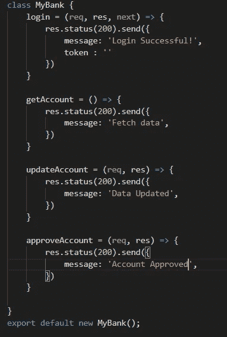
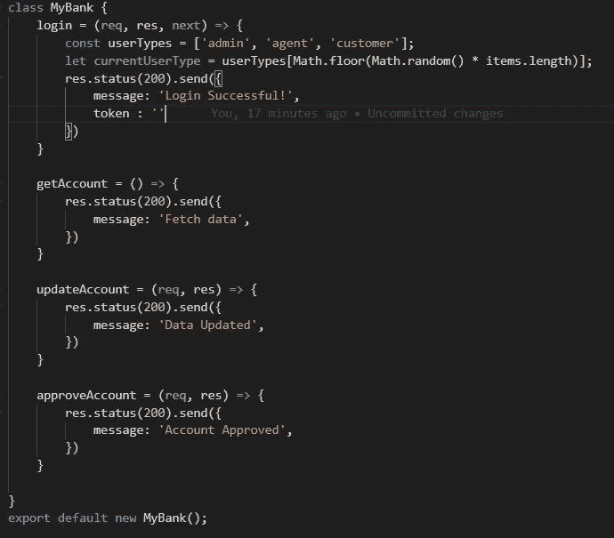

# 像专家一样基于角色的访问

> 原文：<https://javascript.plainenglish.io/role-based-access-like-a-pro-eb8f1207ca29?source=collection_archive---------9----------------------->

Photo by [Hunters Race](https://unsplash.com/@huntersrace?utm_source=medium&utm_medium=referral) on [Unsplash](https://unsplash.com?utm_source=medium&utm_medium=referral)

你有没有想过开发一个应用程序，让不同类型的用户使用它？

你心里一定有几个问题。您将如何限制用户执行特定的操作？在这种情况下，您如何管理系统的安全性？你到底应该如何为他们生成一个令牌。

今天，我们将讨论如何创建一个能够为任何角色生成令牌并像专家一样验证令牌的应用程序。

## 先决条件

我们将使用 Node Js 和 Express 创建一个 API，然后向它添加基于角色的访问。当然，我们会添加一些库来帮助我们。

## 目标

我们将创建一个银行应用程序后端，将有 3 种用户

*   顾客
*   代理人
*   管理

我们将为他们每个人生成不同的令牌，并根据角色添加限制。例如，客户可以获得他们的信息，代理可以添加/更新帐户，管理员可以批准该用户。但是现在，我们将避免注册/添加/更新/批准帐户的核心逻辑。我们将编写愚蠢的代码，只关注基于角色的访问。

## 开始

我们将克隆 [*回购*](https://github.com/Piyush-Use-Personal/Role-Based-Access.git) 的入门或如果想要完整的代码，那么你可以随时切换分支。它只是一个文件夹，有一个 express 应用程序准备好并运行在端口 8080，你只需要拉然后运行`npm install`和`npm run dev`。代码很简单，你有一堆路由和相应的控制器，用空的中间件调用回调。

我们将从发送所有路由的成功消息开始。就像下图一样。

正如我提到的，我们不会创建任何控制逻辑，所以只是放一些垃圾代码来生成随机的用户类型(这将帮助我们获得不同的令牌值)。

更新后的代码将如下所示，

现在，让我们创建一些文件来帮助我们。首先，添加一个文件夹/lib，并在该文件夹下创建一个文件 **Authentication.js** 并安装一个名为 [*jsonwebtoken*](https://www.npmjs.com/package/jsonwebtoken) 的包。一旦这个包被安装，它会给我们很多方法来使用，但我们主要集中在创建一个令牌和验证它。

现在，让我们在 middleware 文件夹中添加一个名为 AuthenticateRoles.js 的中间件。

在这里，这是至关重要的一步。首先，我们需要定义我们想要验证哪些角色，并基于此创建一个子函数，最后，创建一个主函数来处理实际验证，最后，我们可以将用户身份附加到 req.user 参数。

您还可以根据收到的错误创建多个状态代码，如果需要多个相同级别的身份验证，则可以将一组角色传递给控制器，并通过循环函数使其工作。

现在是时候看看所有的活动了。继续在路由和登录 API 中进行更改。

下面是来自 routes 文件的代码，我们可以根据之前创建的中间件和在 Login API 中生成令牌的控制器文件来应用我们必须赋予用户的任何角色。

Routes file

Controller file

现在是最后一步，

如果你去的路线:*http://localhost:8080/API/log in*

您可以使用这些路线中的任何一条来检查令牌是否正常工作。

*   *http://localhost:8080/API/account【放】*
*   *http://localhost:8080/API/*账号
*   *http://localhost:8080/API/*批准

我们将能够随机创建一个令牌，因为我们没有适当的控制逻辑，但我敢打赌，您现在已经对我们如何管理多角色身份验证有了相当的了解，如果您想查看整个项目的运行情况，请转到分支*基于角色的访问*到上述回购，或单击 [*此处*](https://github.com/Piyush-Use-Personal/Role-Based-Access/tree/role-based-access) 。

感谢阅读:)