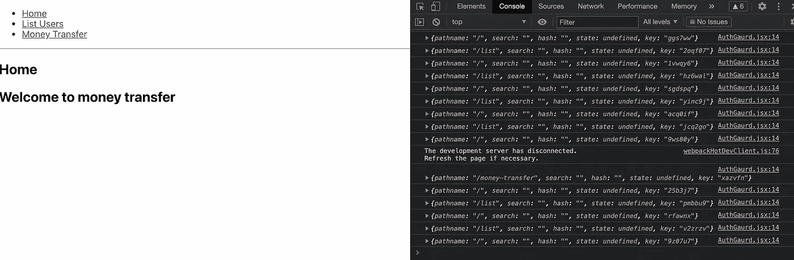

# 反应中的路线守卫

> 原文：<https://javascript.plainenglish.io/route-guards-in-react-5441b7d31334?source=collection_archive---------0----------------------->

在 React 项目中像专家一样实现授权。


React 是目前最流行的 JavaScript 框架。但是如果你在任何规模上或者为你的爱好项目使用过 React，它没有很多内置的特性，这可能是一件好事也可能是一件坏事。

## 问题空间

安全性是许多公司非常关心的问题。对于所有现实世界的项目，授权和认证都是强制性的。Route Guard 帮助我们管理混合的授权层。

## 解决办法

使用路线守卫是 Angular 中我最喜欢的功能之一，在这里你可以对你的路线进行更精细的控制，并且可以根据不同的条件使用不同的功能。

要了解更多关于 Angular 中的路线守卫，可以访问这个[链接](https://angular.io/guide/router)。

**我们将尝试在 React 中实现同样的功能。**

# 什么是路线守卫？

Route Guard 是一种对整个应用程序中可用的路线进行更多控制的机制。这些可以是简单的菜单权限，用于激活或停用路由。

为什么我们在应用程序中需要 Route Guards 是因为一个非常基本的需求——我们不希望所有用户对应用程序的所有资源拥有相同的特权。

一个例子是，你的应用程序用于管理资金转移，普通用户可以请求不同的金融服务，管理员可以批准。

为此，为了隐藏和控制收到的所有请求的列表，我们必须将路由限制为只有 admin 用户，其他任何人都不能访问该路由。

**代码入门:**

**我们将使用的工具:**

```
"react-router-dom": "^5.2.0"
```

## 基本应用程序

## RootGuard

在这个守卫中，我们可以导入所有不同的守卫，并用它们特定的实现和用例包装儿童道具。

## AuthGuard

这是处理每个路由的权限的安全措施，您可以从任何安全最佳实践中获取菜单权限，并以这样的方式存储它，即更改权限会使 JSON 无效，并从 API 带来，或者您可以加密并存储它，并使用中存在的密钥。env 你可以解密这个令牌。

## 各部分如何协同工作？

就在我们应用程序内的路由器实现下面，我们添加了根保护，它接收所有作为孩子的应用程序的内部内容。

在 react 中，子元素是一种特殊类型的道具，用于获取它所包裹的标签的所有内部元素。这允许我们执行某些操作，并且不管内部内容如何，我们的应用程序也有一些共同的样式。

Root Guard 包含我们的第一个 guard AuthGuard，它检查该应用程序的权限，并根据您的应用程序要求的任何逻辑，您可以控制应该激活哪个路由。

我们有使用效果监控我们的位置名称，位置名称只不过是当前激活的路线，每当它发生变化，警卫再次开火。

我们当前的实现在请求的路由是列表时进行检查，如果用户没有权限，它会将他们重定向到主页。您也可以将他们重定向到另一个未经授权的位置，这取决于您认为如何对您的应用程序更好。

现在，我可以访问除列表之外的所有页面，无论何时，我都可以尝试使用按钮或直接粘贴 URL 或一些我不知道的漏洞，它会将我重定向回来



## 亲 Tip

我建议让您的 API 也知道使用某种中间件登录的用户权限和授权，这样您就不会对系统资源进行不必要的更改。

更多有趣的文章敬请关注。和平！

*更多内容尽在*[*plain English . io*](http://plainenglish.io/)