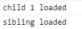
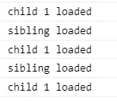
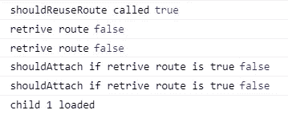
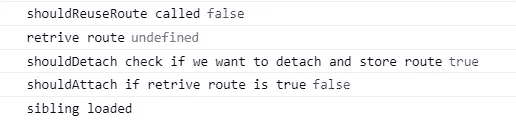
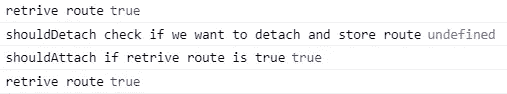
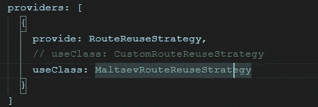

# 路由使用策略在角度上得到简化

> 原文：<https://javascript.plainenglish.io/routereusestrategy-simplified-in-angular-2e358db618d9?source=collection_archive---------2----------------------->

## 角度基础 2021

## Angular 中的路由复用策略是什么？如何实施？

最近，我在寻找最好的技术来写干净和优化我的 angular 代码。我看了很多文章，我们知道，是无限的。然后我想到用不同的基本角度的主题来巩固清单，这些主题对我有帮助，将来也可能对别人有帮助。

Photo by [Sigmund](https://unsplash.com/@sigmund?utm_source=medium&utm_medium=referral) on [Unsplash](https://unsplash.com?utm_source=medium&utm_medium=referral)

这些小文章不仅能帮助你写出更好更干净的 Angular 代码，还能让你清楚前端技术的概念。这将有助于你建立强大的基础，并能在即将到来的前端面试中帮助你。

在开始 Angular 中的 RouteReuse 策略之前，让我们先讨论一下这个问题。

## 问题

在 Angular 中使用路由从一个 URL 导航到另一个 URL。当我们导航到另一个页面时，它不会存储上一个页面的值。当我们回到上一页时，它会重新加载整个页面。到此，我们以`**performance**` 问题结束。

让我们来理解这个动画的问题。

## 说明

当我们从路线 `/parent/child`导航到`/siblings`时，Child1Component 被销毁，SiblingComponent 将被加载。

现在，当我们突然从`/sibling`导航到`/parent/child`时，SiblingComponent 被销毁，Child1Component 将被加载。

如果我们继续导航到相同的组件，这基本上会导致性能问题。

## 解决方案

当你知道你很快就会再次需要一个组件时，我们应该避免破坏它。与往常一样，Angular 提供了一个解决方案，并让您通过实现[routereustrategy](https://angular.io/api/router/RouteReuseStrategy)类来定义自己的重用策略。

**routerusestrategy**接口包含五个方法:

`*shouldReuseRoute:*` 每次在路线间导航时都会被调用。有两种类型，未来和现在。未来是我们离开的路线，当前是我们着陆的路线。

`*shouldAttach*`:当我们在这条航线的组件上着陆时，为刚刚打开的航线调用。

如果 *shouldAttach* 返回 TRUE，则`*retrieve*:`被调用。

`*shouldDetach*:`当我们**离开当前** *路线*时调用。

只有当 *shouldDetach* 返回 true 时，才会调用该方法。

## 例子

让我们来看一下动画，以了解我们可以用自定义 RouteReuseStrategy 实现什么。

## 说明

当我们启动应用程序时，我们注意到以下情况:

*   正如您在控制台中看到的，当我们第一次加载我们的路线时，下面是我们在控制台中看到的内容。

因此，正如我们看到的， **shouldReuseRoute** 被调用为 true，因为它与代码中写的条件相匹配。

*   另一个值得注意的事情是检索**T5 和 **shouldAttach** 是后来被调用的，因为它们第一次都是假的，因为我们没有做任何导航**
*   `child 1`组件已加载。

当我们开始从父路由导航到同级路由时:

*   正如您在控制台中看到的，shouldDetach 方法为 true，因为我们有了包含`data: { reuse: true },`的父组件，并且我们现在存储了以前的路由。
*   这里的**应该附加**方法是假的作为我们第一次来时的弟妹成分。
*   在最后一个兄弟节点，组件被加载。

当我们开始从同级路由导航到父路由时:

*   这里 **retrieve** 方法使用重用技术作为父组件
*   **shouldDetach** 未定义，因为同级组件在路由模块中没有定义的重用技术。
*   shouldAttach 越来越真实，我们基本上再次重用相同的组件。
*   耶！我们已经重复使用了它…参见控制台…父组件这次没有被加载，它被重复使用。

## 让我们检查一下代码

**app.module.ts**

# 结论

使用路由重用策略，我们可以避免频繁加载组件，这对于构建更高性能的 Angular 应用程序有很大帮助。

可以在这里玩 stack blitz:[https://stack blitz . com/edit/angular-route-reuse-strategy-test-project-hbycnv](https://stackblitz.com/edit/angular-route-reuse-strategy-test-project-hbycnv)

*来源:非常感谢 https://stackblitz.com/@pcurrivan**的* [*提供了这个简化的例子。*](https://stackblitz.com/@pcurrivan)

*更多内容请看*[***plain English . io***](http://plainenglish.io)