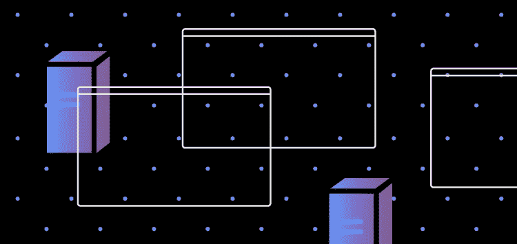

# RudderStack JavaScript SDK 增强:信标支持

> 原文：<https://javascript.plainenglish.io/rudderstack-javascript-sdk-enhancements-beacon-support-afadecbba609?source=collection_archive---------21----------------------->

T4 的核心是提供有保证的事件交付。这方面的主要挑战是跟踪服务器上的事件数据和网络故障、页面卸载等。这篇文章将讨论我们对 JS SDK 的最新增强——增加了信标支持，使它更加高效、快速和易于使用。

# 我们用来缓解跟踪事件数据挑战的不同机制。

直到最近，我们才支持使用带有持久队列的`XMLHttpRequest`向服务器发送事件数据。每当 SDK 接收到一个事件时，它会将其卸载到队列中并立即返回。队列不断提取事件数据，并使用`XMLHttpRequest`将其发送给服务器。

为了与其他流行的事件跟踪标签保持同步，我们增强了 SDK，以支持使用浏览器 [Beacon API](https://developer.mozilla.org/en-US/docs/Web/API/Navigator/sendBeacon) 发送事件数据。我们现在增加了对使用`the navigator.sendBeacon`浏览器实用程序发送事件有效负载的支持，它通过 HTTP 异步发送少量数据到 RudderStack 服务器。

# 使用 Beacon API 的利与弊

# 赞成的意见

*   与 fetch 和`XMLHttpRequest`相比，它有很多优点，比如当浏览器不太忙时，它可以作为一个更高性能的信标队列来处理发送事件，等等。
*   我们的 SDK 将事件数据作为 JSON 发送，这允许在信标部分进行 CORS 优化。
*   与其他事件发送机制相比，插入代码更少，导致 SDK 的编译时间更少。我们想进一步删除我们的持久队列，以进一步减少 SDK 的大小，但由于下面提到的限制，我们仍在使用它；我们可以称之为包装队列。

# 骗局

*   信标请求不可能重试失败的事件，因为它不支持获取响应代码。
*   信标请求有大小限制。
*   信标队列可能会变满(与上面的第 2 点相关)。我们希望我们的 SDK 支持为这个场景发送事件。当我们无法将事件数据推送到信标队列时，我们保留我们的持久队列进行重试，将这样的失败事件推送到信标队列。一旦一些事件被发送到服务器，信标可以接受更多的事件。对于通过我们的 SDK 每秒跟踪的事件数超过 Beacon 出列数的站点，这是必需的。

与 **XHR 仪器**相比，将事件推入信标队列的速度更快。您可能会在 JavaScript SDK 中看到一些性能改进。

信标请求得到了优化，因为浏览器会等到 CPU 负载降低或网络空闲时再发出实际请求。这可以带来更好的网站性能。

在我们的[文档](https://docs.rudderstack.com/rudderstack-sdk-integration-guides/rudderstack-javascript-sdk/javascript-sdk-enhancements#why-use-sendbeacon-to-send-your-event-payload)中阅读更多关于其他 JavaScript SDK 增强的内容。

# 免费注册并开始发送数据

测试我们的事件流、ELT 和反向 ETL 管道。使用我们的 HTTP 源在不到 5 分钟的时间内发送数据，或者在您的网站或应用程序中安装我们 12 个 SDK 中的一个。[上手](https://app.rudderlabs.com/signup?type=freetrial)。

本博客最初发布于:
[https://rudder stack . com/blog/rudder stack-JavaScript-SDK-enhancements-beacon-support](https://rudderstack.com/blog/rudderstack-javascript-sdk-enhancements-beacon-support)

*更多内容请看*[***plain English . io***](http://plainenglish.io)