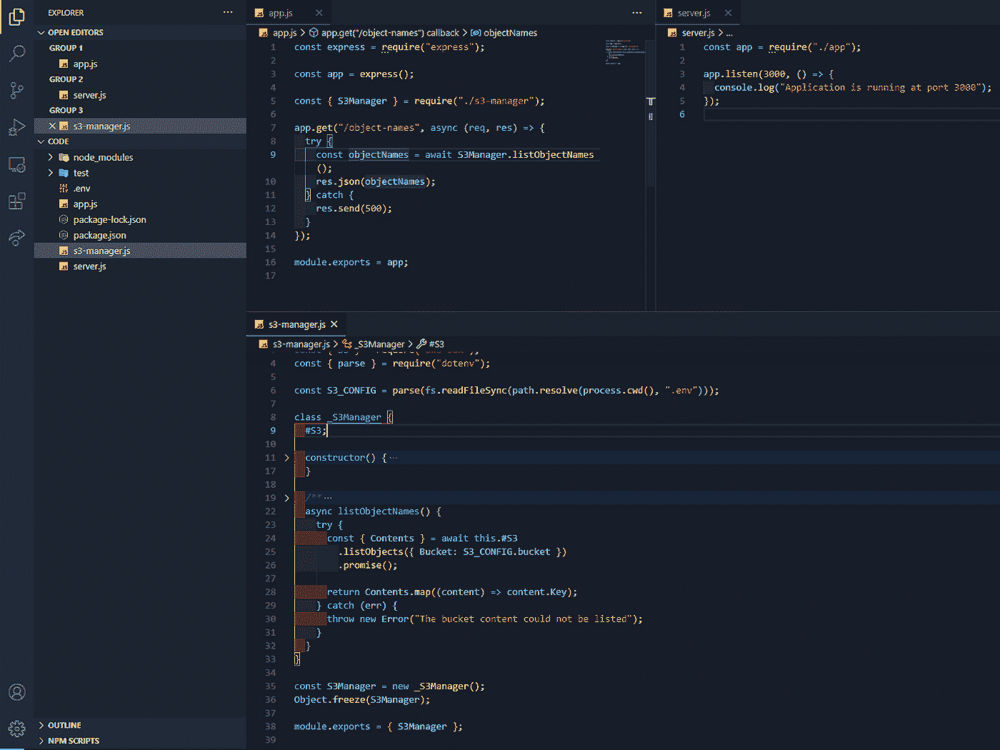
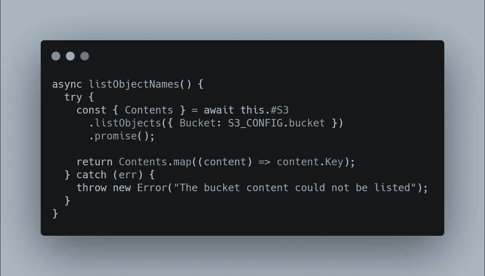
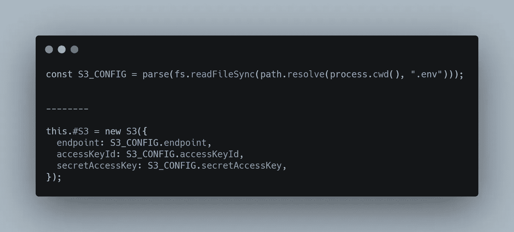
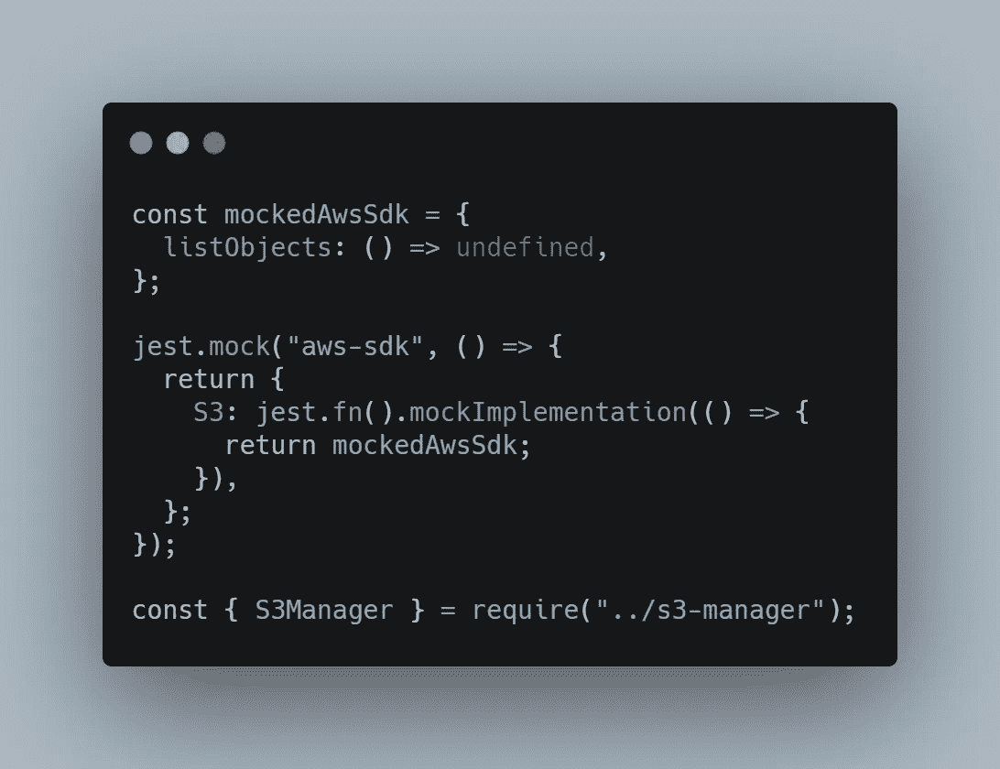
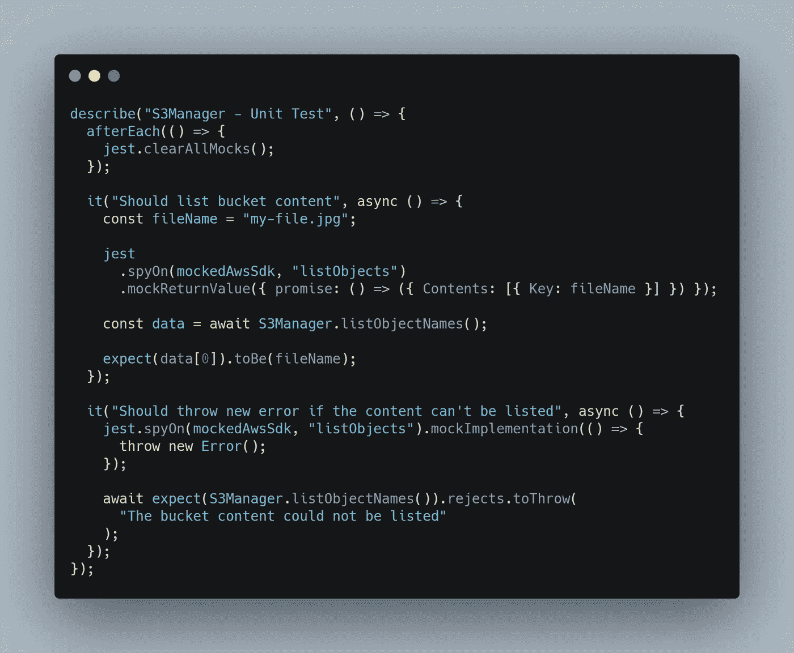
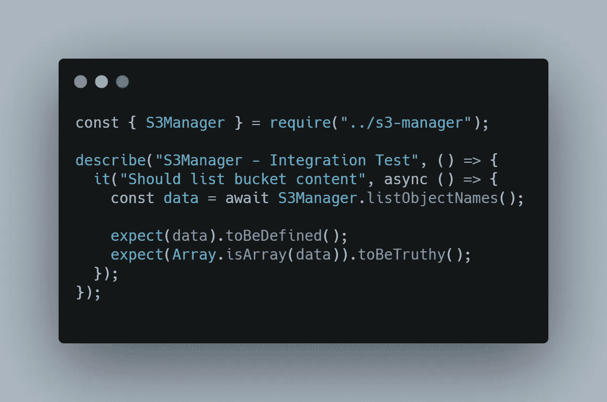
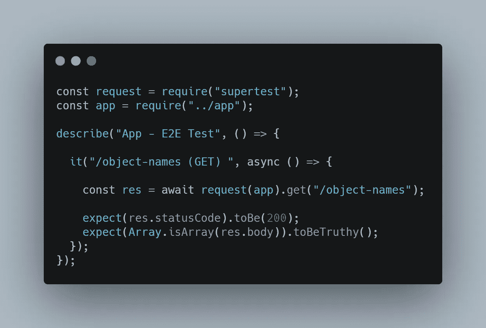
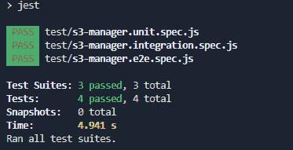
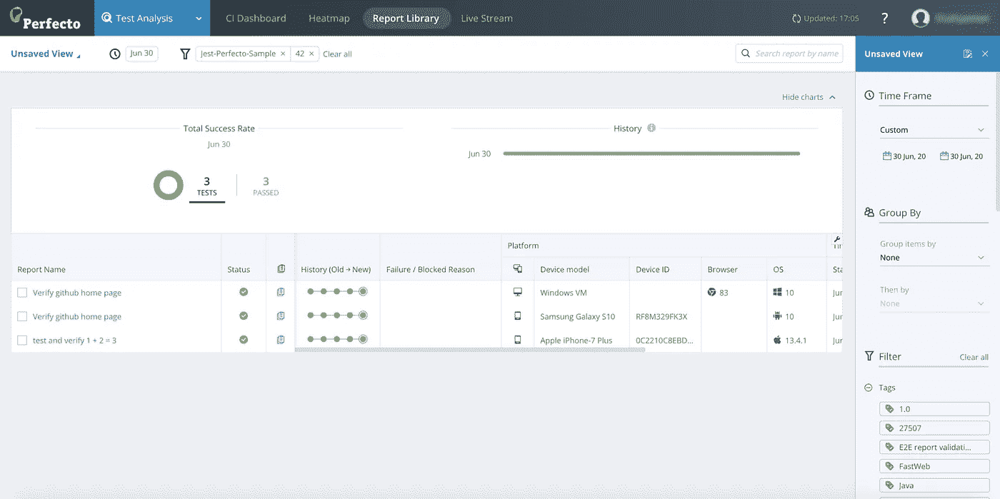

# 为基于服务器的应用程序运行自动化测试

> 原文：<https://javascript.plainenglish.io/running-automated-tests-for-a-server-based-application-487ba0b42536?source=collection_archive---------13----------------------->

Photo by [Sigmund](https://unsplash.com/@sigmund?utm_source=unsplash&utm_medium=referral&utm_content=creditCopyText) on [Unsplash](https://unsplash.com/s/photos/code?utm_source=unsplash&utm_medium=referral&utm_content=creditCopyText)

作为一名 web 开发人员，您希望确保您所交付的应用程序是稳定的，并且当被任何用户使用或被其他应用程序使用时，它不会有意外的行为。

手动执行这种检查非常耗时，尤其是当我们有一个不断变化和更新的大规模应用程序时。我们可以使用测试自动化脚本，甚至将它们与不同的工具结合起来，以充分利用它们来解决这个问题。

# 什么是自动化测试？

测试自动化与手工测试正好相反。您不用手动检查代码是否按预期工作，而是编写一个脚本来完成这项工作，并将结果与您期望得到的预定义值进行比较。自动化测试也可以针对[移动设备测试](https://www.perfecto.io/blog/mobile-testing)进行，以确保移动应用程序完美运行。

起初，编写自动化测试脚本可能会更加耗时，但是它们一直被证明是更好的长期解决方案。然而，并不是所有的事情都需要自动化；第一步是确实需要确定的一步。例如，日常的、重复的代码暗示了具有多种可能路径的高复杂性，这是一个值得自动化的测试的极好例子。

# 怎么做

以下是如何为你的应用程序编写自动化测试脚本。我们将使用 3 种最流行的测试类型:单元测试、集成测试和端到端测试，我们将为每种类型编写一个测试。

# 应用概述

在我们检查测试用例之前，让我们看看我们需要测试什么。

Target Application

我们将在本文中用作演示的应用程序是一个简单的 API，它查询一个 S3 桶并列出它的所有对象。单个端点`/object-names`将返回内容。

作为依赖项，它具有以下内容:

*   `express` —创建后端服务器
*   `aws-sdk` —与 S3 存储器通信
*   `dotenv` —加载环境变量(S3 凭证)
*   `jest & supertest` —用于测试

由于应用程序非常简单，我们将为从 S3 存储中读取对象的代码、S3Manager 类和整个应用程序的 E2E 测试用例编写单元和集成测试。

在`S3Manager`类中，只有函数`listObjectNames()`值得自动化。

该函数的代码如下:

[RAW](https://carbon.now.sh/?bg=rgba%28171%2C+184%2C+195%2C+1%29&t=seti&wt=none&l=javascript&ds=true&dsyoff=20px&dsblur=68px&wc=true&wa=true&pv=56px&ph=56px&ln=false&fl=1&fm=Hack&fs=14px&lh=133%25&si=false&es=2x&wm=false&code=async%2520listObjectNames%28%29%2520%257B%250A%2520%2520try%2520%257B%250A%2520%2520%2520%2520const%2520%257B%2520Contents%2520%257D%2520%253D%2520await%2520this.%2523S3%250A%2520%2520%2520%2520%2520%2520.listObjects%28%257B%2520Bucket%253A%2520S3_CONFIG.bucket%2520%257D%29%250A%2520%2520%2520%2520%2520%2520.promise%28%29%253B%250A%250A%2520%2520%2520%2520return%2520Contents.map%28%28content%29%2520%253D%253E%2520content.Key%29%253B%250A%2520%2520%257D%2520catch%2520%28err%29%2520%257B%250A%2520%2520%2520%2520throw%2520new%2520Error%28%2522The%2520bucket%2520content%2520could%2520not%2520be%2520listed%2522%29%253B%250A%2520%2520%257D%250A%257D)

该函数将列出给定桶中的对象，然后返回一系列对象的键(名称)。

`this.#S3`访问[私有变量](https://developer.mozilla.org/en-US/docs/Web/JavaScript/Reference/Classes/Private_class_fields)，`#S3`，该变量在构造函数中用存储凭证从`aws-sdk`库中实例化。

[RAW](https://carbon.now.sh/?bg=rgba%28171%2C+184%2C+195%2C+1%29&t=seti&wt=none&l=javascript&ds=true&dsyoff=20px&dsblur=68px&wc=true&wa=true&pv=56px&ph=56px&ln=false&fl=1&fm=Hack&fs=14px&lh=133%25&si=false&es=2x&wm=false&code=const%2520S3_CONFIG%2520%253D%2520parse%28fs.readFileSync%28path.resolve%28process.cwd%28%29%252C%2520%2522.env%2522%29%29%29%253B%250A%250A%250A--------%250A%250Athis.%2523S3%2520%253D%2520new%2520S3%28%257B%250A%2520%2520endpoint%253A%2520S3_CONFIG.endpoint%252C%250A%2520%2520accessKeyId%253A%2520S3_CONFIG.accessKeyId%252C%250A%2520%2520secretAccessKey%253A%2520S3_CONFIG.secretAccessKey%252C%250A%257D%29%253B)

# 单元测试

[单元测试](https://en.wikipedia.org/wiki/Unit_testing)是指我们将代码功能彼此隔离开来，测试最小的单元:一个函数、一个类、一个模块等等。

单元测试的目的是尽早识别并修复代码中的错误。编写单元测试可能有点困难，因为被测试的单元必须通过模仿它与之交互的其他模块(内部的或外部的)与代码的其余部分隔离开来。

在新文件名`s3-manager.unit.spec.js`中，我们将从模仿外部依赖关系开始。当我们使用来自`aws-sdk`库的`listObjects`方法时，模拟将如下所示:

[RAW](https://carbon.now.sh/?bg=rgba%28171%2C+184%2C+195%2C+1%29&t=seti&wt=none&l=javascript&ds=true&dsyoff=20px&dsblur=68px&wc=true&wa=true&pv=56px&ph=56px&ln=false&fl=1&fm=Hack&fs=14px&lh=133%25&si=false&es=2x&wm=false&code=const%2520mockedAwsSdk%2520%253D%2520%257B%250A%2520%2520listObjects%253A%2520%28%29%2520%253D%253E%2520undefined%252C%250A%257D%253B%250A%250Ajest.mock%28%2522aws-sdk%2522%252C%2520%28%29%2520%253D%253E%2520%257B%250A%2520%2520return%2520%257B%250A%2520%2520%2520%2520S3%253A%2520jest.fn%28%29.mockImplementation%28%28%29%2520%253D%253E%2520%257B%250A%2520%2520%2520%2520%2520%2520return%2520mockedAwsSdk%253B%250A%2520%2520%2520%2520%257D%29%252C%250A%2520%2520%257D%253B%250A%257D%29%253B%250A%250Aconst%2520%257B%2520S3Manager%2520%257D%2520%253D%2520require%28%2522..%252Fs3-manager%2522%29%253B)

这里值得一提的是，我们创建了一个名为`mockedAwsSdk`的新常量，其中定义了测试目标正在使用的方法。我们默认返回 undefined，因为我们将在每个测试用例中设置我们想要返回的实际值。

同时，mock 是在导入`S3Manager`类之前声明的。因此，当执行来自`s3-manager.js`的代码时，它将导入`aws-sdk`库，它将导入我们声明的这个常量。

我们的目标函数的圈复杂度为 2。这是因为我们的代码有两个可能的路径:一个在 try 块中，一个在 catch 中。因此，我们需要编写两个单元测试，看看两个路径的预期结果是否都正确返回。

对于第一个路径，即`try`块，我们期望一个字符串数组，对于第二个路径，即`catch`块，我们期望一个定制的错误消息。

这两条路径可以用下面的测试套件来验证。

[RAW](https://carbon.now.sh/?bg=rgba%28171%2C+184%2C+195%2C+1%29&t=seti&wt=none&l=javascript&ds=true&dsyoff=20px&dsblur=68px&wc=true&wa=true&pv=56px&ph=56px&ln=false&fl=1&fm=Hack&fs=14px&lh=133%25&si=false&es=2x&wm=false&code=describe%28%2522S3Manager%2520-%2520Unit%2520Test%2522%252C%2520%28%29%2520%253D%253E%2520%257B%250A%2520%2520afterEach%28%28%29%2520%253D%253E%2520%257B%250A%2520%2520%2520%2520jest.clearAllMocks%28%29%253B%250A%2520%2520%257D%29%253B%250A%250A%2520%2520it%28%2522Should%2520list%2520bucket%2520content%2522%252C%2520async%2520%28%29%2520%253D%253E%2520%257B%250A%2520%2520%2520%2520const%2520fileName%2520%253D%2520%2522my-file.jpg%2522%253B%250A%2520%2520%2520%2520%250A%2520%2520%2520%2520jest%250A%2520%2520%2520%2520%2520%2520.spyOn%28mockedAwsSdk%252C%2520%2522listObjects%2522%29%250A%2520%2520%2520%2520%2520%2520.mockReturnValue%28%257B%2520promise%253A%2520%28%29%2520%253D%253E%2520%28%257B%2520Contents%253A%2520%255B%257B%2520Key%253A%2520fileName%2520%257D%255D%2520%257D%29%2520%257D%29%253B%250A%250A%2520%2520%2520%2520const%2520data%2520%253D%2520await%2520S3Manager.listObjectNames%28%29%253B%250A%2520%2520%2520%2520%250A%2520%2520%2520%2520expect%28data%255B0%255D%29.toBe%28fileName%29%253B%250A%2520%2520%257D%29%253B%250A%250A%2520%2520it%28%2522Should%2520throw%2520new%2520error%2520if%2520the%2520content%2520can%27t%2520be%2520listed%2522%252C%2520async%2520%28%29%2520%253D%253E%2520%257B%250A%2520%2520%2520%2520jest.spyOn%28mockedAwsSdk%252C%2520%2522listObjects%2522%29.mockImplementation%28%28%29%2520%253D%253E%2520%257B%250A%2520%2520%2520%2520%2520%2520throw%2520new%2520Error%28%29%253B%250A%2520%2520%2520%2520%257D%29%253B%250A%250A%2520%2520%2520%2520await%2520expect%28S3Manager.listObjectNames%28%29%29.rejects.toThrow%28%250A%2520%2520%2520%2520%2520%2520%2522The%2520bucket%2520content%2520could%2520not%2520be%2520listed%2522%250A%2520%2520%2520%2520%29%253B%250A%2520%2520%257D%29%253B%250A%257D%29%253B)

在第一个测试中，我们模拟了来自`aws-sdk`的`listObjects`函数来返回一个硬编码的对象数组，并且我们测试了我们的函数`listObjectNames`将正确地遍历这个数组并提取每个对象的键。

在第二个测试中，我们模仿了来自`aws-sdk`的同一个函数，但是这一次抛出了一个错误，我们测试了我们的目标函数可以捕捉这个错误并为它返回一个定制的消息。

同时，我们定义了一个`afterEach`钩子来删除我们在每个测试用例中定义的模拟。

# 集成测试

在[集成测试](https://www.javatpoint.com/integration-testing)中，我们测试模块如何相互交互。在我们的情况下，我们需要测试`S3Manager`类使用了我们已经正确安装的`aws-sdk`库。因此，我们只需要测试一下`try`路径，看看是否返回了一个包含对象的数组，或者如果存储为空，则没有对象。

在一个名为`s3-manager.integration.spec.ts`的新文件中，我们将定义下面的测试。

[RAW](https://carbon.now.sh/?bg=rgba%28171%2C+184%2C+195%2C+1%29&t=seti&wt=none&l=javascript&ds=true&dsyoff=20px&dsblur=68px&wc=true&wa=true&pv=56px&ph=56px&ln=false&fl=1&fm=Hack&fs=14px&lh=133%25&si=false&es=2x&wm=false&code=const%2520%257B%2520S3Manager%2520%257D%2520%253D%2520require%28%2522..%252Fs3-manager%2522%29%253B%250A%250Adescribe%28%2522S3Manager%2520-%2520Integration%2520Test%2522%252C%2520%28%29%2520%253D%253E%2520%257B%250A%2520%2520it%28%2522Should%2520list%2520bucket%2520content%2522%252C%2520async%2520%28%29%2520%253D%253E%2520%257B%250A%2520%2520%2520%2520const%2520data%2520%253D%2520await%2520S3Manager.listObjectNames%28%29%253B%250A%250A%2520%2520%2520%2520expect%28data%29.toBeDefined%28%29%253B%250A%2520%2520%2520%2520expect%28Array.isArray%28data%29%29.toBeTruthy%28%29%253B%250A%2520%2520%257D%29%253B%250A%257D%29%253B%250A)

对于集成测试，我们不再模仿`aws-sdk`库，我们将允许来自文件`s3-manager.js`的代码导入已安装的依赖项。

由于对象存储可能是空的，我们只测试是否返回了一个值，并且该值是一个数组。

# E2E 测试

在[端到端测试](https://www.guru99.com/end-to-end-testing.html)中，我们测试了整个应用从一端到另一端的工作情况。

在我们的例子中，我们将测试通过 GET 请求请求 bucket 内容的整个工作流是否会像预期的那样工作，并返回一个字符串数组。

在名为`s3-manager.e2e.spec.ts`的新文件中，我们将定义下面的测试。

[RAW](https://carbon.now.sh/?bg=rgba%28171%2C+184%2C+195%2C+1%29&t=seti&wt=none&l=javascript&ds=true&dsyoff=20px&dsblur=68px&wc=true&wa=true&pv=56px&ph=56px&ln=false&fl=1&fm=Hack&fs=14px&lh=133%25&si=false&es=2x&wm=false&code=const%2520request%2520%253D%2520require%28%2522supertest%2522%29%253B%250Aconst%2520app%2520%253D%2520require%28%2522..%252Fapp%2522%29%253B%250A%250Adescribe%28%2522App%2520-%2520E2E%2520Test%2522%252C%2520%28%29%2520%253D%253E%2520%257B%250A%250A%2520%2520it%28%2522%252Fobject-names%2520%28GET%29%2520%2522%252C%2520async%2520%28%29%2520%253D%253E%2520%257B%250A%2520%2520%250A%2520%2520%2520%2520const%2520res%2520%253D%2520await%2520request%28app%29.get%28%2522%252Fobject-names%2522%29%253B%250A%2520%250A%2520%2520%2520%2520expect%28res.statusCode%29.toBe%28200%29%253B%250A%2520%2520%2520%2520expect%28Array.isArray%28res.body%29%29.toBeTruthy%28%29%253B%250A%2520%2520%257D%29%253B%250A%257D%29%253B)

如果我们运行`jest`来执行这些测试套件，我们应该会看到我们的代码是否如设计的那样工作。

Test Report

# 从测试中获得更多

拥有一个自动化测试总是首选的方式。你写一次，每次都自动执行。但是为复杂的任务编写和管理大规模的自动化测试脚本会变得具有挑战性。

尽管如此，我们使用的开源依赖项，如`jest`和`supertest`，仍然存在，因为它们使测试过程更加简单。

然而，当复杂性增加时，扩展自动化流程并将其成功集成到 DevOps 方法中可能还不够。

当测试自动化变得势不可挡时，您可以将其他更高级的工具引入到过程中。这可以通过从测试套件中收集更多的信息并提供多个测试目标来帮助您管理和增强您的测试套件。

一个这样的工具是 [Perfecto](https://www.perfecto.io/free-trial) ，它作为测试自动化的统一云平台。从分散在多个目标上的大量测试套件中获取数据可能具有挑战性。Perfecto 的一个好处是，您可以配置它来生成智能报告，并一次在多个目标上运行测试套件。

# 结论

编写测试自动化是每个人都在做的事情，也是任何 web 应用程序的必经之路。不仅能给你稳定，还能给你速度。有很多工具可以帮助您启动自动化过程，并超越基本测试。

然而，最重要的是选择最适合您需求的工具，并确定您的应用程序中值得自动化的地方。

*更多内容尽在*[***plain English . io***](http://plainenglish.io/)