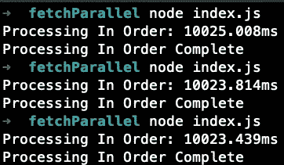
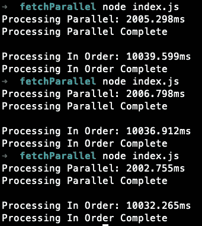

# 并行运行 JavaScript 函数

> 原文：<https://javascript.plainenglish.io/running-javascript-functions-in-parallel-baf0e2fc6b11?source=collection_archive---------2----------------------->


在这个快速教程中，我们将介绍并行执行异步 JavaScript 函数以及对代码执行时间的影响。

# 问题是

假设我们需要进行一系列异步函数调用。这可能包括:API 调用、超时或者读/写文件(如果使用 Node 的话)。为了模拟并行运行这些请求的效果，我们将创建一个简单的函数，在解析承诺之前等待 2 秒钟。

```
function **makeRequest**() {
    return new **Promise**((*resolve*) =>
        **setTimeout**(() => resolve({ status: 'done' }), 2000)
    )
}
```

从那里，我们将执行请求 5 次，并测量完成所有请求的时间。为了给我们的函数计时，我们利用了 ***console.time*** 和 ***console.timeEnd.*** 一旦所有的请求完成，时间(以毫秒为单位)将在控制台中输出，我们返回以停止执行。

```
async function **processInOrder**() {
    console.time('Processing In Order')
    for (let i = 0; i < 5; i++) { 
        await **makeRequest**()
     }
    console.timeEnd('Processing In Order')
    console.log('Processing In Order Complete')
    **return**;
}
```



在运行测试 3 次后，我们可以看到我们的结果在 10 秒多一点的时间内几乎相同。这非常有意义，因为我们调用的函数需要 2 秒来解决 5 个单独的时间，总共需要 10 秒。现在，如果我告诉你，我们可以将所有请求的时间缩短到略多于 2s。

# **解决方案**

为了解决这个问题，我们可以使用 ***Promise.all —*** ，它将一个可迭代的承诺作为输入，并返回一个承诺，该承诺解析为输入承诺的结果数组。只有当输入的所有 都已解决时，该返回的承诺才会解决。

```
const *arrayOfPromises* = [
    **makeRequest**(),
    **makeRequest**(),
    **makeRequest**(),
    **makeRequest**(),
    **makeRequest**()
]async function **processParallel**(*arrayOfPromises*) {
    console.time('Processing Parallel')
    await Promise.all(*arrayOfPromises*)
    console.timeEnd('Processing Parallel')
    console.log('Processing Parallel Complete  \n')
    return;
}**processParallel**(*arrayOfPromises)*
```

正如你所看到的，我们非常接近每次运行两秒钟的完美时间。无论是编写客户端代码还是服务器端代码，这都是加速 JavaScript 的好方法。



在某些情况下，您的后端必须处理对数据库或外部 API 的多个请求，这是性能至关重要的地方，并且使用 ***Promise.all*** 并行运行请求确实很出色。