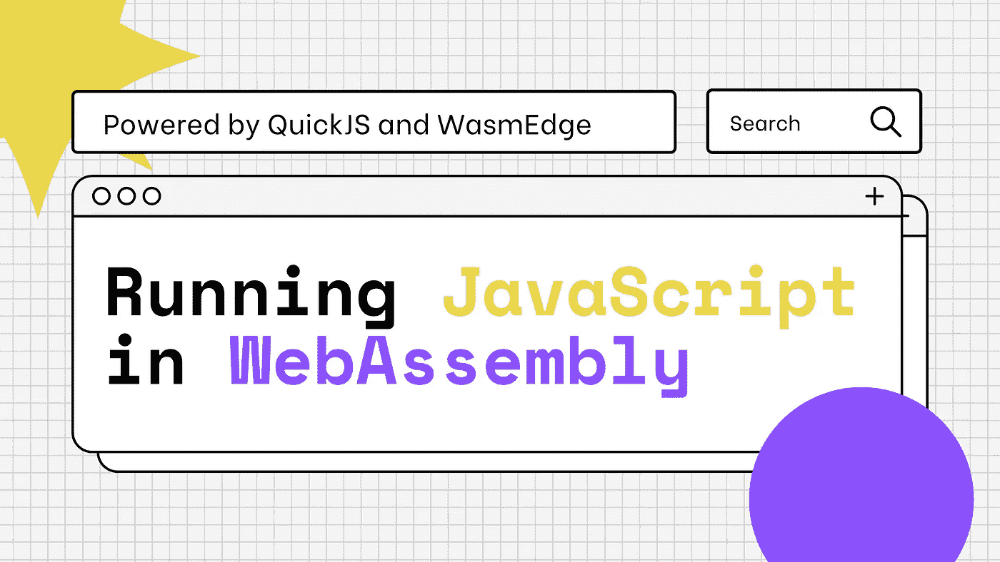
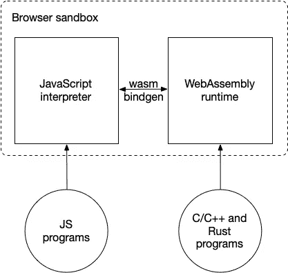
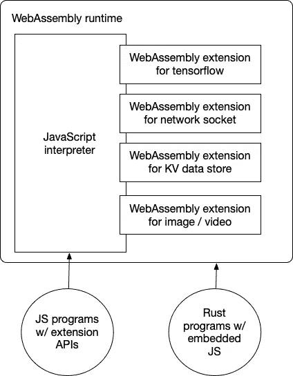

# 使用 WasmEdge 在 WebAssembly 中运行 JavaScript

> 原文：<https://javascript.plainenglish.io/running-javascript-in-webassembly-883ec71438e1?source=collection_archive---------8----------------------->



[WebAssembly](https://webassembly.org/) 一开始是“浏览器的 JavaScript 替代品”。想法是在浏览器中安全地运行由 C/C++或 Rust 等语言编译的高性能应用程序。在浏览器中，WebAssembly 与 JavaScript 并行运行。



Figure 1\. WebAssembly and JavaScript in the browser.

随着 WebAssembly 越来越多地在云中使用，它现在是云原生应用的通用运行时。与 Docker 类应用程序容器相比，WebAssembly 运行时以较低的资源消耗实现了更高的性能。云中 WebAssembly 的常见用例包括。

*   [无服务器功能即服务](https://github.com/second-state/aws-lambda-wasm-runtime) (FaaS)的运行时
*   将[用户自定义函数嵌入 SaaS](http://reactor.secondstate.info/en/docs/) 应用程序或数据库
*   服务网格中[边车应用](https://github.com/second-state/dapr-wasm)的运行时间
*   用于 web 代理的可编程插件
*   边缘设备的沙盒运行时间，包括[软件定义的工具](https://www.secondstate.io/articles/second-state-joins-the-autoware-foundation/)和智能工厂

然而，在那些云原生用例中，开发人员通常希望使用 JavaScript 来编写业务应用程序。这意味着我们现在必须在 WebAssembly 中支持 [JavaScript。此外，我们应该支持在 WebAssembly 运行时从 JavaScript 调用 C/C++或 Rust 函数，以利用 WebAssembly 的计算效率。WasmEdge WebAssembly 运行时允许您这样做。](https://github.com/WasmEdge/WasmEdge/blob/master/docs/run_javascript.md)



Figure 2\. WebAssembly and JavaScript in the cloud.

# 瓦斯梅奇

[WasmEdge](https://github.com/WasmEdge/WasmEdge) 是领先的云原生 WebAssembly 运行时[，由 CNCF](https://www.secondstate.io/articles/wasmedge-joins-cncf/) (云原生计算基金会)/ Linux 基金会托管。它是当今市场上最快的 WebAssembly 运行时。WasmEdge 支持所有标准的 WebAssembly 扩展以及 Tensorflow 推理、KV 存储和图像处理等专有扩展。其编译器工具链不仅支持 C/C++、Rust、Swift、Kotlin 和 AssemblyScript 等 WebAssembly 语言，还支持[常规 JavaScript](https://github.com/WasmEdge/WasmEdge/blob/master/docs/run_javascript.md) 。

WasmEdge 应用程序可以嵌入到一个 [C](https://github.com/WasmEdge/WasmEdge/blob/master/docs/c_api_quick_start.md) 程序、一个 [Go](https://www.secondstate.io/articles/extend-golang-app-with-webassembly-rust/) 程序、一个 [Rust](https://github.com/WasmEdge/WasmEdge/tree/master/bindings/rust) 程序、一个 [JavaScript](https://www.secondstate.io/articles/getting-started-with-rust-function/) 程序或者操作系统的 [CLI](https://github.com/WasmEdge/WasmEdge/blob/master/docs/run.md) 中。运行时可以由 Docker 工具(如 [CRI-O](https://www.secondstate.io/articles/manage-webassembly-apps-in-wasmedge-using-docker-tools/) )、编排工具(如 K8s)、无服务器平台(如 [Vercel](https://www.secondstate.io/articles/vercel-wasmedge-webassembly-rust/) 、 [Netlify](https://www.secondstate.io/articles/netlify-wasmedge-webassembly-rust-serverless/) 、 [AWS Lambda](https://www.cncf.io/blog/2021/08/25/webassembly-serverless-functions-in-aws-lambda/) 、[腾讯 SCF](https://github.com/second-state/tencent-scf-wasm-runtime) )和数据流框架(如 [YoMo](https://www.secondstate.io/articles/yomo-wasmedge-real-time-data-streams/) 和 Zenoh)来管理。

现在，您可以在 WasmEdge 支持的无服务器功能、微服务和 AIoT 应用程序中运行 JavaScript 程序！它不仅运行普通的 JavaScript 程序，还允许开发人员使用 Rust 和 C/C++在 WebAssembly 的安全沙箱中创建新的 JavaScript APIs。

# 在 WasmEdge 中构建 JavaScript 引擎

首先，让我们为 WasmEdge 构建一个基于 WebAssmbly 的 JavaScript 解释程序。它基于带有 WasmEdge 扩展的 [QuickJS](https://bellard.org/quickjs/) ，如[网络套接字](https://github.com/second-state/wasmedge_wasi_socket)和[张量流推理](https://www.secondstate.io/articles/wasi-tensorflow/)，作为 JavaScript APIs 并入解释器。你需要[安装 Rust](https://www.rust-lang.org/tools/install) 来构建解释器。

> *如果只是想用解释器运行 JavaScript 程序，可以跳过这一节。确保你已经安装了* [*锈*](https://www.rust-lang.org/tools/install) *和* [*锈*](https://github.com/WasmEdge/WasmEdge/blob/master/docs/install.md) *。*

派生或克隆 wasmegde-quickjs Github 存储库来开始。

```
$ git clone [https://github.com/second-state/wasmedge-quickjs](https://github.com/second-state/wasmedge-quickjs)
```

按照报告中的说明，您将能够为 WasmEdge 构建一个 JavaScript 解释器。

```
# Install GCC
$ sudo apt update
$ sudo apt install build-essential# Install wasm32-wasi target for Rust
$ rustup target add wasm32-wasi# Build the QuickJS JavaScript interpreter
$ cargo build --target wasm32-wasi --release
```

基于 WebAssembly 的 JavaScript 解释程序位于构建目标目录中。您现在可以尝试一个简单的“hello world”JavaScript 程序( [example_js/hello.js](https://github.com/second-state/wasmedge-quickjs/blob/main/example_js/hello.js) )，它将命令行参数打印到控制台。

```
args = args.slice(1)
print("Hello", ...args)
```

在 WasmEdge 的 QuickJS 运行时运行`hello.js`文件，如下所示。注意，命令行上的`--dir .:.`是为了给`wasmedge`权限来读取`hello.js`文件在文件系统中的本地目录。

```
$ cd example_js
$ wasmedge --dir .:. ../target/wasm32-wasi/release/wasmedge_quickjs.wasm hello.js WasmEdge Runtime
Hello WasmEdge Runtime
```

# ES6 模块支持

WasmEdge QuickJS 运行时支持 ES6 模块。GitHub repo 中的[example _ js/es6 _ module _ demo](https://github.com/second-state/wasmedge-quickjs/tree/main/example_js/es6_module_demo)文件夹包含一个例子。 [module_def.js](https://github.com/second-state/wasmedge-quickjs/blob/main/example_js/es6_module_demo/module_def.js) 文件定义并导出一个简单的 js 函数。

```
function hello(){
    console.log('hello from module_def.js')
}export {hello}
```

[module_def_async.js](https://github.com/second-state/wasmedge-quickjs/blob/main/example_js/es6_module_demo/module_def_async.js) 文件定义并导出 aysnc 函数和变量。

```
export async function hello(){
    console.log('hello from module_def_async.js')
    return "module_def_async.js : return value"
}export var something = "async thing"
```

[demo.js](https://github.com/second-state/wasmedge-quickjs/blob/main/example_js/es6_module_demo/demo.js) 文件从这些模块中导入函数和变量并执行它们。

```
import { hello as module_def_hello } from './module_def.js'
module_def_hello()var f = async ()=>{
    let {hello , something} = await import('./module_def_async.js')
    await hello()
    console.log("./module_def_async.js `something` is ",something)
}
f()
```

要运行该示例，您可以在 CLI 上执行以下操作。

```
$ cd example_js/es6_module_demo
$ wasmedge --dir .:. ../../target/wasm32-wasi/release/wasmedge_quickjs.wasm demo.js
hello from module_def.js
hello from module_def_async.js
./module_def_async.js `something` is  async thing
```

接下来，让我们尝试几个更高级的 JavaScript 程序。

# JavaScript 网络客户端示例

解释器支持 WasmEdge 网络套接字扩展，这样您的 JavaScript 就可以与互联网建立 HTTP 连接。这里有一个 JavaScript 的例子。

```
let r = GET("http://18.235.124.214/get?a=123",{"a":"b","c":[1,2,3]})
print(r.status)

let headers = r.headers
print(JSON.stringify(headers))let body = r.body;
let body_str = new Uint8Array(body)
print(String.fromCharCode.apply(null,body_str))
```

要在 WasmEdge 运行时运行 JavaScript，您可以在 CLI 上执行此操作。

```
$ cd example_js
$ wasmedge --dir .:. ../target/wasm32-wasi/release/wasmedge_quickjs.wasm http_demo.js
```

现在，您应该可以在控制台上看到 HTTP GET 结果。

# JavaScript 网络服务器示例

下面是一个 JavaScript 运行 HTTP 服务器监听端口 3000 的例子。

```
import {HttpServer} from 'http'let http_server = new HttpServer('0.0.0.0:8000')
print('listen on 0.0.0.0:8000')while(true){
    http_server.accept((request)=>{
        let body = request.body
        let body_str = String.fromCharCode.apply(null,new Uint8Array(body))
        print(JSON.stringify(request),'\n body_str:',body_str) return {
            status:200,
            header:{'Content-Type':'application/json'},
            body:'echo:'+body_str
        }
    });
}
```

要在 WasmEdge 运行时运行 JavaScript，您可以在 CLI 上执行此操作。既然是服务器，就应该在后台运行。

```
$ cd example_js
$ nohup wasmedge --dir .:. ../target/wasm32-wasi/release/wasmedge_quickjs.wasm http_server_demo.js &
```

然后，您可以通过在网络上查询服务器来测试它。

```
$ curl -d "WasmEdge" -X POST http://localhost:8000
echo:WasmEdge
```

现在，您应该看到控制台上打印的 HTTP POST 主体。

# JavaScript Tensorflow 推理示例

解释器支持 WasmEdge Tensorflow lite 推理扩展，因此您的 JavaScript 可以运行 ImageNet 模型进行图像分类。这里有一个 JavaScript 的例子。

```
import {TensorflowLiteSession} from 'tensorflow_lite'
import {Image} from 'image'let img = new Image('./example_js/tensorflow_lite_demo/food.jpg')let img_rgb = img.to_rgb().resize(192,192)
let rgb_pix = img_rgb.pixels()let session = new TensorflowLiteSession('./example_js/tensorflow_lite_demo/lite-model_aiy_vision_classifier_food_V1_1.tflite')session.add_input('input',rgb_pix)
session.run()
let output = session.get_output('MobilenetV1/Predictions/Softmax');
let output_view = new Uint8Array(output)
let max = 0;
let max_idx = 0;
for (var i in output_view){
    let v = output_view[i]
    if(v>max){
        max = v;
        max_idx = i;
    }
}
print(max,max_idx)
```

要在 WasmEdge 运行时运行 JavaScript，您可以在 CLI 上执行以下操作，使用 Tensorflow 重新构建 QuickJS 引擎，然后使用 Tensorflow API 运行 JavaScript 程序。

```
$ cargo build --target wasm32-wasi --release --features=tensorflow
... ...
$ cd example_js/tensorflow_lite_demo
$ wasmedge-tensorflow-lite --dir .:. ../../target/wasm32-wasi/release/wasmedge_quickjs.wasm main.js
label:
Hot dog
confidence:
0.8941176470588236
```

## 注意:

*   编译器标志用 WasmEdge Tensorflow 扩展构建 QuickJS 引擎的一个版本。
*   `wasmedge-tensorflow-lite`程序是 WasmEdge 包的一部分。它是内置了 Tensorflow 扩展的 WasmEdge 运行时。

现在，您应该可以看到 TensorFlow lite ImageNet 模型识别的食品名称。

# 让它更快

上面的 Tensorflow 推理示例需要 1-2 秒来运行。这在 web 应用程序场景中是可以接受的，但还可以改进。回想一下，WasmEdge 是当今最快的 WebAssembly 运行时，这是因为它的 AOT(提前编译)优化。WasmEdge 提供了一个`wasmedgec`实用程序来将`wasm`文件编译到一个本地的`so`共享库中。您可以使用`wasmedge`来运行`so`文件，而不是`wasm`文件，以获得更快的性能。

以下示例使用扩展版本的`wasmedge`和`wasmedgec`来支持 WasmEdge Tensorflow 扩展。

```
$ cd example_js/tensorflow_lite_demo
$ wasmedgec-tensorflow ../../target/wasm32-wasi/release/wasmedge_quickjs.wasm wasmedge_quickjs.so
$ wasmedge-tensorflow-lite --dir .:. wasmedge_quickjs.so main.js
label:
Hot dog
confidence:
0.8941176470588236
```

你可以看到图像分类任务可以在 0.1s 内完成，至少是 10x 的提升！

> *`*so*`*共享库不能跨机器和操作系统移植。您应该在您部署和运行应用程序的机器上运行* `*wasmedgec*` *和* `*wasmedgec-tensorflow*` *。**

# *关于 QuickJS 的一个注记*

*现在，选择 QuickJS 作为我们的 JavaScript 引擎可能会带来性能问题。QuickJS [不是因为缺乏 JIT 支持而比 v8 慢很多吗？是的，但是…](https://bellard.org/quickjs/bench.html)*

*首先 QuickJS 比 v8 小很多。事实上，它只占用 v8 消耗的运行时资源的 1/40(或 2.5%)。在一台物理机器上，您可以运行比 v8 函数更多的 QuickJS 函数。*

*其次，对于大多数业务逻辑应用程序，原始性能并不重要。该应用程序可能有计算密集型任务，如人工智能的飞行推理。WasmEdge 允许 QuickJS 应用程序使用高性能的 WebAssembly 来完成这些任务，而在 v8 中添加这样的扩展模块并不容易。*

*第三，众所周知[许多 JavaScript 安全问题源于 JIT](https://www.theregister.com/2021/08/06/edge_super_duper_security_mode/) 。也许在云原生环境中关闭 JIT 并不是一个坏主意！*

# *下一步是什么？*

*示例演示了如何在 WasmEdge 中使用`wasmedge-quickjs.wasm` JavaScript 引擎。除了使用 CLI，您还可以使用 [Docker / Kubernetes tools](https://www.secondstate.io/articles/manage-webassembly-apps-in-wasmedge-using-docker-tools/) 来启动 WebAssembly 应用程序，或者将该应用程序嵌入到您自己的应用程序或框架中，正如我们在本文前面所讨论的。*

*在接下来的几篇文章中，我将重点介绍如何结合使用 JavaScript 和 Rust 来充分利用这两种语言。*

*   *[将 JavaScript 整合到 Rust 应用中](https://www.secondstate.io/articles/embed-javascript-in-rust/)*
*   *[使用 Rust 创建高性能 JavaScript APIs】](https://www.secondstate.io/articles/embed-rust-in-javascript/)*
*   *[从 JavaScript 调用本地函数](https://www.secondstate.io/articles/call-native-functions-from-javascript/)*

*云原生 WebAssembly 中的 JavaScript 仍然是下一代云和边缘计算基础设施中的新兴领域。我们才刚刚开始！如果您感兴趣，请加入我们的 [WasmEdge](https://github.com/WasmEdge/WasmEdge) 项目(或者通过提出功能请求问题告诉我们您想要什么)。*

# **更多内容请看*[***plain English . io***](http://plainenglish.io/)*