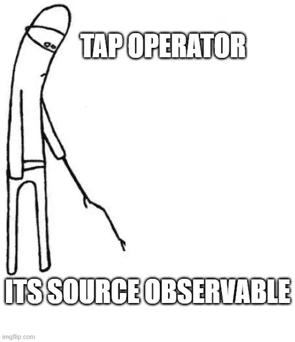
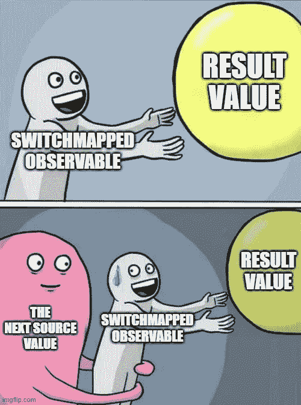

# 图片中的 RxJS 操作符，但大多是模因

> 原文：<https://javascript.plainenglish.io/rxjs-operators-in-pictures-but-mostly-memes-7137cea5c8cc?source=collection_archive---------19----------------------->

在这个系列中，我想用图片或模因来描述一些 RxJS 算子。当然，我也会提供一个描述，但是我总是可以通过一些有趣的参考或故事学到一些更容易的东西。

在这里，我不会真的遵循任何类型的路径，但是我尝试从不太复杂的操作符到更高级、更复杂的操作符。让我们投入进去吧！

# 地图操作员

The map operator with a meme

这是 RxJS 中使用最多的操作符之一。这个操作符基本上是扩展到异步流的 Array.map 函数。它以回调作为参数，在这个回调中，我们得到由可观察对象发出的值，我们可以改变它，用它做一些计算，然后返回一个我们想传递给结果可观察对象的值，传递给下一个操作者或订阅者。

我在 Angular 中发现这个操作符最常见的用例之一是映射来自 API 请求的值。例如，我通常用它将日期字符串值映射到实际的日期对象中。

# 水龙头操作者

Tap operator waiting for the source to emit something

tap 操作符主要用于副作用和/或调试目的。这与 Array 上的 forEach 方法非常相似。但是，不要将它与 forEach 方法混淆。当您不想更改发出的值，只想以某种方式处理它，比如将它传递给另一个方法时，您可以使用这个操作符。例如，您可以使用它来显示通知或将值传递给 console.log 以进行调试。如果我们将 NgRx 添加到组合中，那么 tap 操作符可以用于调度副作用的操作。

# switchMap 运算符

Mapped Observable sweating to complete

您可以将 switchMap 操作符视为一种特殊的映射操作符，因此得名。简单地说，就是把输入的可观测值映射到其他可观测值，并切换到那些可观测值。这意味着，你可以用它来切换到另一个可观测的。例如，您可以切换到正在执行 HTTP 请求的可观察对象。这是 switchMap 操作符最常见的用例。还有一个更重要的规则，当新的输入值到达时，它将取消最后一个未取消的结果。我发现这是一个常见的错误来源。假设您有某种输入，并且您想在后端保存该输入的更改。在这种情况下，你可能会做这样的事情。

问题是，我们还要看多少次‘完成！’控制台中的消息。好吧，假设我们打字的速度超过每秒一个字符，在我们停止打字后，我们只会看到一次。我们正在对每个键入的字符启动一个 API 请求，但是它们将被取消，因为在它们完成之前一个新的值到达了。在大多数情况下，当我们映射到 API 请求时，这是期望的工作流。但是，如果您想要处理流中的每个值，那么 switchMap 不是您需要的操作符。还有，更重要的一点是，使用 switchMap，我们启动每个请求，在它们完成之前，我们就取消它们。这意味着，例如，如果我们正在实现一个 live search 功能，您想要提供搜索结果，那么使用这个操作符，您将创建 N 个请求，其中 N 是搜索项的长度。这通常不是你所需要的。为此，我们必须将 switchMap 与另一个操作符结合起来。

我不想把这篇文章写得太长，所以你们要等下一篇才能看到更多 RxJs 迷因。我希望这些图片和例子能消除你的困惑，或者至少让你开心。