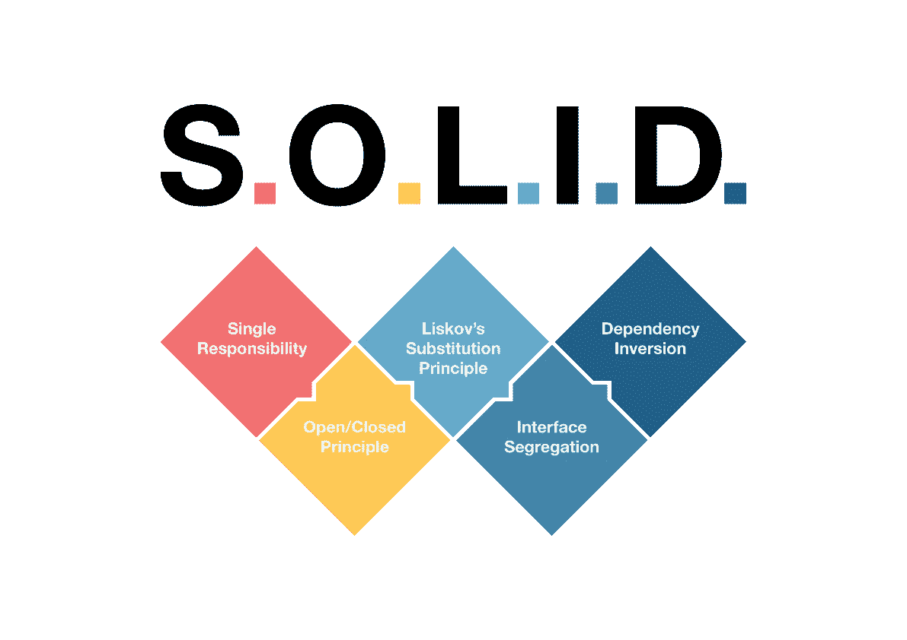

# 用 JavaScript 示例演示 S.O.L.I.D 原则

> 原文：<https://javascript.plainenglish.io/s-o-l-d-with-javascript-examples-e8a071345c8a?source=collection_archive---------1----------------------->

# 固体原理是什么？

在这一部分，我将向你介绍**固体**原理。S.O.L.I.D 是一个助记首字母缩写词，代表:

*   `**S**`——单一责任原则。
*   `**O**` -开闭原理。
*   `**L**`——利斯科夫——替代原理。
*   `**I**` -界面分离原理。
*   `**D**`**——依存倒置原则。**

**南 O.L.I.D，我现在称之为 **SOLID** ，是面向对象编程中非常流行的一个基本设计原则。每个开发人员都应该理解所有这些原则，因为这对任何软件工程师来说都是一个关键概念。**

**所有的设计模式和原则不仅有助于编写好的代码，也有助于编写干净的代码。然而，如果你只是学习其中的两个，那就用`**S**` -单一责任原则和`**O**` -开闭原则。SOLID 可能是使用最广泛的原则，也是构建健壮和可维护软件最有效的原则。**

**好了，现在你已经知道了什么是坚实的原则，让我们开始学习它们。**

# **单一责任原则**

**本节将介绍单一责任原则或简称为 **SRP** 。SRP 适用于类别、组件和微服务。**

**SRP 的主要规则是:*“类应该有一个* ***单一责任*** *—一个类不应该因为一个以上的原因* *而* ***改变。”*****

**SRP 允许更小的班级。一个责任意味着当我们遇到新问题时，我们需要调整代码的可能原因更少。**

**让我们来回顾一下我从 freecodecamp.org 中找到的一个例子:**

# **开闭原则**

**开闭原则或简称 OCP 指出:*“一个(类、模块、函数等)应* ***打开*** *进行扩展而* ***关闭*** *进行修改。”***

**这意味着我们不需要修改我们的代码来让它为进一步的功能工作。每一个类都应该有一个基本的功能集，并针对每一个用例进行精简。**

**下面我们有一个视频游戏平台的课程。**

**我们在这里的问题是，一些功能将不得不被修改，以使所有方法在所有平台上工作，这将违反 SRP 和 OCP。这就是我们使用子类的原因。**

**这样，我们就不必修改任何类方法来为我们的类引入新的功能。**

# **利斯科夫替代原理**

**利斯科夫替代原理指出。**

***“对象应该是* ***用* ***替换了*** *的子类的实例而不改变行为*** *。”***

**这意味着，如果我们有一个基类，它不应该将方法扩展到不能或不愿接受其父类方法的类。**

**我在 Academind 找到了一个很好的例子:**

# **界面分离原理**

**接口隔离原则(ISP)规定:**

***许多特定于客户端的接口比一个通用接口要好。***

# **依存倒置原则**

**这个原则的一般思想既简单又重要:提供复杂逻辑的高级模块应该易于重用，并且不受提供实用功能的低级模块的变化的影响。为了实现这一点，您需要引入一个抽象，将高级和低级模块相互分离。**

***“你应该* ***依靠抽象，而不是集中。”*****

**基于这一思想，罗伯特·c·马丁对依存关系倒置原则的定义由两部分组成:**

1.  **高层模块不应该依赖低层模块。两者都应该依赖于抽象。**
2.  **抽象不应该依赖于细节。细节应该依赖于抽象。**

**这个定义的一个重要细节是，高层**和低层**模块依赖于抽象。设计原则不仅仅是改变依赖关系的方向，当你第一次读到它的名字时，你可能已经预料到了。它通过在高级和低级模块之间引入抽象来分离它们之间的依赖关系。所以最后，你会得到两个依赖关系:**

1.  **高级模块依赖于抽象，并且**
2.  **底层依赖于相同的抽象。**

***更多内容请看*[***plain English . io***](http://plainenglish.io)**