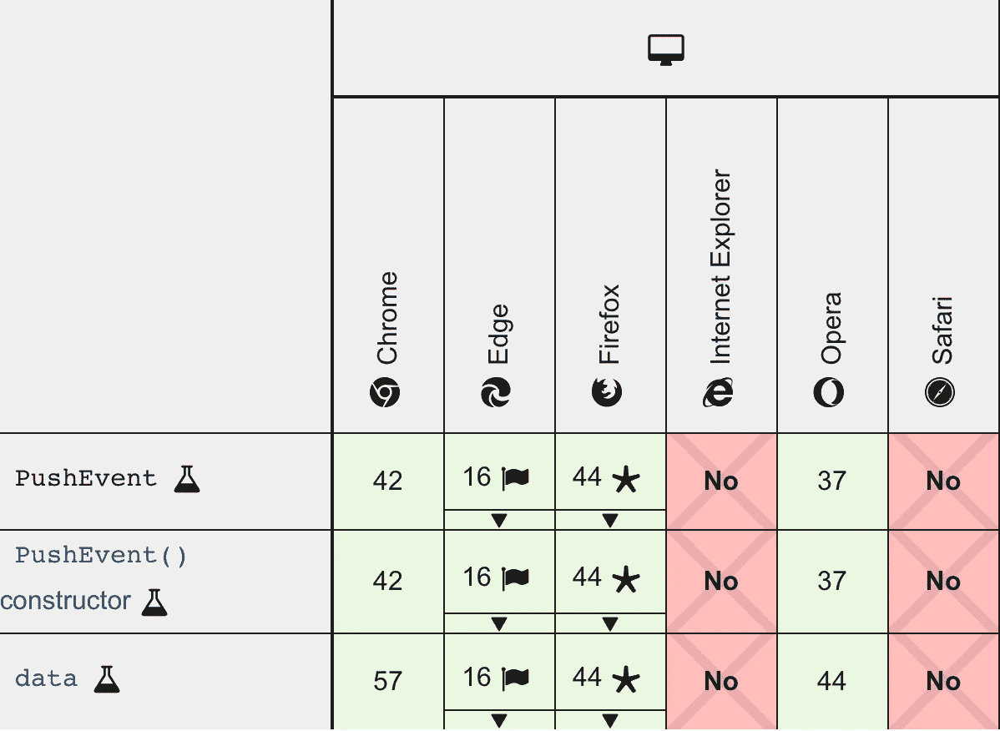
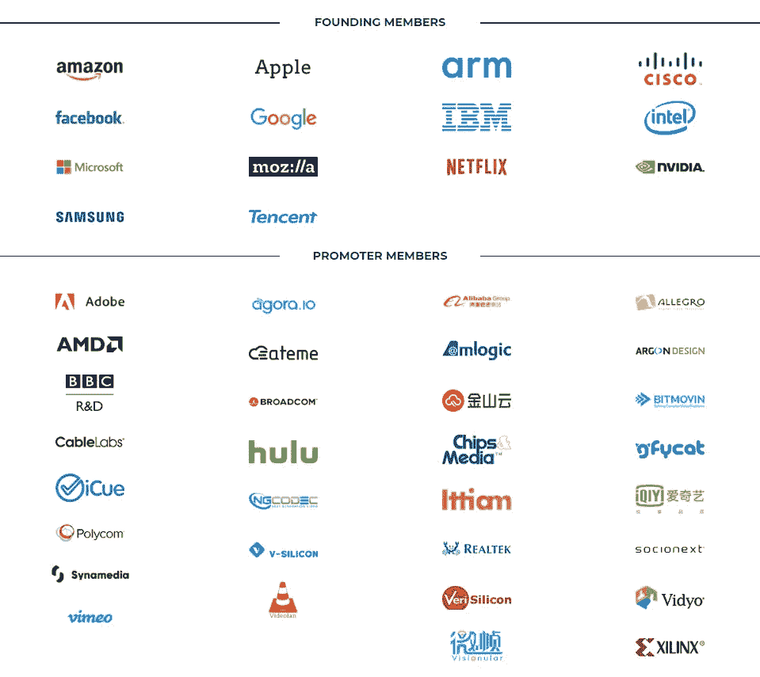

# Safari 已经成为第二个互联网浏览器

> 原文：<https://javascript.plainenglish.io/safari-has-become-the-second-internet-explorer-e2c2dd114837?source=collection_archive---------2----------------------->

## 我越用它，它就越让我想起 IE

Safari sometimes looks like IE

如果你问一个开发者听到 IE (Internet Explorer)是什么感觉，最常见的回答是——痛苦。我也不例外。我从事网页开发工作十多年了。在此期间，我有许多不同的项目，我们必须支持 IE。当浏览器不支持一些常见的 rest 浏览器功能时，我知道这种失望。或者当它在错误的位置显示元素时。最糟糕的是，当您需要调试意外行为时。

幸运的是，在日常生活中，我用 MacBook Pro 搭配 M1。我喜欢用苹果的软件，因为它速度快、节能、美观。Safari 是苹果的应用之一。我想喜欢它，但我越是用它工作，它就越让我想起 IE。这就是为什么强调触及我们每个人的问题很重要。对于其中的一些，我会提供解决方案。

# 渐进式网络应用支持

PWA 支持，更准确地说是缺乏支持，是当今最关键的阻碍因素之一。你知道什么是 PWA 吗？这是一个网络应用程序，你可以在浏览器中打开并在本地安装。它将看起来像一个从应用商店安装的普通应用程序，具有离线启动的能力。理论上，你现在就可以做到(在 iPhone 上)，但苹果不允许你有一个完整的限制列表:

*   您不能存储超过 50 Mb 的内容
*   没有蓝牙接入
*   用于访问本机共享对话框的 Web 共享不可用
*   没有后台同步和网络推送通知
*   没有邀请用户安装应用程序的 Web 应用程序横幅
*   您不能自定义闪屏

这些限制使得技术毫无用处。苹果想要控制市场，只允许用户通过 App Store 安装“真正的”应用。

在 Mac 上的 Safari 中，你根本做不到。

# 网络推送通知

这个主题在 PWA 限制列表中，但值得额外讨论。

在 Mac 上，一些应用的网页版不能提供完整的功能，因为它们不能发送推送通知。

Push notifications browser support

信使就是最好的例子。如今，telegram 或 FB messenger 只有在网站打开时才能通知用户新消息，并带有标题开关和声音。如果用户用静音最小化他的浏览器，显然他错过了消息。

这种限制的唯一好处是，新闻网站没有令人讨厌的订阅通知的提议。但这并不意味着我们不需要通知功能。

# 滚动行为

苹果对 Safari 的性能和能效感到非常自豪。而且这也不是没有道理！

为了达到如此好的性能，他们实施了大量的优化。其中之一是在动态滚动过程中阻止 DOM 更新。也许这不是唯一的优化，但在那之后，用户开始体验到一些滚动滞后。最广为人知的问题 YouTube 视频页面上的评论滚动。在[官方支持论坛](https://discussions.apple.com/thread/250853003)和 MacRumors 上都有讨论。

要解决这个问题，您必须安装 UserScripts 扩展并添加一些 CSS 样式。

但这并不是这个问题存在的唯一地方。我在许多不同的网站上看到了一些滚动问题，比如 youtube music、脸书、Reddit 和其他网站，在这些网站上，on scroll event 附加了许多功能。

这是对快速滚动的补偿，所以我希望苹果能找到一个更好的平衡。

# 油管（国外视频网站）

当我们开始谈论 YouTube 时，你可能看到了一个问题，一些缩略图或头像无法加载。你可以在苹果讨论中找到许多关于这个问题的不同话题(例如[这里](https://discussions.apple.com/thread/252092264)和[这里](https://forums.macrumors.com/threads/youtube-website-scrolling-issue.2272026/))。

我不知道问题的根源，但缓存中有一个 bug。清除缓存可以解决这个问题。但有时它会重复。

在 Safari 中有两种清除缓存的方法:

1.  在 Safari 中点击**刷新按钮**的同时，按下键盘上的 **Shift** 。
2.  按下键盘上的**命令(⌘)** + **选项(** ⌥ **)** + **R** 。

想选什么就选什么。

# 收藏夹图标

你见过 Mac 上 Safari 里的 Instagram favicon 吗？出于某种原因，它是黑白的。

Black & White icon in the left corner

小问题，但很奇怪。你可以自己查一下，真正的图标是有颜色的。我在很多网站上都有这个问题，甚至在我的 [methodist.io](https://methodist.io) 上也有。如果你知道为什么会出现这个问题以及如何修复，请在评论中分享。

# 扩展ˌ扩张

在 2018 年之前，Safari 已经有了构建浏览器扩展的框架。这也是 App Store 里扩展少很多的原因。只是到了 2018 年之后，他们才开始像 Chrome 一样使用 WebExtensions Api。对于扩展开发者来说，这是一个巨大的进步，因为核心 API 在主流浏览器中是相同的。但是时间已经过去了，与其他浏览器相比，扩展的数量有了很大的不同。

# 媒体格式标准化

你们可能都知道 jpeg 和 png 图像格式。它们既古老(自 1992 年以来)又笨重，这就是为什么在 2017 年，科技巨头们决定设计更高效的媒体格式。苹果发布了 HEIC(高效图像编码)，谷歌实现了 WebP。但由于某种原因，他们没有就哪一个更好达成一致。Chrome 只支持 WebP，Safari 只尊重 HEIC。直到 2020 年中期，苹果才在 Safari 中加入了 WebP 支持。

这个故事是关于图像的，但同样是关于视频的。谷歌为视频设计了 **WebM** 格式，即使是现在(2021 年 1 月) **Safari 也不支持**。

2019 年，IT 巨头合作并开始致力于最现代和免费的视频编解码器— **AV1** 。苹果、谷歌、网飞以及更多公司(名单令人印象深刻)成立了“开放媒体联盟”。这些公司分享他们的技术和专利来创造未来的编解码器。编解码器准备好了。网飞已经在他们的应用中使用它，但是 Safari 也不支持它。

Alliance for Open Media

正如你所看到的，Safari 是一个非常保守的浏览器，苹果的兴趣并不总是与用户的愿望一致。

# 结论

Safari 速度快，节能，甚至可能是一个安全的浏览器。但是这个浏览器背后的公司有自己的策略。当然，这个策略的主要目标是赚钱。让用户能够避开 App Store 安装应用程序并不是一个有利可图的想法。也许同样的解释适用于所有流行的媒体格式。但是这些问题阻碍了技术的发展，也给开发者增加了更多的麻烦。

**感谢阅读！**