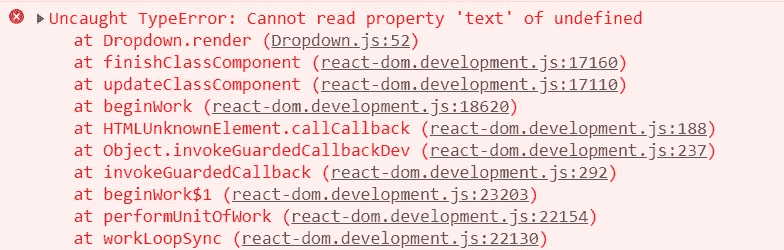
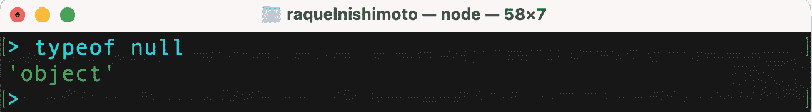
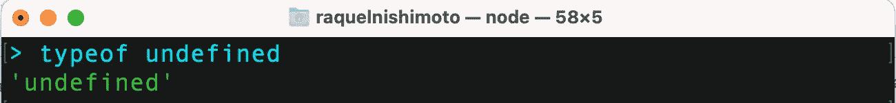

# JavaScript 空数据类型和未定义数据类型的区别

> 原文：<https://javascript.plainenglish.io/same-same-but-different-javascript-null-and-undefined-data-types-7b62b4b37eb8?source=collection_archive---------8----------------------->

在 JavaScript 程序中， *null* 和 *undefined* 有时会被松散地使用，并且可以互换*。*然而，它们是不同的数据类型，了解它们之间的差异和相似之处有助于避免错误并节省排除错误的时间。

Photo by [Dylan Shaw](https://unsplash.com/@dylanshaw?utm_source=unsplash&utm_medium=referral&utm_content=creditCopyText) on [Unsplash](https://unsplash.com/s/photos/sheep?utm_source=unsplash&utm_medium=referral&utm_content=creditCopyText)

Uncaught TypeError: Cannot read property ‘text’ of undefined.

Uncaught TypeError: Cannot read property ‘style’ of null.

如果您在编码时还没有至少一次遇到浏览器控制台上打印的不可原谅的未捕获的**类型错误** *'* 无法读取**未定义的** *'* 或“无法读取 **null** 的属性”请举手？

你有没有问过为什么你会看到它们或者 *null* 和 *undefined 有什么区别？在我作为软件工程师的经历中，我遇到过一些。然而，理解每种数据类型的特性有助于我调试和避免这些问题。一旦我理解了它们的定义，它们的相似之处，它们的不同之处，更重要的是，当它们出现在我的程序中时，我就开始构建更多的防御性程序。*

根据 [MDN 文档](https://developer.mozilla.org/en-US/docs/Web/JavaScript/Reference/Global_Objects/TypeError)，当一个操作因为一个值不是预期的类型而无法正常执行时，在程序执行过程中会抛出一个 **TypeError** 。在这种情况下，操作无法处理类型为*未定义*和 *null 的值。这篇博客试图定义这些价值观，并强调它们最重要的区别和相似之处。*

## 空

JavaScript*null*——在其他语言中也称为 nill、NULL、None 是一个通常表示缺少值的关键字。奇怪的是，在“null”上使用 *typeof* 操作符来标识其数据类型会返回一个“object”。

typeof null returns ‘object’

这是因为传统的原因，而[修复它](https://web.archive.org/web/20160331031419/http://wiki.ecmascript.org:80/doku.php?id=harmony:typeof_null)可能会出乎意料地破坏现有站点。尽管有这个小问题，但将 *null* 视为表示“无对象”的特殊对象值仍然是有用的，有时会将其分配给变量或属性，但它也可以在函数中用作返回值，以在没有任何内容要返回时明确指示“无值”或“无对象”。

## 不明确的

*未定义*是代表原始数据值[未定义](https://developer.mozilla.org/en-US/docs/Web/JavaScript/Reference/Global_Objects/undefined)的全局属性。现在，让我们来分解一下定义。作为一个全局属性意味着它的值在程序中的任何地方都是可访问的，在这种情况下，它将被系统用来表示没有值。 [MDN 文档](https://developer.mozilla.org/en-US/docs/Web/JavaScript/Reference/Global_Objects/undefined#description)指出了系统返回`undefined`的三种方式。首先，当一个变量还没有赋值时。其次，当在方法或语句中被求值的变量没有赋值时。第三，当函数不返回值时。

实际上， *undefined* 与 *null* 一样表示缺少值。但是，与 *null 不同的是，*的数据类型是‘undefined’，这意味着 *undefined* 是其自身类型的唯一成员。

typeof undefined returns ‘undefined’

## 差异和相似之处

两种数据类型— *null* 和 *undefined —* 是 JavaScript 7 原语数据类型的一部分，包括字符串、数字、bigint、布尔、符号、undefined 和 null。原始数据代表语言实现的原子级别。所有原始数据类型都是不可变的，这意味着它们不是对象，因此没有[方法](https://developer.mozilla.org/en-US/docs/Glossary/Method)。在这种情况下， *null* 和 *undefined* 都没有任何属性或方法。

> JavaScript 7 原始数据类型有字符串、数字、bigint、布尔、符号、未定义和 null。

如前所述, *null* 是一种原始数据类型，通常被视为其自身类型的唯一成员。然而，与 *undefined* 相反，它不是一个全局属性——在任何地方都可以访问——因此必须在需要时有意地将其赋给一个变量。*空值*可分配给变量，以指示*数字*、*字符串*和*对象*的“无值”。

数据类型*未定义*和*空*在许多方面都相似，因此很容易被误用。它们都代表着价值的缺失。然而，这种缺失的性质有些不同。 *null* 用于**明确地**有目的地表示缺少值，而*未定义的*可以通过 JavaScript 返回**隐含的**来表示意外的或类似错误的缺少值。

这两种数据类型之间的另一个重要相似之处在于，在布尔运算中，两者都被视为**虚假的**。我们将在下一节探讨这一概念。

## *空*和*未定义*均为假

*null* 和 *undefined* 都是 [falsy](https://developer.mozilla.org/en-US/docs/Glossary/Falsy) ，但是它们不一样——我们已经看到它们是不同的数据类型，有区别的值。验证这个命题的一种方法是使用 JavaScript 等式运算符对其进行评估。

JavaScript 有*等式运算符*和*严格等式运算符*。等式运算符`==`试图在比较不同类型的操作数并返回布尔结果之前对其进行转换。当使用`==`运算符比较 null 和 undefined 时，JavaScript 将 *null* 和 *undefined* 转换并返回 true。

Example showing that the equality operator considers null and undefined to be equal.

与此相反，*严格相等运算符* `*===*`检查数据类型，并不尝试转换操作数。因此，如果操作数属于不同的数据类型——如前所示，null 和未定义的数据类型是不同的——标识运算符`===`将返回“false”。

The strict equality operator === distinguishes null and undefined.

知道这些操作员`==`和`===`会返回不同的结果对于理解如何构建更多的防御程序是至关重要的。

## 检查程序中的 null 和未定义

如果需要检查某个变量或者某个函数的返回值是*空*还是*未定义*，可以增加等式运算符`==`(而不是严格的等式或者身份运算符`===`)来验证该条件。每当*未定义*或*空*可能发生时，通常当无法预期这些值的出现时，添加该检查来捕捉是有用的。

*undefined* 由系统隐式返回，因此在程序中并不总是能够避免它的出现。同样的想法也适用于 *null* 。有时，null 被有意地分配给一个变量来表示没有值，但是在程序的后面被重新分配给另一个值。如果有所欠缺，并且没有进行第二次赋值，那么无论何时计算该变量，都将返回“null”。在这两种情况下，为了避免**类型错误**，识别值的出现总是有用的——“null”和“undefined”。

下面的代码块是一个简单的例子，它说明了在实践中如何计算 *null* 或 *undefined* 以及为什么在试图捕捉“null”和“undefined”值时使用相等运算符`==`而不是严格的相等运算符`===`更有用。在`lines 7 — 13`中，函数`evaluateNullOnly`带一个参数`example`，在`line 8`中，评估其值和类型是否严格等于‘空’。在这种情况下，只有在`line 2`中初始化的`variableOne`通过该测试。因此，当调用`line 24`中的`evaluateNullOnly`并将其作为参数传递给`variableOne`时，系统解释器将只执行`line 9`并输出`'The value is null’`。相反，被赋值为“未定义”的`variableTwo`将使测试`example === null`失败，返回“falsy”并导致执行`lines 10 — 12`中的 else 条件。

A simple example illustrates how the evaluation of *null* or *undefined* works in practice.

与前面的函数不同，在`line 16`中，函数`evaluateNullorUndefined`使用等式运算符`==`来评估分配给参数`example`的值是否为‘空’。正如我们已经看到的，相等运算符认为 *null* 和 *undefined* 相等。因此，`variableOne`和`variableTwo`在作为参数传递给函数`evaluateNullOrUndefined`时都会返回 the。

## 摘要

*null* 和 *undefined* 数据类型有很多相似之处。对于布尔运算，它们都被视为*假值*，并且都表示没有值。由于这些相似之处，它们有时可以互换使用。然而，假设它们是同一个东西是错误的，不知道如何区分它们会在程序中引入 bug。

简而言之， *undefined* 表示系统级的意外缺值错误，而 *null* 表示程序级的正常缺值。其他一些差异包括:

*   理论上， *null* 是一个关键字，而 *undefined* 是一个全局属性。
*   在 Javascript 程序中，所有数据都有一个类型，null 的类型是“object”，undefined 的类型是“undefined”。
*   必须显式使用空值，而未定义的值*通常是隐式返回的值。*

有些人喜欢尽可能避免程序中的“null”和“undefined ”,但无论如何，构建检查这些值是否存在的防御性代码是很重要的，这样程序就可以继续执行，而不会在预期有值时因错误而暂停，这意味着不是 *null* 和/或 *undefined —* 。

捕捉这些值的一种方法是使用`==`相等操作符，而不是严格的相等操作符`===`。这是因为相等运算符认为 *null* 和 *undefined* 相等，而严格相等运算符会区分它们。

[*更多内容看 plainenglish.io*](http://plainenglish.io/)