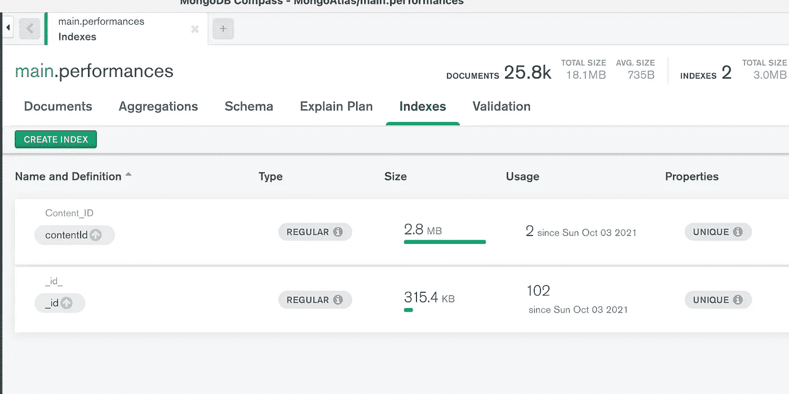
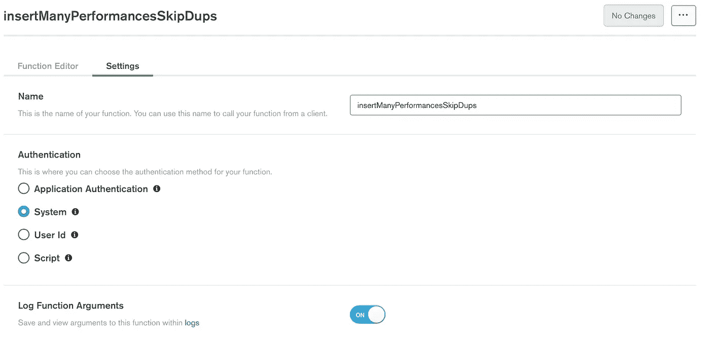
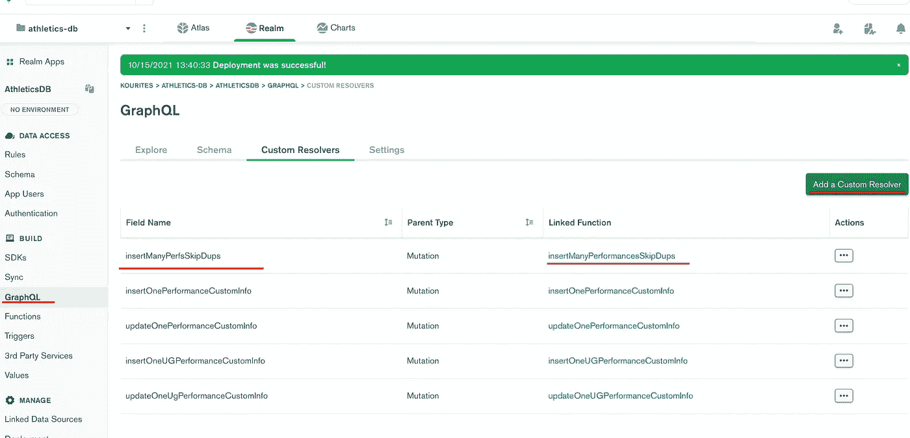
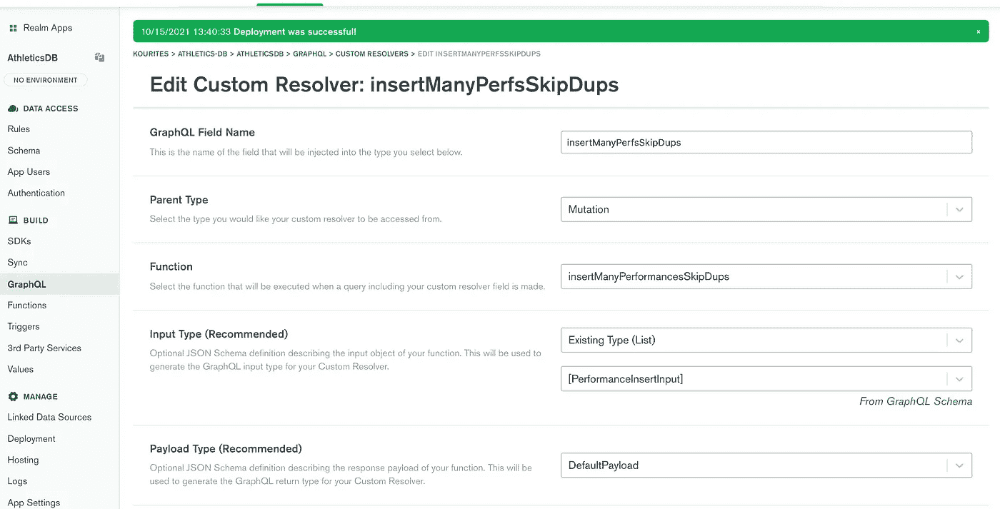
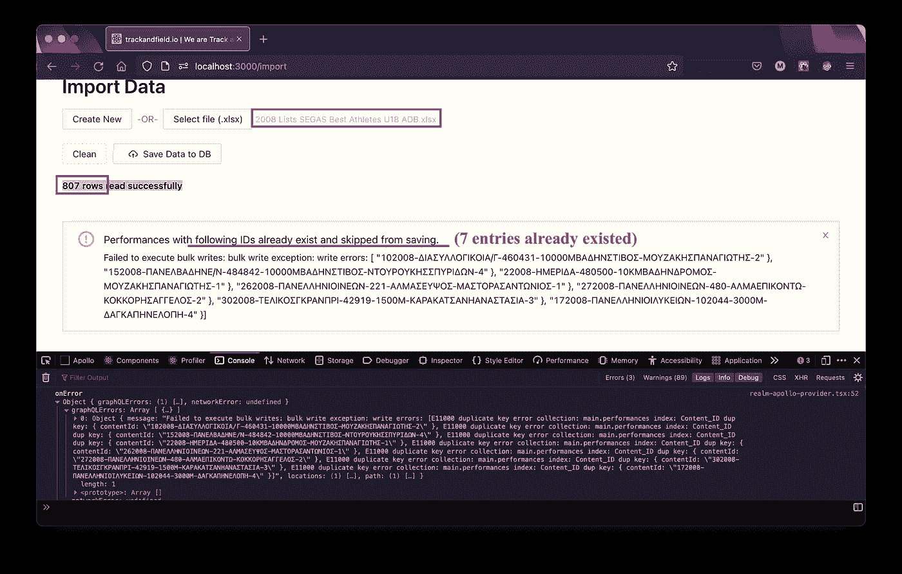
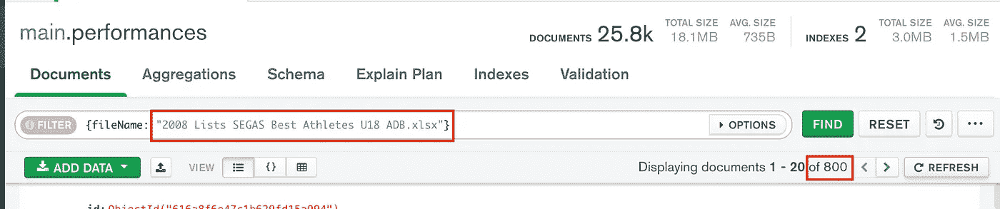

# 用 React 和 Apollo 客户端在 MongoDB 上保存许多文档，跳过重复

> 原文：<https://javascript.plainenglish.io/save-many-entries-on-mongodb-skipping-duplications-with-react-and-apollo-client-f5e11a9d2744?source=collection_archive---------8----------------------->


Photo by [Patrick Tomasso](https://unsplash.com/@impatrickt?utm_source=unsplash&utm_medium=referral&utm_content=creditCopyText) on [Unsplash](https://unsplash.com/?utm_source=unsplash&utm_medium=referral&utm_content=creditCopyText)

# 目标:

*   ***使用 Apollo 客户端*** ，一次将多个文档从 React 应用程序上传到 MongoDB。每个文档都是。我们解析和操作的 xlsx 文件。这个过程与本文无关。
*   ***拒绝现有的(基于唯一 id)文档，但存储新的*** 。

我们走吧！

# 选择#1:用 insertOne()写批量

## 1.在您的 [Mongo Atlas](https://realm.mongodb.com) 项目中添加 Realm 函数

***注意#1*** *:使用****{ ordered:false }****是在过账数据时跳过已有条目的关键。* [*更多细节在此*](https://docs.mongodb.com/manual/reference/method/db.collection.bulkWrite/#std-label-bulkwrite-write-operations-executionofoperations) *。*

**你可以通过 [*MongoDB 指南针*](https://www.mongodb.com/products/compass) *app* 轻松设置这些指标**



## 2.设置功能的设置



## 3.创建自定义冲突解决程序并将其链接到函数



## 4.在 react 应用程序的 operations.graphql 文件中添加透视图变体

```
mutation InsertManyPerformancesSkipDuplicates($data:[PerformanceInsertInput!]!) { insertManyPerfsSkipDups(input: $data) { status }}
```

## 5.用 [npm run generate](https://www.apollographql.com/blog/tooling/apollo-codegen/typescript-graphql-code-generator-generate-graphql-types/) 生成你的钩子和类型

## 6.生成适当的数据后，使用组件中的函数

这是我们的应用程序上的结果和我们的数据库中特定文件的透视数据。



The informative message to the user about the skipped values due to duplication.



Info from our Database as viewed from MongoDB Compass

# 选择#2:用 updateOne()写批量

在这种方法中，我们唯一需要改变的是我们在领域函数中使用的方法。

代替

```
const operations = performances.map(op => (**{ insertOne : { “document” : p }** })); return await myCollection.bulkWrite( operations, { ordered : false })
```

我们现在使用

```
const operations = performances.map(op => (**{ updateOne : {“filter”: { “contentId”: p.contentId }, “update” : {$set: p}, upsert: true } }**)); return await myCollection.bulkWrite( operations, { ordered : false })
```

这里重要的是:

1.  **upsert: true** 选项，意思是“如果没有找到要更新的文档，就创建它。”
2.  **过滤器:{ "contentId": p.contentId }:** 这是我们进行验证的属性，也是我们找到重复项所基于的上一个选项。

就是这样！🙂

*更多内容看*[***plain English . io***](http://plainenglish.io)