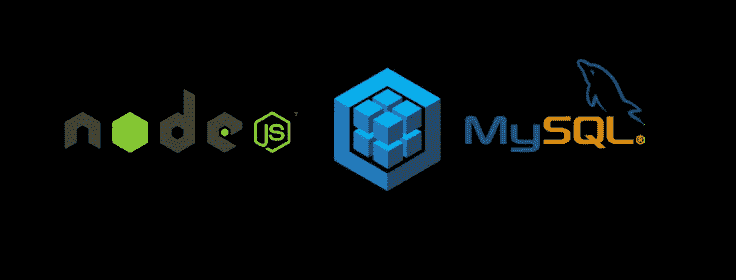
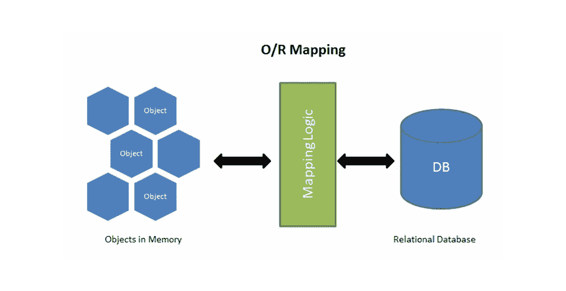

# 7 分钟学会序列:第一部分

> 原文：<https://javascript.plainenglish.io/save-time-learn-sequelize-in-7-mins-part-1-3e4fde67d037?source=collection_archive---------3----------------------->



Sequelize: Node.js ORM

ORM 或“对象关系映射”是一种使用面向对象编程语言在不兼容类型系统之间转换数据的编程技术。这意味着它旨在简化数据库管理。顾名思义，它们在关系数据库中自动映射出我们代码中的对象(实体)。

开发人员可以轻松地与数据进行交互，并使用本机类而不是编写查询来执行创建、读取、更新和删除等常见操作。由于查询是由 Sequelize 生成的，我们作为开发人员在数据库上有一个抽象层，我们可以在技术上交换整个数据库，并在项目生命周期的后期进行最小的代码更改。Sequelize 是 mongoose、Prisma、TypeORM 等等中最流行的 node.js ORM 之一。Sequelize 比 waterline 功能丰富得多，water line 是 Sails.JS 的默认表单。

> “Sequelize 是一个基于 promise 的 Node.js ORM，适用于 Postgres、MySQL、MariaDB、SQLite 和 Microsoft SQL Server。它具有可靠的事务支持、关系、急切加载和延迟加载、读取复制等特性。”—来自 https://sequelize.org/[的定义](https://sequelize.org/)



ORM Logic

在今天的帖子中，我们将学习如何在 Node.js 中安装 Sequelize，什么是模型，什么是模型实例&如何查询它们。我们将在 Express Node.js 框架中使用 Sequelize。让我们开始吧。

**步骤 1:** 使用 NPM 安装 Sequelize 和 Sequelize CLI。

```
npm install --save sequelize
npm install --save sequelize-cli
npm install --save mysql2
```

**第二步:**用下面的命令初始化 Sequelize。该命令将创建基本配置文件&数据库连接。

```
node_modules/.bin/sequelize init
```

这将创建:
**a.** 带有 config.json 文件的 config 文件夹，其中包含三种环境的数据库连接参数。
**b.** 用于迁移数据的迁移文件夹。
**c.** 包含 index.js 文件的 models 文件夹，该文件包含用于连接到数据库的 Sequelize 实例。
**d.** seeders 文件夹，包含 seeders 数据文件。

**第三步:**模型定义。

```
module.exports = (sequelize, DataTypes) => {
 const User = sequelize.define('User', {
  email: {
   type: DataTypes.STRING,
   primaryKey: true,
   unique: true,
  },
  uuid: {
   type: DataTypes.UUID,
   defaultValue: DataTypes.UUIDV4,
  },
  phoneNo: {
   type: DataTypes.STRING,
  },
  countryCode: {
   type: DataTypes.STRING,
  },
  firstName: {
   type: DataTypes.STRING,
   allowNull: false,
  },
  lastName: {
   type: DataTypes.STRING,
  },
  password: {
   type: DataTypes.STRING,
  },
  age: {
   type: DataTypes.STRING,
  },
  gender: {
   type: DataTypes.STRING,
   validate: {
    isIn: [[
     'FEMALE'
     'MALE',
     'OTHER'
    ]],
   }
  },
 }, {
 indexes: [{
  fields: ['gender'],
 }],
 defaultScope: {
  attributes: {
   exclude: [
    'password',
   ]},
  },
 })User.associate = function (models) {
 models.User.hasMany(models.Posts, {
  foreignKey: 'email',
  sourceKey: 'email',
 })
 models.User.hasOne(models.UserSubscription, {
  foreignKey: 'email',
  sourceKey: 'email',
 })
}
return User
}
```

Sequelize 中的模型只不过是数据库中的表。模型告诉 Sequelize 它所代表的实体，例如数据库中表的名称以及它包含哪些列(以及它们的数据类型)。模型的每个实例都是数据库中的一行。在 Sequelize 中，可以用两种等效的方式定义模型:

*   调用 **sequelize.define(型号名称，属性，选项)**
*   扩展[模型](https://sequelize.org/master/class/lib/model.js~Model.html)并调用 **init(属性，选项)**

```
module.exports = (sequelize, DataTypes, Model) => {
class User extends Model { }
return User.init({
  firstName: {
   type: DataTypes.STRING,
   allowNull: false
  },
  lastName: {
   type: DataTypes.STRING
  }
 }, {
  sequelize,
  modelName: 'User'
 });
}
```

在内部 sequelize.define 调用 Model.init 方法，所以两者给出相同的结果。让我们来了解一下每个参数:
**一、** email 指定了一个列的名称，这个列是一个对象，包含了每个列的属性，像
*。type 定义列的数据类型。例如，字符串、浮点、布尔等。点击了解更多关于数据类型[的信息。
***b .***unique 包含一个布尔值，指定一列是否有唯一约束。如果插入重复值，sequelize 将抛出错误“sequelizeuniqueconstrainerror”
***c .***主键包含一个布尔值，该值指定某列是否为主键。
***d .***default value 指定在插入行时如果传递了 null，则插入的默认值。
****e .***允许空指定一列是否允许接受空值。如果试图将 null 设置为不允许 null 的字段，将抛出“ValidationError”而不执行任何 SQL 查询。
****f .***validate 用于验证列，就像是 email 的值匹配 email 格式或者 isIn validates 传入的值必须是指定的值之一。例如，性别必须是“女性”、“男性”或“其他”。如果验证失败，Sequelize 将抛出一个错误。点击**](https://sequelize.org/master/manual/model-basics.html#data-types)**了解更多关于验证的信息。***

****二。**索引指定要索引的字段数组
**iii** 。默认范围指定用于帮助您重用代码的对象。在上面的例子中，我们想要排除密码属性。这意味着它不应该被任何人看到。
**四世。** ModelName.associate 函数用于指定两个模型之间的关联。你可以在下一个帖子中了解更多关于该协会的信息。**

****第四步:**模型实例**

```
**router.post('/create_user', (req, res) => {
 if (!req.body.email) {
  throw new Error('Email is required')
 }
 return models.User.create(req.body).then((user) => {
   res.send(user)
 }).catch((err) => {
  res.status(501).send(err.message)
 })
})**
```

**即使模型是一个类，它的实例也不是使用 new()创建的。相反，Sequelize 使用 build & save 方法来插入记录。build 方法创建模型的一个实例，save 方法用于插入记录。Sequelize 使用 ModelName.create 方法在内部调用 build 和 save 方法的表中插入记录。**

```
**const users = await User.bulkCreate([   
 { email: 'Johndoe@example.com' },   
 { email: 'willsmitch@domain.in' } 
]);**
```

**Sequelize 提供了 Model.bulkCreate 方法，允许只使用一个查询一次创建多个记录。Model.bulkCreate 的用法与 Model.create 非常相似，都是接收一个对象数组而不是单个对象。**

```
**// using update method
router.put('/update_user', (req, res) => {
 return models.User.update({
   firstName: 'John',
   age: ' 45 Years'
  },{
   where: {
    email: "testuser@example.com",
   }
 }).then((user) => {
   res.send(user)
 }).catch((err) => {
  res.status(501).send(err.message)
 })
})// using save method
router.put('/update_user', (req, res) => {
 return models.User.findByPk("testuser@example.com").then(async  (user) => {
   if (!user) {
    throw an Error ('User not found')
   }
   user.firstName = 'John'
   user.age = ' 45 Years'
   await user.save()
   res.send(user)
 }).catch((err) => {
  res.status(501).send(err.message)
 })
})**
```

**Sequelize 使用 update 方法更新实例列值。“where”参数是必需的，否则 Sequelize 将抛出一个错误。您可以通过首先调用 findByPk 或 findOne 方法来更新该行。这将获取模型实例&使用 instance.save 方法来更新行。**

```
**router.delete('/delete_user', (req, res) => {
 return models.User.findByPk("testuser@example.com").then(async  (user) => {
   if (!user) {
    throw an Error ('User not found')
   }
   await user.destroy()
   res.send("user deleted")
 }).catch((err) => {
  res.status(501).send(err.message)
 })
})router.delete('/delete_user', (req, res) => {
  return models.User.destroy({
   where: {
    email: "testuser@example.com",
   }
 }).then(() => {
   res.send("user deleted")
 }).catch((err) => {
  res.status(501).send(err.message)
 })
})**
```

**Sequelize 使用 destroy 方法从表中删除行。Destroy 方法也接受“where”选项，就像上面显示的 read 查询一样。**

****第五步:**模型查询。**

```
**router.get('/all_users', (req, res) => {
 if (!req.query.limit) {
  req.query.limit = 10
 }
 if (!req.query.offset) {
  req.query.offset = 10
 }
 return models.User.findAll({
   order: [['createdAt', 'DESC']],
   limit: parseInt(req.query.limit, 10),
   attributes: ['firstName', 'email', 'lastName'],
   offset: parseInt(req.query.offset, 10),
 }).then((users) => {
   res.send(users)
 }).catch((err) => {
  res.status(501).send(err.message)
 })
})**
```

**Sequelize 提供了 4 种查询数据库的查找器方法，可以生成“选择”查询。默认情况下，所有 finder 方法的结果都是 model 类的实例。这意味着在数据库返回结果后，Sequelize 会自动将所有内容包装在适当的实例对象中。在少数情况下，当有太多结果时，这种包装可能是低效的。要禁用这种包装并接收普通响应，将`{ raw: true }` 作为选项传递给 finder 方法。
**我**。FindAll 生成一个标准的 SELECT 查询，从表中检索所有条目，它受到类似 where 子句的限制。
**二**。FindByPk 方法使用提供的主键从表中只获取一个条目。
**三**。FindOne 方法获取它找到的满足可选查询选项的第一个条目。一般来说，它带有一个 where 子句，而不是主键。
**四**。findOrCreate 将检查一个表是否包含任何符合条件的记录，如果没有找到，将在表中创建一个条目。在这两种情况下，它都将返回一个实例(找到的实例或创建的实例)和一个布尔值，该值指示该实例是创建的还是已经存在。where 选项用于查找记录，defaults 选项用于定义在没有找到记录的情况下必须创建的内容。Sequelize 将采用给定的值，其中默认值不包含每一列的值。
**五、**findandcountal 方法是一种结合了 findAll 和 count 的便捷方法。这在处理与分页相关的查询时很有用，在这种情况下，您希望检索带有限制和偏移量的数据，但还需要知道与查询匹配的记录总数。findAndCountAll 方法返回一个具有两个属性的对象:1。count——一个整数——与查询匹配的记录总数。2.rows -对象的数组-获得的记录。**

**在上面的例子中，我们可以传递选项来查找像
**a.** 这样的记录，属性包含一个要写入的列名数组。当用户只需要特定的列而不是所有的列时，这很有用。
**b.** 其中一个对象包含一个列名和要应用于它的条件。例如，您想要查找印度的所有用户。**

```
**where: {
 country: 'India'
}**
```

****c.** order 包含带有‘ASC’&‘desc’选项的列数组。例如，您想要一个按创建日期降序排列的用户列表。
**d.** 限制&偏移用于限制和分页。**

**我们将在接下来的文章中讨论高级主题，如序列关联、关系、急切加载、懒惰加载、事务等等。**

*****感谢阅读。*****

***更多内容请看*[*plain English . io*](http://plainenglish.io/)**