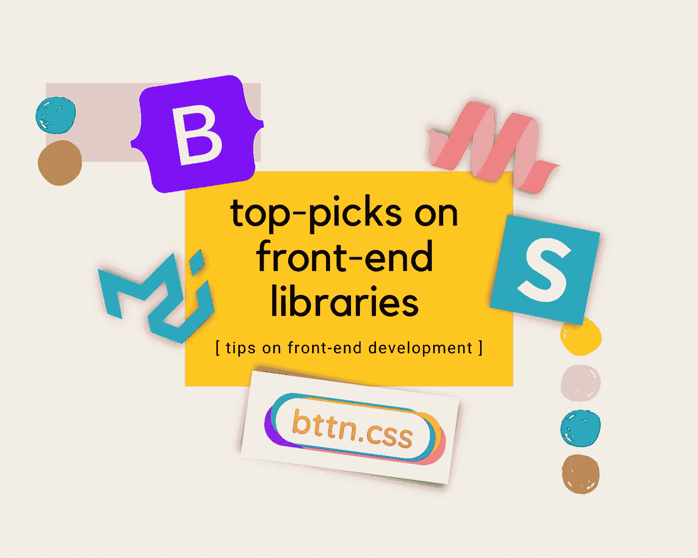

# 使用这些前端库节省时间

> 原文：<https://javascript.plainenglish.io/saving-your-time-with-these-front-end-libraries-77a291f3215a?source=collection_archive---------13----------------------->

## 如何通过使用这些开源库来节省开发时间

Image Designed with [Canva](https://www.canva.com/)

关于前端开发的第一个**技巧**，我们将探索和了解最受欢迎的前端库及其最佳组件。一开始，决定选择哪一个前端库是非常困难和耗时的，因为有很多前端库，并且在我们可以将它应用到应用程序之前，每个库都附带了大量的文档或教程。

为了让我们作为开发人员的生活更容易，更少痛苦，我想缩小范围，分享我最喜欢的**前端库和它们最好的组件**。为了演示，我使用了代码沙箱(一个在线代码编辑器)来显示代码和快速结果。如果你愿意，你可以把这些作为你申请的样板。

**你将从这个话题中学到什么:**

*   **引导程序**及其转盘组件
*   **素材 UI** 及其时间轴组件
*   **物化 CSS** 及其转盘和卡片组件
*   **语义 UI** 及其标签组件
*   附赠:带 **bttn 的按钮组件。CSS**

好了，我们开始吧！

## **1。引导程序及其转盘组件**

Bootstrap 是最受欢迎的前端库，有很多很棒的组件和功能，但我最喜欢的是它的 **Carousel** 组件及其动画效果。

*   难易程度:简单快速申请。
*   应用程序:用于在您的投资组合或产品登录页面上显示项目演示。
*   文献[此处](https://getbootstrap.com/docs/4.0/components/carousel/)。

点击此处查看[演示](https://hh55z.csb.app/):

## **2。素材 UI 及其时间轴组件**

我是 React.js 框架的粉丝，所以 Material UI 前端库对我来说可以是个不错的选择。它像其他产品一样有很多很酷的组件和功能，但它也有一个**时间轴**组件。

*   难度等级:中等适用。
*   应用程序:用于将 showcase 显示为 react 投资组合或任何创造性的渐进式 react 应用程序的时间线。
*   文档[此处](https://material-ui.com/components/timeline/)。

点击此处查看[演示](https://xp7lx.csb.app/):

## **3。物化 CSS 及其转盘和卡片组件**

另一个最受欢迎的前端库是 Materialize CSS，因为它简单且易于应用，但仍然具有足够的功能(内置 JavaScript 代码)用于全栈应用程序，其 **Carousel** 和 **Card** 组件就是其中之一。

*   难易程度:简单快速申请。
*   应用:任何应用和用途是无止境的。
*   文档[这里](https://materializecss.com/)。

点击此处查看[演示](https://ndtjv.csb.app/):

## **4。语义 UI 及其标签组件**

当我在做我的兼职项目( [QA 应用](https://github.com/juniHub/merng-QAapp-full))时，我使用语义 UI，因为我认为它足够简单，但应用起来仍然很优雅。我最喜欢的是它的**标签**组件，你可以在这里把它作为一个展示窗口。

*   难易程度:简单易行。
*   应用:适用于电子商务或科技文档 app 等任何应用。
*   文档[此处](https://semantic-ui.com/elements/label.html)。

请参见此处的[演示](https://rf3cg.csb.app/):

## **5。额外收获:带 bttn 的按钮组件。CSS**

任何应用程序都至少有一个按钮组件，所以我认为在这里提一下是很重要的。我一直在做一些研究，寻找最简单的方法来应用按钮，而不需要很多定制的 CSS 代码(把时间留给点击按钮的动作)。这是我到目前为止发现的一些基本但仍然优雅的按钮组件，具有良好的悬停效果。

*   难度等级:简单快速适用。
*   应用:任何应用和用途是无止境的。
*   文献[此处](https://bttn.surge.sh/)。

点击此处查看[演示](https://7wkgw.csb.app/):

这就是我关于前端开发的第一个技巧。我希望你能喜欢它，并发现它很容易申请。你呢？你最喜欢哪一个？如果这里还有其他我还没有提到的有趣的前端库，欢迎和我分享。我很乐意向你学习，因为作为开发者，我们都喜欢开源。所以，让我们一起学习，一起成长吧！

## 关于我

作为我的第一篇博文，我想简单介绍一下我自己。我的名字是由尼阮，我是一个自学成才的网站开发人员位于加利福尼亚州圣地亚哥。2019 年从当地一所社区大学计算机科学专业毕业后，我认识到自己对构建和开发基于网络的应用程序和移动应用程序的热情。于是，我开始自学成为一名全栈的 web 开发者。

我知道要成为我想成为的人，这将是一个漫长的旅程，但如果你感兴趣的话，我愿意与你分享我在这个旅程中的经历。在学习期间，我在考虑写技术博客或教程，我还制作了自己的[故事书](https://juni-storybook.herokuapp.com/)来记录和分享我在兼职项目中遇到的问题。所以我在这里与你分享。如果你还在读，谢谢你，祝你有美好的一天！

*更多内容尽在*[***plain English . io***](http://plainenglish.io)